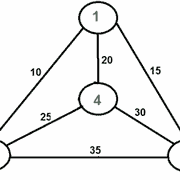

# 旅行商人使用 BackTracking 实现问题

> 原文： [https://www.geeksforgeeks.org/travelling-salesman-problem-implementation-using-backtracking/](https://www.geeksforgeeks.org/travelling-salesman-problem-implementation-using-backtracking/)

[**旅行推销员问题（TSP）：**](https://www.geeksforgeeks.org/travelling-salesman-problem-set-1/) 给定一组城市和每对城市之间的距离，问题在于找到一条最短的路线，该路线只精确地访问每个城市一次并返回 到起点

注意 [**哈密顿循环**](https://www.geeksforgeeks.org/backtracking-set-7-hamiltonian-cycle/) 和 TSP 之间的差异。 汉密尔顿循环问题是要找出是否存在一次游览每个城市一次的旅行。 在这里，我们知道存在汉密尔顿游历（因为该图是完整的），并且实际上存在许多此类游历，问题是找到最小权重的汉密尔顿环。

例如，考虑图中所示的图表。 图中的 TSP 巡视为 1-> 2-> 4-> 3-> 1.巡视的成本为 10 + 25 + 30 + 15，即 80。

该问题是著名的 NP 难题。 没有多项式时间已知的解决方案来解决此问题。



> **给定图的输出**：
> 最小权重哈密顿量：10 + 25 + 30 + 15 = 80

**方法**：在本文中，讨论了简单解决方案的实现。

*   将城市 1（假设第 0 个节点）作为起点和终点。 由于路线是循环的，因此我们可以将任何点视为起点。

*   开始以 dfs 方式从源遍历到其相邻节点。

*   计算每次遍历的成本并跟踪最小成本，并不断更新最小成本储值的值。

*   以最小的成本返回排列。

下面是上述方法的实现：

## C++

```cpp

// C++ implementation of the approach 
#include <bits/stdc++.h> 
using namespace std; 
#define V 4 

// Function to find the minimum weight Hamiltonian Cycle 
void tsp(int graph[][V], vector<bool>& v, int currPos, 
         int n, int count, int cost, int& ans) 
{ 

    // If last node is reached and it has a link 
    // to the starting node i.e the source then 
    // keep the minimum value out of the total cost 
    // of traversal and "ans" 
    // Finally return to check for more possible values 
    if (count == n && graph[currPos][0]) { 
        ans = min(ans, cost + graph[currPos][0]); 
        return; 
    } 

    // BACKTRACKING STEP 
    // Loop to traverse the adjacency list 
    // of currPos node and increasing the count 
    // by 1 and cost by graph[currPos][i] value 
    for (int i = 0; i < n; i++) { 
        if (!v[i] && graph[currPos][i]) { 

            // Mark as visited 
            v[i] = true; 
            tsp(graph, v, i, n, count + 1, 
                cost + graph[currPos][i], ans); 

            // Mark ith node as unvisited 
            v[i] = false; 
        } 
    } 
}; 

// Driver code 
int main() 
{ 
    // n is the number of nodes i.e. V 
    int n = 4; 

    int graph[][V] = { 
        { 0, 10, 15, 20 }, 
        { 10, 0, 35, 25 }, 
        { 15, 35, 0, 30 }, 
        { 20, 25, 30, 0 } 
    }; 

    // Boolean array to check if a node 
    // has been visited or not 
    vector<bool> v(n); 
    for (int i = 0; i < n; i++) 
        v[i] = false; 

    // Mark 0th node as visited 
    v[0] = true; 
    int ans = INT_MAX; 

    // Find the minimum weight Hamiltonian Cycle 
    tsp(graph, v, 0, n, 1, 0, ans); 

    // ans is the minimum weight Hamiltonian Cycle 
    cout << ans; 

    return 0; 
} 

```