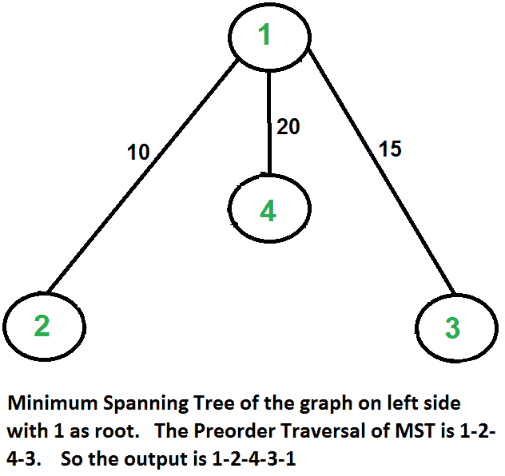

# 旅行推销员问题|集合 2(使用 MST 近似)

> 原文:[https://www . geesforgeks . org/旅行推销员-问题集-2-近似-使用-mst/](https://www.geeksforgeeks.org/travelling-salesman-problem-set-2-approximate-using-mst/)

我们在[之前的帖子](https://www.geeksforgeeks.org/travelling-salesman-problem-set-1/)中介绍了[旅行推销员问题](https://www.geeksforgeeks.org/travelling-salesman-problem-set-1/)，并讨论了该问题的天真和动态编程解决方案。这两个解决方案都不可行。事实上，这个问题没有多项式时间的解决方案，因为这个问题是一个已知的 NP-Hard 问题。不过，有一些近似算法可以解决这个问题。只有当问题实例满足三角不等式时，近似算法才起作用。

**三角形-不等式:**从 I 到达顶点 j 的距离最小的路径总是从 I 直接到达 j，而不是通过其他某个顶点 k(或多个顶点)，即 dis(i，j)总是小于或等于 dis(i，k) + dist(k，j)。三角不等式适用于许多实际情况。
当成本函数满足三角不等式时，我们可以为旅行商问题设计一个近似算法，该算法返回的旅行费用永远不会超过最优旅行费用的两倍。想法是使用 **M** 最小 **S** 平移 **T** 稀土元素(MST)。以下是基于 MST 的算法。

**算法:**
**1)** 让 1 作为业务员的起止点。
**2)** 使用[引物算法](https://www.geeksforgeeks.org/greedy-algorithms-set-5-prims-minimum-spanning-tree-mst-2/)以 1 为根构建 MST。
**(3)**列出构建的 MST 的前序遍历中访问的顶点，并在末尾添加 1。

让我们考虑下面的例子。第一个图表是给定的图表。第二个图显示了以 1 为根构造的 MST。MST 的前序遍历是 1-2-4-3。最后加 1 得到 1-2-4-3-1，就是这个算法的输出。

在这种情况下，近似算法产生最优巡线，但它未必在所有情况下都产生最优巡线。

**这个算法 2-近似如何？**上述算法产生的输出成本永远不会超过最佳可能输出成本的两倍。让我们看看上面的算法是如何保证的。
让我们定义一个术语 ***满走*** 来理解这一点。一个完整的行走是列出所有顶点当他们第一次被访问时，它也列出顶点当他们返回后，一个子树被访问时。上述树的完整路径将是 1-2-1-4-1-3-1。
以下是证明 2-近似性的一些重要事实。
**1)** 最好的旅行推销员之旅的费用永远不会低于 MST 的费用。( [MST](http://en.wikipedia.org/wiki/Minimum_spanning_tree) 的定义说，它是连接所有顶点的最小代价树)。
**2)** 全走步的总代价最多是 MST 代价的两倍(MST 的每条边最多被访问-两次)
**3)** 上述算法的输出小于全走步的代价。在上面的算法中，我们将预订单行走打印为输出。在预排序行走中，完全行走的两条或多条边被一条边代替。例如，2-1 和 1-4 被 1 条边 2-4 代替。所以如果图遵循三角形不等式，那么这总是正确的。

从以上三个陈述中，我们可以得出结论，近似算法产生的输出成本永远不会超过最佳可能解决方案成本的两倍。

我们讨论了旅行推销员问题的一个非常简单的 2-近似算法。这个问题还有其他更好的近似算法。例如[克里斯托菲德斯算法](http://en.wikipedia.org/wiki/Christofides_algorithm)是 1.5 近似算法。我们将很快在单独的帖子中讨论这些算法。

**参考文献:**
[Clifford Stein、Thomas H. Cormen、Charles E. Leiserson、罗纳德·L·李维斯特《算法导论》第三版](http://www.flipkart.com/introduction-algorithms-3/p/itmczynzhyhxv2gs?pid=9788120340077&affid=sandeepgfg)
[http://www . personal . Kent . edu/~ rmuhamma/Algorithms/MyAlgorithms/aproxagor/TSP/TSP . htm](http://www.personal.kent.edu/~rmuhamma/Algorithms/MyAlgorithms/AproxAlgor/TSP/tsp.htm) 

如果您发现任何不正确的地方，或者您想分享更多关于上面讨论的主题的信息，请写评论