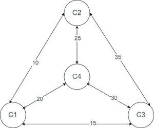
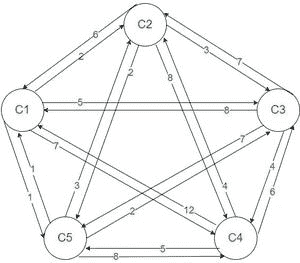
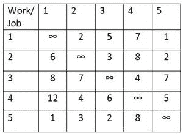
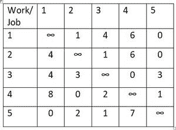
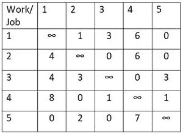
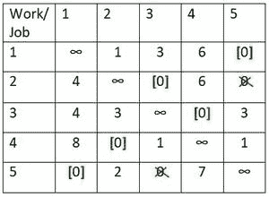
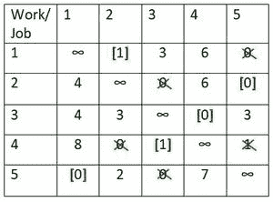
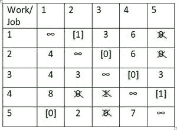

# 使用匈牙利方法的旅行推销员问题

> 原文:[https://www . geesforgeks . org/旅行推销员-问题-使用-匈牙利-方法/](https://www.geeksforgeeks.org/travelling-salesman-problem-using-hungarian-method/)

一个旅行推销员计划去 **N** 个城市，他会去每个城市**一次****然后返回**到他出发的城市**。**I 市**与**j 市**的距离为 **C ij** 。找到他能走的最短路线。**

****注意:**从 I 市前往 I 市是不可能的，C ij 可能不等于 C ji 。**

****示例:****

> ****输入:**见图中路线。**
> 
>  **
> 
> **输出:** 80
> **说明:**最短路线可循路径 C1->C2->C4->C3->C1。
> 所以路线长度为 10 + 25 + 30 + 15 = 80。
> 
> **输入:**见图中路线。
> 
> 
> 
> **输出:**15
> T3】说明:最短路线为 C1->C2->C3->C4->C5->C1。所以路径长度是 2 + 3 + 4 + 5 + 1 = 15。**

****直觉:**假设有 3 个城市，即城市 1、城市 2、城市 3。参观这些城市的所有可能组合是**

> **1->2->3->1 (1->2，2->3，3-> 1)
> 1->3->2->1(1->3，3- > 2，2->1)
> 2->1->3->2(2->1，1- > 3，3- > 2)
> 2- > 3- >**

**所以，城市可以通过 **6 种不同的方式**游览，但是如果仔细观察的话，可以看到游览**1、4、5 号相当于**，游览**2、3、6 号相当于**。因此，可能的**不同**组合实际上是 **2** ，这些是**

> **1-> 2-> 3-> 1
> 1->3->2->1**

**因此，如果有 **N 个城市**可以参观，那么就有 **(N-1)！**前往每个城市一次，返回出发城市的方式。这类问题可以通过 [**匈牙利法**](https://www.geeksforgeeks.org/hungarian-algorithm-assignment-problem-set-1-introduction/)分支定界法、罚分法和最近邻法来解决。我们将看到如何使用匈牙利方法解决这类问题。**

****方法:**下面提到的是使用**匈牙利方法**解决问题的步骤。
考虑图中所示的示例:**

****

**为了更好地理解，请按照上述示例中的解决方案图示进行操作。**

****步骤 1:** 在成本矩阵的每一行中找到最小的成本要素。从相应行的每隔一个元素中减去这个元素。因此，降低成本矩阵的每一行中至少有一个零**

> **插图:**
> 
> 1.  **用最小值 1 减去第一行。**
> 2.  **用最小值 2 减去第二行。**
> 3.  **用最小值 4 减去第三行。**
> 4.  **用最小值 4 减去第 4 行。**
> 5.  **用最小值 1 减去第 5 行。**
> 
> ****

****第二步:**同样，在得到的降低成本矩阵中找到每列的最小元素，并从相应列的每个元素中减去该元素。因此，第二个降低成本矩阵的每一行和每一列中应该至少有一个零。**

> **插图:**
> 
>  **1.  用最小值 0 减去第一列。
> 2.  用最小值 0 减去第二列。
> 3.  用最小值 1 减去第三列。
> 4.  用最小值 0 减去第 4 列。
> 5.  用最小值 0 减去第 5 列。
> 
> **

****步骤 3:** 在矩阵中进行赋值，如下所示。**

1.  **逐行移动，直到找到单个零的行。**
2.  **指定包含零的单元格，并划掉其列中的所有其他零。**
3.  **继续此过程，直到分配了所有带单个零的行。**
4.  **对每一列重复该过程。**
5.  **如果一行和(或)一列有两个或两个以上的零，并且一个不能通过检查来选择，那么分配这些零中的任意一个，并划掉该行/列的所有其他零。**

> **插图:**
> 
> **分配了逐行单元格(1，5)。所以，列式单元格(2，5)被划掉了。
> 分配行方式单元(2，3)。所以，列式单元格(5，3)被划掉了。
> 已分配行方式单元格(3，4)。
> 分配行方式单元格(4，2)。
> 分配行方式单元(5，1)。**
> 
> ****
> 
> **在这里，分配的数量等于城市的数量，旅行是 1->5->1 和 2->3->4->2，这意味着推销员将从城市 1 旅行到城市 5 并返回城市 1，然后再次从城市开始，旅行到城市 3、城市 4 并返回城市 2。因此，我们得到两个循环，因此它不是解决方案。**

****第 4 步:**取最小非零元素，重复第 2 步和第 3 步，即可得到次优解**

> ****说明:**这种情况下，最小非零元素为 1。**
> 
> **分配了逐行单元格(3，4)。
> 分配行方式单元(1，2)。因此，列方向的单元(4，2)被划掉，行方向的单元(1，5)被划掉。
> 分配了行方式单元格(2，5)。因此，行方向的单元(2，3)被划掉，列方向的单元(4，5)被划掉。
> 分配行方式单元格(4，3)。所以，列式单元格(5，3)被划掉了。
> 分配行方式单元(5，1)。**
> 
> ****
> 
>  **现在，顺序是 1->2->5->1 和 3->4->3。同样，我们得到两个循环，因此这也不是解决方案。**

****步骤 5:** 进行不同的可能分配**

> **插图:**
> 
> **分配了逐行单元格(3，4)。
> 分配行方式单元(1，2)。因此，列方向的单元(4，2)被划掉，行方向的单元(1，5)被划掉。
> 分配行方式单元(2，3)。因此，列方向的单元(4，3)和(5，3)被划掉，行方向的单元(2，5)被划掉。
> 分配行方式单元格(4，5)。
> 分配行方式单元(5，1)。**
> 
> ****
> 
> **顺序是 1->2->3->4->5->1。所以，这个解决方案是最优的，这个旅行的总距离是**
> 
> **细胞 12 +细胞 23 +细胞 34 +细胞 45 +细胞 51 = (2+3+4+5+1) =15。**