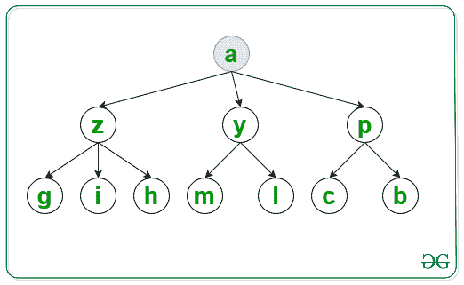
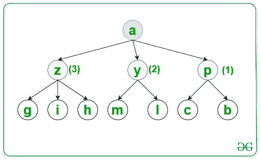
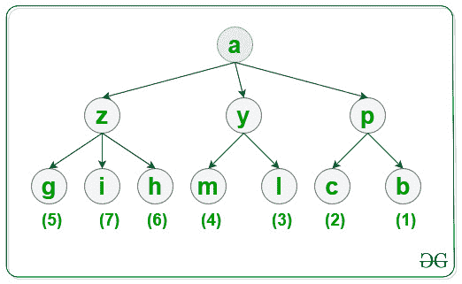

# 使用 BFS 以字典顺序遍历图

> 原文:[https://www . geeksforgeeks . org/按字典顺序遍历图形-使用-bfs/](https://www.geeksforgeeks.org/traversal-of-a-graph-in-lexicographical-order-using-bfs/)

给定一个由 **N** 节点、一个源 **S** 和一个[数组](https://www.geeksforgeeks.org/multidimensional-arrays-c-cpp/) **类型的 **{u，v}** 边[]**组成的[图](https://www.geeksforgeeks.org/introduction-to-graphs/)， **G** ，表示在节点 **u** 和 **v** 之间有一条无向边，任务是使用 [BFS 按照字典顺序遍历该图](https://www.geeksforgeeks.org/breadth-first-search-or-bfs-for-a-graph/)

> **输入:** N = 10，M = 10，S = 'a '，Edges[[2]= { 'a '，' y' }，{ 'a '，' z' }，{ ' a '，' p' }，{ 'p '，' c' }，{ 'p '，' b' }，{ 'y '，' m' }，{ 'y '，' l' }，{ 'z '，' h' }，{ 'z '，' g' }，{ 'z '，' I ' }
> **输出:** a p y z b c
> 
> **说明:**
> 对于第一级，按照所示的字典顺序访问节点并打印:
> 
> 
> 
> 对于第二层，按照所示的字典顺序访问该节点，并将其打印出来:
> 
> 
> 
> 对于第三层，按照所示的字典顺序访问该节点，并将其打印出来:
> 
> 
> 
> **输入:** N = 6，S = 'a '，Edges[][2]= { 'a '，' e' }，{ ' a '，' d' }，{ 'e '，' b' }，{ 'e '，' c' }，{ 'd '，' f' }，{ 'd '，' g ' }
> T3】输出: a d e f g b c

**方法:**按照以下步骤解决问题:

*   初始化一个[图](https://www.geeksforgeeks.org/map-associative-containers-the-c-standard-template-library-stl/)，比如说 **G** 按照节点的字典顺序存储一个节点的所有相邻节点。
*   初始化一个[图](https://www.geeksforgeeks.org/map-associative-containers-the-c-standard-template-library-stl/)，比如说**和**来检查一个节点是否已经被遍历。
*   [遍历边[][2]数组](https://www.geeksforgeeks.org/c-program-to-traverse-an-array/)，将图中每个节点的所有相邻节点存储在 **G** 中。
*   最后，[使用 BFS](https://www.geeksforgeeks.org/breadth-first-search-or-bfs-for-a-graph/) 遍历该图，并打印该图的访问节点。

下面是上述方法的实现:

## C++

```
// C++ program to implement
// the above approach

#include <bits/stdc++.h>
using namespace std;

// Function to traverse the graph in
// lexicographical order using BFS
void LexiBFS(map<char, set<char> >& G,
             char S, map<char, bool>& vis)
{
    // Stores nodes of the graph
    // at each level
    queue<char> q;

    // Insert nodes of first level
    q.push(S);

    // Mark S as
    // visited node
    vis[S] = true;

    // Traverse all nodes of the graph
    while (!q.empty()) {

        // Stores top node of queue
        char top = q.front();

        // Print visited nodes of graph
        cout << top << " ";

        // Insert all adjacent nodes
        // of the graph into queue
        for (auto i = G[top].begin();
             i != G[top].end(); i++) {

            // If i is not visited
            if (!vis[*i]) {

                // Mark i as visited node
                vis[*i] = true;

                // Insert i into queue
                q.push(*i);
            }
        }

        // Pop top element of the queue
        q.pop();
    }
}

// Utility Function to traverse graph
// in lexicographical order of nodes
void CreateGraph(int N, int M, int S,
                 char Edges[][2])
{
    // Store all the adjacent nodes
    // of each node of a graph
    map<char, set<char> > G;

    // Traverse Edges[][2] array
    for (int i = 0; i < M; i++) {
        G[Edges[i][0]].insert(Edges[i][1]);
    }

    // Check if a node is already visited or not
    map<char, bool> vis;

    LexiBFS(G, S, vis);
}

// Driver Code
int main()
{
    int N = 10, M = 10 S = 'a';
    char Edges[M][2]
        = { { 'a', 'y' }, { 'a', 'z' },
            { 'a', 'p' }, { 'p', 'c' },
            { 'p', 'b' }, { 'y', 'm' },
            { 'y', 'l' }, { 'z', 'h' },
            { 'z', 'g' }, { 'z', 'i' } };

    // Function Call
    CreateGraph(N, M, S, Edges);

    return 0;
}
```

## Java 语言(一种计算机语言，尤用于创建网站)

```
// Java program to implement
// the above approach
import java.util.*;

class Graph{

// Function to traverse the graph in
// lexicographical order using BFS
static void LexiBFS(HashMap<Character, Set<Character>> G,
            char S, HashMap<Character, Boolean> vis)
{

    // Stores nodes of the graph
    // at each level
    Queue<Character> q = new LinkedList<>();

    // Insert nodes of first level
    q.add(S);

    // Mark S as
    // visited node
    vis.put(S, true);

    // Traverse all nodes of the graph
    while (!q.isEmpty())
    {

        // Stores top node of queue
        char top = q.peek();

        // Print visited nodes of graph
        System.out.print(top + " ");

        // Insert all adjacent nodes
        // of the graph into queue
        if (G.containsKey(top))
        {
            for(char  i : G.get(top))
            {

                // If i is not visited
                if (vis.containsKey(i))
                {
                    if (!vis.get(i))
                    {

                        // Mark i as visited node
                        vis.put(i, true);

                        // Insert i into queue
                        q.add(i);
                    }
                }
                else
                {

                    // Mark i as visited node
                    vis.put(i, true);

                    // Insert i into queue
                    q.add(i);
                }
            }
        }

        // Pop top element of the queue
        q.remove();
    }
}

// Utility Function to traverse graph
// in lexicographical order of nodes
static void CreateGraph(int N, int M, char S,
                        char[][] Edges)
{

    // Store all the adjacent nodes
    // of each node of a graph
    HashMap<Character, Set<Character>> G = new HashMap<>();

    // Traverse Edges[][2] array
    for(int i = 0; i < M; i++)
    {
        if (G.containsKey(Edges[i][0]))
        {
            Set<Character> temp = G.get(Edges[i][0]);
            temp.add(Edges[i][1]);
            G.put(Edges[i][0], temp);
        }
        else
        {
            Set<Character> temp = new HashSet<>();
            temp.add(Edges[i][1]);
            G.put(Edges[i][0], temp);
        }
    }

    // Check if a node is already visited or not
    HashMap<Character, Boolean> vis = new HashMap<>();

    LexiBFS(G, S, vis);
}

// Driver code
public static void main(String[] args)
{
    int N = 10, M = 10;
    char S = 'a';

    char[][] Edges = { { 'a', 'y' }, { 'a', 'z' },
                       { 'a', 'p' }, { 'p', 'c' },
                       { 'p', 'b' }, { 'y', 'm' },
                       { 'y', 'l' }, { 'z', 'h' },
                       { 'z', 'g' }, { 'z', 'i' } };

    // Function Call
    CreateGraph(N, M, S, Edges);
}
}

// This code is contributed by hritikrommie
```

## 蟒蛇 3

```
# Python3 program to implement
# the above approach
from collections import deque

G = [[] for i in range(1000)]
vis = [False for i in range(1000)]

# Function to traverse the graph in
# lexicographical order using BFS
def LexiBFS(S):

    global G, vis

    # Stores nodes of the graph
    # at each level
    q = deque()

    # Insert nodes of first level
    q.append(ord(S))

    # Mark S as
    # visited node
    vis[ord(S)] = True
    #a = []

    # Traverse all nodes of the graph
    while (len(q) > 0):

        # Stores top node of queue
        top = q.popleft()
        print(chr(top), end = " ")

        # Insert all adjacent nodes
        # of the graph into queue
        for i in G[top]:

            # If i is not visited
            if (not vis[i]):
                #print(chr(i),end=" ")

                # Mark i as visited node
                vis[i] = True

                # Insert i into queue
                q.append(i)

# Utility Function to traverse graph
# in lexicographical order of nodes
def CreateGraph(N, M, S,Edges):

    # Traverse Edges[][2] array
    for i in range(M):
        G[ord(Edges[i][0])].append(ord(Edges[i][1]))

    for i in range(1000):
        G[i] = sorted(G[i])

    LexiBFS(S)

# Driver Code
if __name__ == '__main__':

    N, M = 10, 10
    S = 'a'

    Edges = [ [ 'a', 'y' ], [ 'a', 'z' ],
              [ 'a', 'p' ], [ 'p', 'c' ],
              [ 'p', 'b' ], [ 'y', 'm' ],
              [ 'y', 'l' ], [ 'z', 'h' ],
              [ 'z', 'g' ], [ 'z', 'i' ] ]

    # Function Call
    CreateGraph(N, M, S, Edges)

# This code is contributed by mohit kumar 29
```

## java 描述语言

```
<script>

// Javascript program to implement
// the above approach

// Function to traverse the graph in
// lexicographical order using BFS
function LexiBFS(G, S, vis)
{

    // Stores nodes of the graph
    // at each level
    var q = [];

    // Insert nodes of first level
    q.push(S);

    // Mark S as
    // visited node
    vis.set(S, true);

    // Traverse all nodes of the graph
    while (q.length != 0)
    {

        // Stores top node of queue
        var top = q[0];

        // Print visited nodes of graph
        document.write( top + " ");

        if (G.has(top))
        {

            // Insert all adjacent nodes
            // of the graph into queue
            [...G.get(top)].sort().forEach(value => {

                // If i is not visited
                if (!vis.has(value))
                {

                    // Mark i as visited node
                    vis.set(value, true);

                    // Insert i into queue
                    q.push(value);
                }
            });
        }

        // Pop top element of the queue
        q.shift();
    }
}

// Utility Function to traverse graph
// in lexicographical order of nodes
function CreateGraph(N, M, S, Edges)
{

    // Store all the adjacent nodes
    // of each node of a graph
    var G = new Map();

    // Traverse Edges[][2] array
    for(var i = 0; i < M; i++)
    {
        if (G.has(Edges[i][0]))
        {
            var tmp = G.get(Edges[i][0]);
            tmp.add(Edges[i][1]);
            G.set(Edges[i][0], tmp);
        }
        else
        {
            var tmp = new Set();
            tmp.add(Edges[i][1])
            G.set(Edges[i][0], tmp)
        }
    }

    // Check if a node is already visited or not
    var vis = new Map();

    LexiBFS(G, S, vis);
}

// Driver Code
var N = 10, M = 10, S = 'a';
var Edges = [ [ 'a', 'y' ], [ 'a', 'z' ],
              [ 'a', 'p' ], [ 'p', 'c' ],
              [ 'p', 'b' ], [ 'y', 'm' ],
              [ 'y', 'l' ], [ 'z', 'h' ],
              [ 'z', 'g' ], [ 'z', 'i' ] ];

// Function Call
CreateGraph(N, M, S, Edges);

// This code is contributed by rutvik_56

</script>
```

**Output:** 

```
a p y z b c l m g h i
```

***时间复杂度:** O(N * log(N))*
***辅助空间:** O(N)*