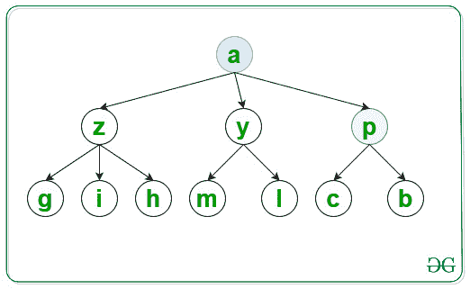
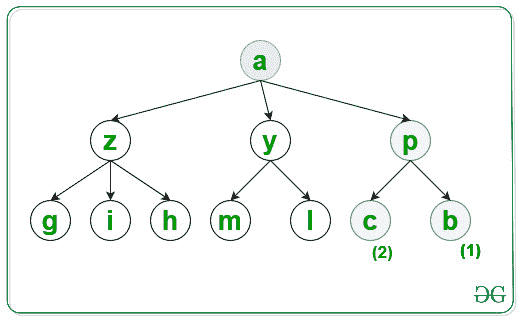
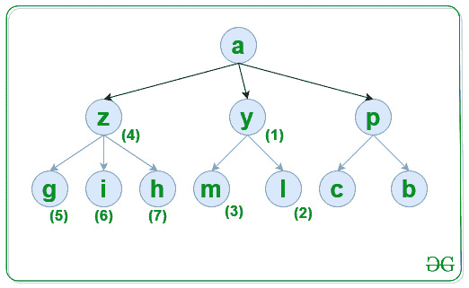

# 使用 DFS 按照节点的字典顺序遍历图

> 原文:[https://www . geesforgeks . org/traverse-graph-in-accordulated-order-of-nodes-use-DFS/](https://www.geeksforgeeks.org/traverse-graph-in-lexicographical-order-of-nodes-using-dfs/)

给定由 **N** 节点、源 **S** 和类型 **{u，v}** 的[数组](https://www.geeksforgeeks.org/multidimensional-arrays-c-cpp/) **边【】【2】**组成的[图， **G** 表示在节点 **u** 和 **v** 之间有一条无向边，任务是使用](https://www.geeksforgeeks.org/introduction-to-graphs/) [DFS 按照字典顺序遍历该图](https://www.geeksforgeeks.org/depth-first-search-or-dfs-for-a-graph/)

**示例:**

> **输入:** N = 10，M = 10，S = 'a '，Edges[][2]= { 'a '，' y' }，{ 'a '，' z' }，{ ' a '，' p' }，{ 'p '，' c' }，{ 'p '，' b' }，{ 'y '，' m' }，{ 'y '，' l' }，{ 'z '，' h' }，{ 'z '，' g' }，{ 'z '，' I ' }
> **输出:** a p b c y l
> 
> **说明:**
> 一级访问节点并打印:
> 
> 
> 
> 同样访问了第二级**节点 p** ，它的字典序最小为:
> 
> 
> 
> 类似地，按字典顺序访问了第三级节点 p ,如:
> 
> 
> 
> 现在最终的遍历如下图所示，标记为数字的递增顺序:
> 
> 
> 
> **输入:** N = 6，S = 'a '，Edges[][2]= { 'a '，' e' }，{ ' a '，' d' }，{ 'e '，' b' }，{ 'e '，' c' }，{ 'd '，' f' }，{ 'd '，' g ' }
> T3】输出: a d f g e b c

**方法:**按照以下步骤解决问题:

*   初始化一个[图](https://www.geeksforgeeks.org/map-associative-containers-the-c-standard-template-library-stl/)，比如说 **G** 按照节点的字典顺序存储一个节点的所有相邻节点。
*   初始化一个[图](https://www.geeksforgeeks.org/map-associative-containers-the-c-standard-template-library-stl/)，比如说**和**来检查一个节点是否已经被遍历。
*   [遍历边[][2]数组](https://www.geeksforgeeks.org/c-program-to-traverse-an-array/)，将图中每个节点的所有相邻节点存储在 **G** 中。
*   最后，[使用 DFS](https://www.geeksforgeeks.org/depth-first-search-or-dfs-for-a-graph/) 遍历图，打印图的访问节点。

下面是上述方法的实现:

## C++

```
// C++ program  for the above approach
#include <bits/stdc++.h>
using namespace std;

// Function to traverse the graph in
// lexicographical order using DFS
void LexiDFS(map<char, set<char> >& G,
             char S, map<char, bool>& vis)
{
    // Mark S as visited nodes
    vis[S] = true;

    // Print value of visited nodes
    cout << S << " ";

    // Traverse all adjacent nodes of S
    for (auto i = G[S].begin();
         i != G[S].end(); i++) {

        // If i is not visited
        if (!vis[*i]) {

            // Traverse all the nodes
            // which is connected to i
            LexiDFS(G, *i, vis);
        }
    }
}

// Utility Function to traverse graph
// in lexicographical order of nodes
void CreateGraph(int N, int M, int S,
                 char Edges[][2])
{
    // Store all the adjacent nodes
    // of each node of a graph
    map<char, set<char> > G;

    // Traverse Edges[][2] array
    for (int i = 0; i < M; i++) {

        // Add the edges
        G[Edges[i][0]].insert(
            Edges[i][1]);
    }

    // Check if a node is already
    // visited or not
    map<char, bool> vis;

    // Function Call
    LexiDFS(G, S, vis);
}

// Driver Code
int main()
{
    int N = 10, M = 10, S = 'a';
    char Edges[M][2]
        = { { 'a', 'y' }, { 'a', 'z' },
            { 'a', 'p' }, { 'p', 'c' },
            { 'p', 'b' }, { 'y', 'm' },
            { 'y', 'l' }, { 'z', 'h' },
            { 'z', 'g' }, { 'z', 'i' } };

    // Function Call
    CreateGraph(N, M, S, Edges);

    return 0;
}
```

## Java 语言(一种计算机语言，尤用于创建网站)

```
// Java program for above approach
import java.util.*;

class Graph{

// Function to traverse the graph in
// lexicographical order using DFS
static void LexiDFS(HashMap<Character, Set<Character>> G,
            char S, HashMap<Character, Boolean> vis)
{

    // Mark S as visited nodes
    vis.put(S, true);

    // Print value of visited nodes
    System.out.print(S + " ");

    // Traverse all adjacent nodes of S
    if (G.containsKey(S))
    {
        for(char i : G.get(S))
        {

            // If i is not visited
            if (!vis.containsKey(i) || !vis.get(i))
            {

                // Traverse all the nodes
                // which is connected to i
                LexiDFS(G, i, vis);
            }
        }
    }
}

// Utility Function to traverse graph
// in lexicographical order of nodes
static void CreateGraph(int N, int M, char S,
                        char[][] Edges)
{

    // Store all the adjacent nodes
    // of each node of a graph
    HashMap<Character, Set<Character>> G = new HashMap<>();

    // Traverse Edges[][2] array
    for(int i = 0; i < M; i++)
    {
        if (G.containsKey(Edges[i][0]))
        {
            Set<Character> temp = G.get(Edges[i][0]);
            temp.add(Edges[i][1]);
            G.put(Edges[i][0], temp);
        }
        else
        {
            Set<Character> temp = new HashSet<>();
            temp.add(Edges[i][1]);
            G.put(Edges[i][0], temp);
        }
    }

    // Check if a node is already visited or not
    HashMap<Character, Boolean> vis = new HashMap<>();

    LexiDFS(G, S, vis);
}

// Driver code
public static void main(String[] args)
{
    int N = 10, M = 10;
    char S = 'a';

    char[][] Edges = { { 'a', 'y' }, { 'a', 'z' },
                       { 'a', 'p' }, { 'p', 'c' },
                       { 'p', 'b' }, { 'y', 'm' },
                       { 'y', 'l' }, { 'z', 'h' },
                       { 'z', 'g' }, { 'z', 'i' } };

    // Function Call
    CreateGraph(N, M, S, Edges);
}
}

// This code is contributed by hritikrommie
```

## 蟒蛇 3

```
# Python3 program  for the above approach
G = [[] for i in range(300)]
vis = [0 for i in range(300)]

# Function to traverse the graph in
# lexicographical order using DFS
def LexiDFS(S):
    global G, vis

    # Mark S as visited nodes
    vis[ord(S)] = 1

    # Prvalue of visited nodes
    print (S,end=" ")

    # Traverse all adjacent nodes of S
    for i in G[ord(S)]:
        # If i is not visited
        if (not vis[i]):
            # Traverse all the nodes
            # which is connected to i
            LexiDFS(chr(i))

# Utility Function to traverse graph
# in lexicographical order of nodes
def CreateGraph(N, M, S, Edges):
    global G
    # Store all the adjacent nodes
    # of each node of a graph

    # Traverse Edges[][2] array
    for i in Edges:
        # Add the edges
        G[ord(i[0])].append(ord(i[1]))
        G[ord(i[0])] = sorted(G[ord(i[0])])

    # Function Call
    LexiDFS(S)

# Driver Code
if __name__ == '__main__':
    N = 10
    M = 10
    S = 'a'
    Edges=[ ['a', 'y' ],[ 'a', 'z' ],
           [ 'a', 'p' ],[ 'p', 'c' ],
           [ 'p', 'b' ],[ 'y', 'm' ],
           [ 'y', 'l' ],[ 'z', 'h' ],
           [ 'z', 'g' ],[ 'z', 'i' ] ]

    # Function Call
    CreateGraph(N, M, S, Edges);

# This code is contributed by mohitkumar29.
```

## java 描述语言

```
<script>

// JavaScript program  for the above approach

let G = new Array(300).fill(0).map(() => [])
let vis = new Array(300).fill(0)

// Function to traverse the graph in
// lexicographical order using DFS
function LexiDFS(S) {
    // Mark S as visited nodes
    vis[S.charCodeAt(0)] = 1

    // Prvalue of visited nodes
    document.write(S + " ")

    // Traverse all adjacent nodes of S
    for (let i of G[S.charCodeAt(0)]) {
        // If i is not visited
        if (!vis[i]) {
            // Traverse all the nodes
            // which is connected to i
            LexiDFS(String.fromCharCode(i))
        }
    }
}

// Utility Function to traverse graph
// in lexicographical order of nodes
function CreateGraph(N, M, S, Edges) {
    // Store all the adjacent nodes
    // of each node of a graph

    // Traverse Edges[][2] array
    for (let i of Edges) {
        // Add the edges
        G[i[0].charCodeAt(0)].push(i[1].charCodeAt(0))

        G[i[0].charCodeAt(0)] =
        G[i[0].charCodeAt(0)].sort((a, b) => a - b)
    }

    // Function Call
    LexiDFS(S)
}

// Driver Code
let N = 10
let M = 10
let S = 'a'
let Edges = [['a', 'y'], ['a', 'z'],
['a', 'p'], ['p', 'c'],
['p', 'b'], ['y', 'm'],
['y', 'l'], ['z', 'h'],
['z', 'g'], ['z', 'i']]

// Function Call
CreateGraph(N, M, S, Edges);

// This code is contributed by _saurabh_jaiswal

</script>
```

**Output:** 

```
a p b c y l m z g h i
```

***时间复杂度:** O(N * log(N))*
***辅助空间:** O(N)*