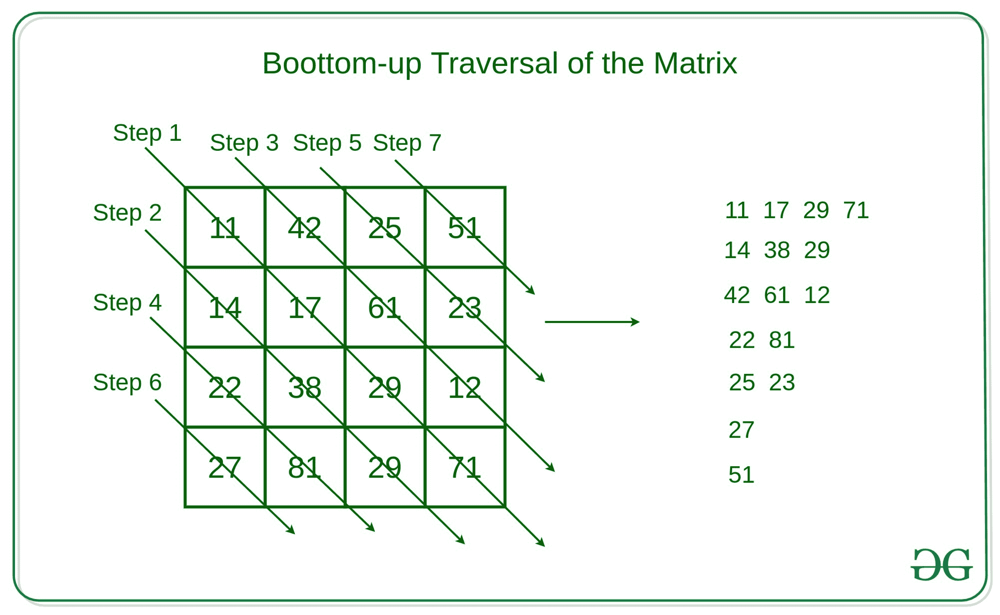

# 使用递归以对角自下而上的方式遍历矩阵

> 原文:[https://www . geesforgeks . org/traverse-matrix-in-对角线-自下而上-时尚-使用递归/](https://www.geeksforgeeks.org/traverse-the-matrix-in-diagonally-bottom-up-fashion-using-recursion/)

给定大小为 **N x N** 的矩阵 **mat[][]** ，任务是使用[递归](https://www.geeksforgeeks.org/recursion/)以自下而上的方式对角遍历矩阵。
**对角自下而上遍历:**

*   遍历矩阵的主对角线。
*   穿过底部对角线到矩阵的主对角线。
*   沿着矩阵的上对角线到主对角线。
*   同样，遍历矩阵的每个对角线。

下图显示了矩阵的自下而上遍历。



**例:**

```
Input: 
M[][] = {{11, 42, 25, 51}, 
         {14, 17, 61, 23},
         {22, 38, 19, 12},
         {27, 81, 29, 71}} 
Output: 
11 17 19 71 
14 38 29 
42 61 12 
22 81 
25 23 
27 
51 

Input: 
M[][] = {{3, 2, 5}, 
         {4, 7, 6},
         {2, 8, 9}}
Output: 
3 7 9 
4 8 
2 6 
2 
5  
```

**方法:**思路是遍历矩阵的主对角线元素，然后递归调用，求矩阵的下对角线和上面的对角线到矩阵的主对角线。该方法的递归定义描述如下:

*   **函数定义:**对于这个问题，会有如下的论证:
    *   ***【mat】【】【】***//待穿越矩阵
    *   当前行(说 ***i*** ) //要遍历的当前行
    *   当前列(比如 ***j*** ) //要穿越的当前列
    *   行数(比如 ***行*** )
    *   列数(如 ***栏*** )
*   **基本情况:**这个问题的基本情况可以是当前行或当前列越界。在这种情况下，遍历另一个底部对角线，或者如果上次选择了底部对角线，则遍历它上面的主对角线。

```
if (i >= row or j >= col)
    if (flag)
        // Change the Current index
        // to the bottom diagonal
    else
        // Change the current index
        // to the up diagonal of matrix
```

*   **递归情况:**矩阵递归遍历有两种情况，定义如下:
    *   **遍历当前对角线:**要遍历当前对角线，请将当前行和列同时递增 1，并递归调用函数。
    *   **遍历下/上对角线:**要遍历下/上对角线，调用递归函数，静态变量存储矩阵的下一个遍历起始点。

以下是上述方法的实现:

## C++

```
// C++ implementation to traverse the
// matrix in the bottom-up fashion
// using Recursion

#include <iostream>

using namespace std;

// Recursive function to traverse the
// matrix Diagonally Bottom-up
bool traverseMatrixDiagonally(int m[][5], 
          int i, int j, int row, int col)
{

    // Static variable for changing
    // Row and column
    static int k1 = 0, k2 = 0;

    // Flag variable for handling
    // Bottom up diagonal traversing
    static bool flag = true;

    // Base Condition
    if (i >= row || j >= col) {

        // Condition when to traverse
        // Bottom Diagonal of the matrix
        if (flag) {
            int a = k1;
            k1 = k2;
            k2 = a;
            flag = !flag;
            k1++;
        }
        else {

            int a = k1;
            k1 = k2;
            k2 = a;
            flag = !flag;
        }
        cout << endl;
        return false;
    }

    // Print matrix cell value
    cout << m[i][j] << " ";

    // Recursive function to traverse
    // The matrix diagonally
    if (traverseMatrixDiagonally(
           m, i + 1, j + 1, row, col)) {
        return true;
    }
    // Recursive function 
    // to change diagonal
    if (traverseMatrixDiagonally(
            m, k1, k2, row, col)) {
        return true;
    }

    return true;
}

// Driver Code
int main()
{
    // Initialize the 5 x 5 matrix
    int mtrx[5][5] = {
        { 10, 11, 12, 13, 14 },
        { 15, 16, 17, 18, 19 },
        { 20, 21, 22, 23, 24 },
        { 25, 26, 27, 28, 29 },
        { 30, 31, 32, 33, 34 }
    };

    // Function call 
    // for traversing matrix
    traverseMatrixDiagonally(
            mtrx, 0, 0, 5, 5);
}
```

## Java 语言(一种计算机语言，尤用于创建网站)

```
// Java implementation to traverse 
// the matrix in the bottom-up 
// fashion using recursion
class GFG{

// Static variable for changing
// row and column
static int k1 = 0, k2 = 0;

// Flag variable for handling
// bottom up diagonal traversing
static boolean flag = true; 

// Recursive function to traverse the
// matrix diagonally bottom-up
static boolean traverseMatrixDiagonally(int m[][], int i,
                                        int j, int row,
                                        int col)
{

    // Base Condition
    if (i >= row || j >= col)
    {

        // Condition when to traverse
        // Bottom Diagonal of the matrix
        if (flag)
        {
            int a = k1;
            k1 = k2;
            k2 = a;
            flag = !flag;
            k1++;
        }
        else
        {
            int a = k1;
            k1 = k2;
            k2 = a;
            flag = !flag;
        }

        System.out.println();
        return false;
    }

    // Print matrix cell value
    System.out.print(m[i][j] + " ");

    // Recursive function to traverse
    // The matrix diagonally
    if (traverseMatrixDiagonally(m, i + 1,
                                    j + 1, row, col))
    {
        return true;
    }

    // Recursive function 
    // to change diagonal
    if (traverseMatrixDiagonally(m, k1, k2, row, col))
    {
        return true;
    }

    return true;
}

// Driver Code
public static void main(String[] args)
{
    // Initialize the 5 x 5 matrix
    int mtrx[][] = { { 10, 11, 12, 13, 14 },
                     { 15, 16, 17, 18, 19 },
                     { 20, 21, 22, 23, 24 },
                     { 25, 26, 27, 28, 29 },
                     { 30, 31, 32, 33, 34 } };

    // Function call 
    // for traversing matrix
    traverseMatrixDiagonally(mtrx, 0, 0, 5, 5);
}
}

// This code is contributed by sapnasingh4991
```

## 蟒蛇 3

```
# Python3 implementation to traverse the 
# matrix in the bottom-up fashion 
# using Recursion

# Static variable for changing 
# Row and column
k1 = 0
k2 = 0

# Flag variable for handling 
# Bottom up diagonal traversing
flag = True

# Recursive function to traverse the 
# matrix Diagonally Bottom-up
def traverseMatrixDiagonally(m, i, 
                             j, row, col):
    global k1
    global k2
    global flag

    # Base Condition
    if(i >= row or j >= col):

        # Condition when to traverse 
        # Bottom Diagonal of the matrix
        if(flag):
            a = k1 
            k1 = k2
            k2 = a
            if(flag):
                flag = False
            else:
                flag = True
            k1 += 1
        else:
            a = k1
            k1 = k2
            k2 = a
            if(flag):
                flag = False
            else:
                flag = True
        print()
        return False

    # Print matrix cell value
    print(m[i][j], end = " ")

    # Recursive function to traverse 
    # The matrix diagonally
    if (traverseMatrixDiagonally(m, i + 1, 
                                 j + 1, 
                                 row, col)):
        return True

    # Recursive function  
    # to change diagonal
    if(traverseMatrixDiagonally(m, k1, 
                                k2, row, col)):
        return True
    return True

# Driver Code

# Initialize the 5 x 5 matrix
mtrx=[[10, 11, 12, 13, 14],
      [15, 16, 17, 18, 19],
      [20, 21, 22, 23, 24],
      [25, 26, 27, 28, 29],
      [30, 31, 32, 33, 34]]

# Function call  
# for traversing matrix
traverseMatrixDiagonally(mtrx, 0, 
                         0, 5, 5)

#This code is contributed by avanitrachhadiya2155
```

## C#

```
// C# implementation to traverse 
// the matrix in the bottom-up 
// fashion using recursion
using System;

class GFG{

// Static variable for changing
// row and column
static int k1 = 0, k2 = 0;

// Flag variable for handling
// bottom up diagonal traversing
static bool flag = true; 

// Recursive function to traverse the
// matrix diagonally bottom-up
static bool traverseMatrixDiagonally(int [,]m, int i,
                                     int j, int row,
                                     int col)
{

    // Base Condition
    if (i >= row || j >= col)
    {

        // Condition when to traverse
        // Bottom Diagonal of the matrix
        if (flag)
        {
            int a = k1;
            k1 = k2;
            k2 = a;
            flag = !flag;
            k1++;
        }
        else
        {
            int a = k1;
            k1 = k2;
            k2 = a;
            flag = !flag;
        }

        Console.WriteLine();
        return false;
    }

    // Print matrix cell value
    Console.Write(m[i, j] + " ");

    // Recursive function to traverse
    // The matrix diagonally
    if (traverseMatrixDiagonally(m, i + 1,
                                    j + 1, row, col))
    {
        return true;
    }

    // Recursive function 
    // to change diagonal
    if (traverseMatrixDiagonally(m, k1, k2, row, col))
    {
        return true;
    }
    return true;
}

// Driver Code
public static void Main(String[] args)
{

    // Initialize the 5 x 5 matrix
    int [,]mtrx = { { 10, 11, 12, 13, 14 },
                    { 15, 16, 17, 18, 19 },
                    { 20, 21, 22, 23, 24 },
                    { 25, 26, 27, 28, 29 },
                    { 30, 31, 32, 33, 34 } };

    // Function call for  
    // traversing matrix
    traverseMatrixDiagonally(mtrx, 0, 0, 5, 5);
}
}

// This code is contributed by Amit Katiyar
```

## java 描述语言

```
<script>
// Java script implementation to traverse
// the matrix in the bottom-up
// fashion using recursion

// Static variable for changing
// row and column
let k1 = 0, k2 = 0;

// Flag variable for handling
// bottom up diagonal traversing
let flag = true;

// Recursive function to traverse the
// matrix diagonally bottom-up
function traverseMatrixDiagonally(m,i,j,row,col)
{

    // Base Condition
    if (i >= row || j >= col)
    {

        // Condition when to traverse
        // Bottom Diagonal of the matrix
        if (flag)
        {
            let a = k1;
            k1 = k2;
            k2 = a;
            flag = !flag;
            k1++;
        }
        else
        {
            let a = k1;
            k1 = k2;
            k2 = a;
            flag = !flag;
        }

        document.write("<br>");
        return false;
    }

    // Print matrix cell value
    document.write(m[i][j] + " ");

    // Recursive function to traverse
    // The matrix diagonally
    if (traverseMatrixDiagonally(m, i + 1,
                                    j + 1, row, col))
    {
        return true;
    }

    // Recursive function
    // to change diagonal
    if (traverseMatrixDiagonally(m, k1, k2, row, col))
    {
        return true;
    }

    return true;
}

// Driver Code

    // Initialize the 5 x 5 matrix
    let mtrx = [[ 10, 11, 12, 13, 14 ],
                    [ 15, 16, 17, 18, 19 ],
                    [ 20, 21, 22, 23, 24 ],
                    [ 25, 26, 27, 28, 29 ],
                    [ 30, 31, 32, 33, 34 ]];

    // Function call
    // for traversing matrix
    traverseMatrixDiagonally(mtrx, 0, 0, 5, 5);

//This code is contributed by sravan kumar
</script>
```

**Output**

```
10 16 22 28 34 
15 21 27 33 
11 17 23 29 
20 26 32 
12 18 24 
25 31 
13 19 
30 
14 
```

**时间复杂度:** O(N <sup>2</sup> )