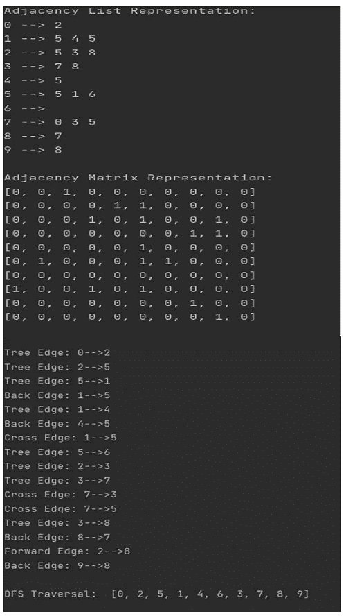

# 图的 DFS 中的树、后、边和交叉边

> 原文:[https://www . geesforgeks . org/tree-back-edge-and-cross-edges-in-DFS-of-graph/](https://www.geeksforgeeks.org/tree-back-edge-and-cross-edges-in-dfs-of-graph/)

考虑下面给出的有向图，下图的 DFS 是 1 2 4 6 3 5 7 8。在下图中，如果将 [DFS](https://www.geeksforgeeks.org/depth-first-traversal-for-a-graph/) 应用于该图，将获得一个使用绿色边连接的树。


**树边**:在图中应用 DFS 后得到的树中存在的边。所有的绿色边都是树边。
**前进边**:这是一个边(u，v)，这样 v 是后代，但不是 DFS 树的一部分。从 **1 到 8** 的边缘是向前的边缘。
**后沿**:是一条边(u，v)，这样 v 就是节点 u 的祖先，但不是 DFS 树的一部分。从 **6 到 2** 的边缘是后边缘。[后沿的出现表示有向图](https://www.geeksforgeeks.org/detect-cycle-in-a-graph/)中的循环。
**交叉边**:是连接两个节点的边，使得它们之间没有任何祖先和后代关系。节点 **5 至 4** 的边为交叉边。

**时间复杂度(DFS)**

由于所有的节点和顶点都被访问过，图的 DFS 的平均时间复杂度是 O(V + E)，其中 V 是顶点的数量，E 是边的数量。对于树上的 DFS，时间复杂度为 O(V)，其中 V 是节点数。

**算法(DFS)**

选择任意节点。如果未访问，将其标记为已访问，并在其所有相邻节点上重复出现。

重复以上步骤，直到访问完所有节点，或者找到要搜索的节点。

#### **示例:**

使用邻接表实现 DFS 取一个大小为 n=10 的有向图，在图中随机选择边数从 9 到 45 不等。将每条边标识为前向边、树边、后向边和交叉边。

## 蟒蛇 3

```
# code
import random

class Graph:
    # instance variables
    def __init__(self, v):
        # v is the number of nodes/vertices
        self.time = 0
        self.traversal_array = []
        self.v = v
        # e is the number of edge (randomly chosen between 9 to 45)
        self.e = random.randint(9, 45)
        # adj. list for graph
        self.graph_list = [[] for _ in range(v)]
        # adj. matrix for graph
        self.graph_matrix = [[0 for _ in range(v)] for _ in range(v)]

    # function to create random graph
    def create_random_graph(self):
        # add edges upto e
        for i in range(self.e):
            # choose src and dest of each edge randomly
            src = random.randrange(0, self.v)
            dest = random.randrange(0, self.v)
            # re-choose if src and dest are same or src and dest already has an edge
            while src == dest and self.graph_matrix[src][dest] == 1:
                src = random.randrange(0, self.v)
                dest = random.randrange(0, self.v)
            # add the edge to graph
            self.graph_list[src].append(dest)
            self.graph_matrix[src][dest] = 1

    # function to print adj list
    def print_graph_list(self):
        print("Adjacency List Representation:")
        for i in range(self.v):
            print(i, "-->", *self.graph_list[i])
        print()

    # function to print adj matrix
    def print_graph_matrix(self):
        print("Adjacency Matrix Representation:")
        for i in self.graph_matrix:
            print(i)
        print()

    # function the get number of edges
    def number_of_edges(self):
        return self.e

    # function for dfs
    def dfs(self):
        self.visited = [False]*self.v
        self.start_time = [0]*self.v
        self.end_time = [0]*self.v

        for node in range(self.v):
            if not self.visited[node]:
                self.traverse_dfs(node)
        print()
        print("DFS Traversal: ", self.traversal_array)
        print()

    def traverse_dfs(self, node):
        # mark the node visited
        self.visited[node] = True
        # add the node to traversal
        self.traversal_array.append(node)
        # get the starting time
        self.start_time[node] = self.time
        # increment the time by 1
        self.time += 1
        # traverse through the neighbours
        for neighbour in self.graph_list[node]:
            # if a node is not visited
            if not self.visited[neighbour]:
                # marks the edge as tree edge
                print('Tree Edge:', str(node)+'-->'+str(neighbour))
                # dfs from that node
                self.traverse_dfs(neighbour)
            else:
                # when the parent node is traversed after the neighbour node
                if self.start_time[node] > self.start_time[neighbour] and self.end_time[node] < self.end_time[neighbour]:
                    print('Back Edge:', str(node)+'-->'+str(neighbour))
                # when the neighbour node is a descendant but not a part of tree
                elif self.start_time[node] < self.start_time[neighbour] and self.end_time[node] > self.end_time[neighbour]:
                    print('Forward Edge:', str(node)+'-->'+str(neighbour))
                # when parent and neighbour node do not have any ancestor and a descendant relationship between them
                elif self.start_time[node] > self.start_time[neighbour] and self.end_time[node] > self.end_time[neighbour]:
                    print('Cross Edge:', str(node)+'-->'+str(neighbour))
            self.end_time[node] = self.time
            self.time += 1

if __name__ == "__main__":
    n = 10
    g = Graph(n)
    g.create_random_graph()
    g.print_graph_list()
    g.print_graph_matrix()
    g.dfs()
```

### <u>输出:</u>

