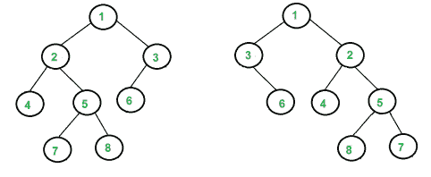

# 树同构问题

> 原文:[https://www.geeksforgeeks.org/tree-isomorphism-problem/](https://www.geeksforgeeks.org/tree-isomorphism-problem/)

写一个函数来检测两棵树是否同构。如果可以通过一系列翻转(即交换多个节点的左右子节点)从其他树中获得其中一个树，则这两个树称为同构树。任何级别的任何数量的节点都可以交换其子节点。两个空树是同构的。
例如，下面两棵树同构，下面子树翻转:2 和 3，NULL 和 6，7 和 8。



我们同时穿越两棵树。假设正在遍历的两棵树的当前内部节点分别为 **n1** 和 **n2** 。以 n1 和 n2 为根的子树同构有以下两个条件。
**1)**n1 和 n2 的数据相同。
**2)** 以下两个中的一个对 n1 和 n2 的孩子来说是成立的
……**a)**n1 的左孩子同构于 n2 的左孩子，n1 的右孩子同构于 n2 的右孩子。
……**b)**n1 的左子同构于 n2 的右子，n1 的右子同构于 n2 的左子。

## C++

```
// A C++ program to check if two given trees are isomorphic
#include <iostream>
using namespace std;

/* A binary tree node has data, pointer to left and right children */
struct node
{
    int data;
    struct node* left;
    struct node* right;
};

/* Given a binary tree, print its nodes in reverse level order */
bool isIsomorphic(node* n1, node *n2)
{
 // Both roots are NULL, trees isomorphic by definition
 if (n1 == NULL && n2 == NULL)
    return true;

 // Exactly one of the n1 and n2 is NULL, trees not isomorphic
 if (n1 == NULL || n2 == NULL)
    return false;

 if (n1->data != n2->data)
    return false;

 // There are two possible cases for n1 and n2 to be isomorphic
 // Case 1: The subtrees rooted at these nodes have NOT been "Flipped".
 // Both of these subtrees have to be isomorphic, hence the &&
 // Case 2: The subtrees rooted at these nodes have been "Flipped"
 return
 (isIsomorphic(n1->left,n2->left) && isIsomorphic(n1->right,n2->right))||
 (isIsomorphic(n1->left,n2->right) && isIsomorphic(n1->right,n2->left));
}

/* Helper function that allocates a new node with the
   given data and NULL left and right pointers. */
node* newNode(int data)
{
    node* temp = new node;
    temp->data = data;
    temp->left = NULL;
    temp->right = NULL;

    return (temp);
}

/* Driver program to test above functions*/
int main()
{
    // Let us create trees shown in above diagram
    struct node *n1 = newNode(1);
    n1->left        = newNode(2);
    n1->right       = newNode(3);
    n1->left->left  = newNode(4);
    n1->left->right = newNode(5);
    n1->right->left  = newNode(6);
    n1->left->right->left = newNode(7);
    n1->left->right->right = newNode(8);

    struct node *n2 = newNode(1);
    n2->left         = newNode(3);
    n2->right        = newNode(2);
    n2->right->left   = newNode(4);
    n2->right->right   = newNode(5);
    n2->left->right   = newNode(6);
    n2->right->right->left = newNode(8);
    n2->right->right->right = newNode(7);

    if (isIsomorphic(n1, n2) == true)
       cout << "Yes";
    else
      cout << "No";

    return 0;
}
```

## Java 语言(一种计算机语言，尤用于创建网站)

```
// An iterative java program to solve tree isomorphism problem

/* A binary tree node has data, pointer to left and right children */
class Node
{
    int data;
    Node left, right;

    Node(int item)
    {
        data = item;
        left = right;
    }
}

class BinaryTree
{
    Node root1, root2;

    /* Given a binary tree, print its nodes in reverse level order */
    boolean isIsomorphic(Node n1, Node n2)
    {
        // Both roots are NULL, trees isomorphic by definition
        if (n1 == null && n2 == null)
            return true;

        // Exactly one of the n1 and n2 is NULL, trees not isomorphic
        if (n1 == null || n2 == null)
            return false;

        if (n1.data != n2.data)
            return false;

        // There are two possible cases for n1 and n2 to be isomorphic
        // Case 1: The subtrees rooted at these nodes have NOT been
        // "Flipped".
        // Both of these subtrees have to be isomorphic.
        // Case 2: The subtrees rooted at these nodes have been "Flipped"
        return (isIsomorphic(n1.left, n2.left) &&
                                         isIsomorphic(n1.right, n2.right))
        || (isIsomorphic(n1.left, n2.right) &&
                                         isIsomorphic(n1.right, n2.left));
    }

    // Driver program to test above functions
    public static void main(String args[])
    {
        BinaryTree tree = new BinaryTree();

        // Let us create trees shown in above diagram
        tree.root1 = new Node(1);
        tree.root1.left = new Node(2);
        tree.root1.right = new Node(3);
        tree.root1.left.left = new Node(4);
        tree.root1.left.right = new Node(5);
        tree.root1.right.left = new Node(6);
        tree.root1.left.right.left = new Node(7);
        tree.root1.left.right.right = new Node(8);

        tree.root2 = new Node(1);
        tree.root2.left = new Node(3);
        tree.root2.right = new Node(2);
        tree.root2.right.left = new Node(4);
        tree.root2.right.right = new Node(5);
        tree.root2.left.right = new Node(6);
        tree.root2.right.right.left = new Node(8);
        tree.root2.right.right.right = new Node(7);

        if (tree.isIsomorphic(tree.root1, tree.root2) == true)
            System.out.println("Yes");
        else
            System.out.println("No");
    }
}

// This code has been contributed by Mayank Jaiswal
```

## 计算机编程语言

```
# Python program to check if two given trees are isomorphic

# A Binary tree node
class Node:
    # Constructor to create the node of binary tree
    def __init__(self, data):
        self.data = data
        self.left = None
        self.right = None

# Check if the binary tree is isomorphic or not
def isIsomorphic(n1, n2):

    # Both roots are None, trees isomorphic by definition
    if n1 is None and n2 is None:
        return True

    # Exactly one of the n1 and n2 is None, trees are not
    # isomorphic
    if n1 is None or n2 is None:
        return False

    if n1.data != n2.data :
        return False
    # There are two possible cases for n1 and n2 to be isomorphic
    # Case 1: The subtrees rooted at these nodes have NOT
    # been "Flipped".
    # Both of these subtrees have to be isomorphic, hence the &&
    # Case 2: The subtrees rooted at these nodes have
    # been "Flipped"
    return ((isIsomorphic(n1.left, n2.left)and
            isIsomorphic(n1.right, n2.right)) or
            (isIsomorphic(n1.left, n2.right) and
            isIsomorphic(n1.right, n2.left))
            )

# Driver program to test above function
n1 = Node(1)
n1.left = Node(2)
n1.right = Node(3)
n1.left.left = Node(4)
n1.left.right = Node(5)
n1.right.left = Node(6)
n1.left.right.left = Node(7)
n1.left.right.right = Node(8)

n2 = Node(1)
n2.left = Node(3)
n2.right = Node(2)
n2.right.left = Node(4)
n2.right.right = Node(5)
n2.left.right = Node(6)
n2.right.right.left = Node(8)
n2.right.right.right  = Node(7)

print "Yes" if (isIsomorphic(n1, n2) == True) else "No"

# This code is contributed by Nikhil Kumar Singh(nickzuck_007)
```

## C#

```
using System;

// An iterative C# program to solve tree isomorphism problem

/* A binary tree node has data, pointer to left and right children */
public class Node
{
    public int data;
    public Node left, right;

    public Node(int item)
    {
        data = item;
        left = right;
    }
}

public class BinaryTree
{
    public Node root1, root2;

    /* Given a binary tree, print its nodes in reverse level order */
    public virtual bool isIsomorphic(Node n1, Node n2)
    {
        // Both roots are NULL, trees isomorphic by definition
        if (n1 == null && n2 == null)
        {
            return true;
        }

        // Exactly one of the n1 and n2 is NULL, trees not isomorphic
        if (n1 == null || n2 == null)
        {
            return false;
        }

        if (n1.data != n2.data)
        {
            return false;
        }

        // There are two possible cases for n1 and n2 to be isomorphic
        // Case 1: The subtrees rooted at these nodes have NOT been
        // "Flipped".
        // Both of these subtrees have to be isomorphic.
        // Case 2: The subtrees rooted at these nodes have been "Flipped"
        return (isIsomorphic(n1.left, n2.left)
        && isIsomorphic(n1.right, n2.right))
        || (isIsomorphic(n1.left, n2.right)
        && isIsomorphic(n1.right, n2.left));
    }

    // Driver program to test above functions
    public static void Main(string[] args)
    {
        BinaryTree tree = new BinaryTree();

        // Let us create trees shown in above diagram
        tree.root1 = new Node(1);
        tree.root1.left = new Node(2);
        tree.root1.right = new Node(3);
        tree.root1.left.left = new Node(4);
        tree.root1.left.right = new Node(5);
        tree.root1.right.left = new Node(6);
        tree.root1.left.right.left = new Node(7);
        tree.root1.left.right.right = new Node(8);

        tree.root2 = new Node(1);
        tree.root2.left = new Node(3);
        tree.root2.right = new Node(2);
        tree.root2.right.left = new Node(4);
        tree.root2.right.right = new Node(5);
        tree.root2.left.right = new Node(6);
        tree.root2.right.right.left = new Node(8);
        tree.root2.right.right.right = new Node(7);

        if (tree.isIsomorphic(tree.root1, tree.root2) == true)
        {
            Console.WriteLine("Yes");
        }
        else
        {
            Console.WriteLine("No");
        }
    }
}

// This code is contributed by Shrikant13
```

## java 描述语言

```
<script>

      // An iterative JavaScript program
      // to solve tree isomorphism problem
      /* A binary tree node has data, pointer to
      left and right children */
      class Node {
        constructor(item) {
          this.data = item;
          this.left = null;
          this.right = null;
        }
      }

      class BinaryTree {
        constructor() {
          this.root1 = null;
          this.root2 = null;
        }

        /* Given a binary tree, print its
        nodes in reverse level order */
        isIsomorphic(n1, n2) {
          // Both roots are NULL, trees isomorphic by definition
          if (n1 == null && n2 == null) {
            return true;
          }

          // Exactly one of the n1 and n2 is NULL,
          // trees not isomorphic
          if (n1 == null || n2 == null) {
            return false;
          }

          if (n1.data != n2.data) {
            return false;
          }

          // There are two possible cases for
          // n1 and n2 to be isomorphic
          // Case 1: The subtrees rooted at
          // these nodes have NOT been
          // "Flipped".
          // Both of these subtrees have to be isomorphic.
          // Case 2: The subtrees rooted at these nodes
          // have been "Flipped"
          return (
            (this.isIsomorphic(n1.left, n2.left) &&
              this.isIsomorphic(n1.right, n2.right)) ||
            (this.isIsomorphic(n1.left, n2.right) &&
              this.isIsomorphic(n1.right, n2.left))
          );
        }
      }
      // Driver program to test above functions
      var tree = new BinaryTree();

      // Let us create trees shown in above diagram
      tree.root1 = new Node(1);
      tree.root1.left = new Node(2);
      tree.root1.right = new Node(3);
      tree.root1.left.left = new Node(4);
      tree.root1.left.right = new Node(5);
      tree.root1.right.left = new Node(6);
      tree.root1.left.right.left = new Node(7);
      tree.root1.left.right.right = new Node(8);

      tree.root2 = new Node(1);
      tree.root2.left = new Node(3);
      tree.root2.right = new Node(2);
      tree.root2.right.left = new Node(4);
      tree.root2.right.right = new Node(5);
      tree.root2.left.right = new Node(6);
      tree.root2.right.right.left = new Node(8);
      tree.root2.right.right.right = new Node(7);

      if (tree.isIsomorphic(tree.root1, tree.root2) == true) {
        document.write("Yes");
      } else {
        document.write("No");
      }

</script>
```

**输出:**

```
Yes
```

**时间复杂度:**上面的解决方案遍历了两棵树。所以时间复杂度是 O(min(m，n)*2)或 O(min(m，n))，其中 m 和 n 是给定树中的节点数。

本文由 **Ciphe** 供稿。如果你发现任何不正确的地方，或者你想分享更多关于上面讨论的话题的信息，请写评论。
如果你喜欢 GeeksforGeeks 并想投稿，你也可以写一篇文章并把你的文章邮寄到 review-team@geeksforgeeks.org。看到你的文章出现在极客博客主页上，帮助其他极客。