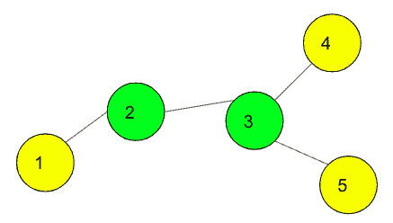
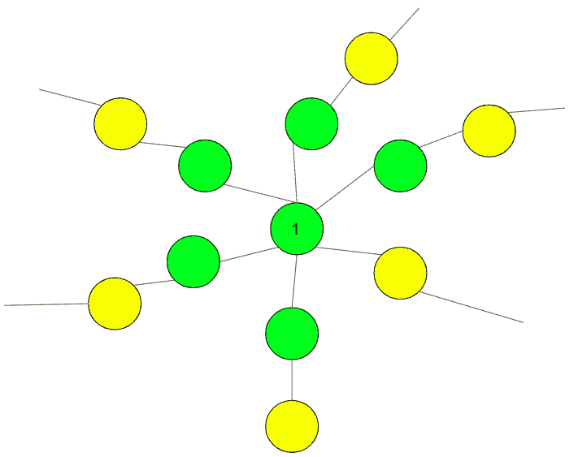

# 有 N 个节点和 K 片叶子的树，最远叶子之间的距离最小

> 原文:[https://www . geeksforgeeks . org/带 n 个节点和 k 个叶子的树，这样最远叶子之间的距离被最小化/](https://www.geeksforgeeks.org/tree-with-n-nodes-and-k-leaves-such-that-distance-between-farthest-leaves-is-minimized/)

给定 N 和 K，打印一棵树，使得该树具有不超过 K 个叶节点，并且每隔一个节点至少有两个节点与之连接。任务是精确地构建一个由 N 个节点组成的树，使得最远的叶节点之间的距离最小。也打印最小距离。
**注:**可以有多棵树。
**示例:**

> **输入:** N = 5，K = 3
> **输出:**距离= 3
> 树为:
> 1 2
> 2 3
> 3 4
> 3 5
> 
> 
> 
> **输入:** N = 3，K = 2
> **输出:**距离= 2
> 树为:
> 1 2
> 2 3

**进场:**

*   最初，树将有 k-1 个节点连接到 1。
*   然后将一个节点逐个连接到所有 k-1 个节点。
*   如果剩下节点，继续将它们逐个连接到叶节点。

如何构建树的图示将使事情更加清晰。在下图中，已经演示了 K = 6 并且对于任何数字 N。黄色的节点是叶子节点。



以下是上述方法的实现:

## C++

```
// C++ program of above approach
#include <bits/stdc++.h>
using namespace std;

// Function to print the distance
// and the tree
void buildTree(int n, int k)
{
    int ans = 2 * ((n - 1) / k) + min((n - 1) % k, 2);
    cout << "Distance = " << ans;

    cout << "\nThe tree is:\n";

    // print all K-1 leaf nodes attached with 1
    for (int i = 2; i <= k; i++) {
        cout << "1 " << i << endl;
    }

    // Join nodes to from other left nodes
    // the last node thus will be the left out leaf node
    for (int i = k + 1; i <= n; i++) {
        cout << i << " " << (i - k) << endl;
    }
}

// Driver Code
int main()
{
    int n = 5, k = 3;

    buildTree(n, k);
}
```

## Java 语言(一种计算机语言，尤用于创建网站)

```
// Java program of above approach
import java.util.*;
import java.lang.*;

// Function to print the distance
// and the tree
class GFG
{
public void buildTree(int n, int k)
{
    int ans = 2 * ((n - 1) / k) +
            Math.min((n - 1) % k, 2);
    System.out.println("Distance = " + ans);

    System.out.println("The tree is: ");

    // print all K-1 leaf nodes
    // attached with 1
    for (int i = 2; i <= k; i++)
    {
        System.out.println( "1 " + i );
    }

    // Join nodes to from other left
    // nodes the last node thus will
    // be the left out leaf node
    for (int i = k + 1; i <= n; i++)
    {
        System.out.println( i + " " +
                        (i - k));
    }
}

// Driver Code
public static void main(String args[])
{
    GFG g = new GFG();
    int n = 5, k = 3;

    g.buildTree(n, k);
}
}

// This code is contributed
// by Akanksha Rai(Abby_akku)
```

## 蟒蛇 3

```
# Python3 program of above approach

# Function to print the distance
# and the tree
def buildTree(n, k):

    ans = (2 * ((n - 1) // k) +
            min((n - 1) % k, 2))
    print("Distance = ", ans )

    print("The tree is:")

    # print all K-1 leaf nodes
    # attached with 1
    for i in range(2, k + 1):
        print("1 ", i)

    # Join nodes to from other left nodes
    # the last node thus will be the
    # left out leaf node
    for i in range(k + 1, n + 1):
        print(i, "", (i - k))

# Driver Code
if __name__ == '__main__':
    n = 5
    k = 3
    buildTree(n, k)

# This code is contributed
# by SHUBHAMSINGH10
```

## C#

```
// C# program of above approach
using System;

// Function to print the distance
// and the tree
class GFG
{
public void buildTree(int n, int k)
{
    int ans = 2 * ((n - 1) / k) +
        Math.Min((n - 1) % k, 2);
    Console.WriteLine("Distance = " + ans);

    Console.WriteLine ("The tree is: ");

    // print all K-1 leaf nodes
    // attached with 1
    for (int i = 2; i <= k; i++)
    {
        Console.WriteLine( "1 " + i );
    }

    // Join nodes to from other left
    // nodes the last node thus will
    // be the left out leaf node
    for (int i = k + 1; i <= n; i++)
    {
        Console.WriteLine ( i + " " +
                        (i - k));
    }
}

// Driver Code
public static void Main()
{
    GFG g = new GFG();
    int n = 5, k = 3;

    g.buildTree(n, k);
}
}

// This code is contributed by Soumik
```

## 服务器端编程语言（Professional Hypertext Preprocessor 的缩写）

```
<?php
// PHP program of above approach

// Function to print the distance
// and the tree
function buildTree($n, $k)
{
    $ans = (2 * (int)(($n - 1) / $k) +
              min(($n - 1) % $k, 2));
    echo "Distance = " . $ans;

    echo "\nThe tree is:\n";

    // print all K-1 leaf nodes
    // attached with 1
    for ($i = 2; $i <= $k; $i++)
    {
        echo "1 " . $i . "\n";
    }

    // Join nodes to from other left nodes
    // the last node thus will be the left
    // out leaf node
    for ($i = $k + 1; $i <= $n; $i++)
    {
        echo $i . " " . ($i - $k) . "\n";
    }
}

// Driver Code
$n = 5; $k = 3;

buildTree($n, $k);

// This code is contributed
// by Akanksha Rai
?>
```

## java 描述语言

```
<script>
// javascript program of above approach
// Function to print the distance
// and the tree

    function buildTree(n , k)
    {
        var ans = parseInt(2 * ((n - 1) / k) + Math.min((n - 1) % k, 2));
        document.write("Distance = " + ans+ "<br/>");

        document.write("The tree is:<br/> ");

        // print all K-1 leaf nodes
        // attached with 1
        for (i = 2; i <= k; i++) {
            document.write("1 " + i+"<br/>");
        }

        // Join nodes to from other left
        // nodes the last node thus will
        // be the left out leaf node
        for (i = k + 1; i <= n; i++) {
            document.write(i + " " + (i - k)+"<br/>");
        }
    }

    // Driver Code
        var n = 5, k = 3;
        buildTree(n, k);

// This code is contributed by aashish1995.
</script>
```

**Output:** 

```
Distance = 3
The tree is:
1 2
1 3
4 1
5 2
```