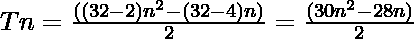

# 三联式开司酮编号

> 原文:[https://www.geeksforgeeks.org/triacontakaidigon-number/](https://www.geeksforgeeks.org/triacontakaidigon-number/)

给定一个 **N** 号，任务是找到**N<sup>th</sup>T5[三十开地贡号](https://en.wikipedia.org/wiki/Triacontadigon)。** 

> 一个[三十开地贡数](https://en.wikipedia.org/wiki/Triacontadigon)是一类数字。它有一个 32 边的多边形，叫做三十烷凯迪贡。第 N 个三十烷酰二甘醇数是 32 个点的数目，所有其他点都被一个共同的角包围并形成一个图案。前几个三十烷醇的数字是 **1、32、93、184……**

**例:**

> **输入:** N = 2
> **输出:** 32
> **说明:**
> 第二个三十烷二醇数为 32。
> **输入:** N = 3
> **输出:** 93

**方法:**第 N 个三十烷酰二甘醇数由公式给出:

*   s 边多边形的第 n 项= 

*   因此 32 边多边形的第 n 项为

> 

以下是上述方法的实现:

## C++

```
// C++ program for above approach
#include <bits/stdc++.h>
using namespace std;

// Finding the nth triacontakaidigon Number
int triacontakaidigonNum(int n)
{
    return (30 * n * n - 28 * n) / 2;
}

// Driver Code
int main()
{
    int n = 3;
    cout << "3rd triacontakaidigon Number is = "
         << triacontakaidigonNum(n);

    return 0;
}

// This code is contributed by Akanksha_Rai
```

## C

```
// C program for above approach
#include <stdio.h>
#include <stdlib.h>

// Finding the nth triacontakaidigon Number
int triacontakaidigonNum(int n)
{
    return (30 * n * n - 28 * n) / 2;
}

// Driver program to test above function
int main()
{
    int n = 3;
    printf("3rd triacontakaidigon Number is = %d",
           triacontakaidigonNum(n));

    return 0;
}
```

## Java 语言(一种计算机语言，尤用于创建网站)

```
// Java program for above approach
class GFG{

// Finding the nth triacontakaidigon number
public static int triacontakaidigonNum(int n)
{
    return (30 * n * n - 28 * n) / 2;
}

// Driver code   
public static void main(String[] args)
{
    int n = 3;

    System.out.println("3rd triacontakaidigon Number is = " +
                                    triacontakaidigonNum(n));
}
}

// This code is contributed by divyeshrabadiya07   
```

## 蟒蛇 3

```
# Python3 program for above approach

# Finding the nth triacontakaidigon Number
def triacontakaidigonNum(n):

    return (30 * n * n - 28 * n) // 2

# Driver Code
n = 3
print("3rd triacontakaidigon Number is = ",
                   triacontakaidigonNum(n))

# This code is contributed by divyamohan123
```

## C#

```
// C# program for above approach
using System;
class GFG{

// Finding the nth triacontakaidigon number
public static int triacontakaidigonNum(int n)
{
    return (30 * n * n - 28 * n) / 2;
}

// Driver code
public static void Main(String[] args)
{
    int n = 3;

    Console.WriteLine("3rd triacontakaidigon Number is = " +
                                   triacontakaidigonNum(n));
}
}

// This code is contributed by 29AjayKumar
```

## java 描述语言

```
<script>

// javascript program for above approach

// Finding the nth triacontakaidigon Number
function triacontakaidigonNum( n)
{
    return (30 * n * n - 28 * n) / 2;
}

// Driver code
let n = 3;
document.write("3rd triacontakaidigon Number is " + triacontakaidigonNum(n));

// This code contributed by gauravrajput1

</script>
```

**Output:** 

```
3rd triacontakaidigon Number is = 93
```

***时间复杂度:** O(1)*

***辅助空间:** O(1)*

**参考资料:**[https://en . Wikipedia . org/wiki/tricontingent](https://en.wikipedia.org/wiki/Triacontadigon)