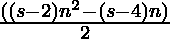
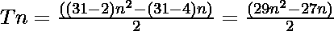

# 三联化学试剂编号

> 原文:[https://www.geeksforgeeks.org/triacontakaihenagonal-number/](https://www.geeksforgeeks.org/triacontakaihenagonal-number/)

一个**三十烷前数**是一类图形数。它有 **31 边多边形**叫做**三十烷海纳贡**。第 N 个三十烷醇数字计数是 31 个点的数目，所有其他的点用一个公共的共享角包围并形成一个图案。
三十烷醇的前几个数字是:

> 1，31，90，178 …

### 检查 N 是否是三十烷醇的数字

给定一个数字 **N** ，任务是找到**N<sup>th</sup>T5[三十烷前数。](https://en.wikipedia.org/wiki/List_of_polygons)
**例:**** 

> **输入:** N = 2
> **输出:** 31
> **解释:**
> 第二个三十烷醇数为 31。
> **输入:** N = 3
> **输出:** 90

**方法:**在数学中，第 N 个三十烷醇数由公式给出:

*   s 边多边形的第 n 项= 

*   因此 31 边多边形的第 n 项为

> 

以下是上述方法的实现:

## C++

```
// C++ implementation for
// above approach

#include <iostream>
using namespace std;

// Function to find the Nth
// triacontakaihenagonal Number
int triacontakaihenagonalNum(int n)
{
    return (29 * n * n - 27 * n) / 2;
}

// Driver Code
int main()
{
    int n = 3;
    cout << triacontakaihenagonalNum(n);

    return 0;
}
```

## Java 语言(一种计算机语言，尤用于创建网站)

```
// Java implementation for the
// above approach
import java.util.*;

class GFG{

// Function to find the Nth
// triacontakaihenagonal Number
static int triacontakaihenagonalNum(int n)
{
    return (29 * n * n - 27 * n) / 2;
}

// Driver Code
public static void main (String[] args)
{

    // Given number
    int n = 3;

    // Function call
    System.out.print(triacontakaihenagonalNum(n));
}
}

// This code is contributed by Ritik Bansal
```

## 蟒蛇 3

```
# Python3 implementation for
# above approach

# Function to find the Nth
# triacontakaihenagonal Number
def triacontakaihenagonalNum(n):

    return (29 * n * n - 27 * n) // 2;

# Driver Code
n = 3;
print(triacontakaihenagonalNum(n));

# This code is contributed by Code_Mech
```

## C#

```
// C# implementation for the
// above approach
using System;

class GFG{

// Function to find the Nth
// triacontakaihenagonal Number
static int triacontakaihenagonalNum(int n)
{
    return (29 * n * n - 27 * n) / 2;
}

// Driver Code
public static void Main (string[] args)
{

    // Given number
    int n = 3;

    // Function call
    Console.Write(triacontakaihenagonalNum(n));
}
}

// This code is contributed by rock_cool
```

## java 描述语言

```
<script>
// Javascript implementation for the
// above approach

    // Function to find the Nth
    // triacontakaihenagonal Number
    function triacontakaihenagonalNum( n)
    {
        return (29 * n * n - 27 * n) / 2;
    }

    // Driver Code

    // Given number
    let n = 3;

    // Function call
    document.write(triacontakaihenagonalNum(n));

// This code is contributed by Rajput-Ji
</script>
```

**Output:** 

```
90
```

***时间复杂度:** O(1)*

***辅助空间:** O(1)*