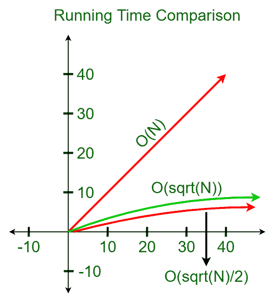

# 素分解的试除算法

> 原文:[https://www . geeksforgeeks . org/质因数分解的试除法算法/](https://www.geeksforgeeks.org/trial-division-algorithm-for-prime-factorization/)

本文讨论了检验一个数是否是素数的试除法。给定一个数 N，任务是检查这个数是否是质数。

**示例:**

> **输入:** N = 433
> **输出:**质数
> **说明:**
> 433 的唯一因子是 1 和 433。因此，它是一个质数。
> 
> **输入:** N = 1263
> **输出:**复合
> **说明:**
> 1263 的因子是 1，3，421，1263。因此，它是一个复合数。

**天真方法:**根据定义，[素数](https://www.geeksforgeeks.org/prime-numbers/)是大于 1 的整数，只能被 1 和自身整除。因此，我们初始化一个从 2 到 N–1 的循环，并检查可除性。以下是该方法的伪代码:

```
N <- input
initialise: i <- 2
while(i ≤ N - 1):
    if(N % i == 0):
        return "Composite"
return "Prime" 
```

**时间复杂度分析:**

*   对于任何给定的数字 **N** ，while 循环运行**N–2**次。因此，while 循环的时间复杂度为 **O(N)** 。
*   可除性检查在恒定时间内完成。因此，while 循环中 if 条件的时间复杂度为 **O(1)** 。
*   因此，上述方法的整体时间复杂度为 **O(N)** 。

**试分法:**试分法的概念可以更有效地进行素性检查。当处理整数因子分解时，试除法是关键的但是最简单的因子分解技术之一。

**观察:**上述方法的工作原理是观察到任意数字 N 的最大因子总是小于或等于平方根(N)。这个结论可以通过以下方式得出:

*   从学校算术来看，众所周知的事实是，任何一个合数都是由两个或两个以上的素数构成的。
*   让 **N** 的因子为 n1，n2，以此类推。数量 **N** 只有存在两个因素 **n1** 和 **n2** 时，因素最大。
*   因此，让我们假设 **n1** 和 **n2** 是数量 **N** 的两个最大因素。这些数字 **n1** 和 **n2** 只有在 **n1 和 n2 相等时才能最大**。
*   让 **n1 = n2 = n** 。因此， **N = n * n** 。因此，N 的最大可能因子是**平方根(N)** 。

**方法:**从上面的观察来看，这个算法的方法很简单。这个想法是，我们只检查直到**平方根(N)** ，而不是检查到某个因子的 N-1。

下面是上述方法的实现:

## C++

```
// CPP implementation of
// Trial Division Algorithm
#include <bits/stdc++.h>

using namespace std;

// Function to check if a number is
// a prime number or not
int TrialDivision(int N){

    // Initializing with the value 2
    // from where the number is checked
    int i = 2;

    // Computing the square root of
    // the number N
    int k = ceil(sqrt(N));

    // While loop till the
    // square root of N
    while(i<= k){

        // If any of the numbers between
        // [2, sqrt(N)] is a factor of N
        // Then the number is composite
        if(N % i == 0)
            return 0;
        i += 1;
    }

    // If none of the numbers is a factor,
    // then it is a prime number
    return 1;
}

// Driver code
int main()
{
    int N = 49;
    int p = TrialDivision(N);

    // To check if a number is a prime or not
    if(p)
        cout << ("Prime");
    else
        cout << ("Composite");

    return 0;
}

// This code is contributed by mohit kumar 29
```

## Java 语言(一种计算机语言，尤用于创建网站)

```
// Java implementation of
// Trial Division Algorithm
import java.util.*;

class GFG{

// Function to check if a number is
// a prime number or not
static int TrialDivision(int N){

    // Initializing with the value 2
    // from where the number is checked
    int i = 2;

    // Computing the square root of
    // the number N
    int k =(int) Math.ceil(Math.sqrt(N));

    // While loop till the
    // square root of N
    while(i<= k){

        // If any of the numbers between
        // [2, sqrt(N)] is a factor of N
        // Then the number is composite
        if(N % i == 0)
            return 0;
        i += 1;
    }

    // If none of the numbers is a factor,
    // then it is a prime number
    return 1;
}

// Driver Code
public static void main(String[] args)
{

    int N = 49;
    int p = TrialDivision(N);

    // To check if a number is a prime or not
    if(p != 0)
        System.out.print("Prime");
    else
        System.out.print("Composite");

}
}

// This code is contributed by shivanisinghss2110
```

## 蟒蛇 3

```
# Python3 implementation of
# Trial Division Algorithm

# Function to check if a number is
# a prime number or not
def TrialDivision(N):

    # Initializing with the value 2
    # from where the number is checked
    i = 2

    # Computing the square root of
    # the number N
    k = int(N ** 0.5)

    # While loop till the
    # square root of N
    while(i<= k):

        # If any of the numbers between
        # [2, sqrt(N)] is a factor of N
        # Then the number is composite
        if(N % i == 0):
            return 0
        i += 1

    # If none of the numbers is a factor,
    # then it is a prime number
    return 1

# Driver code
if __name__ == "__main__":
    N = 49
    p = TrialDivision(N)

# To check if a number is a prime or not
    if(p):
        print("Prime")
    else:
        print("Composite")

```

## C#

```
// C# implementation of
// Trial Division Algorithm
using System;

class GFG{

// Function to check if a number is
// a prime number or not
static int TrialDivision(int N){

    // Initializing with the value 2
    // from where the number is checked
    int i = 2;

    // Computing the square root of
    // the number N
    int k =(int) Math.Ceiling(Math.Sqrt(N));

    // While loop till the
    // square root of N
    while(i<= k){

        // If any of the numbers between
        // [2, sqrt(N)] is a factor of N
        // Then the number is composite
        if(N % i == 0)
            return 0;
        i += 1;
    }

    // If none of the numbers is a factor,
    // then it is a prime number
    return 1;
}

// Driver Code
public static void Main()
{

    int N = 49;
    int p = TrialDivision(N);

    // To check if a number is a prime or not
    if(p != 0)
        Console.Write("Prime");
    else
        Console.Write("Composite");

}
}

// This code is contributed by AbhiThakur
```

## java 描述语言

```
<script>

// JavaScript implementation of
// Trial Division Algorithm

// Function to check if a number is
// a prime number or not
function TrialDivision(N){

    // Initializing with the value 2
    // from where the number is checked
    let i = 2;

    // Computing the square root of
    // the number N
    let k = Math.ceil(Math.sqrt(N));

    // While loop till the
    // square root of N
    while(i<= k){

        // If any of the numbers between
        // [2, sqrt(N)] is a factor of N
        // Then the number is composite
        if(N % i == 0)
            return 0;
        i += 1;
    }

    // If none of the numbers is a factor,
    // then it is a prime number
    return 1;
}

// Driver code

let N = 49;
let p = TrialDivision(N);

// To check if a number is a prime or not
if(p)
    document.write("Prime");
else
    document.write("Composite");

// This code is contributed by gfgking

</script>
```

**Output:** 

```
Composite
```

**时间复杂度分析:**

*   while 循环最多执行平方根(N)次。因此，while 循环的时间复杂度为 **O(sqrt(N))** 。
*   所有 if 条件的运行时间是恒定的。因此，if 语句的时间复杂度为 **O(1)** 。
*   因此，整体时间复杂度为 **O(sqrt(N))** 。

**优化试除法:**上述试除法可以通过剔除**【2，K】**范围内的所有偶数进一步优化，其中 K =平方根(N) as 2 是唯一的偶数素数。总体复杂性仍然保持不变，但执行数量减少了一半。

**注意:**在试除法中进行的优化可能看起来很小，因为除了迭代次数之外，该方法几乎类似于朴素方法。然而，这极大地减少了较高 n 值的计算次数。这可以通过下面绘制的算法运行时间图来解释:

