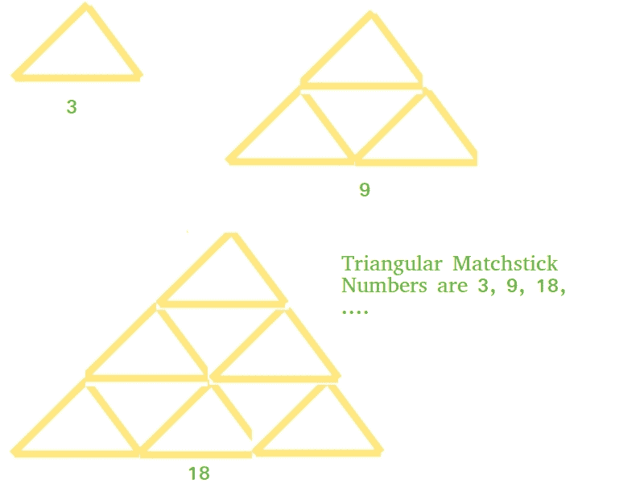

# 三角形火柴杆编号

> 原文:[https://www.geeksforgeeks.org/triangular-matchstick-number/](https://www.geeksforgeeks.org/triangular-matchstick-number/)

给定一个代表火柴棍金字塔的楼层的数字 X，编写一个程序来打印形成 X 层火柴棍金字塔所需的火柴棍总数。

示例:

```
Input : X = 1
Output : 3

Input : X = 2
Output : 9 
```

这主要是[三角数](https://www.geeksforgeeks.org/triangular-numbers/)的延伸。对于数字 X，所需的火柴杆将是第 X 个[三角形数字](https://www.geeksforgeeks.org/triangular-numbers/)的三倍，即(3*X*(X+1))/2



## C++

```
// C++ program to find X-th triangular
// matchstick number

#include <bits/stdc++.h>
using namespace std;

int numberOfSticks(int x)
{
    return (3 * x * (x + 1)) / 2;
}

int main()
{
    cout<<numberOfSticks(7);
    return 0;
}
```

## Java 语言(一种计算机语言，尤用于创建网站)

```
// Java program to find X-th triangular
// matchstick number
public class TriangularPyramidNumber {
    public static int numberOfSticks(int x)
    {
        return (3 * x * (x + 1)) / 2;
    }
    public static void main(String[] args)
    {
        System.out.println(numberOfSticks(7));
    }
}
```

## 蟒蛇 3

```
# Python program to find X-th triangular
# matchstick number

def numberOfSticks(x):
    return (3 * x * (x + 1)) / 2

# main()
print(int(numberOfSticks(7)))
```

## C#

```
// C# program to find X-th triangular
// matchstick number
using System;

class GFG
{
    // Function to ind missing number
    static int numberOfSticks(int x)
    {
        return (3 * x * (x + 1)) / 2;
    }

    public static void Main()
    {
        Console.Write(numberOfSticks(7));
    }
}

// This code is contributed by _omg
```

## 服务器端编程语言（Professional Hypertext Preprocessor 的缩写）

```
<?php
// PHP program to find
// X-th triangular
// matchstick number

function numberOfSticks($x)
{
    return (3 * $x * ($x + 1)) / 2;
}

// Driver code
echo(numberOfSticks(7));

// This code is contributed by Ajit.
?>
```

## java 描述语言

```
<script>
// javascript program to find X-th triangular
// matchstick number

function numberOfSticks( x)
{
    return (3 * x * (x + 1)) / 2;
}

   document.write(numberOfSticks(7));

// This code is contributed by aashish1995

</script>
```

**Output:** 

```
84
```