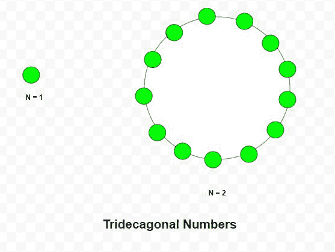

# 三叉戟号码

> 原文:[https://www.geeksforgeeks.org/tridecagonal-number/](https://www.geeksforgeeks.org/tridecagonal-number/)

给定一个 **N** 号，任务是找到 **N <sup>号</sup>三叉戟号**。

> 三叉戟数字是一个图形数字，它将三角形和正方形数字的概念扩展到三叉戟(一个十三边多边形)。第 N <sup>个</sup>三叉戟数字计算 N 个嵌套三叉戟图案中的点数，所有嵌套三叉戟共享一个公共角，其中图案中的第 I 个三叉戟具有由相互间隔一个单位的“I”个点组成的边。前几个三叉戟数字是 **1、13、36、70、115、171……**

**例:**

> **输入:** N = 2
> **输出:** 13
> **说明:**
> 第二个三叉戟号为 13。
> **输入:** N = 6
> **输出:** 171



**方法:**第 N <sup>个</sup>三叉戟号码由公式给出:

以下是上述方法的实现:

## C++

```
// C++ program to find N-th
// Tridecagonal number

#include <bits/stdc++.h>
using namespace std;

// Function to find N-th
// Tridecagonal number
int Tridecagonal_num(int n)
{
    // Formula to calculate nth
    // Tridecagonal number
    return (11 * n * n - 9 * n) / 2;
}

// Driver Code
int main()
{
    int n = 3;
    cout << Tridecagonal_num(n) << endl;

    n = 10;

    cout << Tridecagonal_num(n) << endl;

    return 0;
}
```

## Java 语言(一种计算机语言，尤用于创建网站)

```
// Java program to find N-th
// tridecagonal number
class GFG{

// Function to find N-th
// tridecagonal number
static int Tridecagonal_num(int n)
{

    // Formula to calculate nth
    // tridecagonal number
    return (11 * n * n - 9 * n) / 2;
}

// Driver Code
public static void main(String[] args)
{
    int n = 3;
    System.out.print(Tridecagonal_num(n) + "\n");

    n = 10;
    System.out.print(Tridecagonal_num(n) + "\n");
}
}

// This code is contributed by Princi Singh
```

## 蟒蛇 3

```
# Python3 program to find N-th
# tridecagonal number

# Function to find N-th
# tridecagonal number
def Tridecagonal_num(n):

    # Formula to calculate nth
    # tridecagonal number
    return (11 * n * n - 9 * n) / 2

# Driver Code
n = 3
print(int(Tridecagonal_num(n)))

n = 10
print(int(Tridecagonal_num(n)))

# This code is contributed by divyeshrabadiya07
```

## C#

```
// C# program to find N-th
// tridecagonal number
using System;

class GFG{

// Function to find N-th
// tridecagonal number
static int Tridecagonal_num(int n)
{

    // Formula to calculate nth
    // tridecagonal number
    return (11 * n * n - 9 * n) / 2;
}

// Driver Code
public static void Main(String[] args)
{
    int n = 3;
    Console.Write(Tridecagonal_num(n) + "\n");

    n = 10;
    Console.Write(Tridecagonal_num(n) + "\n");
}
}

// This code is contributed by Rajput-Ji
```

## java 描述语言

```
<script>

    // Javascript program to find N-th
    // Tridecagonal number

    // Function to find N-th
    // Tridecagonal number
    function Tridecagonal_num(n)
    {
        // Formula to calculate nth
        // Tridecagonal number
        return (11 * n * n - 9 * n) / 2;
    }

    let n = 3;
    document.write(Tridecagonal_num(n) + "</br>");

    n = 10;

    document.write(Tridecagonal_num(n));

</script>
```

**Output:** 

```
36
505
```

**参考:**T2】https://en.wikipedia.org/wiki/Polygonal_number