# 三项式三角形

> 原文:[https://www.geeksforgeeks.org/trinomial-triangle/](https://www.geeksforgeeks.org/trinomial-triangle/)

[**三项式三角形**](https://en.wikipedia.org/wiki/Trinomial_triangle) 是[帕斯卡三角形](https://www.geeksforgeeks.org/pascal-triangle/)的变体。两者的区别在于三项式三角形中的一个条目是上面三个条目(而不是帕斯卡三角形中的两个)的总和:

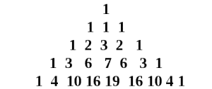

第 **n** 行的第 **k** 个条目由:
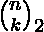
行表示，从 0 开始计数。第 **n** 行的条目从左边的 **-n** 开始索引，中间条目的索引为 0。一行条目关于中间条目的对称性由关系
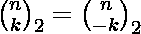
**表示:**

*   第 **n** 行对应于三项 **(1 + x + x <sup>2</sup> )** 的展开式的多项式展开式中的系数上升到第 **n** 次幂。
    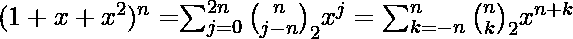
    **或符号化的**
    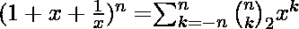
    因其与多项式系数的关系而得名**:
    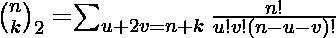** 
*   **对角线具有交叉属性，例如它们与[三角形数字](https://www.geeksforgeeks.org/triangular-numbers/)的关系。** 
*   **第 **n** 行元素之和为**3<sup>n</sup>T5。****

****递归公式**
三项式系数可以使用以下递归公式生成:
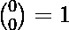

其中，
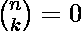 **，为 k n** 
**应用:**** 

*   **三角形对应于国王在一盘棋中可以走的可能路径的数量。单元格中的条目表示国王到达单元格所能走的不同路径的数量(使用最小移动次数)。** 

**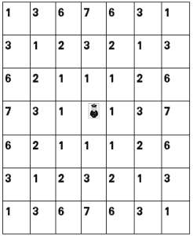**

*   **多项式**(1+x+x<sup>2</sup>)<sup>n</sup>**中 **x <sup>k</sup>** 的系数规定了从两套 **n** 相同的扑克牌中随机抽取 **k** 张牌的不同方式的数量。比如这样一个 A、B、C 三张牌有两套的卡牌游戏，选择如下:** 

**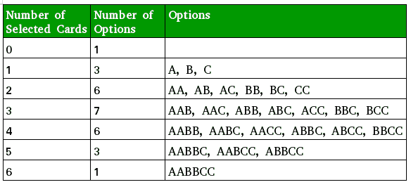**

*   **给定一个正数 **n** 。任务是打印身高 n 的三项式三角形
    **示例:**** 

```
Input : n = 4
Output :
1
1 1 1
1 2 3 2 1
1 3 6 7 6 3 1

Input : n = 5
Output :
1
1 1 1 
1 2 3 2 1
1 3 6 7 6 3 1
1 4 10 16 19 16 10 4 1
```

*   **下面是打印三项式三角形 og 高度 n 的实现:** 

## **C++**

```
// CPP Program to print trinomial triangle.
#include<bits/stdc++.h>
using namespace std;

// Function to find the trinomial triangle value.
int TrinomialValue(int n, int k)
{
    // base case
    if (n == 0 && k == 0)
        return 1;

    // base case
    if(k < -n || k > n)
        return 0;

    // recursive step.
    return TrinomialValue (n - 1, k - 1)
           + TrinomialValue (n - 1, k)
           + TrinomialValue (n - 1, k + 1);
}

// Function to print Trinomial Triangle of height n.
void printTrinomial(int n)
{
    // printing n rows.
    for (int i = 0; i < n; i++)
    {
        // printing first half of triangle
        for (int j = -i; j <= 0; j++)
            cout << TrinomialValue(i, j) << " ";

        // printing second half of triangle.
        for (int j = 1; j <= i; j++)
            cout << TrinomialValue(i, j) << " ";

        cout << endl;
    }
}

// Driven Program
int main()
{
    int n = 4;

    printTrinomial(n);
    return 0;
}
```

## **Java 语言(一种计算机语言，尤用于创建网站)**

```
// Java Program to print trinomial triangle.
import java.util.*;
import java.lang.*;

public class GfG {

    // Function to find the trinomial
    // triangle value.
    public static int TrinomialValue(int n,
                                     int k)
    {
        // base case
        if (n == 0 && k == 0)
            return 1;

        // base case
        if (k < -n || k > n)
            return 0;

        // recursive step.
        return TrinomialValue(n - 1, k - 1)
            + TrinomialValue(n - 1, k)
            + TrinomialValue(n - 1, k + 1);
    }

    // Function to print Trinomial
    // Triangle of height n.
    public static void printTrinomial(int n)
    {
        // printing n rows.
        for (int i = 0; i < n; i++)
        {
            // printing first half of triangle
            for (int j = -i; j <= 0; j++)
                System.out.print(TrinomialValue(i, j)
                                    + " ");

            // printing second half of triangle.
            for (int j = 1; j <= i; j++)
                System.out.print(TrinomialValue(i, j)
                                  + " ");

            System.out.println();
        }
    }

    // driver function
    public static void main(String argc[])
    {
        int n = 4;

        printTrinomial(n);
    }

}

/* This code is contributed by Sagar Shukla */
```

## **蟒蛇 3**

```
# Python3 code to print trinomial triangle.

# Function to find the trinomial triangle value.
def TrinomialValue(n, k):
    # base case
    if n == 0 and k == 0:
        return 1

    # base cas
    if k < -n or k > n:
        return 0

    # recursive step.
    return (TrinomialValue (n - 1, k - 1)+
                TrinomialValue (n - 1, k)+
                        TrinomialValue (n - 1, k + 1))

# Function to print Trinomial Triangle of height n.
def printTrinomial( n ):

    # printing n rows.
    for i in range(n):

        # printing first half of triangle
        for j in range(-i, 1):
            print(TrinomialValue(i, j),end=" ")

        # printing second half of triangle.
        for j in range(1, i+1):
            print( TrinomialValue(i, j),end=" ")

        print("\n",end='')

# Driven Code
n = 4
printTrinomial(n)

# This code is contributed by "Sharad_Bhardwaj".
```

## **C#**

```
// C# Program to print trinomial triangle.
using System;

public class GfG {

    // Function to find the trinomial
    // triangle value.
    public static int TrinomialValue(int n,
                                    int k)
    {
        // base case
        if (n == 0 && k == 0)
            return 1;

        // base case
        if (k < -n || k > n)
            return 0;

        // recursive step.
        return TrinomialValue(n - 1, k - 1)
            + TrinomialValue(n - 1, k)
            + TrinomialValue(n - 1, k + 1);
    }

    // Function to print Trinomial
    // Triangle of height n.
    public static void printTrinomial(int n)
    {
        // printing n rows.
        for (int i = 0; i < n; i++)
        {
            // printing first half of triangle
            for (int j = -i; j <= 0; j++)
                Console.Write(TrinomialValue(i, j)
                                    + " ");

            // printing second half of triangle.
            for (int j = 1; j <= i; j++)
                Console.Write(TrinomialValue(i, j)
                                + " ");

            Console.WriteLine();
        }
    }

    // Driver function
    public static void Main()
    {
        int n = 4;

        printTrinomial(n);
    }

}

/* This code is contributed by Vt_m */
```

## **服务器端编程语言（Professional Hypertext Preprocessor 的缩写）**

```
<?php
// PHP Program to print
// trinomial triangle.

// Function to find the
// trinomial triangle value.
function TrinomialValue($n, $k)
{
    // base case
    if ($n == 0 && $k == 0)
        return 1;

    // base case
    if($k < -$n || $k > $n)
        return 0;

    // recursive step.
    return TrinomialValue ($n - 1, $k - 1) +
           TrinomialValue ($n - 1, $k) +
           TrinomialValue ($n - 1, $k + 1);
}

// Function to print Trinomial
// Triangle of height n.
function printTrinomial($n)
{
    // printing n rows.
    for ($i = 0; $i < $n; $i++)
    {
        // printing first
        // half of triangle
        for ($j = -$i; $j <= 0; $j++)
            echo TrinomialValue($i, $j), " ";

        // printing second
        // half of triangle.
        for ($j = 1; $j <= $i; $j++)
            echo TrinomialValue($i, $j) , " ";

        echo "\n";
    }
}

// Driver Code
$n = 4;

printTrinomial($n);

// This code is contributed
// by ajit
?>
```

## **java 描述语言**

```
<script>

// JavaScript Program to print trinomial triangle.

    // Function to find the trinomial
    // triangle value.
    function TrinomialValue(n, k)
    {
        // base case
        if (n == 0 && k == 0)
            return 1;

        // base case
        if (k < -n || k > n)
            return 0;

        // recursive step.
        return TrinomialValue(n - 1, k - 1)
            + TrinomialValue(n - 1, k)
            + TrinomialValue(n - 1, k + 1);
    }

    // Function to print Trinomial
    // Triangle of height n.
    function printTrinomial(n)
    {
        // printing n rows.
        for (let i = 0; i < n; i++)
        {
            // printing first half of triangle
            for (let j = -i; j <= 0; j++)
                document.write(TrinomialValue(i, j)
                                    + " ");

            // printing second half of triangle.
            for (let j = 1; j <= i; j++)
                document.write(TrinomialValue(i, j)
                                  + " ");

            document.write("<br/>");
        }
    }

// Driver code   
        let n = 4;
        printTrinomial(n);

        // This code is contributed by code_hunt.
</script>
```

****输出:**** 

```
1 
1 1 1 
1 2 3 2 1 
1 3 6 7 6 3 1 
```

*   **下面是利用动态规划和三项式三角形的性质打印三项式三角形的实现，即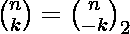** 

## **C**

```
// CPP Program to print trinomial triangle.
#include<bits/stdc++.h>
#define MAX 10
using namespace std;

// Function to find the trinomial triangle value.
int TrinomialValue(int dp[MAX][MAX], int n, int k)
{
    // Using property of trinomial triangle.
    if (k < 0)
        k = -k;

    // If value already calculated, return that.
    if (dp[n][k] != 0)
        return dp[n][k];

    // base case
    if (n == 0 && k == 0)
        return 1;

    // base case
    if(k < -n || k > n)
        return 0;

    // recursive step and storing the value.
    return (dp[n][k] = TrinomialValue(dp, n - 1, k - 1)
           + TrinomialValue(dp, n - 1, k)
           + TrinomialValue(dp, n - 1, k + 1));
}

// Function to print Trinomial Triangle of height n.
void printTrinomial(int n)
{
    int dp[MAX][MAX] = { 0 };

    // printing n rows.
    for (int i = 0; i < n; i++)
    {
        // printing first half of triangle
        for (int j = -i; j <= 0; j++)
            cout << TrinomialValue(dp, i, j) << " ";

        // printing second half of triangle.
        for (int j = 1; j <= i; j++)
            cout << TrinomialValue(dp, i, j) << " ";

        cout << endl;
    }
}

// Driven Program
int main()
{
    int n = 4;

    printTrinomial(n);
    return 0;
}
```

## **Java 语言(一种计算机语言，尤用于创建网站)**

```
// Java Program to print trinomial triangle.
import java.util.*;
import java.lang.*;

public class GfG {

    private static final int MAX = 10;

    // Function to find the trinomial triangle value.
    public static int TrinomialValue(int dp[][], int n, int k)
    {
        // Using property of trinomial triangle.
        if (k < 0)
            k = -k;

        // If value already calculated, return that.
        if (dp[n][k] != 0)
            return dp[n][k];

        // base case
        if (n == 0 && k == 0)
            return 1;

        // base case
        if (k < -n || k > n)
            return 0;

        // recursive step and storing the value.
        return (dp[n][k] = TrinomialValue(dp, n - 1, k - 1)
                           + TrinomialValue(dp, n - 1, k)
                           + TrinomialValue(dp, n - 1, k + 1));
    }

    // Function to print Trinomial Triangle of height n.
    public static void printTrinomial(int n)
    {
        int[][] dp = new int[MAX][MAX];

        // printing n rows.
        for (int i = 0; i < n; i++) {
            // printing first half of triangle
            for (int j = -i; j <= 0; j++)
                System.out.print(TrinomialValue(dp, i, j) + " ");

            // printing second half of triangle.
            for (int j = 1; j <= i; j++)
                System.out.print(TrinomialValue(dp, i, j) + " ");

            System.out.println();
        }
    }

    // driver function
    public static void main(String argc[])
    {
        int n = 4;
        printTrinomial(n);
    }

}
/* This code is contributed by Sagar Shukla */
```

## **蟒蛇 3**

```
# Python3 code to print trinomial triangle.

# Function to find the trinomial triangle value.
def TrinomialValue(dp , n , k):

    # Using property of trinomial triangle.
    if k < 0:
        k = -k

    # If value already calculated, return that.
    if dp[n][k] != 0:
        return dp[n][k]

    # base case
    if n == 0 and k == 0:
        return 1

    # base case
    if k < -n or k > n:
        return 0

    # recursive step and storing the value.
    return  (TrinomialValue(dp, n - 1, k - 1) +
                TrinomialValue(dp, n - 1, k)+
                    TrinomialValue(dp, n - 1, k + 1))

# Function to print Trinomial Triangle of height n.
def printTrinomial(n):
    dp = [[0]*10]*10

    # printing n rows.
    for i in range(n):

        # printing first half of triangle
        for j in range(-i,1):
            print(TrinomialValue(dp, i, j),end=" ")

        # printing second half of triangle.
        for j in range(1,i+1):
            print(TrinomialValue(dp, i, j),end=" ")
        print("\n",end='')

# Driven Program
n = 4
printTrinomial(n)

# This code is contributed by "Sharad_Bhardwaj".
```

## **C#**

```
// C# Program to print
// trinomial triangle.
using System;

class GFG
{

    private static int MAX = 10;

    // Function to find the
    // trinomial triangle value.
    public static int TrinomialValue(int [,]dp,
                                     int n, int k)
    {
        // Using property of
        // trinomial triangle.
        if (k < 0)
            k = -k;

        // If value already
        // calculated, return that.
        if (dp[n, k] != 0)
            return dp[n, k];

        // base case
        if (n == 0 && k == 0)
            return 1;

        // base case
        if (k < -n || k > n)
            return 0;

        // recursive step and storing the value.
        return (dp[n, k] = TrinomialValue(dp, n - 1,
                                              k - 1) +
                           TrinomialValue(dp, n - 1,
                                                  k) +
                           TrinomialValue(dp, n - 1,
                                              k + 1));
    }

    // Function to print Trinomial
    // Triangle of height n.
    public static void printTrinomial(int n)
    {
        int[,] dp = new int[MAX, MAX];

        // printing n rows.
        for (int i = 0; i < n; i++)
        {
            // printing first
            // half of triangle
            for (int j = -i; j <= 0; j++)
            Console.Write(TrinomialValue(dp, i,
                                         j) + " ");

            // printing second half
            // of triangle.
            for (int j = 1; j <= i; j++)
                Console.Write(TrinomialValue(dp, i,
                                             j) + " ");

            Console.WriteLine();
        }
    }

    // Driver Code
    static public void Main ()
    {
        int n = 4;
        printTrinomial(n);
    }
}

// This code is contributed by ajit
```

## **服务器端编程语言（Professional Hypertext Preprocessor 的缩写）**

```
<?php
// PHP Program to print
// trinomial triangle.

$MAX = 10;

// Function to find the
// trinomial triangle value.
function TrinomialValue($dp, $n, $k)
{
    // Using property of
    // trinomial triangle.
    if ($k < 0)
        $k = -$k;

    // If value already
    // calculated, return that.
    if ($dp[$n][$k] != 0)
        return $dp[$n][$k];

    // base case
    if ($n == 0 && $k == 0)
        return 1;

    // base case
    if($k < -$n || $k > $n)
        return 0;

    // recursive step and
    // storing the value.
    return ($dp[$n][$k] = TrinomialValue($dp, $n - 1, $k - 1) +
                          TrinomialValue($dp, $n - 1, $k) +
                          TrinomialValue($dp, $n - 1, $k + 1));
}

// Function to print Trinomial
// Triangle of height n.
function printTrinomial($n)
{
    global $MAX;
    $dp;
    for ($i = 0; $i < $MAX; $i++)
    for ($j = 0; $j < $MAX; $j++)
        $dp[$i][$j] = 0;

    // printing n rows.
    for ($i = 0; $i < $n; $i++)
    {
        // printing first
        // half of triangle
        for ($j = -$i; $j <= 0; $j++)
            echo TrinomialValue($dp, $i, $j)." ";

        // printing second
        // half of triangle.
        for ($j = 1; $j <= $i; $j++)
            echo TrinomialValue($dp, $i, $j)." ";

        echo "\n";
    }
}

// Driven Code
$n = 4;
printTrinomial($n);

// This code is contributed by mits
?>
```

## **java 描述语言**

```
<script>

// Javascript Program to print trinomial triangle.
var MAX = 10

// Function to find the trinomial triangle value.
function TrinomialValue(dp, n, k)
{
    // Using property of trinomial triangle.
    if (k < 0)
        k = -k;

    // If value already calculated, return that.
    if (dp[n][k] != 0)
        return dp[n][k];

    // base case
    if (n == 0 && k == 0)
        return 1;

    // base case
    if(k < -n || k > n)
        return 0;

    // recursive step and storing the value.
    return (dp[n][k] = TrinomialValue(dp, n - 1, k - 1)
           + TrinomialValue(dp, n - 1, k)
           + TrinomialValue(dp, n - 1, k + 1));
}

// Function to print Trinomial Triangle of height n.
function printTrinomial(n)
{
    var dp = Array.from(Array(MAX), ()=> Array(MAX).fill(0));

    // printing n rows.
    for (var i = 0; i < n; i++)
    {
        // printing first half of triangle
        for (var j = -i; j <= 0; j++)
            document.write( TrinomialValue(dp, i, j) + " ");

        // printing second half of triangle.
        for (var j = 1; j <= i; j++)
            document.write( TrinomialValue(dp, i, j) + " ");

        document.write("<br>");
    }
}

// Driven Program
var n = 4;
printTrinomial(n);

</script>
```

****输出:****

```
1 
1 1 1 
1 2 3 2 1 
1 3 6 7 6 3 1 
```