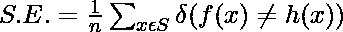
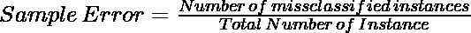
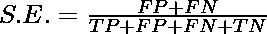
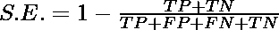
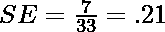
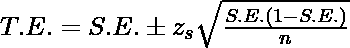

# 真实误差与样本误差

> 原文:[https://www.geeksforgeeks.org/true-error-vs-sample-error/](https://www.geeksforgeeks.org/true-error-vs-sample-error/)

### 真误差

真正的误差可以说是假设将从总体中错误分类单个随机抽取样本的概率。这里的人口代表了世界上所有的数据。

让我们考虑一个假设 h(x)，真实/目标函数是总体 p 的 f(x)。h 将对随机绘制的实例进行错误分类的概率，即真实误差为:

<center>

![T.E. = Prob[f(x) \neq h(x)]](img/6bd43a393564dd6faab3b2f28c0fe1ce.png "Rendered by QuickLaTeX.com")

</center>

### 样本误差

S 相对于目标函数 f 和数据样本 S 的样本误差是样本 S 错误分类的比例。

<center>



</center>

<center>



</center>

或者，下面的公式代表也代表样本误差:

*   
*   
*   标准误差= 1-精度

假设假设 h 在总人口中对 33 个例子中的 7 个进行了错误分类。那么采样误差应该是:

<center>



</center>

### 偏差和方差

**偏差**:偏差是假设的平均预测值与预测的正确值之差。带有高度偏见的假设试图过度简化训练(不适用于复杂的模型)。它往往具有高训练误差和高测试误差。

<center>

![Bias = E[h(x)]- f(x)](img/8fa9b09a55c1135d0bd3f20bfab16e6a.png "Rendered by QuickLaTeX.com")

</center>

**方差:**高方差假设在它们的预测之间具有高可变性。他们试图使模型过于复杂，不能很好地概括数据。

<center>

![Var(X)  = E[(X - E[X])^2]](img/3a89cfe7c147515f7c14e8a01f1d6e29.png "Rendered by QuickLaTeX.com")

</center>

### 置信区间

一般情况下，真误差比较复杂，难以计算。它可以借助于置信区间来估计。置信区间可以作为采样误差的函数来估计。

下面是置信区间的步骤:

*   随机抽取 n 个样本 S(相互独立)，其中 n 应该大于 30
*   计算样本 s 的样本误差

这里我们假设抽样误差是真误差的无偏估计量。以下是计算真实误差的公式:

<center>



</center>

其中 z <sub>s</sub> 是置信区间 s 百分比的 z 分值的值:

<figure class="table">

| %置信区间 | Fifty | Eighty | Ninety | Ninety-five | Ninety-nine | Ninety-nine point five |
| z 分数 | Zero point six seven | One point two eight | One point six four | One point nine six | Two point five eight | Two point eight |

### 真实误差与样本误差

<figure class="table">

| 真误差 | 样本误差 |
| --- | --- |
| 真实误差表示总体中随机样本被错误分类的概率。 | 样本误差表示样本中被错误分类的部分。 |
| 真误差用于估计总体误差。 | 样本误差用于估计样本的误差。 |
| 真误差很难计算。它是在样本误差的基础上由置信区间范围估计的。 | 样本误差很容易计算。你只需要计算样本被错误分类的分数。 |
| 真正的错误可能是由不良的数据收集方法、选择偏差或非响应偏差引起的。 | 抽样误差可以是特定人群误差(错误的调查对象)、选择误差、样本框架误差(为样本选择了错误的框架窗口)和无响应误差(当被调查者没有响应时)。 |

</figure>

### 实施:

在这个实现中，我们将使用置信区间来实现真实误差的估计。

## 蟒蛇 3

```
# imports
import numpy as np
import scipy.stats as st

#define sample data
np.random.seed(0)
data = np.random.randint(10, 30, 10000)

alphas = [0.90, 0.95, 0.99, 0.995]
for alpha in alphas:
  print(st.norm.interval(alpha=alpha, loc=np.mean(data), scale=st.sem(data)))
```

```
# confidence Interval
90%: (17.868667310403545, 19.891332689596453)
95%: (17.67492277275104, 20.08507722724896)
99%: (17.29626006422982, 20.463739935770178)
99.5%: (17.154104780989755, 20.60589521901025)
```

## **参考文献:**

*   [**样本误差与真实误差**](http://www.cs.cmu.edu/~tom/10601_sp08/slides/evaluation-2-13.pdf)

</figure>