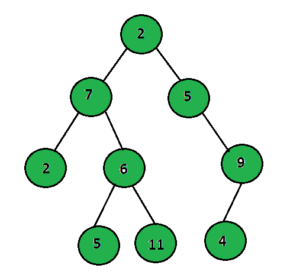
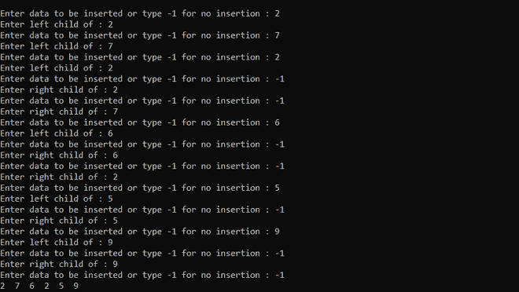
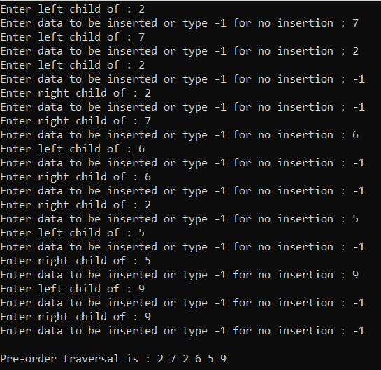
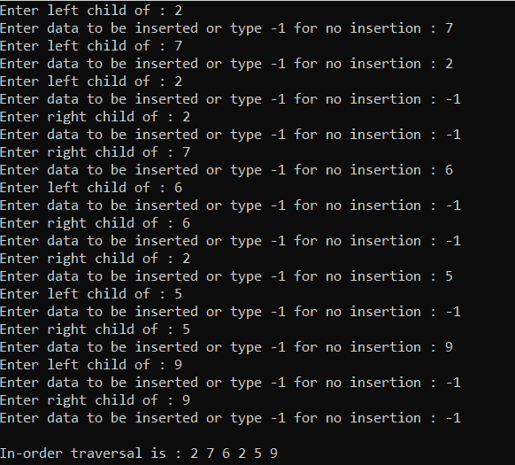
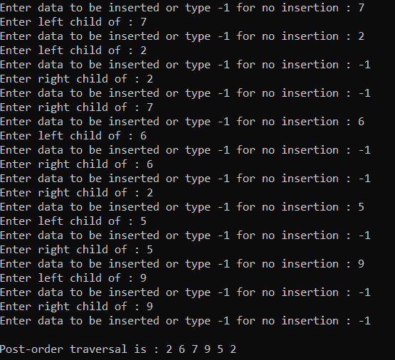
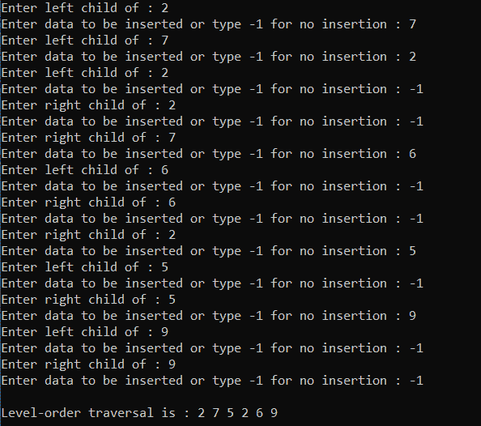
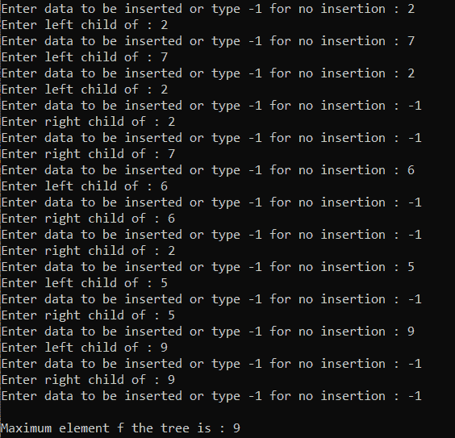
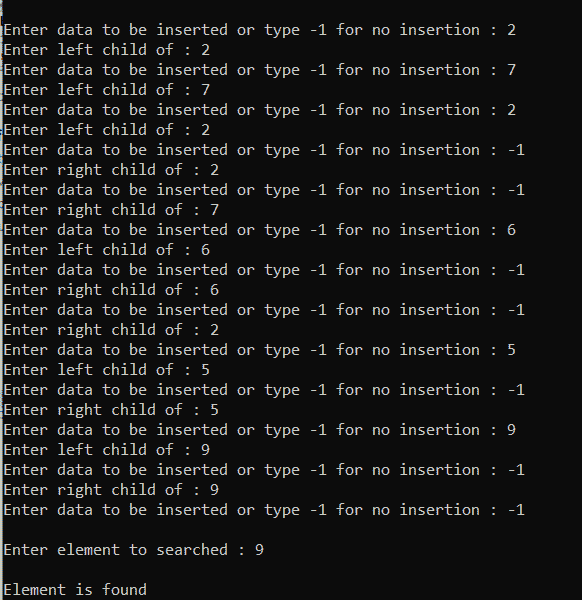
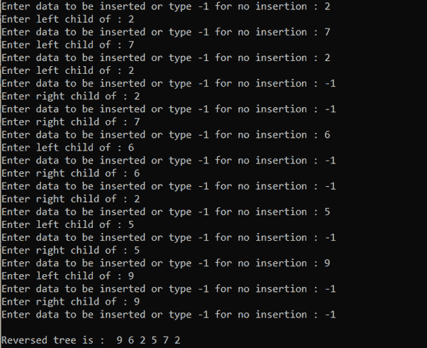
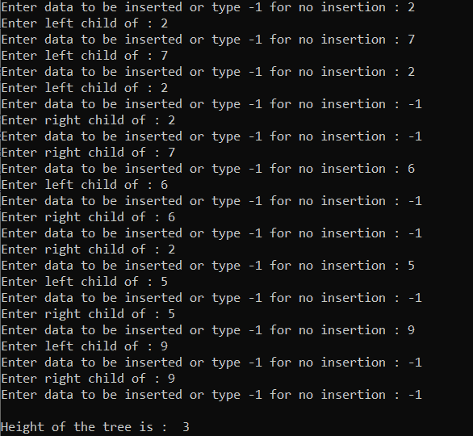

# 二叉树教程

> 原文:[https://www.geeksforgeeks.org/tutorial-on-binary-tree/](https://www.geeksforgeeks.org/tutorial-on-binary-tree/)

[树](https://www.geeksforgeeks.org/binary-tree-data-structure/)是一个分层的[数据结构](https://www.geeksforgeeks.org/data-structures/)。一棵[二叉树](https://www.geeksforgeeks.org/binary-tree-set-3-types-of-binary-tree/)是一棵最多有两个孩子的树。二叉树左边的节点叫做“左子”，右边的节点叫做“右子”。此外，根节点左侧较小的树或子树称为“左子树”，右侧的称为“右子树”。



以下是可以在二叉树上执行的各种操作:

### [**<u>创造二叉树</u>**](https://www.geeksforgeeks.org/linked-complete-binary-tree-its-creation/) **<u>:</u>**

其思想是首先创建给定树的根节点，然后递归地为每个父节点创建左右子节点。下面是同样的程序来说明:

## C++

```
// C++ program to illustrate how to
// create a tree
#include <iostream>
using namespace std;

// Structure of the Binary Tree
struct treenode {
    int info;
    struct treenode *left,
        *right;
};

// Function to create the Binary Tree
struct treenode* create()
{
    int data;
    struct treenode* tree;

    // Dynamically allocating memory
    // for the tree-node
    tree = new treenode;

    cout << "\nEnter data to be inserted "
         << "or type -1 for no insertion : ";

    // Input from the user
    cin >> data;

    // Termination Condition
    if (data == -1)
        return 0;

    // Assign value from user into tree
    tree->info = data;

    // Recursively Call to create the
    // left and the right sub tree
    cout << "Enter left child of : "
         << data;
    tree->left = create();

    cout << "Enter right child of : "
         << data;
    tree->right = create();

    // Return the created Tree
    return tree;
};

// Function to perform the inorder
// traversal of the given Tree
void inorder(struct treenode* root)
{
    // If root is NULL
    if (root == NULL)
        return;

    // Recursively call for the left
    // and the right subtree
    inorder(root->left);
    cout << root->info << "  ";
    inorder(root->right);
}

// Driver Code
int main()
{
    // Root Node
    struct treenode* root = NULL;

    // Function Call
    root = create();

    // Perform Inorder Traversal
    inorder(root);

    return 0;
}

/* Will be creating tree:
                2  
           /     \  
          7       5  
         /  \       \  
        2    6       9
 */
```

**输出:**



***时间复杂度:**O(N)*
T5**辅助空间:** O(1)

### [**<u>预序遍历</u>**](https://www.geeksforgeeks.org/tree-traversals-inorder-preorder-and-postorder/) **:**

在这个遍历中，首先访问根，然后是左子树和右子树。下面是同样的程序来说明:

## C++

```
// C++ program to demonstrate the
// pre-order traversal
#include "bits/stdc++.h"
using namespace std;

// Structure of the Binary Tree
struct treenode {
    int info;
    struct treenode *left,
        *right;
};

// Function to create the Binary Tree
struct treenode* create()
{
    int data;
    struct treenode* tree;

    // Dynamically allocating memory
    // for the tree-node
    tree = new treenode;

    cout << "\nEnter data to be inserted "
         << "or type -1 for no insertion : ";

    // Input from the user
    cin >> data;

    // Termination Condition
    if (data == -1)
        return 0;

    // Assign value from user into tree
    tree->info = data;

    // Recursively Call to create the
    // left and the right sub tree
    cout << "Enter left child of : "
         << data;
    tree->left = create();

    cout << "Enter right child of : "
         << data;
    tree->right = create();

    // Return the created Tree
    return tree;
};

// Function to perform the pre-order
// traversal for the given tree
void preorder(struct treenode* root)
{
    // If the root is NULL
    if (root == NULL)
        return;

    // Using tree-node type stack STL
    stack<treenode*> s;

    while ((root != NULL) || (!s.empty())) {
        if (root != NULL) {
            // Print the root
            cout << root->info << " ";

            // Push the node in the stack
            s.push(root);

            // Move to left subtree
            root = root->left;
        }
        else {
            // Remove the top of stack
            root = s.top();
            s.pop();
            root = root->right;
        }
    }

    cout << endl;
}

// Driver Code
int main()
{
    // Root Node
    struct treenode* root = NULL;

    // Function Call
    root = create();

    // Perform Inorder Traversal
    preorder(root);

    return 0;
}

/* Will be creating tree:
                2  
           /     \  
          7       5  
         /  \       \  
        2    6       9
 */
```

**输出:**



***时间复杂度:**O(N)*
T5**辅助空间:** O(N)

### [**<u>有序穿越</u> :**](https://www.geeksforgeeks.org/inorder-tree-traversal-without-recursion/)

在这个遍历中，首先访问左边的子树，然后是根和右边的子树。下面是同样的程序来说明:

## C++

```
// C++ program to illustrate how to
// create a tree
#include "bits/stdc++.h"
using namespace std;

// Structure of the Binary Tree
struct treenode {
    int info;
    struct treenode *left,
        *right;
};

// Function to create the Binary Tree
struct treenode* create()
{
    int data;
    struct treenode* tree;

    // Dynamically allocating memory
    // for the tree-node
    tree = new treenode;

    cout << "\nEnter data to be inserted "
         << "or type -1 for no insertion : ";

    // Input from the user
    cin >> data;

    // Termination Condition
    if (data == -1)
        return 0;

    // Assign value from user into tree
    tree->info = data;

    // Recursively Call to create the
    // left and the right sub tree
    cout << "Enter left child of : "
         << data;
    tree->left = create();

    cout << "Enter right child of : "
         << data;
    tree->right = create();

    // Return the created Tree
    return tree;
};

// Function to perform the inorder
// traversal of the given Tree
void inorder(struct treenode* root)
{
    // If root is NULL
    if (root == NULL)
        return;

    // Recursively call for the left
    // and the right subtree
    inorder(root->left);
    cout << root->info << "  ";
    inorder(root->right);
}

// Driver Code
int main()
{
    // Root Node
    struct treenode* root = NULL;

    // Function Call
    root = create();

    // Perform Inorder Traversal
    inorder(root);

    return 0;
}

/* Will be creating tree:
                2  
           /     \  
          7       5  
         /  \       \  
        2    6       9
 */
```

**输出:**



***时间复杂度:**O(N)*
T5**辅助空间:** O(N)

### [**<u>后序遍历</u>**](https://www.geeksforgeeks.org/tree-traversals-inorder-preorder-and-postorder/) **:**

在这个遍历中，首先访问左边的子树，然后是右边的子树和根节点。下面是同样的程序来说明:

## C++

```
// C++ program to implement the
// post-order traversal
#include "bits/stdc++.h"
using namespace std;

// Structure of the Binary Tree
struct treenode {
    int info;
    struct treenode *left,
        *right;
};

// Function to create the Binary Tree
struct treenode* create()
{
    int data;
    struct treenode* tree;

    // Dynamically allocating memory
    // for the tree-node
    tree = new treenode;

    cout << "\nEnter data to be inserted "
         << "or type -1 for no insertion : ";

    // Input from the user
    cin >> data;

    // Termination Condition
    if (data == -1)
        return 0;

    // Assign value from user into tree
    tree->info = data;

    // Recursively Call to create the
    // left and the right sub tree
    cout << "Enter left child of : "
         << data;
    tree->left = create();

    cout << "Enter right child of : "
         << data;
    tree->right = create();

    // Return the created Tree
    return tree;
};

// Function to perform the post-order
// traversal of the given tree
void postorder(struct treenode* root)
{
    // If the root is NULL
    return;

    stack<treenode*> s3;
    struct treenode* previous = NULL;

    do {
        // Iterate until root is present
        while (root != NULL) {
            s3.push(root);
            root = root->left;
        }

        while (root == NULL && (!s3.empty())) {
            root = s3.top();

            // If the right subtree is NULL
            if (root->right == NULL
                || root->right == previous) {
                // Print the root information
                cout << root->info << " ";
                s3.pop();

                // Update the previous
                previous = root;
                root = NULL;
            }

            // Otherwise
            else
                root = root->right;
        }

    } while (!s3.empty());
    cout << endl;
}

// Driver Code
int main()
{
    // Root Node
    struct treenode* root = NULL;

    // Function Call
    root = create();

    // Perform Inorder Traversal
    postorder(root);

    return 0;
}

/* Will be creating tree:
                2  
           /     \  
          7       5  
         /  \       \  
        2    6       9
 */
```

**输出:**



***时间复杂度:**O(N)*
T5**辅助空间:** O(N)

### [**<u>等级顺序遍历</u>**](https://www.geeksforgeeks.org/level-order-tree-traversal/) **<u>:</u>**

在这个遍历中，给定的树是逐级遍历的。下面是同样的程序来说明:

## C++

```
// C++ program to illustrate the
// level order traversal#include "bits/stdc++.h"
using namespace std;

// Structure of the Binary Tree
struct treenode {
    int info;
    struct treenode *left,
        *right;
};

// Function to create the Binary Tree
struct treenode* create()
{
    int data;
    struct treenode* tree;

    // Dynamically allocating memory
    // for the tree-node
    tree = new treenode;

    cout << "\nEnter data to be inserted "
         << "or type -1 for no insertion : ";

    // Input from the user
    cin >> data;

    // Termination Condition
    if (data == -1)
        return 0;

    // Assign value from user into tree
    tree->info = data;

    // Recursively Call to create the
    // left and the right sub tree
    cout << "Enter left child of : "
         << data;
    tree->left = create();

    cout << "Enter right child of : "
         << data;
    tree->right = create();

    // Return the created Tree
    return tree;
};

// Function to perform the level-order
// traversal
void levelorder(struct treenode* root)
{
    // If the root is NULL
    if (root == NULL)
        return;

    // Use queue for traversal
    queue<treenode*> q;

    // Print the root's value and
    // push it into the queue
    cout << root->info << " ";
    q.push(root);

    // Iterate until queue is non-empty
    while (!q.empty()) {
        // Get the front node
        root = q.front();
        q.pop();

        // If the root has the left child
        if (root->left) {
            cout << root->left->info
                 << " ";
            q.push(root->left);
        }

        // If the root has the right child
        if (root->right) {
            cout << root->right->info
                 << " ";
            q.push(root->right);
        }
    }
    cout << endl;
}

// Driver Code
int main()
{
    // Root Node
    struct treenode* root = NULL;

    // Function Call
    root = create();

    // Perform Inorder Traversal
    levelorder(root);

    return 0;
}

/* Will be creating tree:
                2  
           /     \  
          7       5  
         /  \       \  
        2    6       9
 */
```

**输出:**



***时间复杂度:**O(N)*
T5**辅助空间:** O(N)

### [**二叉树的最大元素**](https://www.geeksforgeeks.org/find-maximum-or-minimum-in-binary-tree/) **:**

二叉树所有元素中最大的元素称为最大元素。下面是同样的程序来说明:

## C++

```
// C++ program for the above approach
#include "bits/stdc++.h"
using namespace std;

// Structure of the Binary Tree
struct treenode {
    int info;
    struct treenode *left, *right;
};

// Function to create the Binary Tree
struct treenode* create()
{
    int data;
    struct treenode* tree;

    // Dynamically allocating memory
    // for the tree-node
    tree = new treenode;

    cout << "\nEnter data to be inserted "
         << "or type -1 for no insertion : ";

    // Input from the user
    cin >> data;

    // Termination Condition
    if (data == -1)
        return 0;

    // Assign value from user into tree
    tree->info = data;

    // Recursively Call to create the
    // left and the right sub tree
    cout << "Enter left child of : " << data;
    tree->left = create();

    cout << "Enter right child of : " << data;
    tree->right = create();

    // Return the created Tree
    return tree;
};

// Function to find the maximum element
// in the given Binary Tree
int FindMax(struct treenode* root)
{
    // If the tree is empty
    if (root == NULL)
        return 0;

    queue<treenode*> q;
    int max;
    struct treenode* temp;

    max = root->info;

    // Push the root in the queue
    q.push(root);

    // Iterate until queue is non-empty
    while (!q.empty()) {

        // Get the front node of
        // the tree
        root = q.front();
        temp = root;
        q.pop();

        // Update the maximum value
        // of the Tree
        if (max < temp->info)
            max = temp->info;

        if (root->left) {
            q.push(root->left);
        }
        if (root->right) {
            q.push(root->right);
        }
    }

    // Return the maximum value
    return max;
}

// Driver Code
int main()
{
    // Root Node
    struct treenode* root = NULL;

    // Function Call
    root = create();

    // Perform Inorder Traversal
    FindMax(root);

    return 0;
}

/* Will be creating tree:
                2  
           /     \  
          7       5  
         /  \       \  
        2    6       9
 */
```

**输出:**



***时间复杂度:**O(N)*
T5**辅助空间:** O(N)

### [**<u>搜索一个元素</u>**](https://www.geeksforgeeks.org/binary-search-tree-set-1-search-and-insertion/) **:**

在树节点中搜索任何特定元素的方法是在给定的树上执行任何树遍历，并检查是否存在具有给定搜索值的任何节点。如果发现为真，则打印**“找到元素”**。否则，打印**“找不到元素”**。

下面是同样的程序来说明:

## C++

```
// C++ program for the above approach
#include "bits/stdc++.h"
using namespace std;

// Structure of the Binary Tree
struct treenode {
    int info;
    struct treenode *left, *right;
};

// Function to create the Binary Tree
struct treenode* create()
{
    int data;
    struct treenode* tree;

    // Dynamically allocating memory
    // for the tree-node
    tree = new treenode;

    cout << "\nEnter data to be inserted "
         << "or type -1 for no insertion : ";

    // Input from the user
    cin >> data;

    // Termination Condition
    if (data == -1)
        return 0;

    // Assign value from user into tree
    tree->info = data;

    // Recursively Call to create the
    // left and the right sub tree
    cout << "Enter left child of : " << data;
    tree->left = create();

    cout << "Enter right child of : " << data;
    tree->right = create();

    // Return the created Tree
    return tree;
};

// Function to search an element in the
// given Binary Tree
int FindElement(struct treenode* root,
                int data)
{
    // If the root is NULL
    if (root == NULL)
        return 0;

    queue<treenode*> q;
    struct treenode* temp;
    if (!root)
        return 0;

    else {
        // Push the root
        q.push(root);

        // Perform the level-order traversal
        while (!q.empty()) {
            // Get the root
            root = q.front();
            temp = root;
            q.pop();

            // If the node with value data
            // exists then return 1
            if (data == temp->info)
                return 1;

            // Recursively push the left and
            // the right child of the node
            if (root->left) {
                q.push(root->left);
            }
            if (root->right) {
                q.push(root->right);
            }
        }

        // Otherwise, not found
        return 0;
    }
}

// Driver Code
int main()
{
    int data;

    // Root of the tree
    struct treenode* root = NULL;

    // Create the Tree
    root = create();

    cout << "\nEnter element to searched : ";
    cin >> data;

    // Function Call
    if (FindElement(root, data) == 1)
        cout << "\nElement is found";
    else
        cout << "Element is not found";
    return 0;
}

/* Will be creating tree:
                2
           /     \
          7       5
         /  \       \
        2    6       9
 */
```

**输出:**



***时间复杂度:** O(log N)*
***辅助空间:** O(N)*

### **<u>反向层级顺序遍历</u> :**

下面是同样的程序来说明:

## C++

```
// C++ program for the above approach
#include "bits/stdc++.h"
using namespace std;

// Structure of the Binary Tree
struct treenode {
    int info;
    struct treenode *left, *right;
};

// Function to create the Binary Tree
struct treenode* create()
{
    int data;
    struct treenode* tree;

    // Dynamically allocating memory
    // for the tree-node
    tree = new treenode;

    cout << "\nEnter data to be inserted "
         << "or type -1 for no insertion : ";

    // Input from the user
    cin >> data;

    // Termination Condition
    if (data == -1)
        return 0;

    // Assign value from user into tree
    tree->info = data;

    // Recursively Call to create the
    // left and the right sub tree
    cout << "Enter left child of : " << data;
    tree->left = create();

    cout << "Enter right child of : " << data;
    tree->right = create();

    // Return the created Tree
    return tree;
};

// Function to print the reverse level
// order traversal of the given tree
void reversetree(struct treenode* root)
{
    // If the root is NULL
    if (root == NULL)
        return;

    queue<treenode*> q;
    stack<int> s;
    struct treenode* temp;
    q.push(root);

    // Until queue is empty
    while (!q.empty()) {
        // Get the front node
        temp = q.front();
        q.pop();

        // Push every countered node
        // data into stack
        s.push(temp->info);

        // Check for the left subtree
        if (temp->left)
            q.push(temp->left);

        // Check for the right subtree
        if (temp->right)
            q.push(temp->right);
    }

    // While S is non-empty, print
    // all the nodes
    while (!s.empty()) {
        cout << s.top() << " ";
        s.pop();
    }
}

// Driver Code
int main()
{
    // Create root node
    struct treenode* root = NULL;

    // Create a tree
    root = create();

    cout << "\nReversed tree is :  ";
    reversetree(root);
    return 0;
}
/* Will be creating tree:
                2
           /     \
          7       5
         /  \       \
        2    6       9
*/
```

**输出:**



***时间复杂度:**O(N)*
T5**辅助空间:** O(N)

### [**<u>树高</u>**](https://www.geeksforgeeks.org/write-a-c-program-to-find-the-maximum-depth-or-height-of-a-tree/) **:**

[二叉树](https://www.geeksforgeeks.org/binary-tree-data-structure/)的高度是从根节点到树中任何叶节点的最长路径。下面是同样的程序来说明:

## C++

```
// C++ program for the above approach
#include "bits/stdc++.h"
using namespace std;

// Structure of the Binary Tree
struct treenode {
    int info;
    struct treenode *left, *right;
};

// Function to create the Binary Tree
struct treenode* create()
{
    int data;
    struct treenode* tree;

    // Dynamically allocating memory
    // for the tree-node
    tree = new treenode;

    cout << "\nEnter data to be inserted "
         << "or type -1 for no insertion : ";

    // Input from the user
    cin >> data;

    // Termination Condition
    if (data == -1)
        return 0;

    // Assign value from user into
    // the tree
    tree->info = data;

    // Recursively Call to create the
    // left and the right sub tree
    cout << "Enter left child of : "
         << data;
    tree->left = create();

    cout << "Enter right child of : "
         << data;
    tree->right = create();

    // Return the created Tree
    return tree;
};

// Function to find the height of
// the given Binary tree
int height(struct treenode* root)
{
    int x, y;

    // If root is NOT NULL
    if (root != NULL) {
        // x will contain the height
        // of left subtree
        x = height(root->left);

        // y will contain the height
        // of right subtree
        y = height(root->right);

        if (x > y)

            // Leaf node has one height
            // so x or y + 1
            return x + 1;
        else
            return y + 1;
    }
    return 0;
}

// Driver Code
int main()
{
    // Root Node
    struct treenode* root = NULL;

    // Create the tree
    root = create();

    cout << "\nHeight of the tree is :  "
         << height(root);

    return 0;
}
/* Will be creating tree:
                2
           /     \
          7       5
         /  \       \
        2    6       9
 */
```

**输出**:



***时间复杂度:**O(N)*
T5**辅助空间:** O(1)

### [**树的最深节点**](https://www.geeksforgeeks.org/find-deepest-node-binary-tree/) **:**

出现在最大值或最后一级的节点称为最深节点。下面是实现上述方法的程序:

## C++

```
// C++ program for the above approach
#include "bits/stdc++.h"
using namespace std;

// Structure of the Binary Tree
struct treenode {
    int info;
    struct treenode *left, *right;
};

// Function to create the Binary Tree
struct treenode* create()
{
    int data;
    struct treenode* tree;

    // Dynamically allocating memory
    // for the tree-node
    tree = new treenode;

    cout << "\nEnter data to be inserted "
         << "or type -1 for no insertion : ";

    // Input from the user
    cin >> data;

    // Termination Condition
    if (data == -1)
        return 0;

    // Assign value from user into tree
    tree->info = data;

    // Recursively Call to create the
    // left and the right sub tree
    cout << "Enter left child of : " << data;
    tree->left = create();

    cout << "Enter right child of : " << data;
    tree->right = create();

    // Return the created Tree
    return tree;
};

// Function to find the deepest node
// of the given Binary Tree
int deepest(struct treenode* root)
{
    // If the root is NULL
    if (root == NULL)
        return 0;

    queue<treenode*> q;

    q.push(root);

    // While queue is non-empty
    while (!q.empty()) {
        // Get the front node of queue
        root = q.front();
        q.pop();

        // Check for the left and
        // the right subtree
        if (root->left)
            q.push(root->left);
        if (root->right)
            q.push(root->right);
    }

    // Return the value for the
    // deepest node
    return (root->info);
}

// Driver Code
int main()
{
    // Root Node
    struct treenode* root = NULL;

    // Create the tree
    root = create();

    cout << "\nDeepest node of the tree is :  " << deepest(root);

    return 0;
}

/* Will be creating tree:
                2
           /     \
          7       5
         /  \       \
        2    6       9
 */
```