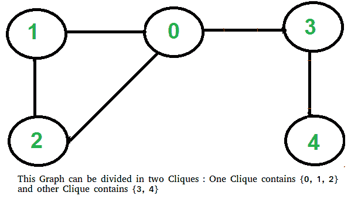

# 两帮问题(检查图形是否可以分成两帮)

> 原文:[https://www . geesforgeks . org/two-clique-problem-check-graph-can-divided-two-clique/](https://www.geeksforgeeks.org/two-clique-problem-check-graph-can-divided-two-cliques/)

团是图的一个子图，使得子图中的所有顶点彼此完全相连。给定一个图，找出它是否可以分成两个小集团。

**示例:**

```
Input : G[][] =   {{0, 1, 1, 0, 0},
                  {1, 0, 1, 1, 0},
                  {1, 1, 0, 0, 0},
                  {0, 1, 0, 0, 1},
                  {0, 0, 0, 1, 0}};
Output : Yes
```



这个问题一开始看起来很棘手，但有一个简单有趣的解决方案。如果一个图的补图是[二部图](https://www.geeksforgeeks.org/bipartite-graph/)，那么这个图可以分成两个小集团。所以下面是两个步骤来发现图形是否可以分成两个派系。

*   求图的补图。下图是补码图，上图是显示图。在补集中，所有原始边都被移除。顶点之间没有边，现在有一条边连接它们。


*   如果补码是二分的，则返回真，否则返回假。上面显示的图是二分图。这里讨论的是检查一个图是否是二分图。

**这是如何工作的？**
如果补图是二部图，那么图可以分成 U 和 V 两个集合，这样就没有边连接到同一个集合的顶点。这意味着在原始图中，这些集合 U 和 V 是完全连通的。因此，原始图形可以分为两个派系。

**实现:**
下面是上面步骤的实现。

## C++

```
// C++ program to find out whether a given graph can be
// converted to two Cliques or not.
#include <bits/stdc++.h>
using namespace std;

const int V = 5;

// This function returns true if subgraph reachable from
// src is Bipartite or not.
bool isBipartiteUtil(int G[][V], int src, int colorArr[])
{
    colorArr[src] = 1;

    // Create a queue (FIFO) of vertex numbers and enqueue
    // source vertex for BFS traversal
    queue <int> q;
    q.push(src);

    // Run while there are vertices in queue (Similar to BFS)
    while (!q.empty())
    {
        // Dequeue a vertex from queue
        int u = q.front();
        q.pop();

        // Find all non-colored adjacent vertices
        for (int v = 0; v < V; ++v)
        {
            // An edge from u to v exists and destination
            // v is not colored
            if (G[u][v] && colorArr[v] == -1)
            {
                // Assign alternate color to this adjacent
                // v of u
                colorArr[v] = 1 - colorArr[u];
                q.push(v);
            }

            // An edge from u to v exists and destination
            // v is colored with same color as u
            else if (G[u][v] && colorArr[v] == colorArr[u])
                return false;
        }
    }

    // If we reach here, then all adjacent vertices can
    // be colored with alternate color
    return true;
}

// Returns true if a Graph G[][] is Bipartite or not. Note
// that G may not be connected.
bool isBipartite(int G[][V])
{
    // Create a color array to store colors assigned
    // to all vertices. Vertex number is used as index in
    // this array. The value '-1' of  colorArr[i]
    // is used to indicate that no color is assigned to
    // vertex 'i'.  The value 1 is used to indicate first
    // color is assigned and value 0 indicates
    // second color is assigned.
    int colorArr[V];
    for (int i = 0; i < V; ++i)
        colorArr[i] = -1;

    // One by one check all not yet colored vertices.
    for (int i = 0; i < V; i++)
        if (colorArr[i] == -1)
            if (isBipartiteUtil(G, i, colorArr) == false)
                return false;

    return true;
}

// Returns true if G can be divided into
// two Cliques, else false.
bool canBeDividedinTwoCliques(int G[][V])
{
    // Find complement of G[][]
    // All values are complemented except
    // diagonal ones
    int GC[V][V];
    for (int i=0; i<V; i++)
        for (int j=0; j<V; j++)
             GC[i][j] = (i != j)?  !G[i][j] : 0;

    // Return true if complement is Bipartite
    // else false.
    return  isBipartite(GC);
}

// Driver program to test above function
int main()
{
    int G[][V] = {{0, 1, 1, 1, 0},
        {1, 0, 1, 0, 0},
        {1, 1, 0, 0, 0},
        {0, 1, 0, 0, 1},
        {0, 0, 0, 1, 0}
    };

    canBeDividedinTwoCliques(G) ? cout << "Yes" :
                                  cout << "No";
    return 0;
}
```

## Java 语言(一种计算机语言，尤用于创建网站)

```
// Java program to find out whether a given graph can be
// converted to two Cliques or not.
import java.util.ArrayDeque;
import java.util.Deque;
class GFG {
static int V = 5;

// This function returns true if subgraph reachable from
// src is Bipartite or not.
static boolean isBipartiteUtil(int G[][], int src, int colorArr[])
{
    colorArr[src] = 1;

    // Create a queue (FIFO) of vertex numbers and enqueue
    // source vertex for BFS traversal
    Deque <Integer> q = new ArrayDeque<>();
    q.push(src);

    // Run while there are vertices in queue (Similar to BFS)
    while (!q.isEmpty())
    {
        // Dequeue a vertex from queue
        int u = q.peek();
        q.pop();

        // Find all non-colored adjacent vertices
        for (int v = 0; v < V; ++v)
        {
            // An edge from u to v exists and destination
            // v is not colored
            if (G[u][v] == -1 && colorArr[v] == -1)
            {
                // Assign alternate color to this adjacent
                // v of u
                colorArr[v] = 1 - colorArr[u];
                q.push(v);
            }

            // An edge from u to v exists and destination
            // v is colored with same color as u
            else if (G[u][v] == colorArr[u] && colorArr[v] == colorArr[u])
                return false;
        }
    }

    // If we reach here, then all adjacent vertices can
    // be colored with alternate color
    return true;
}

// Returns true if a Graph G[][] is Bipartite or not. Note
// that G may not be connected.
static boolean isBipartite(int G[][])
{
    // Create a color array to store colors assigned
    // to all vertices. Vertex number is used as index in
    // this array. The value '-1' of  colorArr[i]
    // is used to indicate that no color is assigned to
    // vertex 'i'.  The value 1 is used to indicate first
    // color is assigned and value 0 indicates
    // second color is assigned.
    int colorArr[]=new int[V];
    for (int i = 0; i < V; ++i)
        colorArr[i] = -1;

    // One by one check all not yet colored vertices.
    for (int i = 0; i < V; i++)
        if (colorArr[i] == -1)
            if (isBipartiteUtil(G, i, colorArr) == false)
                return false;

    return true;
}

// Returns true if G can be divided into
// two Cliques, else false.
static boolean canBeDividedinTwoCliques(int G[][])
{
    // Find complement of G[][]
    // All values are complemented except
    // diagonal ones
    int GC[][]=new int[V][V];
    for (int i=0; i<V; i++)
        for (int j=0; j<V; j++)
             GC[i][j] = (i != j)?  -GC[i][j] : 0;

    // Return true if complement is Bipartite
    // else false.
    return  isBipartite(GC);
}

// Driver program to test above function
public static void main(String[] args) {
     int G[][] = {{0, 1, 1, 1, 0},
        {1, 0, 1, 0, 0},
        {1, 1, 0, 0, 0},
        {0, 1, 0, 0, 1},
        {0, 0, 0, 1, 0}
    };

    if(canBeDividedinTwoCliques(G))
             System.out.println("Yes");
    else
        System.out.println("No");
    }
}
/* This code contributed by PrinciRaj1992 */
```

## 蟒蛇 3

```
# Python3 program to find out whether a given 
# graph can be converted to two Cliques or not. 
from queue import Queue 

# This function returns true if subgraph 
# reachable from src is Bipartite or not. 
def isBipartiteUtil(G, src, colorArr):
    global V
    colorArr[src] = 1

    # Create a queue (FIFO) of vertex numbers 
    # and enqueue source vertex for BFS traversal 
    q = Queue() 
    q.put(src) 

    # Run while there are vertices in
    # queue (Similar to BFS) 
    while (not q.empty()):

        # Dequeue a vertex from queue 
        u = q.get()

        # Find all non-colored adjacent vertices
        for v in range(V):

            # An edge from u to v exists and 
            # destination v is not colored 
            if (G[u][v] and colorArr[v] == -1):

                # Assign alternate color to this  
                # adjacent v of u 
                colorArr[v] = 1 - colorArr[u] 
                q.put(v)

            # An edge from u to v exists and destination 
            # v is colored with same color as u 
            elif (G[u][v] and colorArr[v] == colorArr[u]): 
                return False

    # If we reach here, then all adjacent 
    # vertices can be colored with alternate color 
    return True

# Returns true if a Graph G[][] is Bipartite or not. 
# Note that G may not be connected. 
def isBipartite(G):
    global V

    # Create a color array to store colors assigned 
    # to all vertices. Vertex number is used as index  
    # in this array. The value '-1' of colorArr[i] 
    # is used to indicate that no color is assigned 
    # to vertex 'i'. The value 1 is used to indicate 
    # first color is assigned and value 0 indicates 
    # second color is assigned. 
    colorArr = [-1] * V

    # One by one check all not yet
    # colored vertices.
    for i in range(V):
        if (colorArr[i] == -1):
            if (isBipartiteUtil(G, i, colorArr) == False): 
                return False

    return True

# Returns true if G can be divided into 
# two Cliques, else false. 
def canBeDividedinTwoCliques(G):
    global V

    # Find complement of G[][] 
    # All values are complemented 
    # except diagonal ones 
    GC = [[None] * V for i in range(V)]
    for i in range(V):
        for j in range(V):
            GC[i][j] = not G[i][j] if i != j else 0

    # Return true if complement is  
    # Bipartite else false. 
    return isBipartite(GC)

# Driver Code
V = 5

G = [[0, 1, 1, 1, 0], 
     [1, 0, 1, 0, 0], 
     [1, 1, 0, 0, 0], 
     [0, 1, 0, 0, 1],
     [0, 0, 0, 1, 0]]

if canBeDividedinTwoCliques(G):
    print("Yes")
else:
    print("No")

# This code is contributed by PranchalK
```

**输出:**

```
Yes
```

以上实现的时间复杂度为 O(V <sup>2</sup> )。

**参考:**
[http://math . stackexchange . com/questions/310092/the-two-clique-problem-in-p-or-NP-p-NP-for-thesis](http://math.stackexchange.com/questions/310092/the-two-clique-problem-is-in-p-or-np-p-np-for-hypothesis)

本文由 **Shubham Saxena** 供稿。如果你喜欢 GeeksforGeeks 并想投稿，你也可以使用[write.geeksforgeeks.org](http://www.write.geeksforgeeks.org)写一篇文章或者把你的文章邮寄到 review-team@geeksforgeeks.org。看到你的文章出现在极客博客主页上，帮助其他极客。
如果您发现任何不正确的地方，请写评论，或者您想分享更多关于上面讨论的主题的信息