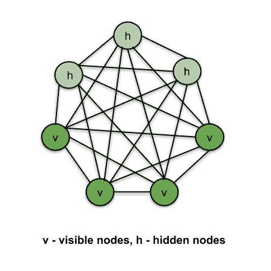
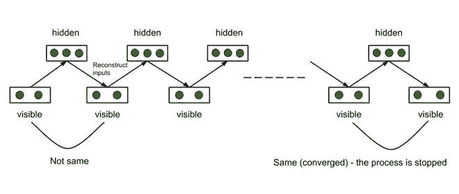
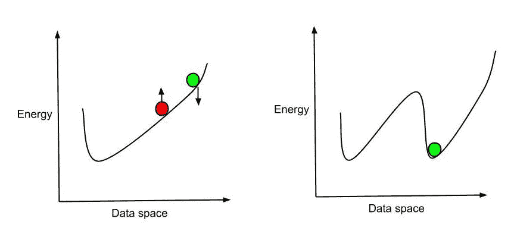
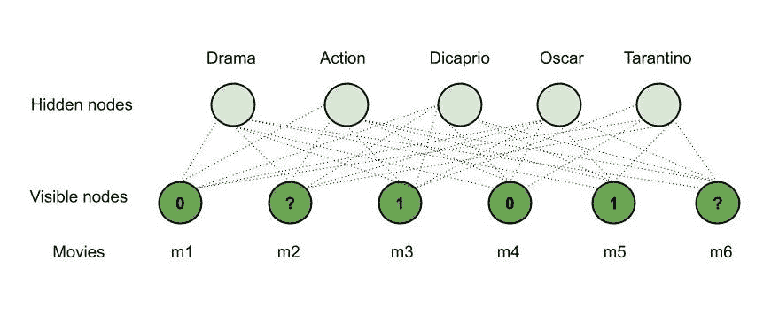

# 玻尔兹曼机器的类型

> 原文:[https://www.geeksforgeeks.org/types-of-boltzmann-machines/](https://www.geeksforgeeks.org/types-of-boltzmann-machines/)

深度学习模型大致分为有监督和无监督模型。

**监督 DL 模型:**

*   人工神经网络
*   递归神经网络
*   卷积神经网络

**无监督 DL 模型:**

*   自组织地图
*   玻尔兹曼机器
*   自动编码器

让我们了解玻尔兹曼机器到底是什么，它们是如何工作的，并实现一个推荐系统，该系统根据以前观看的电影来推荐用户是否喜欢一部电影。

**玻尔兹曼机器**是一个无监督的 DL 模型，其中每个节点都与其他节点相连。也就是说，与人工神经网络、中枢神经系统、神经网络和睡眠监测系统不同，玻尔兹曼机器是**无方向的**(或者说连接是双向的)。玻尔兹曼机器不是确定性的 DL 模型，而是**随机的**或**生成的** DL 模型。它更像是某个系统的代表。玻尔兹曼机器中有两种类型的节点——**可见节点**——那些我们可以并且确实测量的节点，以及**隐藏节点**——那些我们不能或者不测量的节点。尽管节点类型不同，但玻尔兹曼机器认为它们是相同的，所有的东西都作为一个单一的系统工作。训练数据被输入玻尔兹曼机器，系统的权重被相应地调整。玻尔兹曼机器通过了解系统在正常条件下的工作来帮助我们理解异常。



玻尔兹曼机器

**基于能量的模型:**

**玻尔兹曼分布**用于玻尔兹曼机的采样分布。玻尔兹曼分布由以下等式控制

```
P<sub>i = e<sup>(-∈i/kT)/ ∑e(-∈j/kT)</sup></sub> 
P<sub>i -</sub> probability of system being in state i
∈<sub>i -</sub> Energy of system in state i
T - Temperature of the system
k - Boltzmann constant
∑e<sup>(-∈</sup><sub><sup>j/kT) -</sup></sub> Sum of values for all possible states of the system
```

玻尔兹曼分布描述了系统的不同状态，因此玻尔兹曼机器使用这种分布创建了机器的不同状态。从上面的方程可以看出，随着系统能量的增加，系统处于状态“I”的概率降低。因此，系统在最低能量状态下最稳定(气体扩散时最稳定)。这里，在玻尔兹曼机器中，系统的能量是根据突触的**权重来定义的。一旦系统被训练并且权重被设置，系统总是试图通过调整权重来为自己找到最低能量状态。**

**玻尔兹曼机器的类型:**

*   受限玻尔兹曼机器
*   深度信念网络
*   深玻尔兹曼机器

**受限玻尔兹曼机器(RBMs):**

在一个完整的玻尔兹曼机器中，每个节点都与其他节点相连，因此连接呈指数增长**。这就是我们使用成果管理制的原因。限制性商业惯例中节点连接的限制如下**

*   **隐藏节点不能相互连接。**
*   **相互连接的可见节点。**

****受限玻尔兹曼机的能量函数示例–****

```
**E(v, h) = -∑ a<sub>ivi - ∑ bjhj - ∑∑ viwi,jhj</sub>**
**a, v -** biases in the system - constants
**v<sub>i, hj -</sub>** visible node, hidden node
**P(v, h) =** Probability of being in a certain state
**P(v, h) = e<sup>(-E(v, h))/Z</sup>**
**Z -** sum if values for all possible states
```

**假设我们用我们的 RBM 构建了一个推荐系统，可以在六(6)部电影中使用。RBM 学习如何将隐藏节点分配给某些特征。通过**对比发散**的过程，我们让 RBM 接近我们的电影场景，也就是我们的案例或场景。RBM 通过培训过程确定了哪些特征是重要的。训练数据或者是 0 或者是 1，或者是基于用户是否喜欢该电影(1)、不喜欢该电影(0)或者没有观看该电影(缺失数据)的缺失数据。RBM 自动识别重要特征。**

****对比分歧:****

****RBM** 通过此方法调整权重。使用一些随机分配的初始权重，RBM 计算隐藏节点，然后使用相同的权重重建输入节点。每个隐藏节点由所有可见节点构成，每个可见节点由所有隐藏节点重构，因此，输入不同于重构的输入，尽管权重相同。该过程继续，直到重建的输入与先前的输入匹配。据说这个过程在这个阶段已经收敛了。整个过程被称为**吉布斯取样**。**

**

吉布抽样** 

****梯度公式**给出系统某一状态的对数概率相对于系统权重的梯度。如下所示–**

```
**d/dw<sub>ij(log(P(v<sup>0))) = <vi0 * hj0> - <vi∞ * hj∞></sup></sub>**
v - visible state, h- hidden state
<v<sub>i</sub><sup>0</sup> * h<sub>j</sub><sup>0</sup>> - initial state of the system
<v<sub>i</sub><sup>∞</sup> * h<sub>j</sub><sup>∞</sup>> - final state of the system
**P(v<sup>0) -</sup>** probability that the system is in state v<sup>0</sup>
**w<sub>ij -</sub>** weights of the system
```

**上述等式告诉我们——系统权重的变化将如何改变系统处于特定状态的对数概率。系统试图以尽可能低的能量状态(最稳定)结束。我们也可以只考虑前几个暂停，而不是继续调整权重过程，直到当前输入与前一个输入相匹配。了解如何调整我们的曲线以获得最低的能量状态就足够了。因此，我们调整权重，重新设计系统和能量曲线，以便获得当前位置的最低能量。这被称为**韩丁的捷径**。**

**

辛顿的捷径** 

****RBM 的工作–示例–****

**考虑一下——玛丽看了六部电影中的四部，并对其中的四部进行了评分。说着，她看了 m <sub>1</sub> 、m <sub>3</sub> 、m <sub>4</sub> 和 m <sub>5</sub> 并且喜欢 m <sub>3</sub> 、m <sub>5</sub> (评分 1)而不喜欢另外两部，也就是 m <sub>1</sub> 、m <sub>4</sub> (评分 0)，而另外两部电影——m2、m6 都没有评分。现在，用我们的 RBM，我们将推荐其中一部电影给她看。说–**

*   **m <sub>3</sub> ，m <sub>5</sub> 都是‘戏剧’类型。**
*   **m <sub>1</sub> ，m <sub>4</sub> 都是‘动作’类型。**
*   **迪卡普里奥在《第五季》中扮演了一个角色。**
*   **m <sub>3</sub> ，m <sub>5</sub> 获得‘奥斯卡’**
*   **塔伦蒂诺导演的《第四季》。**
*   **m <sub>2</sub> 属于‘动作’类型。**
*   **m <sub>6</sub> 同时属于《动作》和《戏剧》两种类型，《迪卡普里奥》在其中出演，并获得了“奥斯卡奖”。**

**我们有以下观察结果–**

*   **玛丽喜欢 m <sub>3</sub> ，m <sub>5</sub> ，它们都属于“戏剧”类型，她可能**喜欢“戏剧”**电影。**
*   **玛丽不喜欢 m <sub>1</sub> ，m <sub>4</sub> 这些动作片，她可能**不喜欢《动作》**电影。**
*   **玛丽喜欢 m <sub>3</sub> ，m <sub>5</sub> 他们已经获得了一个‘奥斯卡’，她可能**喜欢**一个**【奥斯卡】**电影。**
*   **既然《迪卡普里奥》在《第五季》中出演，而且玛丽喜欢，她可能会喜欢《T2》这部由 T4《迪卡普里奥》在《第五季》中出演的电影。**
*   **玛丽不喜欢塔伦蒂诺导演的《第四季》，她可能不喜欢 T4《塔伦蒂诺》导演的任何电影《第五季》。**

**因此，基于 m <sub>2</sub> 、m <sub>6</sub> 的观察和细节；我们的 RBM **推荐 m6** 给玛丽(《戏剧》，《迪卡普里奥》和《奥斯卡》都符合玛丽的兴趣和 m <sub>6</sub> )。这就是 RBM 是如何工作的，因此被用于推荐系统。**

**

RBM 的工作** 

**因此，径向基函数被用来建立推荐系统。**

****深度信念网络(DBNs):****

**假设我们将几个限制性商业惯例堆叠在一起，这样第一个 RBM 输出就是第二个 RBM 的输入，以此类推。这种网络被称为深度信念网络。每一层中的连接都是无方向的(因为每一层都是 RBM)。同时，层与层之间的连接是定向的(除了上面两层——上面两层之间的连接是无定向的)。有两种方法可以训练数据库网络**

1.  ****贪婪分层训练算法–**径向基函数是逐层训练的。一旦训练了单个径向基函数(即设置了参数-权重、偏差)，就在 DBN 层之间设置了方向。**
2.  ****唤醒-睡眠算法–**DBN 一直向上训练(连接上升-唤醒)，然后向下训练(连接下降-睡眠)。**

**因此，我们堆叠 RBM，训练它们，一旦我们训练了参数，我们就确保层之间的连接只向下工作(除了最上面的两层)。**

****深玻尔兹曼机器(DBMs):****

**数据库管理系统类似于数据库网络，除了层内的连接之外，层与层之间的连接也是**无方向的**(不像 DBN 那样，层与层之间的连接是有方向的)。数据库管理系统可以提取更复杂的特征，因此可以用于更复杂的任务。**