# Ukkonen 的后缀树构造–第 1 部分

> 原文:[https://www . geeksforgeeks . org/ukkonens-后缀-树-构造-part-1/](https://www.geeksforgeeks.org/ukkonens-suffix-tree-construction-part-1/)

后缀树在许多字符串处理和计算生物学问题中非常有用。许多书籍和电子资源都从理论上讨论了这个问题，但很少有人讨论代码实现。但是，我仍然觉得缺少了一些东西，并且不容易实现构造后缀树的代码及其在许多应用程序中的使用。这是试图弥合理论和完整的工作代码实现之间的差距。这里我们将讨论 Ukkonen 的后缀树构造算法。我们将从理论到实施分多个部分逐步详细讨论它。我们将从暴力方式开始，尝试理解 Ukkonen 算法中涉及的不同概念、技巧，在最后一部分，将讨论代码实现。
**注**:当 1 st 或 2 nd 阅读时，你可能会发现算法的某些部分很难理解，它非常好。只要多做一些尝试和思考，你就应该能够理解这些部分。

由**丹·古斯菲尔德**所著的《字符串、树和序列的算法:计算机科学和计算生物学》一书很好地解释了这些概念。

m 字符串 S 的后缀树 **T** 是有根有向树，正好有 m 片叶子，从 1 到**m**(假设最后一个字符串在字符串中是唯一的)

*   Root 可以有零个、一个或多个子级。
*   除了根节点之外，每个内部节点至少有两个子节点。
*   每条边都用一个非空的子串标记
*   来自同一个节点的任何两条边都不能有以相同字符开头的边标签。

从根到叶 I 的路径上的边标签的连接给出了从位置 I 开始的 S 的后缀，即 S[i…m]。

**注意:** Position 以 1 开始(不是零索引的，但是后面在代码实现的时候，我们会用到零索引的 Position)

对于 m = 6 的字符串 S = xabxac，后缀树如下所示:

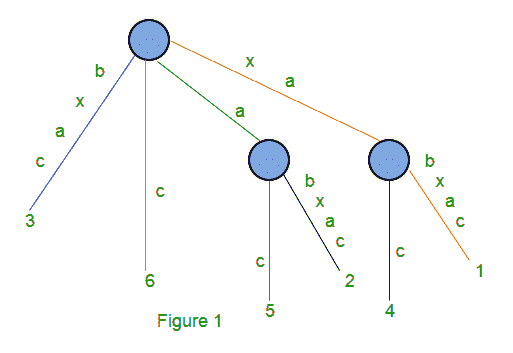

它有一个根节点和两个内部节点以及 6 个叶节点。

红色路径的字符串深度为 1，表示从位置 6 开始的后缀 c
蓝色路径的字符串深度为 4，表示从位置 3 开始的后缀 bxca】绿色路径的字符串深度为 2，表示从位置 5 开始的后缀 AC
橙色路径的字符串深度为 6，表示从位置 1 开始的后缀 xabxac

标签为 a ( 绿色)和 xa ( 橙色)的边是非叶边(在内部节点结束)。所有其他边都是叶子边(叶子的末端)

如果 S 的一个后缀与 S 的另一个后缀的前缀匹配(当字符串中的最后一个字符不唯一时)，那么第一个后缀的路径不会以叶子结束。

对于字符串 S = xabxa，m = 5，下面是后缀树:

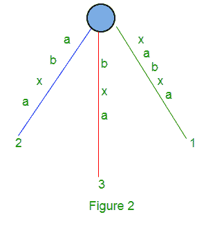

这里我们将有 5 个后缀:xabxa、abxa、bxa、xa 和 a.
后缀‘xa’和‘a’的路径不以叶子结束。像上面这样的树(图 2)被称为隐式后缀树，因为一些后缀(‘xa’和‘a’)在树中看不到。

为了避免这个问题，我们添加了一个字符串中没有的字符。我们通常使用$、#等作为终止字符。
下面是字符串 S = xabxa$的后缀树，m = 6，现在所有 6 个后缀都以 leaf 结尾。

**构建后缀树的简单算法**
给定长度为 m 的字符串 S，输入后缀 S 的单个边[1..m]$(整个字符串)到树中，然后依次输入后缀 S[i..m]$到正在生长的树中，因为 I 从 2 增加到 m。让 N i 表示编码从 1 到 I 的所有后缀的中间树。因此 N i +1 由 N i 构建如下:

*   从 N i 的根开始
*   找到从根开始匹配前缀 S[I+1]的最长路径..m]$
*   匹配结束于节点(比如 w)或边的中间[比如(u，v)]。
*   如果它在一条边(u，v)的中间，通过在边上与 S[I+l]中的字符匹配的最后一个字符之后插入一个新的节点 w，将这条边(u，v)分成两条边..m]就在不匹配的第一个字符之前。新边(u，w)用(u，v)标签中与 S[I+1]匹配的部分进行标记..m]，新的边(w，v)用(u，v)标签的剩余部分来标记。
*   创建从 w 到标记为 i+1 的新叶的新边(w，i+1)，并用后缀 S[I+1]的不匹配部分标记新边..m]

这需要 O(m 2 )来为长度为 m 的字符串 S 构建后缀树。
以下是基于字符串“xabxa{content}”构建后缀树的几个步骤；基于以上算法:

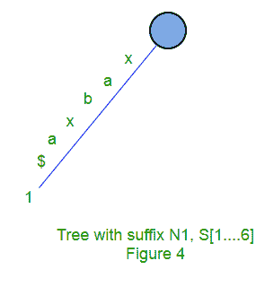

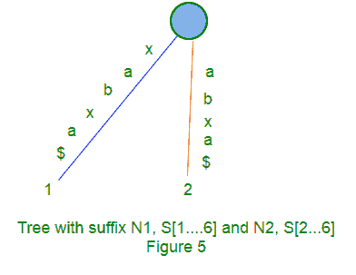

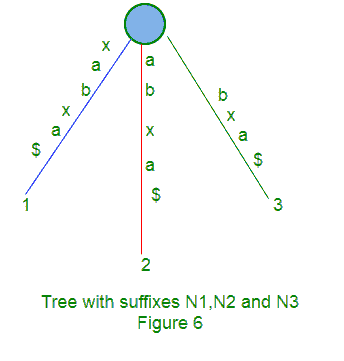

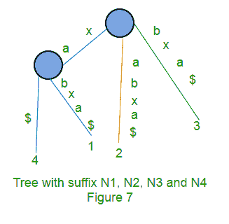

**隐式后缀树**
在使用 Ukkonen 的算法生成后缀树时，我们会根据字符串 s 中的字符，在中间步骤中很少看到隐式后缀树，在隐式后缀树中，不会有带有$(或#或任何其他终止字符)标签的边，也不会有只有一条边从其中出来的内部节点。
从后缀树 S$中获取隐式后缀树，

*   从树的边缘标签中删除所有终端符号$,
*   移除任何没有标签的边
*   移除任何只有一条边的节点，并合并这些边。

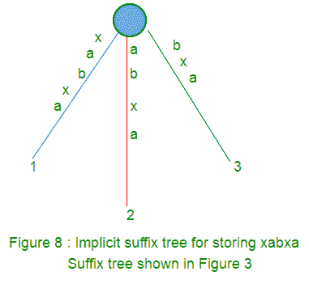

**Ukkonen 算法的高级描述**
Ukkonen 算法为每个前缀 S[l]构造一个隐式后缀树 T i ..长度为米。
首先使用 1 st 字符构建 T 1 ，然后使用 2 nd 字符构建 T 2 ，然后使用 3 rd 字符构建 T 3 ，然后使用 m th 字符构建…Tm。
隐式后缀树 T i +1 建立在隐式后缀树 T i 之上。
S 的真后缀树是由 T m 通过加$。
在任何时候，Ukkonen 的算法都会为目前看到的字符构建后缀树，因此它具有**在线**属性，在某些情况下可能会有用。
所用时间为 O(m)。

Ukkonen 的算法分为 m 个阶段(长度为 m 的字符串中每个字符一个阶段)
在阶段 i+1 中，树 T i +1 由树 T i 构建而成。

每个 i+1 阶段进一步分为 i+1 扩展，每个扩展对应 S[1]的 i+1 后缀..i+1]
在阶段 i+1 的扩展 j 中，算法首先从标有子串 S[j]的根找到路径的末端..我】。
然后，它通过将字符 S(i+1)添加到它的末尾来扩展子串(如果它还不存在的话)。
在一期+1 的延伸段 1 中，我们放入字符串 S[1..我+1]在树上。这里是[1..由于之前的第一阶段，我]将已经出现在树中。我们只需要在树中添加第 S[I+1]个字符(如果还没有的话)。
在 i+1 期的延伸 2 中，我们放入字符串 S[2..我+1]在树上。这是[2..由于之前的第一阶段，i]将已经出现在树中。我们只需要在树中添加第 S[i+1]个字符(如果还没有的话)
在第 I+1 阶段的扩展 3 中，我们将字符串 S[3..我+1]在树上。这是[3..由于之前的第一阶段，我]将已经出现在树中。我们只需要在树中添加第一个字符(如果还没有的话)
。
。
在阶段 i+1 的扩展 i+1 中，我们放入字符串 S[i+1..我+1]在树上。这只是一个可能不在树中的字符(如果到目前为止第一次看到该字符)。如果是这样，我们只需添加一个新的叶子边缘，标签为 S[i+1]。

**高级 Ukkonen 算法**
构造树 T 1
对于 I 从 1 到 m-1 do
开始{ I+1 阶段}
对于 j 从 1 到 i+1
开始{extension j}
从标记为 S[j]的根找到路径的终点..i]在当前树中。
通过添加字符 S[i+l]来扩展该路径，如果它还不在那里
结束；
结束；

后缀扩展就是将下一个字符添加到到到目前为止构建的后缀树中。
在阶段 i+1 的扩展 j 中，算法找到 S[j]的结束..i](由于之前的阶段 I，它已经在树中)，然后它扩展了 S[j..我]为了确定后缀 S[j..i+1]在树上。

有 3 个扩展规则:
**规则 1** :如果路径从根标记为 S[j..i]在叶边缘结束(即 S[i]是叶边缘上的最后一个字符)，然后字符 S[i+1]被添加到该叶边缘上标签的末尾。

**规则 2** :如果从根开始的路径标记为 S[j..i]在非叶边缘结束(即路径上 S[i]之后有更多的字符)，并且下一个字符不是 s[i+1]，则从字符 S[i+1]开始创建一个新的带有标签 s{i+1]和数字 j 的叶边缘。
如果 s[1，还将创建一个新的内部节点..i]在非叶边缘内部(中间)结束。

**规则 3** :如果从根开始的路径标记为 S[j..i]在非叶边缘结束(即路径上 S[i]之后有更多字符)，下一个字符是 s[i+1](已经在树中)，则不执行任何操作。

这里需要注意的一点是，从一个给定的节点(根节点或内部节点)开始，将有一个且只有一个从一个字符开始的边。从同一字符开始，任何节点都不会有多条边。

以下是使用 Ukkonen 算法对字符串 xabxac 进行的一步一步后缀树构造:

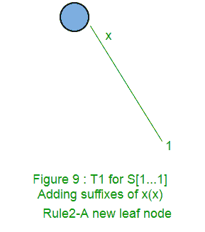

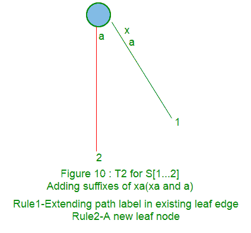

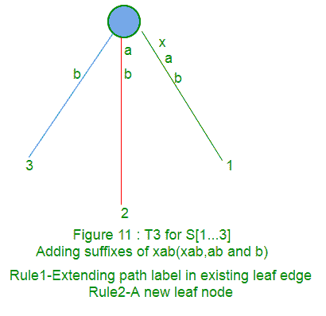

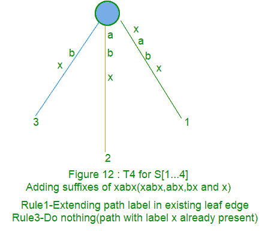

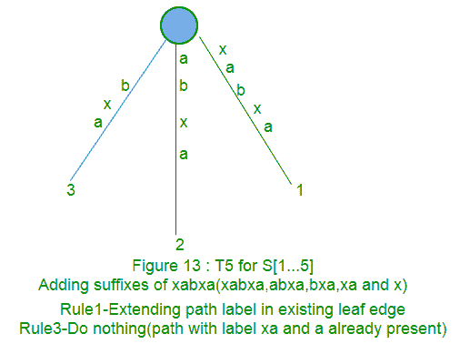

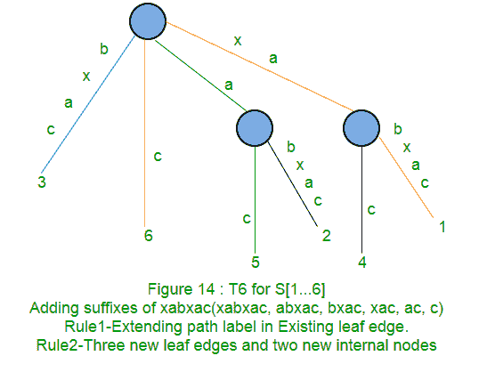

在接下来的部分([第 2 部分](https://www.geeksforgeeks.org/ukkonens-suffix-tree-construction-part-2/)、[第 3 部分](https://www.geeksforgeeks.org/ukkonens-suffix-tree-construction-part-3/)、[第 4 部分](https://www.geeksforgeeks.org/ukkonens-suffix-tree-construction-part-4/)和[第 5 部分](https://www.geeksforgeeks.org/ukkonens-suffix-tree-construction-part-5/))中，我们将讨论后缀链接、活动点、一些技巧，最后是代码实现([第 6 部分](https://www.geeksforgeeks.org/ukkonens-suffix-tree-construction-part-6/))。

**参考文献**:
T3】http://web.stanford.edu/~mjkay/gusfield.pdf

本文由**阿努拉格·辛格**供稿。如果你发现任何不正确的地方，请写评论，或者你想分享更多关于上面讨论的话题的信息