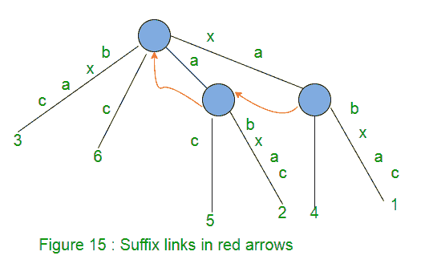
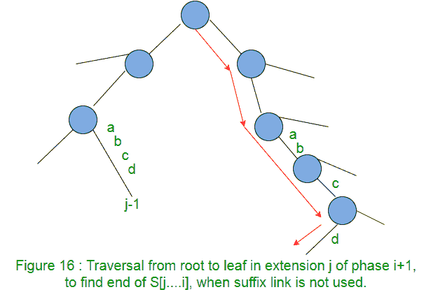
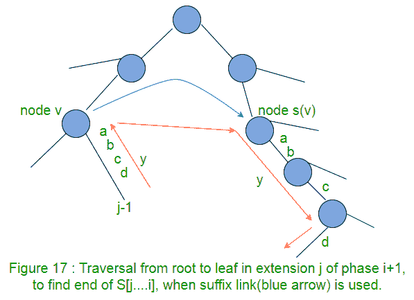
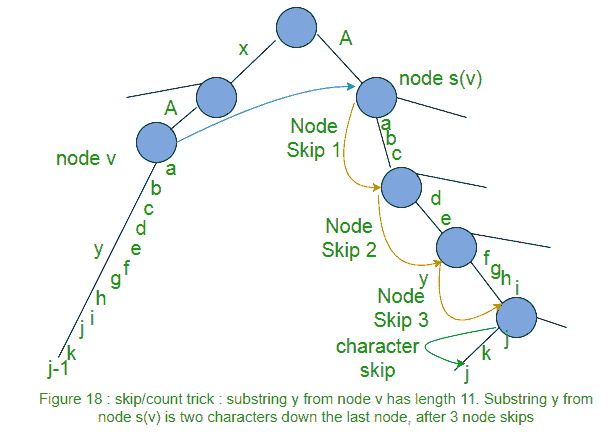
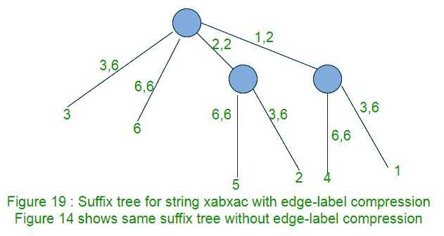

# Ukkonen 的后缀树构造–第 2 部分

> 原文:[https://www . geeksforgeeks . org/ukkonens-后缀-树-构造-part-2/](https://www.geeksforgeeks.org/ukkonens-suffix-tree-construction-part-2/)

在 [Ukkonen 的后缀树构造–第 1 部分](https://www.geeksforgeeks.org/ukkonens-suffix-tree-construction-part-1/ "Ukkonen’s Suffix Tree Construction – Part 1")中，我们看到了高级别的 Ukkonen 算法。本 2 第部分是[第 1 部分](https://www.geeksforgeeks.org/ukkonens-suffix-tree-construction-part-1/ "Ukkonen’s Suffix Tree Construction – Part 1")的延续。
请先浏览[第 1 部分](https://www.geeksforgeeks.org/ukkonens-suffix-tree-construction-part-1/ "Ukkonen’s Suffix Tree Construction – Part 1")，再看当前文章。

在长度为 m 的字符串 S 的后缀树构造中，有 m 个阶段，对于一个阶段 j (1 <= j <= m), we add j第个字符，在到目前为止建立的树中，这是通过 j 扩展来完成的。所有扩展都遵循三个扩展规则之一(在[第 1 部分](https://www.geeksforgeeks.org/ukkonens-suffix-tree-construction-part-1/ "Ukkonen’s Suffix Tree Construction – Part 1")中讨论)。

为了进行阶段 i+1 的第 j 次扩展(添加字符 S[i+1])，我们首先需要从标记为 S[j]的根找到路径的末端..i]在当前树中。一种方法是从根开始，遍历匹配的边..字符串。这将花费 O(m 3 时间来构建后缀树。使用很少的观察和实现技巧，它可以在 O(m)中完成，我们现在将看到这一点。

**后缀链接**
对于路径标签为 xA 的内部节点 v，其中 x 表示单个字符，A 表示(可能为空)子串，如果有另一个路径标签为 A 的节点 s(v)，那么从 v 到 s(v)的指针称为后缀链接。
如果 A 为空字符串，则内部节点的后缀链接将转到根节点。
根节点不会有任何后缀链接(因为它不被认为是内部节点)。

在某一阶段 I 的扩展 j 中，如果添加了一个新的带有路径标签 xA 的内部节点 v，那么在同一阶段 I 的扩展 j+1 中:

*   标记为 A 的路径已经在内部节点结束(如果 A 为空，则为根节点)
*   或将在字符串 A 的末尾创建一个新的内部节点

在同一阶段 I 的扩展 j+1 中，我们将创建一个后缀链接，从 j 第个扩展中创建的内部节点到路径标记为 a 的节点。

因此，在给定的阶段，任何新创建的内部节点(带有路径标签 xA)在下一个扩展结束时都会有一个后缀链接。

在第一阶段之后的任何隐式后缀树 T i 中，如果内部节点 v 具有路径标签 xA，则在 T i 中有一个路径标签为 A 的节点 s(v)，节点 v 将使用后缀链接指向节点 s(v)。

在任何时候，变化树中的所有内部节点都将有从它们到另一个内部节点(或根)的后缀链接，除了最近添加的内部节点，该节点将在下一个扩展结束时接收其后缀链接。

**如何利用后缀链接加快实现？**
在阶段 i+1 的扩展 j 中，我们需要从标记为 S[j]的根找到路径的末端..i]在当前树中。一种方法是从根开始，遍历匹配的边..字符串。后缀链接提供了找到路径终点的捷径。

所以我们可以看到，找到路径 S 的终点【j..我]，我们不需要从根遍历。我们可以从路径 S[j-1]的末端开始..i]，向上走一条边到节点 v(即转到父节点)，沿着后缀链接到 s(v)，然后沿着路径 y 走(在图 17 中这里是 abcd)。
这说明后缀链接的使用是对流程的改进。
注意:在接下来的第 3 部分中，我们将介绍有助于避免“向上走”的 activePoint。我们可以直接从节点 v 转到节点 s(v)。

当存在从节点 v 到节点 s(v)的后缀链接时，如果存在从节点 v 到叶子的标记为字符串 y 的路径，则必须存在从节点 s(v)到叶子的标记为字符串 y 的路径。在图 17 中，从节点 v 到叶子有一个路径标签“abcd”，那么从节点 s(v)到叶子也有一个路径标签“abcd”。
这个事实可以用来改善沿着路径 y 从 s(v)到 leaf 的行走，这被称为“跳过/计数”技巧。

**Skip/Count Trick**
当从节点 s(v)向下走到叶子时，如果边上的字符数小于我们需要行进的字符数，我们可以直接跳到下一个节点，而不是在行进时逐个字符匹配路径。如果边上的字符数多于我们需要行进的字符数，我们直接跳到边上的最后一个字符。
如果实现是这样的，即任何边上的字符数，字符串 S 中给定位置的字符应该在恒定时间内获得，那么跳过/计数技巧将与其上的节点数而不是其上的字符数成比例地向下走。

使用后缀链接和跳过/计数技巧，后缀树可以建立在 O(m 2 中，因为有 m 个相位，每个相位取 O(m)。

**边缘标签压缩**
到目前为止，路径标签都是以字符串形式表示的。这样的后缀树会占用 O(m 2 空间来存储路径标签。为了避免这种情况，我们可以在路径标签的每条边上使用两对索引(开始、结束)，而不是子串本身。索引开始和结束告诉路径标签开始和结束在字符串 s 中的位置。

关于扩展规则在连续扩展和阶段中的交互方式，有两种观察。这两个观察导致了另外两个实现技巧(第一个技巧“跳过/计数”已经在走下去时看到)。

**观察 1:规则 3 是显示停止器**
在第一阶段，有 I 个扩展(1 到 I)要完成。
当规则 3 适用于阶段 i+1 的任何扩展 j(即标记为 S[j..i]以字符 S[i+1]继续)，则它也将应用于相同阶段的所有进一步扩展(即，阶段 i+1 中的扩展 j+1 到 i+1)。那是因为如果路径标为 S[j..i]继续字符 S[i+1]，然后路径标记为 S[j+1]..i]，S[j+2..i]，S[j+3..i]，…，S[i..i]也将继续使用字符 S[i+1]。
考虑应用规则 3 的[第 1 部分](https://www.geeksforgeeks.org/ukkonens-suffix-tree-construction-part-1/ "Ukkonen’s Suffix Tree Construction – Part 1")中的图 11、图 12 和图 13。
在图 11 中，树中添加了“xab”，在图 12(阶段 4)中，我们添加了下一个字符“x”。在这种情况下，完成了 3 个扩展(增加了 3 个后缀)。最后一个后缀“x”已经存在于树中。
在图 13 中，我们在树中添加了字符“a”(阶段 5)。前 3 个后缀添加在树中，最后两个后缀“xa”和“a”已经出现在树中。这表明如果后缀 S[j..i]出现在树中，然后所有剩余的后缀 S[j+1..i]，S[j+2..i]，S[j+3..i]，…，S[i..我]也会出现在树中，不需要添加那些剩余的后缀。
因此，只要规则 3 适用于任何阶段的扩展，就不需要在该阶段做更多的工作。如果在扩展 j 中创建新的内部节点 v，并且规则 3 应用于下一个扩展 j+1，那么我们需要添加从节点 v 到当前节点(如果我们在内部节点上)或根节点的后缀链接。ActiveNode 将在第 3 部分中讨论，在设置后缀链接时会有所帮助。

**一旦规则 3 适用，技巧 2**
停止任何阶段的处理。所有进一步的扩展都已经隐式存在于树中。

**观察 2:一旦一片叶子，永远是一片叶子**
一旦一片叶子被创建并标记为 j(对于从字符串 S 中的位置 j 开始的后缀)，那么在连续的阶段和扩展中，这片叶子将永远是一片叶子。一旦一个叶子被标记为 j，扩展规则 1 将总是应用于所有连续阶段的扩展 j。
参考[第一部分](https://www.geeksforgeeks.org/ukkonens-suffix-tree-construction-part-1/ "Ukkonen’s Suffix Tree Construction – Part 1")中的图 9 至图 14。
在图 10(第 2 阶段)中，规则 1 应用于标记为 1 的叶片。此后，在所有连续阶段中，规则 1 始终应用于此叶。
在图 11(第 3 阶段)中，规则 1 应用于标记为 2 的叶片。此后，在所有连续阶段中，规则 1 始终应用于此叶。
在图 12(第 4 阶段)中，规则 1 应用于标记为 3 的叶片。此后，在所有连续阶段中，规则 1 始终应用于此叶。

在任何阶段 I，都有一个连续扩展的初始序列，其中应用规则 1 或规则 2，然后一旦应用规则 3，阶段 I 就结束。
同样，规则 2 总是创建一个新的叶子(有时是内部节点)。
如果 J i 代表规则 1 或 2 被应用时第一阶段的最后一次扩展(即在 i 第阶段之后，将有 J i 叶子被标记为 1，2，3，…，J i )， 那么 JI<= Ji+1
JI将等于 J i+1 当在 I+1 阶段没有创建新叶时(即规则 3 应用于 J i+1 扩展)
在图 11(第 3 阶段)中，规则 1 应用于前两个扩展，规则 2 应用于第三个扩展，因此这里为 J 没有创建新叶(规则 1 应用于前 3 个扩展，然后规则 3 应用于结束阶段的第 4 个扩展)。 这里 J4= 3 = J3
在图 13(第 5 阶段)中，没有创建新叶(规则 1 应用于前 3 个扩展，然后规则 3 应用于结束该阶段的第 4 个扩展)。这里 J5= 3 = J4
JI会比 J i+1 少，当 i+1 阶段新叶很少的时候。
在图 14(第 6 阶段)中，创建了新叶(规则 1 应用于前 3 个扩展，然后规则 2 应用于结束该阶段的后 3 个扩展)。这里 J 6 = 6 > J 5

所以我们可以看到，在阶段 i+1 中，只有规则 1 将应用于扩展 1 到 J i (这真的不需要太多的工作，可以在恒定时间内完成，这就是技巧 3)，扩展 J i+1 向前，规则 2 可能应用于零个或多个扩展，然后最后是规则 3，结束阶段。
现在使用两个索引(开始、结束)来表示边缘标签，对于任何叶子边缘，结束将总是等于相位号，即对于相位 I，结束= i 对于叶子边缘，对于相位 i+1，结束= i+1 对于叶子边缘。

**技巧 3**
在任何阶段 I，叶子边缘可能看起来像(p，I)，(q，I)，(r，I)，…。其中 p，q，r 是不同边的起始位置，I 是所有边的结束位置。然后在 i+1 阶段，这些叶边缘看起来像(p，i+1)，(q，i+1)，(r，i+1)，…。这样，在每个阶段，所有叶片边缘的末端位置都必须增加。为此，我们需要遍历所有的叶子边缘，并为它们增加结束位置。在恒定时间内做同样的事情，保持一个全局指数 e，e 等于相数。所以现在叶子边缘看起来像(p，e)，(q，e)，(r，e)..在任何阶段，只要增加 e，所有叶片边缘的延伸就会完成。图 19 显示了这一点。

因此，使用后缀链接和技巧 1、2 和 3，可以在线性时间内构建后缀树。

如果一个后缀是另一个后缀的前缀，那么树 Tm 可以是隐式树。所以我们可以先添加一个$ terminal 符号，然后运行算法得到一个真后缀树(一个真后缀树明确包含所有后缀)。为了用相应的后缀起始位置标记每片叶子(所有叶子都标记为全局索引 e)，可以在树上进行线性时间遍历。

至此，我们已经完成了使用 Ukkonen 算法创建后缀树所需了解的大部分内容。在接下来的[第 3 部分](https://www.geeksforgeeks.org/ukkonens-suffix-tree-construction-part-3/ "Ukkonen’s Suffix Tree Construction – Part 3")中，我们将以 string S =“abcabxabcd”为例，一步一步地遍历所有的东西，创建树。在构建树的过程中，我们将讨论更多由活动点解决的实现问题。
我们将继续讨论[第 4 部分](https://www.geeksforgeeks.org/ukkonens-suffix-tree-construction-part-4/ "Ukkonen’s Suffix Tree Construction – Part 4")和[第 5 部分](https://www.geeksforgeeks.org/ukkonens-suffix-tree-construction-part-5/ "Ukkonen’s Suffix Tree Construction – Part 5")中的算法。代码实现将在[第 6 部分](https://www.geeksforgeeks.org/ukkonens-suffix-tree-construction-part-6/ "Ukkonen’s Suffix Tree Construction – Part 6")中讨论。

**参考文献**:
T3】http://web.stanford.edu/~mjkay/gusfield.pdf

本文由**阿努拉格·辛格**供稿。如果您发现任何不正确的地方，或者您想分享更多关于上面讨论的主题的信息，请写评论