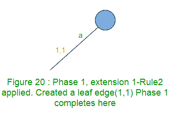
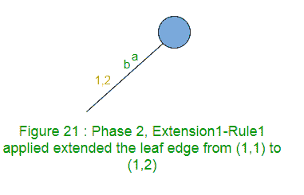
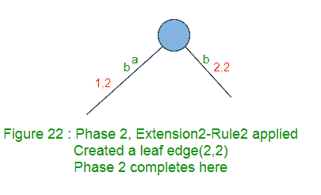
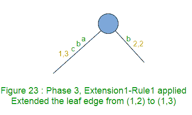
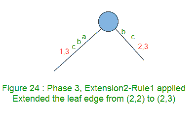
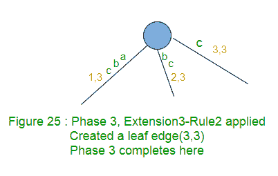
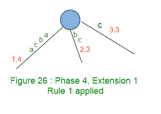
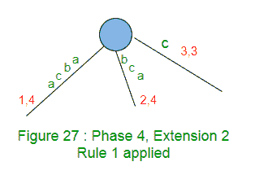
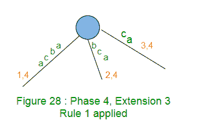
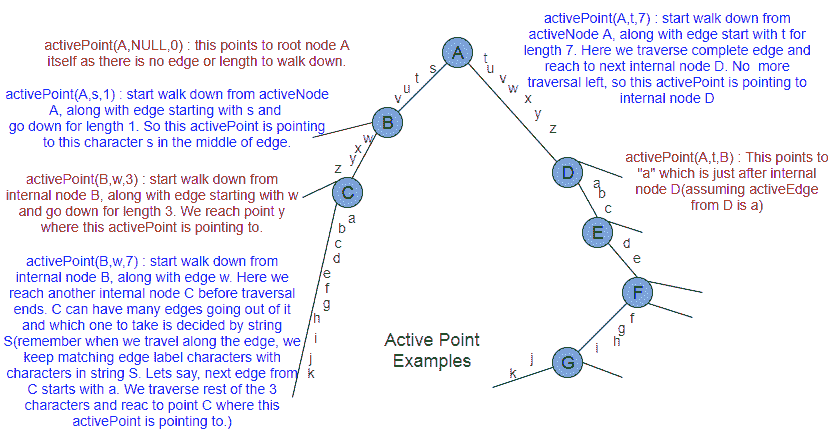

# Ukkonen 的后缀树构造–第 3 部分

> 原文:[https://www . geeksforgeeks . org/ukkonens-后缀-树-构造-part-3/](https://www.geeksforgeeks.org/ukkonens-suffix-tree-construction-part-3/)

本文是以下两篇文章的续篇:
[Ukkonen 的后缀树构造–第 1 部分](https://www.geeksforgeeks.org/ukkonens-suffix-tree-construction-part-1/ "Ukkonen’s Suffix Tree Construction – Part 1")
[Ukkonen 的后缀树构造–第 2 部分](https://www.geeksforgeeks.org/ukkonens-suffix-tree-construction-part-2/ "Ukkonen’s Suffix Tree Construction – Part 2")

请看[第一部分](https://www.geeksforgeeks.org/ukkonens-suffix-tree-construction-part-1/ "Ukkonen’s Suffix Tree Construction – Part 1")和[第二部分](https://www.geeksforgeeks.org/ukkonens-suffix-tree-construction-part-2/ "Ukkonen’s Suffix Tree Construction – Part 2")，在看当前文章之前，我们已经看到了后缀树、高级 ukkonen 算法、后缀链接和三个实现技巧的基础知识。

这里我们将以 string S = "abcabxabcd "为例，一步一步地遍历所有的东西，创建树。
我们将添加$(在[第 1 部分](https://www.geeksforgeeks.org/ukkonens-suffix-tree-construction-part-1/ "Ukkonen’s Suffix Tree Construction – Part 1")中讨论了我们这样做的原因)因此字符串 S 将是“abcabxabcd{content} ”;。

为长度为 m 的字符串 S 构建后缀树时:

*   将有 m 个相位 1 到 m(每个字符一个相位)
    在我们当前的示例中，m 是 11，因此将有 11 个相位。
*   第一阶段将在树中添加第一个字符“a”，第二阶段将在树中添加第二个字符“b”，第三阶段将在树中添加第三个字符“c，……，m th 阶段将在树中添加 m th 字符(这使得 Ukkonen 的算法成为在线算法)
*   每个阶段 I 最多将经历 I 次扩展(从 1 到 I)。如果到目前为止还没有看到当前正在树中添加的字符，所有 I 扩展都将完成(扩展规则 3 在此阶段将不适用)。如果在树中添加的当前字符是以前看到的，那么第一阶段将提前完成(只要扩展规则 3 适用)，而不需要完成所有的扩展
*   有三个扩展规则(1、2 和 3)，任何阶段 I 的每个扩展 j(从 1 到 I)都将遵守这三个规则之一。
*   规则 1 在现有的叶子边缘上添加一个新字符
*   规则 2 创建一个新的叶子边(如果路径标签在边之间结束，也可以创建新的内部节点)
*   规则 3 结束当前阶段(当在被遍历的当前边中找到当前字符时)
*   阶段 1 将从字符串中读取第一个字符，将经过 1 次扩展。
    **(在图中，我们在边缘标签上显示字符只是为了解释，而编写代码时，我们将只使用开始和结束索引–在[第 2 部分](https://www.geeksforgeeks.org/ukkonens-suffix-tree-construction-part-2/ "Ukkonen’s Suffix Tree Construction – Part 2") )**
    扩展 1 中讨论的边缘标签压缩将在树中添加后缀“a”。我们从根开始，用标签“a”遍历路径。没有从根到标签为“a”的路径，所以创建一个叶子边(规则 2)。
    
    阶段 1 随着扩展 1 的完成而完成(因为阶段 1 最多有 I 个扩展)
    对于任何字符串，阶段 1 将只有一个扩展，并且它将始终遵循规则 2。
*   第二阶段将读取第二个字符，将经历至少 1 次和最多 2 次扩展。
    在我们的示例中，阶段 2 将读取第二个字符‘b’。要添加的后缀是“ab”和“b”。
    分机 1 在树中增加后缀“ab”。
    标签‘a’的路径在叶子边缘结束，所以在这个边缘的末端加上‘b’。
    扩展 1 只是在第一条边上将结束索引增加 1(从 1 到 2)(规则 1)。
    
    分机 2 在树中增加后缀“b”。没有从根到标签为“b”的路径，因此创建了一个叶边(规则 2)。
    
    二期随着二期扩建的完成而完成。
    第二阶段在这里经历了两次延伸。规则 1 适用于第一次延期，规则 2 适用于第二次延期。
*   第三阶段将阅读第三个字符，将经历至少 1 个和最多 3 个扩展。
    在我们的示例中，阶段 3 将读取第三个字符‘c’。要添加的后缀是“abc”、“bc”和“c”。
    扩展 1 在树中添加后缀“abc”。
    标签‘ab’的路径在叶子边缘结束，所以在这个边缘的末端加上‘c’。
    扩展 1 只是在这条边上将结束索引增加 1(从 2 到 3)(规则 1)。
    
    分机 2 在树中增加后缀“bc”。
    标签‘b’的路径在叶子边缘结束，所以在这个边缘的末端加上‘c’。
    扩展 2 只是在这条边上将结束索引增加 1(从 2 到 3)(规则 1)。
    
    分机 3 在树中增加后缀“c”。没有从根到标签为“c”的路径，因此创建了一个叶子边(规则 2)。
    
    三期随着三期扩建的完成而完成。
    三期在这里经历了三次延伸。规则 1 适用于前两个扩展，规则 2 适用于第三个扩展。
*   阶段 4 将读取第四个字符，将至少转到 1，最多转到 4 个扩展名。
    在我们的示例中，阶段 4 将读取第四个字符“a”。要添加的后缀是“abca”、“bca”、“ca”和“a”。
    分机 1 在树中增加后缀“abca”。
    标签‘ABC’的路径在叶子边缘结束，所以在这个边缘的末端加上‘a’。
    扩展 1 只是在这条边上将结束索引增加 1(从 3 到 4)(规则 1)。
    
    分机 2 在树中增加后缀“bca”。
    标签‘BC’的路径在叶子边缘结束，所以在这个边缘的末端加上‘a’。
    扩展 2 只是在这条边上将结束索引增加 1(从 3 到 4)(规则 1)。
    
    分机 3 在树中增加后缀“ca”。
    标签‘c’的路径在叶子边缘结束，所以在这个边缘的末端加上‘a’。
    扩展 3 只是在这条边上将结束索引增加 1(从 3 到 4)(规则 1)。
    
    扩展 4 在树中增加后缀“a”。
    树中存在标签“a”的路径。不需要更多的工作，第 4 阶段到此结束(规则 3 和技巧 2)。这是隐式后缀树的一个例子。在这里，后缀“a”不是显式可见的(因为它不会在叶子边缘结束)，而是隐式存在于树中。所以扩展 4 后树结构没有变化。它将保持如上图 28 所示。
    扩展 4 时，规则 3 一应用，阶段 4 就完成。
    第四阶段在这里经历了四次延伸。规则 1 适用于前三次延期，规则 3 适用于第四次延期。

现在我们将看到一些观察结果以及如何实现这些观察结果。

1.  在任何阶段 I 结束时，最多有 I 个叶边(如果到目前为止还没有看到第 i 个字符，那么将会有 I 个叶边，否则将会有少于 I 个叶边)。
    例如，在我们的例子中的阶段 1、2 和 3 之后，分别有 1、2 和 3 个叶边缘，但是在阶段 4 之后，只有 3 个叶边缘(不是 4)。
2.  完成第一阶段后，所有叶子边的“结束”索引都是 I。我们如何在代码中实现这一点？我们是否需要迭代所有这些扩展，通过从根到叶的遍历找到叶边，并增加“结束”索引？答案是“否”。
    为此，我们将维护一个全局变量(比如说“end”)，我们将只递增这个全局变量“END”，并且所有叶边缘 END 索引都将指向这个全局变量。这样，如果在阶段 I 之后有 j 个叶边，那么在阶段 i+1 中，第一个 j 个扩展(1 到 j)将通过将变量“END”递增 1 来完成(END 将是 i+1)。
    这里我们刚刚实现了技巧 3–**一次一片叶子，永远一片叶子**。这个技巧使用规则 1 在任何阶段的恒定时间内处理所有的 j 个叶边缘(即扩展 1 到 j)。规则 1 不适用于同一阶段的后续扩展。这可以在我们上面讨论的四个阶段中得到验证。如果规则 1 适用于任何阶段，它只适用于最初的几个连续阶段(比如 1 到 j)。一旦规则 2 或规则 3 在给定阶段被应用，规则 1 就不会在该阶段应用。
3.  In the example explained so far, in each extension (where trick 3 is not applied) of any phase to add a suffix in tree, we are traversing from root by matching path labels against the suffix being added. If there are j leaf edges after phase i, then in phase i+1, first j extensions will follow Rule 1 and will be done in constant time using trick 3\. There are i+1-j extensions yet to be performed. For these extensions, which node (root or some other internal node) to start from and which path to go? Answer to this depends on how previous phase i is completed.
    If previous phase i went through all the i extensions (when ith character is unique so far), then in next phase i+1, trick 3 will take care of first i suffixes (the i leaf edges) and then extension i+1 will start from root node and it will insert just one character [(i+1)th] suffix in tree by creating a leaf edge using Rule 2.
    If previous phase i completes early (and this will happen if and only if rule 3 applies – when ith character is already seen before), say at jth extension (i.e. rule 3 is applied at jth extension), then there are j-1 leaf edges so far.
    We will state few more facts (which may be a repeat, but we want to make sure it’s clear to you at this point) here based on discussion so far:
    *   *阶段 1 从规则 2 开始，所有其他阶段从规则 1* 开始
    *   *任何阶段以规则 2 或规则 3* 结束
    *   *任何阶段 I 都可能经历一系列 j 个扩展(1 < = j < = i)。在这些 j 扩展中，第一个 p (0 < = p < i)扩展将遵循规则 1，下一个 q (0 < = q < = i-p)扩展将遵循规则 2，下一个 r (0 < = r < = 1)扩展将遵循规则 3。规则 1、规则 2 和规则 3 的应用顺序在一个阶段中是永远不会混合的。它们按照数量的顺序应用(如果有应用的话)，即在一个阶段中，规则 1 首先应用，然后规则 2，然后规则 3*
    *   *在第一阶段，p + q + r < = i*
    *   *在任何阶段 I 结束时，将有 p+q 个叶边缘，下一阶段 i+1 将通过规则 1 进行第一个 p+q 个扩展*

    在下一阶段 i+1 中，技巧 3(规则 1)将处理第一个 j-1 后缀(j-1 叶边)，然后扩展 j 将从我们将在树中添加第 j 个后缀的地方开始。为此，我们需要找到最佳匹配边，然后在该边的末尾添加新字符。如何找到最佳匹配边的终点？我们是否需要从根节点开始遍历并匹配树的边缘来匹配一个字符接一个字符地添加的 j th 后缀？这需要时间，并且整个算法不是线性的。主动点来拯救这里。
    在之前的第一阶段，当 j 第次扩展时，路径遍历在一个点(可能是内部节点或边缘中间的某个点)结束，在该点，已经在树中找到了要添加的 i 第个字符，并且应用了规则 3，第一阶段+1 的 j 第次扩展将从同一个点开始，我们开始将路径与(i+1) 第个字符进行匹配。基于在先前扩展中完成的遍历中获得的知识，activePoint 有助于避免任何扩展中不必要的根路径遍历。在应用规则 1 的 1 st p 扩展中不需要遍历。遍历是在应用规则 2 或规则 3 的地方完成的，这就是活动点告诉遍历的起始点，在那里我们将路径与树中添加的当前字符进行匹配。实现的方式是，在我们需要遍历的任何扩展中，活动点已经被设置到正确的位置(下面讨论的一个例外情况 **APCFALZ** )并且在当前扩展结束时，我们将活动点重置为 apprppriate，以便下一个需要遍历的扩展(相同阶段或下一阶段)活动点已经指向正确的位置。

    **活动点**:这可以是根节点、任何内部节点或边中间的任何点。这是任何扩展中遍历的起点。对于第一阶段的第一次扩展，活动点被设置为根。其他扩展将通过之前的扩展获得正确的活动点设置(有一个例外情况 **APCFALZ** 将在下面讨论)，当前扩展有责任在最后适当地重置活动点，以便在下一个应用规则 2 或规则 3 的扩展中使用(相同或下一阶段)。
    要做到这一点，我们需要一种存储活动点的方法。我们将使用三个变量来存储它:**活动节点**、**活动边缘**、**活动长度**。
    **活动节点**:可以是根节点，也可以是内部节点。
    **activeEdge** :当我们在根节点或者内部节点上，需要向下走的时候，需要知道选择哪条边。活动边缘将存储该信息。在这种情况下，活动节点本身是遍历开始的点，那么活动边缘将被设置为下一阶段处理的下一个字符。
    **activeLength** :这个告诉我们需要从 activeNode 往下走(在 activeEdge 表示的路径上)多少个字符才能到达遍历开始的 activePoint。在这种情况下，活动节点本身就是遍历的起点，那么活动长度将为零。
    
    在第一阶段之后，如果有 j 个叶边，那么在第一阶段+1 中，第一个 j 个扩展将通过技巧 3 来完成。从 j+1 到 i+1 的扩展将需要 activePoint，并且根据前一个扩展的结束点，activePoint 可能会也可能不会在两个扩展之间改变。

    **扩展规则 3 (APCFER3)** 的活动点更改:当规则 3 适用于任何阶段 I 时，那么在我们进入下一阶段 i+1 之前，我们将活动长度增加 1。活动节点和活动边缘没有变化。为什么呢？因为在规则 3 的情况下，来自字符串 S 的当前字符在由当前活动点表示的相同路径上匹配，所以对于下一个活动点，活动节点和活动边缘保持不变，只有活动长度增加 1(因为当前阶段匹配的字符)。这个新的活动点(相同的节点、相同的边和递增的长度)将在阶段 i+1 中使用。

    **向下行走(APCFWD)** 的活动点更改:活动点可能会根据应用的扩展规则在扩展结束时更改。在扩展过程中，当我们走下去时，活动点也可能改变。让我们考虑上面的活动点示例图中的活动点 is (A，s，11)。如果这是某个扩展开始时的活动点，那么当从活动节点 A 往下走时，会看到其他内部节点。任何时候，如果我们在走下去的时候遇到一个内部节点，这个节点就会变成活动节点(它会适当地改变活动边和活动长度，这样新的活动点就代表了与前面相同的点)。在这个向下走的过程中，下面是活动点的变化顺序:
    (A，s，11) — > > > (B，w，7)—>>>(C，A，3)
    以上三个活动点都是指同一个点‘C’
    我们再举一个例子。
    如果 activePoint 是(D，a，11)在一个扩展的开始，那么当往下走的时候，下面是 activePoint 的变化顺序:
    (D，a，10) — > > > (E，D，7) — > > > (F，F，5) — > > (G，j，1)
    以上所有的 activePoints 指的是同一个点‘k’。
    如果活动点是(A，s，3)、(A，t，5)、(B，w，1)、(D，A，2)等，当向下走时没有内部节点挡道，那么 APCFWD 的活动点不会有变化。
    想法是，在任何时候，离我们想要到达的点最近的内部节点应该是活动点。为什么呢？这将在下一个扩展中最小化遍历的长度。

    **活动长度 ZERO (APCFALZ)** 的活动点更改:让我们考虑上面活动点示例图中的一个活动点(A，s，0)。假设从字符串 S 中处理的当前字符是“x”(或任何其他字符)。在扩展开始时，当活动长度为零时，活动边缘被设置为当前正在处理的字符，即“x”，因为这里不需要向下走(因为活动长度为零)，所以我们寻找的下一个字符是当前正在处理的字符。

4.  在代码实现时，我们将逐个遍历字符串 S 的所有字符。第 i 个字符的每个循环将执行第 I 阶段的处理。循环将运行一次或多次，具体取决于还有多少扩展需要执行(请注意，在第 i+1 阶段，我们实际上不必显式执行所有 i+1 扩展，因为技巧 3 将处理来自前一阶段的所有 j 个叶边缘的 j 个扩展)。我们将使用变量 **remainingSuffixCount** ，来跟踪在任何阶段(特技 3 执行后)还有多少扩展需要显式执行。此外，在任何阶段结束时，如果 remainingSuffixCount 为 ZERO，这表明所有应该添加到树中的后缀都被显式添加并出现在树中。如果 remainingSuffixCount 在任何阶段结束时都是非零的，这就表明许多计数的后缀没有显式地添加到树中(因为规则 3，我们提前停止了)，但是它们隐式地添加到树中(这种树被称为隐式后缀树)。当一个独特的字符出现时，这些隐式后缀将在后续阶段显式添加。

我们将在[第 4 部分](https://www.geeksforgeeks.org/ukkonens-suffix-tree-construction-part-4/ "Ukkonen’s Suffix Tree Construction – Part 4")和[第 5 部分](https://www.geeksforgeeks.org/ukkonens-suffix-tree-construction-part-5/ "Ukkonen’s Suffix Tree Construction – Part 5")继续讨论。代码实现将在[第 6 部分](https://www.geeksforgeeks.org/ukkonens-suffix-tree-construction-part-6/ "Ukkonen’s Suffix Tree Construction – Part 6")中讨论。

**参考文献**:
[http://web.stanford.edu/~mjkay/gusfield.pdf](http://web.stanford.edu/~mjkay/gusfield.pdf)
[Ukkonen 的后缀树算法通俗地说](http://stackoverflow.com/questions/9452701/ukkonens-suffix-tree-algorithm-in-plain-english)

本文由**阿努拉格·辛格**供稿。如果您发现任何不正确的地方，或者您想分享更多关于上面讨论的主题的信息，请写评论