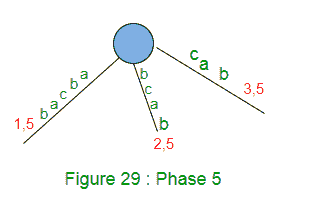
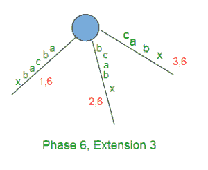
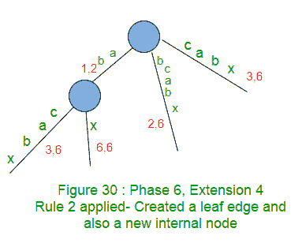
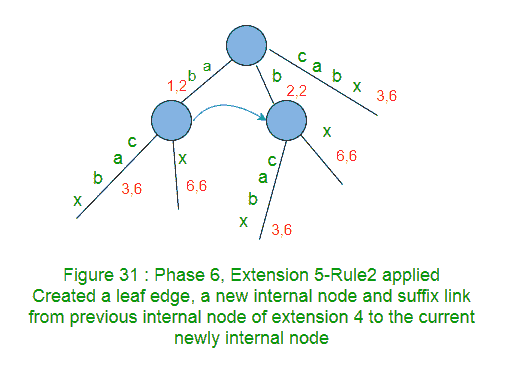
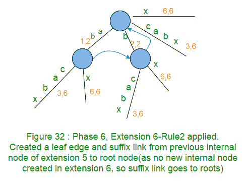

# Ukkonen 的后缀树构造–第 4 部分

> 原文:[https://www . geeksforgeeks . org/ukkonens-后缀-树-构造-part-4/](https://www.geeksforgeeks.org/ukkonens-suffix-tree-construction-part-4/)

本文是以下三篇文章的续篇:
[Ukkonen 的后缀树构造–第 1 部分](https://www.geeksforgeeks.org/ukkonens-suffix-tree-construction-part-1/ "Ukkonen’s Suffix Tree Construction – Part 1")
[Ukkonen 的后缀树构造–第 2 部分](https://www.geeksforgeeks.org/ukkonens-suffix-tree-construction-part-2/ "Ukkonen’s Suffix Tree Construction – Part 2")
[Ukkonen 的后缀树构造–第 3 部分](https://www.geeksforgeeks.org/ukkonens-suffix-tree-construction-part-3/ "Ukkonen’s Suffix Tree Construction – Part 3")

请看[第 1 部分](https://www.geeksforgeeks.org/ukkonens-suffix-tree-construction-part-1/ "Ukkonen’s Suffix Tree Construction – Part 1")、[第 2 部分](https://www.geeksforgeeks.org/ukkonens-suffix-tree-construction-part-2/ "Ukkonen’s Suffix Tree Construction – Part 2")和[第 3 部分](https://www.geeksforgeeks.org/ukkonens-suffix-tree-construction-part-3/ "Ukkonen’s Suffix Tree Construction – Part 3")，在看当前文章之前，我们在这里看到了一些关于后缀树的基础知识、高级 ukkonen 的算法、后缀链接和三个实现技巧以及关于 activePoint 的一些细节，还有一个示例字符串“abcabxabcd”，我们在这里经历了构建后缀树的四个阶段。

让我们重温一下我们已经在[第 3 部分](https://www.geeksforgeeks.org/ukkonens-suffix-tree-construction-part-3/ "Ukkonen’s Suffix Tree Construction – Part 3")中看到的四个阶段，分别是技巧 2、技巧 3 和活动点。

*   activePoint 被初始化为(root，NULL，0)，即 activeNode 是 root，activeEdge 是 NULL(为了便于理解，我们给 activeEdge 赋予了字符值，但是在代码实现中，它将是字符的索引)并且 activeLength 是 ZERO。
*   全局变量 END 和 remainingSuffixCount 被初始化为零

*********************第 1 阶段**************************第 1 阶段
我们从字符串 S 中读取 1 st 字符(a)**

*   将 END 设置为 1
*   将 remainingSuffixCount 增加 1(此处 remainingSuffixCount 将为 1，即还有 1 个扩展需要执行)
*   如下所示运行一个循环 remainingSuffixCount 次(即一次):
    *   如果活动长度为零，则将活动边缘设置为当前字符(此处活动边缘为“a”)。这里是 **APCFALZ** 。
    *   检查活动边缘是否有边缘从活动节点(在此阶段 1 中是根节点)出去。如果没有，创建一个叶片边缘。如果有，走下去。在我们的例子中，叶边缘被创建(规则 2)。
    *   执行扩展后，将 remainingSuffixCount 减 1
    *   此时，活动点为(根，a，0)

在阶段 1 结束时，remainingSuffixCount 为零(所有后缀都显式添加)。
第 3 部分中的图 20 是第 1 阶段后的结果树。

*********************第 2 阶段****************************第 2 阶段
我们从字符串 S 中读取 2 nd 字符(b)**

*   将 END 设置为 2(这将执行扩展 1)
*   将 remainingSuffixCount 增加 1(此处 remainingSuffixCount 将为 1，即还有 1 个扩展需要执行)
*   如下所示运行一个循环 remainingSuffixCount 次(即一次):
    *   如果活动长度为零，则将活动边缘设置为当前字符(此处活动边缘为“b”)。这里是 **APCFALZ** 。
    *   检查活动边缘是否有边缘从活动节点(在第 2 阶段是根节点)出去。如果没有，创建一个叶片边缘。如果有，走下去。在我们的例子中，叶边缘被创建。
    *   执行扩展后，将 remainingSuffixCount 减 1
    *   此时，活动点为(根，b，0)

在阶段 2 结束时，remainingSuffixCount 为零(所有后缀都显式添加)。
第 3 部分中的图 22 是第 2 阶段后的结果树。

*********************第三期****************************第三期
我们从字符串 S 中读取 3 rd 字符(c)**

*   将 END 设置为 3(这将执行扩展 1 和 2)
*   将 remainingSuffixCount 增加 1(此处 remainingSuffixCount 将为 1，即还有 1 个扩展需要执行)
*   如下所示运行一个循环 remainingSuffixCount 次(即一次):
    *   如果活动长度为零，则将活动边缘设置为当前字符(此处活动边缘为“c”)。这里是 **APCFALZ** 。
    *   检查活动边缘是否有边缘从活动节点(在第 3 阶段中是根节点)出去。如果没有，创建一个叶片边缘。如果有，走下去。在我们的例子中，叶边缘被创建。
    *   执行扩展后，将 remainingSuffixCount 减 1
    *   此时，活动点为(根，c，0)

在第 3 阶段结束时，remainingSuffixCount 为零(所有后缀都显式添加)。
第 3 部分中的图 25 是第 3 阶段后的结果树。

*********************第 4 阶段****************************第 4 阶段
我们从字符串 S 中读取 4 第字符(a)**

*   将 END 设置为 4(这将执行扩展 1、2 和 3)
*   将 remainingSuffixCount 增加 1(此处 remainingSuffixCount 将为 1，即还有 1 个扩展需要执行)
*   如下所示运行一个循环 remainingSuffixCount 次(即一次):
    *   如果活动长度为零，则将活动边缘设置为当前字符(此处活动边缘为“a”)。这里是 **APCFALZ** 。
    *   检查活动边缘是否有边缘从活动节点(在第 3 阶段中是根节点)出去。如果没有，创建一个叶片边缘。如果有，走下去(技巧 1–跳过/计数)。在我们的示例中，边“a”出现在活动节点(即根)之外。不需要走下作为活动长度< edgeLength. We increment activeLength from zero to 1 ( **APCFER3** )并停止任何进一步的处理(规则 3)。
    *   此时，活动点为(根，a，1)，并且 remainingSuffixCount 保持设置为 1(没有变化)

在阶段 4 结束时，remainingSuffixCount 为 1(最后一个后缀“a”在树中没有显式添加，但在树中隐式添加)。
第 3 部分中的图 28 是第 4 阶段后的结果树。

重游完成了 1 st 四个阶段，我们将继续建造这棵树，看看进展如何。

*********************第 5 期****************************第 5 期
我们从字符串 S 中读出第 5 第字符(b)**

*   将 END 设置为 5(这将进行扩展 1、2 和 3)。见下图 29。
*   将 remainingSuffixCount 增加 1 (remainingSuffixCount 在这里将是 2，即还有 2 个扩展需要执行，它们是扩展 4 和 5。扩展 4 应该添加后缀“ab”，扩展 5 应该在树中添加后缀“b”)
*   如下所示运行一个循环 remainingSuffixCount 次(即两次):
    *   检查活动边缘是否有边缘从活动节点(在第 3 阶段中是根节点)出去。如果没有，创建一个叶片边缘。如果有，走下去。在我们的示例中，边“a”出现在活动节点(即根)之外。
    *   如有必要，走下去(技巧 1–跳过/计数)。在当前阶段 5，不需要向下移动，因为活动长度
    *   检查字符串 S 的当前字符(即“b”)是否已经出现在活动点之后。如果是，则不再处理(规则 3)。在我们的例子中也是如此，所以我们将活动长度从 1 增加到 2 ( **APCFER3** )并在此停止(规则 3)。
    *   此时，活动点为(根，a，2)，并且 remainingSuffixCount 保持设置为 2(remainingSuffixCount 不变)

第 5 阶段结束时，remainingSuffixCount 为 2(后两个后缀‘ab’和‘b’不是显式添加在树中，而是隐式添加在树中)。

*******************第 6 阶段******************************第 6 阶段
我们从字符串 S 中读取第 6 个第字符(x)**

*   将 END 设置为 6(这将进行扩展 1、2 和 3)
    
*   将 remainingSuffixCount 增加 1 (remainingSuffixCount 在这里将为 3，即还有 3 个扩展需要执行，分别是后缀“abx”、“bx”和“x”的扩展 4、5 和 6)
*   如下所示，运行一个循环 remainingSuffixCount 次(即三次):
    *   而扩展 4，活动点是(根，a，2)，它指向从“a”开始的边上的“b”。
    *   在扩展规则 4 中，字符串 S 中的当前字符“x”与 activePoint 之后的下一个字符不匹配，因此这是扩展规则 2 的情况。因此，这里创建了一个带有边缘标签 x 的叶子边缘。此外，遍历在一个边缘的中间结束，因此在活动点的末端也创建了一个新的内部节点。
    *   在树中添加后缀“abx”时，将 remainingSuffixCount 减 1(从 3 到 2)。

现在活动点在应用规则 2 后会改变。其他三种情况( **APCFER3** 、 **APCFWD** 和 **APCFALZ** )活动点发生变化，已经在[第 3 部分](https://www.geeksforgeeks.org/ukkonens-suffix-tree-construction-part-3/ "Ukkonen’s Suffix Tree Construction – Part 3")中讨论过。

**扩展规则 2 (APCFER2)的活动点更改:**
**情况 1 (APCFER2C1):** 如果活动节点是根节点且活动长度大于零，则活动长度减 1，活动边缘将设置为“S[I–remainingSuffixCount+1]”，其中 I 为当前相号。你能看出为什么在活动点会有这种变化吗？再看一下我们刚才讨论的第 6 阶段(i=6)的当前扩展，我们在其中添加了后缀“abx”。活动长度为 2，活动边缘为“a”。现在在下一个扩展中，我们需要在树中添加后缀“bx”，即下一个扩展中的路径标签应该以‘b’开头。因此‘b’(字符串 S 中的第 5 个字符)应该是下一个扩展的活动边，b 的索引将是“I–remainingSuffixCount+1”(6–2+1 = 5)。活动长度递减 1，因为活动点在每次扩展后都会以长度 1 更接近根。
如果活动节点是根节点，活动长度为零，会发生什么情况？本案已经由 **APCFALZ** 处理。

**情况 2 (APCFER2C2):** 如果活动节点不是根，则跟随当前活动节点的后缀链接。后缀链接指向的新节点(可以是根节点或另一个内部节点)将是下一个扩展的活动节点。活动长度和活动边缘没有变化。你能看出为什么在活动点会有这种变化吗？这是因为:如果两个节点通过后缀链接连接，那么从这两个节点开始的所有路径上的标签都将完全相同，因此对于这些路径上的两个对应的相似点，活动边缘和活动长度将相同，这两个节点将是活动节点。参见[第二部分](https://www.geeksforgeeks.org/ukkonens-suffix-tree-construction-part-2/ "Ukkonen’s Suffix Tree Construction – Part 2")中的图 18。假设在第一阶段和扩展 j 中，在树中添加了后缀“xAabcdedg”。在这一点上，我们假设活动点是(节点-五，一，七)，即点“g”。因此，对于下一个扩展 j+1，我们将添加后缀‘Aabcdefg’，为此，我们需要遍历图 18 所示的 2 和路径。这可以通过跟随当前活动节点 v 的后缀链接来实现。后缀链接将我们带到要穿过的路径，该路径位于[节点 s(v)]之间的某个位置，在该位置之下，路径与先前活动节点 v 之下的路径完全相同。如前所述，“活动点在每次扩展后都以长度 1 接近根”，这种长度的减少将发生在节点 s(v)之上，但在 s(v)之下，完全没有变化。因此，当活动节点不是当前扩展的根节点时，对于下一个扩展，只有活动节点发生变化(活动边和活动长度没有变化)。

*   此时在扩展 4 中，当前活动点是(根，a，2)，基于 **APCFER2C1** ，下一个扩展 5 的新活动点将是(根，b，1)
*   下一个要添加的后缀是“bx”(带有 remainingSuffixCount 2)。
*   字符串 S 中的当前字符“x”与 activePoint 后边缘的下一个字符不匹配，因此这是扩展规则 2 的情况。因此，这里创建了一个带有边缘标签 x 的叶子边缘。此外，遍历在一个边缘的中间结束，因此在活动点的末端也创建了一个新的内部节点。
    后缀链接也是从以前的内部节点(扩展 4)创建到当前扩展 5 中创建的新内部节点。
*   在树中添加后缀“bx”时，将 remainingSuffixCount 减 1(从 2 到 1)。

*   在扩展 5 的这一点上，当前的活动点是(根，b，1)并且基于 **APCFER2C1** 下一个扩展 6 的新活动点将是(根，x，0)
*   下一个要添加的后缀是“remainingSuffixCount 为 1)。
*   在下一个扩展 6 中，字符 x 将不匹配根节点的任何现有边，因此将从根节点创建一个带有标签 x 的新边。来自前一个扩展的内部节点的后缀链接也指向根(因为在当前扩展 6 中没有创建新的内部节点)。
*   在树中添加后缀“x”时，将 remainingSuffixCount 减 1(从 1 到 0)

这就完成了第 6 阶段。
请注意，第 6 阶段已经完成了它的所有 6 个扩展(为什么？因为到目前为止还没有在字符串中看到当前的字符 c，所以阻止进一步扩展的规则 3 在阶段 6 中从未得到应用的机会)，因此阶段 6 之后生成的树是一个真正的后缀树(即，不是一个隐式树)，用于到目前为止读取的字符“abcabx ”,并且它在树中显式地具有所有后缀。

在构建上面的树时，注意到以下事实:

*   扩展 I 中新创建的内部节点通过后缀链接(每个内部节点必须有一个指向另一个内部节点或根的后缀链接)在扩展 i+1 的末尾指向另一个内部节点或根(如果活动节点是扩展 i+1 中的根)
*   后缀链接在搜索下一个后缀的路径标签结尾时提供捷径
*   通过正确跟踪扩展/阶段之间的活动点，可以避免不必要的从根走下来。

我们将在[第 5 部分](https://www.geeksforgeeks.org/ukkonens-suffix-tree-construction-part-5/ "Ukkonen’s Suffix Tree Construction – Part 5")中完成剩下的阶段(7 到 11)，并完全构建树，之后，我们将在[第 6 部分](https://www.geeksforgeeks.org/ukkonens-suffix-tree-construction-part-6/ "Ukkonen’s Suffix Tree Construction – Part 6")中看到算法的代码。

**参考文献**:
[http://web.stanford.edu/~mjkay/gusfield.pdf](http://web.stanford.edu/~mjkay/gusfield.pdf)
[Ukkonen 的后缀树算法通俗地说](http://stackoverflow.com/questions/9452701/ukkonens-suffix-tree-algorithm-in-plain-english)

本文由**阿努拉格·辛格**供稿。如果您发现任何不正确的地方，或者您想分享关于上面讨论的主题的更多信息，请写评论