# Ukkonen 的后缀树构造–第 5 部分

> 原文:[https://www . geeksforgeeks . org/ukkonens-后缀-树-构造-part-5/](https://www.geeksforgeeks.org/ukkonens-suffix-tree-construction-part-5/)

本文是以下四篇文章的续篇:
[Ukkonen 的后缀树构造–第一部分](https://www.geeksforgeeks.org/ukkonens-suffix-tree-construction-part-1/ "Ukkonen’s Suffix Tree Construction – Part 1")
[Ukkonen 的后缀树构造–第二部分](https://www.geeksforgeeks.org/ukkonens-suffix-tree-construction-part-2/ "Ukkonen’s Suffix Tree Construction – Part 2")
[Ukkonen 的后缀树构造–第三部分](https://www.geeksforgeeks.org/ukkonens-suffix-tree-construction-part-3/ "Ukkonen’s Suffix Tree Construction – Part 3")
[Ukkonen 的后缀树构造–第四部分](https://www.geeksforgeeks.org/ukkonens-suffix-tree-construction-part-4/ "Ukkonen’s Suffix Tree Construction – Part 4")

请看[第 1 部分](https://www.geeksforgeeks.org/ukkonens-suffix-tree-construction-part-1/ "Ukkonen’s Suffix Tree Construction – Part 1")、[第 2 部分](https://www.geeksforgeeks.org/ukkonens-suffix-tree-construction-part-2/ "Ukkonen’s Suffix Tree Construction – Part 2")、[第 3 部分](https://www.geeksforgeeks.org/ukkonens-suffix-tree-construction-part-3/ "Ukkonen’s Suffix Tree Construction – Part 3")和[第 4 部分](https://www.geeksforgeeks.org/ukkonens-suffix-tree-construction-part-4/ "Ukkonen’s Suffix Tree Construction – Part 4")，在看当前文章之前，我们已经看到了几个关于后缀树的基础知识、高级 ukkonen 的算法、后缀链接和三个实现技巧以及关于 activePoint 的一些细节，还有一个示例字符串“abcabxabcd”，我们经历了构建后缀树的六个阶段。
在这里，我们将完成其余阶段(7 到 11)并完全构建树。

*******************第 7 期******************************第 7 期
我们从字符串 S 中读出第 7 第字符(a)**

*   将 END 设置为 7(这将进行扩展 1、2、3、4、5 和 6)——因为到上一阶段 6 结束时为止，我们有 6 个叶边缘。

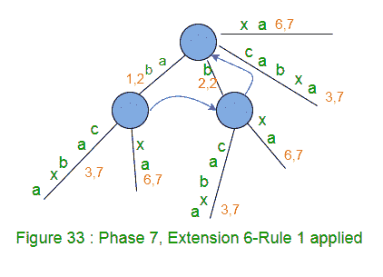

*   将 remainingSuffixCount 增加 1 (remainingSuffixCount 在这里将为 1，即只剩下 1 个扩展需要执行，也就是后缀“a”的扩展 7)
*   如下所示运行一个循环 remainingSuffixCount 次(即一次):
    *   如果活动长度为零[前一阶段的活动点为(根，x，0)]，则将活动边缘设置为当前字符(此处活动边缘为“a”)。这里是 **APCFALZ** 。现在，活动点变成(根，“a”，0)。
    *   检查活动边缘是否有边缘从活动节点(在第 7 阶段中是根节点)出去。如果没有，创建一个叶片边缘。如果有，走下去。在我们的示例中，边“a”出现在活动节点(即根)之外，这里我们将活动长度从零增加到 1 ( **APCFER3** )并停止任何进一步的处理。
    *   此时，活动点为(根，a，1)，并且 remainingSuffixCount 保持设置为 1(没有变化)

在第 7 阶段结束时，remainingSuffixCount 为 1(最后一个后缀“a”没有在树中显式添加，但在树中隐式添加)。
上图 33 是第 7 阶段后的结果树。

*********************第 8 阶段****************************第 8 阶段
我们从字符串 S 中读取第 8 第字符(b)**

*   将 END 设置为 8(这将完成扩展 1、2、3、4、5 和 6)——因为到上一阶段 7 结束时为止，我们已经有了 6 个叶边(图 34)。

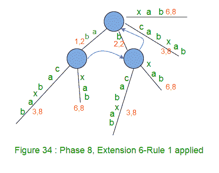

*   将 remainingSuffixCount 增加 1 (remainingSuffixCount 在这里将为 2，即还有两个扩展需要执行，分别是后缀“ab”和“b”的扩展 7 和 8)
*   如下所示运行一个循环 remainingSuffixCount 次(即两次):
    *   检查活动边缘是否有边缘从活动节点(在第 8 阶段中是根节点)出去。如果没有，创建一个叶片边缘。如果有，走下去。在我们的示例中，边“a”出现在活动节点(即根)之外。
    *   如有必要，走下去(技巧 1–跳过/计数)。在当前阶段 8，由于活动长度
    *   检查字符串 S 的当前字符(即“b”)是否已经出现在活动点之后。如果是，则不再处理(规则 3)。在我们的例子中也是如此，所以我们将活动长度从 1 增加到 2 ( **APCFER3** )并在此停止(规则 3)。
    *   此时，活动点为(根，a，2)，并且 remainingSuffixCount 保持设置为 2(remainingSuffixCount 不变)

在第 8 阶段结束时，remainingSuffixCount 为 2(后两个后缀“ab”和“b”不是显式添加到树中，而是隐式添加到树中)。

*******************第 9 期******************************第 9 期
我们从字符串 S 中读出第 9 第字符(c)**

*   将 END 设置为 9(这将进行扩展 1、2、3、4、5 和 6)——因为到上一阶段 8 结束时为止，我们有 6 个叶边缘。

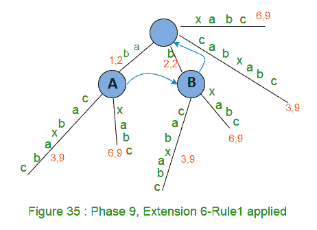

*   将 remainingSuffixCount 增加 1 (remainingSuffixCount 在这里将为 3，即还有三个扩展需要执行，分别是后缀“abc”、“bc”和“c”的扩展 7、8 和 9)
*   如下所示，运行一个循环 remainingSuffixCount 次(即三次):
    *   检查活动边缘是否有一个边缘从活动节点(在第 9 阶段中是根节点)出去。如果没有，创建一个叶片边缘。如果有，走下去。在我们的示例中，边“a”出现在活动节点(即根)之外。
    *   如有必要，走下去(技巧 1–跳过/计数)。在当前阶段 9 中，根据需要向下移动活动长度(2) >=边长(2)。走下时，基于 **APCFWD** ，活动点变为(节点 A，c，0)(这是第一次在我们的示例中应用 **APCFWD** )。
    *   检查字符串 S 的当前字符(也就是“c”)是否已经出现在活动点之后。如果是，则不再处理(规则 3)。在我们的例子中也是如此，所以我们将活动长度从 0 增加到 1 ( **APCFER3** )并在此停止(规则 3)。
    *   此时，活动点为(节点 A，c，1)，并且 remainingSuffixCount 保持设置为 3(remainingSuffixCount 不变)

第 9 阶段结束时，remainingSuffixCount 为 3(后三个后缀“abc”、“bc”和“c”不是显式添加到树中，而是隐式添加到树中)。

*******************第 10 期**************************第 10 期
我们从字符串 S 中读出第 10 第字符(d)**

*   将 END 设置为 10(这将进行扩展 1、2、3、4、5 和 6)——因为到上一阶段 9 结束时为止，我们有 6 个叶边缘。

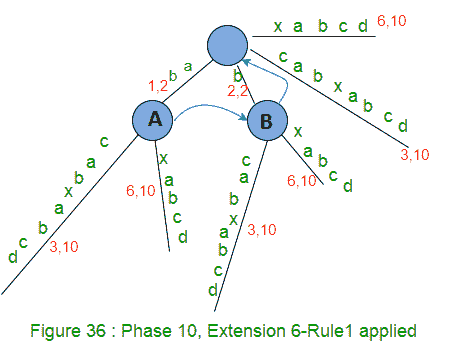

*   将 remainingSuffixCount 增加 1 (remainingSuffixCount 在这里将为 4，即还有四个扩展需要执行，分别是后缀“abcd”、“bcd”、“cd”和“d”的扩展 7、8、9 和 10)
*   如下所示，运行一个循环 remainingSuffixCount 次(即四次):
    ***********************Extension 7***********************************

*   检查活动边缘(c)是否有边缘从活动节点(节点 A)伸出。如果没有，创建一个叶片边缘。如果有，走下去。在我们的例子中，边“c”出现在活动节点(节点 A)之外。*   如有必要，走下去(技巧 1–跳过/计数)。在当前的扩展 7 中，不需要向下走，因为活动长度*   Check if current character of string S (which is ‘d’) is already present after the activePoint. If not, rule 2 will apply. In our example, there is no path starting with ‘d’ going out of activePoint, so we create a leaf edge with label ‘d’. Since activePoint ends in the middle of an edge, we will create a new internal node just after the activePoint (Rule 2)

    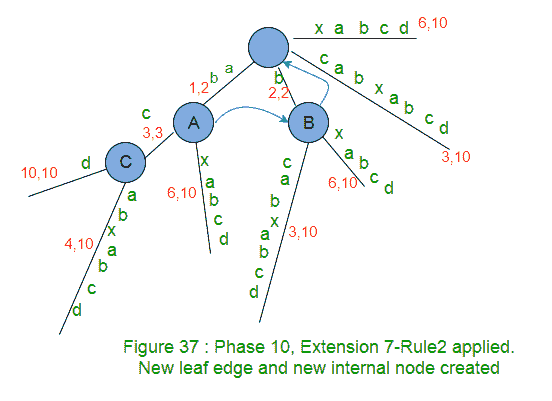

    *The newly created internal node c (in above Figure) in current extension 7, will get it’s suffix link set in next extension 8 (see Figure 38 below).*

    *   在树中添加后缀“abcd”时，将 remainingSuffixCount 减 1(从 4 到 3)。*   Now activePoint will change for next extension 8\. Current activeNode is an internal node (Node A), so there must be a suffix link from there and we will follow that to get new activeNode and that’s going to be ‘Node B’. There is no change in activeEdge and activeLength (This is **APCFER2C2**). So new activePoint is (Node B, c, 1).

    *** * * * * * * * * * * * * * * * * * * * *分机 8 * * * * * * * * * * * * * * * * * * * * * * * * * * * * * * * * * * * ***

    *   Now in extension 8 (here we will add suffix ‘bcd’), while adding character ‘d’ after the current activePoint, exactly same logic will apply as previous extension 7\. In previous extension 7, we added character ‘d’ at activePoint (Node A, c, 1) and in current extension 8, we are going to add same character ‘d’ at activePoint (Node B c, 1). So logic will be same and here we a new leaf edge with label ‘d’ and a new internal node will be created. And the new internal node (C) of previous extension will point to the new node (D) of current extension via suffix link.

    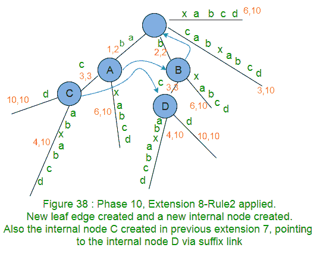

    *Please note the node C from previous extension (see Figure 37 above) got it’s suffix link set here and node D created in current extension will get it’s suffix link set in next extension. What happens if no new node created in next extensions? We have seen this before in Phase 6 ([Part 4](https://www.geeksforgeeks.org/ukkonens-suffix-tree-construction-part-4/ "Ukkonen’s Suffix Tree Construction – Part 4")) and will see again in last extension of this Phase 10\. Stay Tuned.*

    *   在树中添加后缀“bcd”时，将 remainingSuffixCount 减 1(从 3 到 2)。*   Now activePoint will change for next extension 9\. Current activeNode is an internal node (Node B), so there must be a suffix link from there and we will follow that to get new activeNode and that is ‘Root Node’. There is no change in activeEdge and activeLength (This is **APCFER2C2**). So new activePoint is (root, c, 1).

    *** * * * * * * * * * * * * * * * * * * * *分机 9 * * * * * * * * * * * * * * * * * * * * * * * * * * * * * * * * * * * * * ***

    *   Now in extension 9 (here we will add suffix ‘cd’), while adding character ‘d’ after the current activePoint, exactly same logic will apply as previous extensions 7 and 8\. Note that internal node D created in previous extension 8, now points to internal node E (created in current extension) via suffix link.

    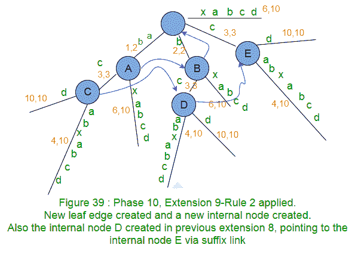

    *   随着树中后缀“cd”的增加，remainingSuffixCount 递减 1(从 2 到 1)。
    *   Now activePoint will change for next extension 10\. Current activeNode is root and activeLength is 1, based on **APCFER2C1**, activeNode will remain ‘root’, activeLength will be decremented by 1 (from 1 to ZERO) and activeEdge will be ‘d’. So new activePoint is (root, d, 0).

        *** * * * * * * * * * * * * * * * * * * * *分机 10 * * * * * * * * * * * * * * * * * * * * * * * * * * * * * * * * * * * ***

    *   现在在扩展 10 中(这里我们将添加后缀‘d’)，同时在当前活动点之后添加字符‘d’，没有以 d 开始的边缘离开活动节点根，因此创建了一个带有标签 d 的新叶子边缘(规则 2)。请注意，在之前的扩展 9 中创建的内部节点 E 现在通过后缀链接指向根节点(因为在此扩展中没有创建新的内部节点)。

    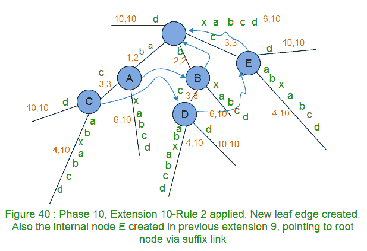

    *Internal Node created in previous extension, waiting for suffix link to be set in next extension, points to root if no internal node created in next extension. In code implementation, as soon as a new internal node (Say A) gets created in an extension j, we will set it’s suffix link to root node and in next extension j+1, if Rule 2 applies on an existing or newly created node (Say B) or Rule 3 applies with some active node (Say B), then suffix link of node A will change to the new node B , else node A will keep pointing to root*

    *   将 remainingSuffixCount 减 1(从 1 到 0)，作为树中添加的后缀“d”。这意味着没有更多的后缀需要添加，所以阶段 10 到此结束。请注意，该树是一个显式树，因为所有后缀都是显式添加到树中的(为什么？？因为到目前为止在字符串 S 中还没有见过字符 d)*   activePoint for next phase 11 is (root, d, 0).

    我们在第 10 阶段看到以下事实:

    *   通过后缀链接连接的内部节点下面有完全相同的树，例如，在上面的图 40 中，A 和 B 下面有相同的树，类似地，C、D 和 E 下面有相同的树。
    *   由于上述事实，在任何扩展中，当当前活动节点通过后缀链接从上一个扩展活动节点派生时，当前扩展中应用扩展逻辑与上一个扩展完全相同。(在第 10 阶段，相同的扩展逻辑应用于扩展 7、8 和 9)
    *   如果在任何阶段 I 的扩展 j 中创建了一个新的内部节点，那么这个新创建的内部节点将在相同阶段 I 的下一个扩展 j+1 结束时获得它的后缀链接集，例如，节点 C 在阶段 10 的扩展 7 中创建(图 37)，并且它在相同阶段 10 的扩展 8 中获得它的后缀链接集到节点 D(图 38)。类似地，在第 10 阶段的扩展 8 中创建了节点 D(图 38)，并将其后缀链接设置为第 10 阶段的扩展 9 中的节点 E(图 39)。类似地，节点 E 在阶段 10 的扩展 9 中被创建(图 39)，并且它的后缀链接被设置为在相同阶段 10 的扩展 10 中的根(图 40)。
    *   基于以上事实，每个内部节点都会有一个后缀链接到其他内部节点或根。根不是内部节点，也没有后缀链接。

    *******************第 11 期**************************第 11 期
    我们从字符串 S 中读出第 11 第字符($)**

    *   将 END 设置为 11(这将进行扩展 1 到 10)——因为到上一阶段 10 结束时为止，我们已经有 10 个叶边缘。

    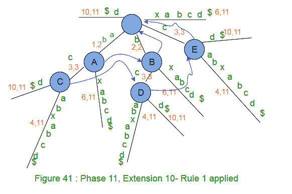

    *   将 remainingSuffixCount 递增 1(从 0 到 1)，即只有一个后缀“{content}”。要添加到树中。
    *   由于 activeLength 为 ZERO，activeEdge 将更改为当前字符“{ content }”；正在处理的字符串的数量( **APCFALZ** )。
    *   没有边缘从活动节点根出去，因此标签为“{content}”的叶边缘。将被创建(规则 2)。

    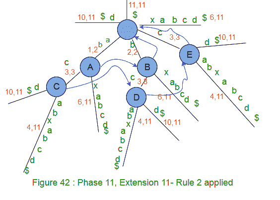

    *   将 remainingSuffixCount 减 1(从 1 到 0)，作为后缀“{content}”。在树中添加。这意味着没有更多的后缀需要添加，因此阶段 11 到此结束。请注意，该树是一个显式树，因为所有后缀都是显式添加到树中的(为什么？？因为字符$以前在字符串 S 中没有出现过)

    现在我们已经添加了字符串' abcabxabcd{content} '的所有后缀。在后缀树中。这棵树有 11 个叶端，从根到叶端的路径上的标签代表一个后缀。现在剩下的唯一一件事就是给每个叶子末端分配一个数字(后缀索引)，这个数字就是字符串 s 中的后缀起始位置。在进行 DFS 遍历时，跟踪标签长度，当找到叶子末端时，将后缀索引设置为“stringSize–labelSize+1”。索引后缀树如下所示:
    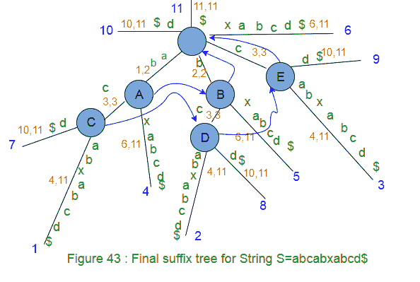
    *在上图中，后缀索引显示为从 1 开始的字符位置(它不是零索引)。在代码实现中，后缀索引将被设置为零索引，即我们在上图中看到后缀索引 j(长度为 m 的字符串为 1 到 m)的地方，在代码实现中，它将是 j-1 (0 到 m-1)*
    ，我们就完成了！！！！
     **数据结构表示后缀树**
    如何表示后缀树？？有节点，边，标签和后缀链接和索引。
    以下是我们在构建后缀树时以及稍后在不同应用程序/用途中使用后缀树时将执行的一些操作/查询:

    *   某条边上的路径标签长度是多少？
    *   某条边上的路径标签是什么？
    *   检查节点中给定字符是否有输出边。
    *   距离节点一定距离的边上的字符值是多少？
    *   内部节点通过后缀链接指向哪里？
    *   从根到叶的路径上的后缀索引是什么？
    *   检查给定的字符串是否出现在后缀树中(作为子串、后缀或前缀)？

    我们可以考虑不同的数据结构来满足这些需求。
    在接下来的[第 6 部分](https://www.geeksforgeeks.org/ukkonens-suffix-tree-construction-part-6/ "Ukkonen’s Suffix Tree Construction – Part 6")中，我们将讨论我们将在代码实现中使用的数据结构以及代码。

    **参考文献**:
    [http://web.stanford.edu/~mjkay/gusfield.pdf](http://web.stanford.edu/~mjkay/gusfield.pdf)
    [Ukkonen 的后缀树算法通俗地说](http://stackoverflow.com/questions/9452701/ukkonens-suffix-tree-algorithm-in-plain-english)

    本文由**阿努拉格·辛格**供稿。如果您发现任何不正确的地方，或者您想分享更多关于上面讨论的主题的信息，请写评论