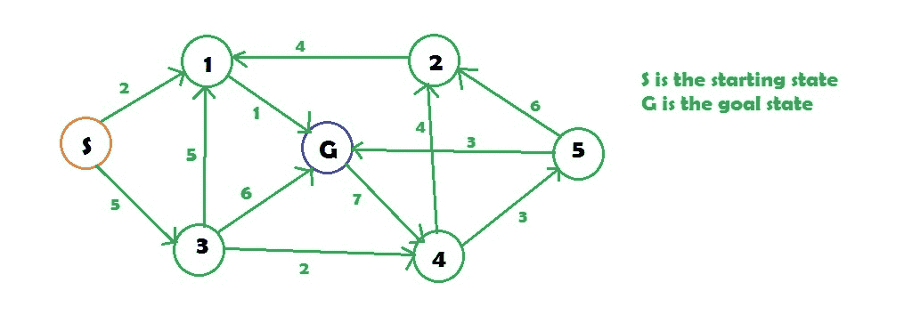

# 均匀成本搜索(大图的 Dijkstra)

> 原文:[https://www . geesforgeks . org/uniform-cost-search-Dijkstra-for-large-graph/](https://www.geeksforgeeks.org/uniform-cost-search-dijkstra-for-large-graphs/)

[统一成本搜索](https://en.wikipedia.org/wiki/Dijkstra%27s_algorithm#Practical_optimizations_and_infinite_graphs)是[迪克斯特拉算法](https://www.geeksforgeeks.org/dijkstras-shortest-path-algorithm-greedy-algo-7/)的变体。这里，我们不是将所有顶点插入到一个优先级队列中，而是只插入源，然后在需要时一个接一个地插入。在每一步中，我们检查项目是否已经在优先级队列中(使用访问数组)。如果是，我们执行减少键，否则我们插入它。
这个 Dijkstra 的变体对于无限图和那些太大而无法在内存中表示的图很有用。均匀成本搜索主要用于人工智能。

**示例:**

```
Input :
```



```
Output :
Minimum cost from S to G is =3
```

均匀成本搜索类似于迪杰斯特拉算法。在该算法中，从起始状态开始，我们将访问相邻的状态，并将选择代价最小的状态，然后我们将从所有未访问的状态和访问状态的相邻状态中选择下一个代价最小的状态，这样，我们将尝试到达目标状态(注意，我们不会继续通过目标状态的路径)，即使我们到达目标状态，我们也将继续搜索其他可能的路径(如果有多个目标)。我们将保持一个优先级队列，该队列将给出来自被访问状态的所有相邻状态中成本最低的下一个状态。

## C++

```
// C++ implementation of above approach
#include <bits/stdc++.h>
using namespace std;

// graph
vector<vector<int> > graph;

// map to store cost of edges
map<pair<int, int>, int> cost;

// returns the minimum cost in a vector( if
// there are multiple goal states)
vector<int> uniform_cost_search(vector<int> goal, int start)
{
    // minimum cost upto
    // goal state from starting
    // state
    vector<int> answer;

    // create a priority queue
    priority_queue<pair<int, int> > queue;

    // set the answer vector to max value
    for (int i = 0; i < goal.size(); i++)
        answer.push_back(INT_MAX);

    // insert the starting index
    queue.push(make_pair(0, start));

    // map to store visited node
    map<int, int> visited;

    // count
    int count = 0;

    // while the queue is not empty
    while (queue.size() > 0) {

        // get the top element of the
        // priority queue
        pair<int, int> p = queue.top();

        // pop the element
        queue.pop();

        // get the original value
        p.first *= -1;

        // check if the element is part of
        // the goal list
        if (find(goal.begin(), goal.end(), p.second) != goal.end()) {

            // get the position
            int index = find(goal.begin(), goal.end(),
                             p.second) - goal.begin();

            // if a new goal is reached
            if (answer[index] == INT_MAX)
                count++;

            // if the cost is less
            if (answer[index] > p.first)
                answer[index] = p.first;

            // pop the element
            queue.pop();

            // if all goals are reached
            if (count == goal.size())
                return answer;
        }

        // check for the non visited nodes
        // which are adjacent to present node
        if (visited[p.second] == 0)
            for (int i = 0; i < graph[p.second].size(); i++) {

                // value is multiplied by -1 so that
                // least priority is at the top
                queue.push(make_pair((p.first +
                  cost[make_pair(p.second, graph[p.second][i])]) * -1,
                  graph[p.second][i]));
            }

        // mark as visited
        visited[p.second] = 1;
    }

    return answer;
}

// main function
int main()
{
    // create the graph
    graph.resize(7);

    // add edge
    graph[0].push_back(1);
    graph[0].push_back(3);
    graph[3].push_back(1);
    graph[3].push_back(6);
    graph[3].push_back(4);
    graph[1].push_back(6);
    graph[4].push_back(2);
    graph[4].push_back(5);
    graph[2].push_back(1);
    graph[5].push_back(2);
    graph[5].push_back(6);
    graph[6].push_back(4);

    // add the cost
    cost[make_pair(0, 1)] = 2;
    cost[make_pair(0, 3)] = 5;
    cost[make_pair(1, 6)] = 1;
    cost[make_pair(3, 1)] = 5;
    cost[make_pair(3, 6)] = 6;
    cost[make_pair(3, 4)] = 2;
    cost[make_pair(2, 1)] = 4;
    cost[make_pair(4, 2)] = 4;
    cost[make_pair(4, 5)] = 3;
    cost[make_pair(5, 2)] = 6;
    cost[make_pair(5, 6)] = 3;
    cost[make_pair(6, 4)] = 7;

    // goal state
    vector<int> goal;

    // set the goal
    // there can be multiple goal states
    goal.push_back(6);

    // get the answer
    vector<int> answer = uniform_cost_search(goal, 0);

    // print the answer
    cout << "Minimum cost from 0 to 6 is = "
         << answer[0] << endl;

    return 0;
}
```

## 蟒蛇 3

```
# Python3 implementation of above approach

# returns the minimum cost in a vector( if
# there are multiple goal states)
def  uniform_cost_search(goal, start):

    # minimum cost upto
    # goal state from starting
    global graph,cost
    answer = []

    # create a priority queue
    queue = []

    # set the answer vector to max value
    for i in range(len(goal)):
        answer.append(10**8)

    # insert the starting index
    queue.append([0, start])

    # map to store visited node
    visited = {}

    # count
    count = 0

    # while the queue is not empty
    while (len(queue) > 0):

        # get the top element of the
        queue = sorted(queue)
        p = queue[-1]

        # pop the element
        del queue[-1]

        # get the original value
        p[0] *= -1

        # check if the element is part of
        # the goal list
        if (p[1] in goal):

            # get the position
            index = goal.index(p[1])

            # if a new goal is reached
            if (answer[index] == 10**8):
                count += 1

            # if the cost is less
            if (answer[index] > p[0]):
                answer[index] = p[0]

            # pop the element
            del queue[-1]

            queue = sorted(queue)
            if (count == len(goal)):
                return answer

        # check for the non visited nodes
        # which are adjacent to present node
        if (p[1] not in visited):
            for i in range(len(graph[p[1]])):

                # value is multiplied by -1 so that
                # least priority is at the top
                queue.append( [(p[0] + cost[(p[1], graph[p[1]][i])])* -1, graph[p[1]][i]])

        # mark as visited
        visited[p[1]] = 1

    return answer

# main function
if __name__ == '__main__':

    # create the graph
    graph,cost = [[] for i in range(8)],{}

    # add edge
    graph[0].append(1)
    graph[0].append(3)
    graph[3].append(1)
    graph[3].append(6)
    graph[3].append(4)
    graph[1].append(6)
    graph[4].append(2)
    graph[4].append(5)
    graph[2].append(1)
    graph[5].append(2)
    graph[5].append(6)
    graph[6].append(4)

    # add the cost
    cost[(0, 1)] = 2
    cost[(0, 3)] = 5
    cost[(1, 6)] = 1
    cost[(3, 1)] = 5
    cost[(3, 6)] = 6
    cost[(3, 4)] = 2
    cost[(2, 1)] = 4
    cost[(4, 2)] = 4
    cost[(4, 5)] = 3
    cost[(5, 2)] = 6
    cost[(5, 6)] = 3
    cost[(6, 4)] = 7

    # goal state
    goal = []

    # set the goal
    # there can be multiple goal states
    goal.append(6)

    # get the answer
    answer = uniform_cost_search(goal, 0)

    # print the answer
    print("Minimum cost from 0 to 6 is = ",answer[0])

# This code is contributed by mohit kumar 29
```

## C#

```
// C# implementation of above approach
using System;
using System.Collections;
using System.Collections.Generic;

class GFG
{

// graph
static List<List<int>> graph=new List<List<int>>();

// map to store cost of edges
static Dictionary<Tuple<int,int>,int> cost= new Dictionary<Tuple<int,int>,int>();

// returns the minimum cost in a vector( if
// there are multiple goal states)
static List<int> uniform_cost_search(List<int> goal, int start)
{
    // minimum cost upto
    // goal state from starting
    // state
    List<int> answer=new List<int>();

    // create a priority queue
    List<Tuple<int, int> > queue = new List<Tuple<int, int> >();

    // set the answer vector to max value
    for (int i = 0; i < goal.Count; i++)
        answer.Add(int.MaxValue);

    // insert the starting index
    queue.Add(new Tuple<int,int>(0, start));

    // map to store visited node
    Dictionary<int, int> visited=new Dictionary<int,int>();

    // count
    int count = 0;

    // while the queue is not empty
    while (queue.Count > 0) {

        // get the top element of the
        // priority queue
        Tuple<int, int> q = queue[0];
        Tuple<int, int> p = new Tuple<int,int>(-q.Item1,q.Item2);

        // pop the element
        queue.RemoveAt(0);

        // check if the element is part of
        // the goal list
        if (goal.Contains(p.Item2)) {

            // get the position
            int index = goal.IndexOf(p.Item2);

            // if a new goal is reached
            if (answer[index] == int.MaxValue)
                count++;

            // if the cost is less
            if (answer[index] > p.Item1)
                answer[index] = p.Item1;

            // pop the element
            queue.RemoveAt(0);

            // if all goals are reached
            if (count == goal.Count)
                return answer;
        }

        // check for the non visited nodes
        // which are adjacent to present node
        if (!visited.ContainsKey(p.Item2))
            for (int i = 0; i < graph[p.Item2].Count; i++) {

                // value is multiplied by -1 so that
                // least priority is at the top
                queue.Add(new Tuple<int,int>((p.Item1 + (cost.ContainsKey(new Tuple<int,int>(p.Item2, graph[p.Item2][i])) ? cost[new Tuple<int,int>(p.Item2, graph[p.Item2][i])] : 0))*-1,
                graph[p.Item2][i]));
            }

        // mark as visited
        visited[p.Item2] = 1;
    }

    return answer;
}

// main function
public static void Main(params string []args)
{
    // create the graph
    graph=new List<List<int>>();

    for(int i=0;i<7;i++)
    {
        graph.Add(new List<int>());
    }

    // add edge
    graph[0].Add(1);
    graph[0].Add(3);
    graph[3].Add(1);
    graph[3].Add(6);
    graph[3].Add(4);
    graph[1].Add(6);
    graph[4].Add(2);
    graph[4].Add(5);
    graph[2].Add(1);
    graph[5].Add(2);
    graph[5].Add(6);
    graph[6].Add(4);

    // add the cost
    cost[new Tuple<int,int>(0, 1)] = 2;
    cost[new Tuple<int,int>(0, 3)] = 5;
    cost[new Tuple<int,int>(1, 6)] = 1;
    cost[new Tuple<int,int>(3, 1)] = 5;
    cost[new Tuple<int,int>(3, 6)] = 6;
    cost[new Tuple<int,int>(3, 4)] = 2;
    cost[new Tuple<int,int>(2, 1)] = 4;
    cost[new Tuple<int,int>(4, 2)] = 4;
    cost[new Tuple<int,int>(4, 5)] = 3;
    cost[new Tuple<int,int>(5, 2)] = 6;
    cost[new Tuple<int,int>(5, 6)] = 3;
    cost[new Tuple<int,int>(6, 4)] = 7;

    // goal state
    List<int> goal=new List<int>();

    // set the goal
    // there can be multiple goal states
    goal.Add(6);

    // get the answer
    List<int> answer = uniform_cost_search(goal, 0);

    // print the answer
    Console.Write("Minimum cost from 0 to 6 is = " + answer[0]);

}
}

// This code is contributed by rutvik_56.
```

**Output:** 

```
Minimum cost from 0 to 6 is = 3
```

**复杂度:**o(m ^(1+楼层(l/e)))
其中，
m 是节点拥有的最大邻居数
l 是到达目标状态的最短路径长度
e 是一条边的最小代价