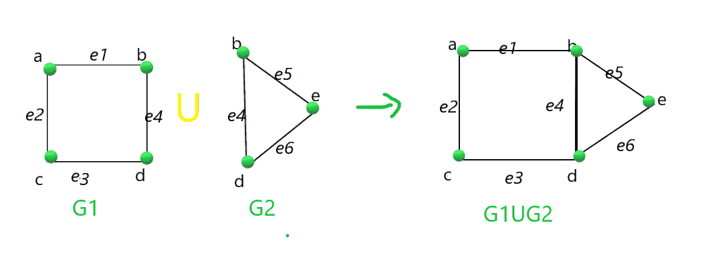
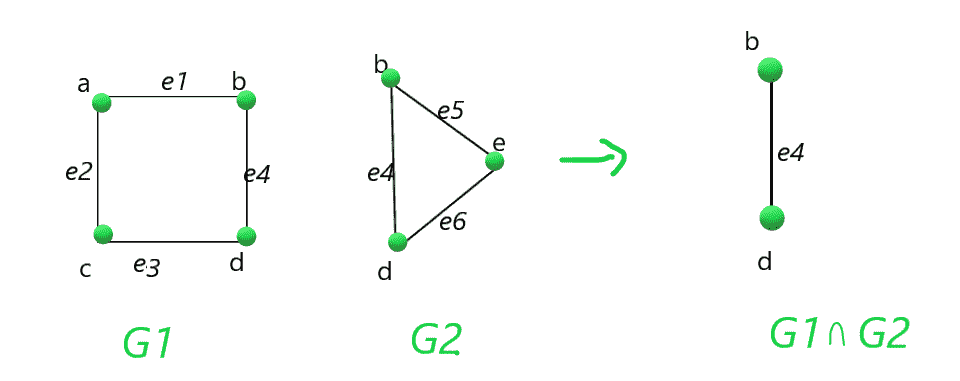

# 两个图的并和交

> 原文:[https://www . geesforgeks . org/两图并集和交集/](https://www.geeksforgeeks.org/union-and-intersection-of-two-graphs/)

给定两张[图](https://www.geeksforgeeks.org/graph-and-its-representations/) **G1** 和 **G2** ，任务是找到两张给定图的**并集**和**交集**，即 **(G1 ∪ G2)** 和**(G1∪G2)**。

**示例:**

> **输入:**G1 = {(“E1”，1，2)、(“e2”，1，3)、(“e3”，3，4)、(“e4”，2，4) }、G2 = = {(“E4”，2，4)、(“e5”，2，5)、(“e6”，4，5) }
> **输出:**
> G1 联合 G2 为
> E1 1 2
> E2 1 3
> E3 3 4
> E4 2 4
> E5
> E6 4 5
> 
> G1 交点 G2 是
> e4 2 4
> **解释:**
> 图 G1 和 G2 的并集:
> 
> [](https://media.geeksforgeeks.org/wp-content/uploads/20210217190412/graphunion.png)
> 
> 图 G1 和 G2 的交点:
> 
> [](https://media.geeksforgeeks.org/wp-content/uploads/20210217190421/graphintersection.png)

**方法:**按照以下步骤解决问题:

*   定义一个函数，比如**联盟(G1，G2)** ，找到 **G1** 和 **G2** 的联盟:
    *   初始化一个[地图](https://www.geeksforgeeks.org/map-associative-containers-the-c-standard-template-library-stl/)，比如说**添加了**，它存储边是否已经被添加。
    *   迭代图的边 **G1** 推一个图中的所有边，说 **G** ，标记所有在**中访问过的边添加**。
    *   现在，再次遍历图的边 **G2** ，如果还没有添加边，则在 **G** 中推边，然后在添加的地图**中标记添加的边。**
*   定义一个函数说**交点(G1，G2)** 找到 **G1** 和 **G2** 的交点:
    *   初始化一个[地图](https://www.geeksforgeeks.org/map-pairs-stl/)，比如说**添加了**，它存储边是否已经被添加。
    *   遍历图的边 **G1** 并标记地图中所有访问的边**添加。**
    *   现在，再次遍历图的边 **G2** ，如果已经添加了边，则推图中的边 **G** 。然后，标记地图中添加的边。
*   现在，打印函数调用**并集(G1，G2)** 和**交集(G1，G2)** 后得到的图形。

下面是上述方法的实现:

## C++14

```
// C++ program for the above approach
#include <bits/stdc++.h>
using namespace std;

// Function to find union of two graphs
void find_union(
    vector<tuple<string, int, int> > G1,
    vector<tuple<string, int, int> > G2)
{
    // Stores an edge of the graph G1
    map<string, pair<int, int> > added;

    // Stores the unioun graph G1
    vector<tuple<string, int, int> > G;

    // Iterate over the edges
    // of the graph G1
    for (auto p : G1) {

        string a = get<0>(p);

        // Get the edges
        int b = get<1>(p);
        int c = get<2>(p);

        // Insert the current
        // edges into graph G
        G.push_back(
            make_tuple(a, b, c));
        added[a] = { b, c };
    }

    // Iterate over the edges
    // of the graph G1
    for (auto p : G2) {

        string a = get<0>(p);
        int b = get<1>(p);
        int c = get<2>(p);

        pair<int, int> x = { b, c };
        pair<int, int> y = { c, b };

        // If either edge x or
        // y is already added
        if (added[a] == x || added[a] == y)
            continue;

        // Otherwise
        G.push_back(make_tuple(a, b, c));
    }

    // Print the unioun
    cout << "G1 union G2 is\n";

    for (auto p : G) {

        string a = get<0>(p);
        int b = get<1>(p);
        int c = get<2>(p);
        cout << a << " " << b << " "
             << c << endl;
    }
}

// Function to find intersection of two graphs
void find_intersection(
    vector<tuple<string, int, int> > G1,
    vector<tuple<string, int, int> > G2)
{
    // Stores an edge
    map<string, pair<int, int> > added;

    // Stores the graph of intersection
    vector<tuple<string, int, int> > G;

    // Iterate over edges of graph G1
    for (auto p : G1) {
        string a = get<0>(p);
        int b = get<1>(p);
        int c = get<2>(p);

        added[a] = { b, c };
    }

    // Iterate over edges of graph G2
    for (auto p : G2) {

        string a = get<0>(p);
        int b = get<1>(p);
        int c = get<2>(p);

        pair<int, int> x = { b, c };
        pair<int, int> y = { c, b };

        // If either edge x or
        // y is already added
        if (added[a] == x || added[a] == y)
            G.push_back(make_tuple(a, b, c));
    }

    // Print the graph G
    cout << "G1 intersection G2 is\n";

    for (auto p : G) {

        string a = get<0>(p);
        int b = get<1>(p);
        int c = get<2>(p);

        cout << a << " " << b
             << " " << c << endl;
    }
}

// Driver Code
int main()
{
    vector<tuple<string, int, int> > G1
        = { make_tuple("e1", 1, 2),
            make_tuple("e2", 1, 3),
            make_tuple("e3", 3, 4),
            make_tuple("e4", 2, 4) };

    vector<tuple<string, int, int> > G2
        = { make_tuple("e4", 2, 4),
            make_tuple("e5", 2, 5),
            make_tuple("e6", 4, 5) };

    // Function call for finding the
    // Union of the given graph
    find_union(G1, G2);

    // Function call for finding the
    // Intersection of the given graph
    find_intersection(G1, G2);

    return 0;
}
```

**Output:**

```
G1 union G2 is
e1 1 2
e2 1 3
e3 3 4
e4 2 4
e5 2 5
e6 4 5
G1 intersection G2 is
e4 2 4

```

***时间复杂度:** O(N * log(N))
**辅助空间:** O(N)*