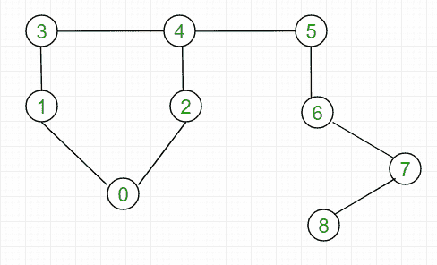
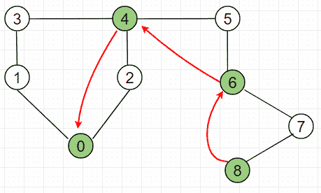
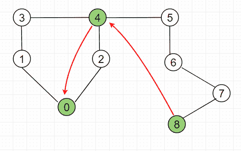
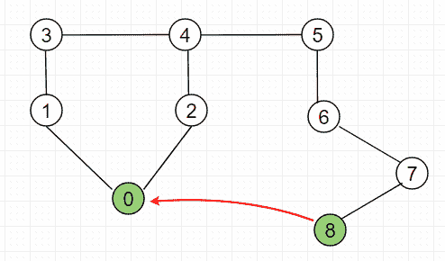

# 联合-查找算法|(按等级联合和按优化路径压缩查找)

> 原文:[https://www . geesforgeks . org/union-find-algorithm-union-rank-find-optimized-path-compression/](https://www.geeksforgeeks.org/union-find-algorithm-union-rank-find-optimized-path-compression/)

检查给定的图形是否包含循环。
**例:**

```
Input: 
```



```
Output: Graph contains Cycle.

Input: 
```


```
Output: Graph does not contain Cycle.
```

先决条件:[不相交集(或联合查找)](https://www.geeksforgeeks.org/union-find/)、[按等级和路径压缩联合](https://www.geeksforgeeks.org/union-find-algorithm-set-2-union-by-rank/)
我们已经讨论了[联合查找检测循环](https://www.geeksforgeeks.org/union-find/)。在这里，我们讨论路径压缩查找，在这里，它被稍微修改，以比原始方法更快地工作，因为我们每次向上遍历图表时都会跳过一个级别。find 函数的实现是迭代的，因此不涉及开销。优化查找函数的时间复杂度为 O(log*(n))，即重对数，对于重复调用收敛到 O(1)。
联合-Find
**复杂度的证明
[参考此链接查找函数解释:](https://en.wikipedia.org/wiki/Proof_of_O(log*n)_time_complexity_of_union%E2%80%93find)**
以例 1 理解查找函数:
(1)第一次调用 Find(8)**映射会这样做:** 

****

**find 函数需要 3 个映射才能得到节点 8 的根。映射如下所示:
从节点 8，跳过节点 7，到达节点 6。
从节点 6，跳过节点 5，到达节点 4。
从节点 4，跳过节点 2，到达节点 0。
(2)第二次**调用 find(8)**映射如下:** 

****

**find 函数需要 2 个映射才能得到节点 8 的根。映射如下所示:
从节点 8 开始，跳过节点 5、节点 6 和节点 7，到达节点 4。
从节点 4，跳过节点 2，到达节点 0。
(3)第三次调用 find(8)**，映射如下:**** 

********

****最后，我们看到 find 函数只需要 1 个映射就可以得到节点 8 的根。映射如下所示:
从节点 8 开始，跳过节点 5、节点 6、节点 7、节点 4 和节点 2，到达节点 0。
这就是它如何将路径从某些映射收敛到单个映射。
**例 1 说明:**
最初数组大小和 Arr 看起来像:
Arr[9] = {0，1，2，3，4，5，6，7，8}
大小[9] = {1，1，1，1，1，1，1，1，1}
考虑图中的边，将它们逐一添加到不相交并集，如下所示:
**Edge 1:0-1**
find(0
Arr[1]=0，size[0]= 2；
**边 2: 0-2**
find(0)= > 0，find(2)= > 2，两者有不同的根父
Arr[2]=0，size[0]= 3；
**边 3: 1-3**
find(1)= > 0，find(3)= > 3，两者有不同的根父项
Arr[3]=0，size[0]= 3；
**边 4: 3-4**
find(3)= > 1，find(4)= > 4，两者有不同的根父项
Arr[4]=0，size[0]= 4；
**边 5: 2-4**
find(2)= > 0，find(4)= > 0，两者具有相同的根父项
因此，图中存在循环。
我们停止进一步检查图形中的循环。**** 

## ****C++****

```
**// CPP program to implement Union-Find with union
// by rank and path compression.
#include <bits/stdc++.h>
using namespace std;

const int MAX_VERTEX = 101;

// Arr to represent parent of index i
int Arr[MAX_VERTEX];

// Size to represent the number of nodes
// in subgxrph rooted at index i
int size[MAX_VERTEX];

// set parent of every node to itself and
// size of node to one
void initialize(int n)
{
    for (int i = 0; i <= n; i++) {
        Arr[i] = i;
        size[i] = 1;
    }
}

// Each time we follow a path, find function
// compresses it further until the path length
// is greater than or equal to 1.
int find(int i)
{
    // while we reach a node whose parent is
    // equal to itself
    while (Arr[i] != i)
    {
        Arr[i] = Arr[Arr[i]]; // Skip one level
        i = Arr[i]; // Move to the new level
    }
    return i;
}

// A function that does union of two nodes x and y
// where xr is root node  of x and yr is root node of y
void _union(int xr, int yr)
{
    if (size[xr] < size[yr]) // Make yr parent of xr
    {
        Arr[xr] = Arr[yr];
        size[yr] += size[xr];
    }
    else // Make xr parent of yr
    {
        Arr[yr] = Arr[xr];
        size[xr] += size[yr];
    }
}

// The main function to check whether a given
// gxrph contains cycle or not
int isCycle(vector<int> adj[], int V)
{
    // Itexrte through all edges of gxrph, find
    // nodes connecting them.
    // If root nodes of both are same, then there is
    // cycle in gxrph.
    for (int i = 0; i < V; i++) {
        for (int j = 0; j < adj[i].size(); j++) {
            int x = find(i); // find root of i
            int y = find(adj[i][j]); // find root of adj[i][j]

            if (x == y)
                return 1; // If same parent
            _union(x, y); // Make them connect
        }
    }
    return 0;
}

// Driver progxrm to test above functions
int main()
{
    int V = 3;

    // Initialize the values for arxry Arr and Size
    initialize(V);

    /* Let us create following gxrph
         0
        |  \
        |    \
        1-----2 */

    vector<int> adj[V]; // Adjacency list for gxrph

    adj[0].push_back(1);
    adj[0].push_back(2);
    adj[1].push_back(2);

    // call is_cycle to check if it contains cycle
    if (isCycle(adj, V))
        cout << "Gxrph contains Cycle.\n";
    else
        cout << "Gxrph does not contain Cycle.\n";

    return 0;
}**
```

## ****Java 语言(一种计算机语言，尤用于创建网站)****

```
**// Java program to implement Union-Find with union
// by rank and path compression
import java.util.*;

class GFG 
{
static int MAX_VERTEX = 101;

// Arr to represent parent of index i
static int []Arr = new int[MAX_VERTEX];

// Size to represent the number of nodes
// in subgxrph rooted at index i
static int []size = new int[MAX_VERTEX];

// set parent of every node to itself and
// size of node to one
static void initialize(int n)
{
    for (int i = 0; i <= n; i++)
    {
        Arr[i] = i;
        size[i] = 1;
    }
}

// Each time we follow a path, find function
// compresses it further until the path length
// is greater than or equal to 1.
static int find(int i)
{
    // while we reach a node whose parent is
    // equal to itself
    while (Arr[i] != i)
    {
        Arr[i] = Arr[Arr[i]]; // Skip one level
        i = Arr[i]; // Move to the new level
    }
    return i;
}

// A function that does union of two nodes x and y
// where xr is root node of x and yr is root node of y
static void _union(int xr, int yr)
{
    if (size[xr] < size[yr]) // Make yr parent of xr
    {
        Arr[xr] = Arr[yr];
        size[yr] += size[xr];
    }
    else // Make xr parent of yr
    {
        Arr[yr] = Arr[xr];
        size[xr] += size[yr];
    }
}

// The main function to check whether a given
// gxrph contains cycle or not
static int isCycle(Vector<Integer> adj[], int V)
{
    // Itexrte through all edges of gxrph, 
    // find nodes connecting them.
    // If root nodes of both are same, 
    // then there is cycle in gxrph.
    for (int i = 0; i < V; i++)
    {
        for (int j = 0; j < adj[i].size(); j++) 
        {
            int x = find(i); // find root of i

            // find root of adj[i][j]
            int y = find(adj[i].get(j)); 

            if (x == y)
                return 1; // If same parent
            _union(x, y); // Make them connect
        }
    }
    return 0;
}

// Driver Code
public static void main(String[] args) 
{
    int V = 3;

    // Initialize the values for arxry Arr and Size
    initialize(V);

    /* Let us create following gxrph
        0
        | \
        | \
        1-----2 */

    // Adjacency list for graph
    Vector<Integer> []adj = new Vector[V]; 
    for(int i = 0; i < V; i++)
        adj[i] = new Vector<Integer>();

    adj[0].add(1);
    adj[0].add(2);
    adj[1].add(2);

    // call is_cycle to check if it contains cycle
    if (isCycle(adj, V) == 1)
        System.out.print("Graph contains Cycle.\n");
    else
        System.out.print("Graph does not contain Cycle.\n");
    }
}

// This code is contributed by PrinciRaj1992**
```

## ****蟒蛇 3****

```
**# Python3 program to implement Union-Find 
# with union by rank and path compression.

# set parent of every node to itself 
# and size of node to one 
def initialize(n):
    global Arr, size
    for i in range(n + 1):
        Arr[i] = i 
        size[i] = 1

# Each time we follow a path, find 
# function compresses it further 
# until the path length is greater 
# than or equal to 1. 
def find(i):
    global Arr, size

    # while we reach a node whose 
    # parent is equal to itself 
    while (Arr[i] != i):
        Arr[i] = Arr[Arr[i]] # Skip one level 
        i = Arr[i] # Move to the new level
    return i

# A function that does union of two 
# nodes x and y where xr is root node 
# of x and yr is root node of y 
def _union(xr, yr):
    global Arr, size
    if (size[xr] < size[yr]): # Make yr parent of xr 
        Arr[xr] = Arr[yr] 
        size[yr] += size[xr]
    else: # Make xr parent of yr
        Arr[yr] = Arr[xr] 
        size[xr] += size[yr]

# The main function to check whether 
# a given graph contains cycle or not 
def isCycle(adj, V):
    global Arr, size

    # Itexrte through all edges of gxrph, 
    # find nodes connecting them. 
    # If root nodes of both are same, 
    # then there is cycle in gxrph.
    for i in range(V):
        for j in range(len(adj[i])):
            x = find(i) # find root of i 
            y = find(adj[i][j]) # find root of adj[i][j] 

            if (x == y):
                return 1 # If same parent 
            _union(x, y) # Make them connect
    return 0

# Driver Code
MAX_VERTEX = 101

# Arr to represent parent of index i 
Arr = [None] * MAX_VERTEX 

# Size to represent the number of nodes 
# in subgxrph rooted at index i 
size = [None] * MAX_VERTEX 

V = 3

# Initialize the values for arxry 
# Arr and Size 
initialize(V) 

# Let us create following gxrph 
#     0 
# | \ 
# | \ 
# 1-----2 

# Adjacency list for graph 
adj = [[] for i in range(V)] 

adj[0].append(1) 
adj[0].append(2) 
adj[1].append(2) 

# call is_cycle to check if it 
# contains cycle 
if (isCycle(adj, V)): 
    print("Graph contains Cycle.") 
else:
    print("Graph does not contain Cycle.")

# This code is contributed by PranchalK**
```

## ****C#****

```
**// C# program to implement Union-Find 
// with union by rank and path compression
using System;
using System.Collections.Generic;

class GFG 
{
static int MAX_VERTEX = 101;

// Arr to represent parent of index i
static int []Arr = new int[MAX_VERTEX];

// Size to represent the number of nodes
// in subgxrph rooted at index i
static int []size = new int[MAX_VERTEX];

// set parent of every node to itself 
// and size of node to one
static void initialize(int n)
{
    for (int i = 0; i <= n; i++)
    {
        Arr[i] = i;
        size[i] = 1;
    }
}

// Each time we follow a path, 
// find function compresses it further 
// until the path length is greater than 
// or equal to 1.
static int find(int i)
{
    // while we reach a node whose 
    // parent is equal to itself
    while (Arr[i] != i)
    {
        Arr[i] = Arr[Arr[i]]; // Skip one level
        i = Arr[i]; // Move to the new level
    }
    return i;
}

// A function that does union of 
// two nodes x and y where xr is 
// root node of x and yr is root node of y
static void _union(int xr, int yr)
{
    if (size[xr] < size[yr]) // Make yr parent of xr
    {
        Arr[xr] = Arr[yr];
        size[yr] += size[xr];
    }
    else // Make xr parent of yr
    {
        Arr[yr] = Arr[xr];
        size[xr] += size[yr];
    }
}

// The main function to check whether 
// a given graph contains cycle or not
static int isCycle(List<int> []adj, int V)
{
    // Itexrte through all edges of graph, 
    // find nodes connecting them.
    // If root nodes of both are same, 
    // then there is cycle in graph.
    for (int i = 0; i < V; i++)
    {
        for (int j = 0; j < adj[i].Count; j++) 
        {
            int x = find(i); // find root of i

            // find root of adj[i][j]
            int y = find(adj[i][j]); 

            if (x == y)
                return 1; // If same parent
            _union(x, y); // Make them connect
        }
    }
    return 0;
}

// Driver Code
public static void Main(String[] args) 
{
    int V = 3;

    // Initialize the values for 
    // array Arr and Size
    initialize(V);

    /* Let us create following graph
        0
        | \
        | \
        1-----2 */

    // Adjacency list for graph
    List<int> []adj = new List<int>[V]; 
    for(int i = 0; i < V; i++)
        adj[i] = new List<int>();

    adj[0].Add(1);
    adj[0].Add(2);
    adj[1].Add(2);

    // call is_cycle to check if it contains cycle
    if (isCycle(adj, V) == 1)
        Console.Write("Graph contains Cycle.\n");
    else
        Console.Write("Graph does not contain Cycle.\n");
    }
}

// This code is contributed by Rajput-Ji**
```

## ****java 描述语言****

```
**<script>

// Javascript program to implement Union-Find with union
// by rank and path compression.

var MAX_VERTEX = 101;

// Arr to represent parent of index i
var Arr = Array(MAX_VERTEX).fill(0);

// Size to represent the number of nodes
// in subgxrph rooted at index i
var size = Array(MAX_VERTEX).fill(0);

// set parent of every node to itself and
// size of node to one
function initialize(n)
{
    for (var i = 0; i <= n; i++) {
        Arr[i] = i;
        size[i] = 1;
    }
}

// Each time we follow a path, find function
// compresses it further until the path length
// is greater than or equal to 1.
function find(i)
{
    // while we reach a node whose parent is
    // equal to itself
    while (Arr[i] != i)
    {
        Arr[i] = Arr[Arr[i]]; // Skip one level
        i = Arr[i]; // Move to the new level
    }
    return i;
}

// A function that does union of two nodes x and y
// where xr is root node  of x and yr is root node of y
function _union(xr, yr)
{
    if (size[xr] < size[yr]) // Make yr parent of xr
    {
        Arr[xr] = Arr[yr];
        size[yr] += size[xr];
    }
    else // Make xr parent of yr
    {
        Arr[yr] = Arr[xr];
        size[xr] += size[yr];
    }
}

// The main function to check whether a given
// gxrph contains cycle or not
function isCycle(adj, V)
{
    // Itexrte through all edges of gxrph, find
    // nodes connecting them.
    // If root nodes of both are same, then there is
    // cycle in gxrph.
    for (var i = 0; i < V; i++) {
        for (var j = 0; j < adj[i].length; j++) {
            var x = find(i); // find root of i
            var y = find(adj[i][j]); // find root of adj[i][j]

            if (x == y)
                return 1; // If same parent
            _union(x, y); // Make them connect
        }
    }
    return 0;
}

// Driver progxrm to test above functions
var V = 3;

// Initialize the values for arxry Arr and Size
initialize(V);
/* Let us create following gxrph
     0
    |  \
    |    \
    1-----2 */
var adj = Array.from(Array(V), ()=>Array()); // Adjacency list for gxrph
adj[0].push(1);
adj[0].push(2);
adj[1].push(2);

// call is_cycle to check if it contains cycle
if (isCycle(adj, V))
    document.write("Graph contains Cycle.<br>");
else
    document.write("Graph does not contain Cycle.<br>");

// This code is contributed by rutvik_56.
</script>**
```

******输出:****** 

```
**Graph contains Cycle.**
```

******时间复杂度(查找):** O(log*(n))
**时间复杂度(联合):** O(1)****