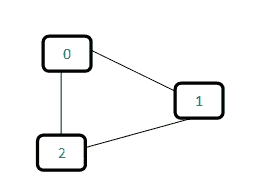

# 不相交集(或联合查找)|集 1(检测无向图中的循环)

> 原文:[https://www.geeksforgeeks.org/union-find/](https://www.geeksforgeeks.org/union-find/)

[*不相交集数据结构*](http://en.wikipedia.org/wiki/Disjoint-set_data_structure) 是一种跟踪被划分为多个不相交(非重叠)子集的一组元素的数据结构。 [*联合查找算法*](http://en.wikipedia.org/wiki/Disjoint-set_data_structure) 是一种对这样的数据结构执行两个有用操作的算法:

***查找:*** 确定某个元素在哪个子集。这可用于确定两个元素是否在同一子集中。

***联合:*** 将两个子集合并为一个子集。这里我们首先要检查这两个子集是否属于同一个集合。如果没有，那么我们就不能执行联合。

在这篇文章中，我们将讨论不相交集合数据结构的应用。应用程序是检查给定的图形是否包含循环。

*联合查找算法*可以用来检查无向图是否包含循环。注意，我们已经讨论了检测周期的[算法。这是另一种基于*联合-寻找*的方法。该方法假设图形不包含任何自循环。](http://www.geeksforgeeks.org/archives/18516)

我们可以跟踪 1D 数组中的子集，让我们称之为父[]。
让我们考虑以下图表:



对于每条边，使用边的两个顶点创建子集。如果两个顶点都在同一个子集中，则找到一个循环。

最初，父数组的所有槽都被初始化为-1(意味着每个子集中只有一个项目)。

```
0   1   2
-1 -1  -1
```

现在逐一处理所有边。
*边 0-1:* 找出顶点 0 和 1 所在的子集。因为它们属于不同的子集，所以我们取它们的并集。对于取并集，要么将节点 0 作为节点 1 的父节点，要么相反。

```
0   1   2    <----- 1 is made parent of 0 (1 is now representative of subset {0, 1})
1  -1  -1
```

*边 1-2:* 1 在子集 1，2 在子集 2。所以，以工会为例。

```
0   1   2    <----- 2 is made parent of 1 (2 is now representative of subset {0, 1, 2})
1   2  -1
```

*边 0-2:* 0 在子集 2，2 也在子集 2。因此，包括这个边缘形成一个循环。
0 的子集怎么和 2 一样？
0- > 1- > 2 // 1 是 0 的亲本，2 是 1 的亲本

基于以上解释，下面是实现:

## C++

```
// A union-find algorithm to detect cycle in a graph
#include <bits/stdc++.h>
using namespace std;

// a structure to represent an edge in graph
class Edge
{
public:
    int src, dest;
};

// a structure to represent a graph
class Graph
{
public:
    // V-> Number of vertices, E-> Number of edges
    int V, E;

    // graph is represented as an array of edges
    Edge* edge;
};

// Creates a graph with V vertices and E edges
Graph* createGraph(int V, int E)
{
    Graph* graph = new Graph();
    graph->V = V;
    graph->E = E;

    graph->edge = new Edge[graph->E * sizeof(Edge)];

    return graph;
}

// A utility function to find the subset of an element i
int find(int parent[], int i)
{
    if (parent[i] == -1)
        return i;
    return find(parent, parent[i]);
}

// A utility function to do union of two subsets
void Union(int parent[], int x, int y)
{
    parent[x] = y;
}

// The main function to check whether a given graph contains
// cycle or not
int isCycle(Graph* graph)
{
    // Allocate memory for creating V subsets
    int* parent = new int[graph->V * sizeof(int)];

    // Initialize all subsets as single element sets
    memset(parent, -1, sizeof(int) * graph->V);

    // Iterate through all edges of graph, find subset of
    // both vertices of every edge, if both subsets are
    // same, then there is cycle in graph.
    for (int i = 0; i < graph->E; ++i) {
        int x = find(parent, graph->edge[i].src);
        int y = find(parent, graph->edge[i].dest);

        if (x == y)
            return 1;

        Union(parent, x, y);
    }
    return 0;
}

// Driver code
int main()
{
    /* Let us create the following graph
        0
        | \
        |  \
        1---2 */
    int V = 3, E = 3;
    Graph* graph = createGraph(V, E);

    // add edge 0-1
    graph->edge[0].src = 0;
    graph->edge[0].dest = 1;

    // add edge 1-2
    graph->edge[1].src = 1;
    graph->edge[1].dest = 2;

    // add edge 0-2
    graph->edge[2].src = 0;
    graph->edge[2].dest = 2;

    if (isCycle(graph))
        cout << "graph contains cycle";
    else
        cout << "graph doesn't contain cycle";

    return 0;
}

// This code is contributed by rathbhupendra
```

## C

```
// A union-find algorithm to detect cycle in a graph
#include <stdio.h>
#include <stdlib.h>
#include <string.h>

// a structure to represent an edge in graph
struct Edge
{
    int src, dest;
};

// a structure to represent a graph
struct Graph
{
    // V-> Number of vertices, E-> Number of edges
    int V, E;

    // graph is represented as an array of edges
    struct Edge* edge;
};

// Creates a graph with V vertices and E edges
struct Graph* createGraph(int V, int E)
{
    struct Graph* graph =
           (struct Graph*) malloc( sizeof(struct Graph) );
    graph->V = V;
    graph->E = E;

    graph->edge =
        (struct Edge*) malloc( graph->E * sizeof( struct Edge ) );

    return graph;
}

// A utility function to find the subset of an element i
int find(int parent[], int i)
{
    if (parent[i] == -1)
        return i;
    return find(parent, parent[i]);
}

// A utility function to do union of two subsets
void Union(int parent[], int x, int y)
{
    parent[x] = y;
}

// The main function to check whether a given graph contains
// cycle or not
int isCycle( struct Graph* graph )
{
    // Allocate memory for creating V subsets
    int *parent = (int*) malloc( graph->V * sizeof(int) );

    // Initialize all subsets as single element sets
    memset(parent, -1, sizeof(int) * graph->V);

    // Iterate through all edges of graph, find subset of both
    // vertices of every edge, if both subsets are same, then
    // there is cycle in graph.
    for(int i = 0; i < graph->E; ++i)
    {
        int x = find(parent, graph->edge[i].src);
        int y = find(parent, graph->edge[i].dest);

        if (x == y)
            return 1;

        Union(parent, x, y);
    }
    return 0;
}

// Driver program to test above functions
int main()
{
    /* Let us create the following graph
        0
        | \
        |  \
        1---2 */ 
    int V = 3, E = 3;
    struct Graph* graph = createGraph(V, E);

    // add edge 0-1
    graph->edge[0].src = 0;
    graph->edge[0].dest = 1;

    // add edge 1-2
    graph->edge[1].src = 1;
    graph->edge[1].dest = 2;

    // add edge 0-2
    graph->edge[2].src = 0;
    graph->edge[2].dest = 2;

    if (isCycle(graph))
        printf( "graph contains cycle" );
    else
        printf( "graph doesn't contain cycle" );

    return 0;
}
```

## Java 语言(一种计算机语言，尤用于创建网站)

```
// Java Program for union-find algorithm to detect cycle in a graph
import java.util.*;
import java.lang.*;
import java.io.*;

class Graph
{
    int V, E;    // V-> no. of vertices & E->no.of edges
    Edge edge[]; // /collection of all edges

    class Edge
    {
        int src, dest;
    };

    // Creates a graph with V vertices and E edges
    Graph(int v,int e)
    {
        V = v;
        E = e;
        edge = new Edge[E];
        for (int i=0; i<e; ++i)
            edge[i] = new Edge();
    }

    // A utility function to find the subset of an element i
    int find(int parent[], int i)
    {
        if (parent[i] == -1)
            return i;
        return find(parent, parent[i]);
    }

    // A utility function to do union of two subsets
    void Union(int parent[], int x, int y)
    {
        parent[x] = y;
    }

    // The main function to check whether a given graph
    // contains cycle or not
    int isCycle( Graph graph)
    {
        // Allocate memory for creating V subsets
        int parent[] = new int[graph.V];

        // Initialize all subsets as single element sets
        for (int i=0; i<graph.V; ++i)
            parent[i]=-1;

        // Iterate through all edges of graph, find subset of both
        // vertices of every edge, if both subsets are same, then
        // there is cycle in graph.
        for (int i = 0; i < graph.E; ++i)
        {
            int x = graph.find(parent, graph.edge[i].src);
            int y = graph.find(parent, graph.edge[i].dest);

            if (x == y)
                return 1;

            graph.Union(parent, x, y);
        }
        return 0;
    }

    // Driver Method
    public static void main (String[] args)
    {
        /* Let us create the following graph
        0
        | \
        |  \
        1---2 */
        int V = 3, E = 3;
        Graph graph = new Graph(V, E);

        // add edge 0-1
        graph.edge[0].src = 0;
        graph.edge[0].dest = 1;

        // add edge 1-2
        graph.edge[1].src = 1;
        graph.edge[1].dest = 2;

        // add edge 0-2
        graph.edge[2].src = 0;
        graph.edge[2].dest = 2;

        if (graph.isCycle(graph)==1)
            System.out.println( "graph contains cycle" );
        else
            System.out.println( "graph doesn't contain cycle" );
    }
}
```

## 计算机编程语言

```
# Python Program for union-find algorithm to detect cycle in a undirected graph
# we have one egde for any two vertex i.e 1-2 is either 1-2 or 2-1 but not both

from collections import defaultdict

#This class represents a undirected graph using adjacency list representation
class Graph:

    def __init__(self,vertices):
        self.V= vertices #No. of vertices
        self.graph = defaultdict(list) # default dictionary to store graph

    # function to add an edge to graph
    def addEdge(self,u,v):
        self.graph[u].append(v)

    # A utility function to find the subset of an element i
    def find_parent(self, parent,i):
        if parent[i] == -1:
            return i
        if parent[i]!= -1:
             return self.find_parent(parent,parent[i])

    # A utility function to do union of two subsets
    def union(self,parent,x,y):
        parent[x] = y

    # The main function to check whether a given graph
    # contains cycle or not
    def isCyclic(self):

        # Allocate memory for creating V subsets and
        # Initialize all subsets as single element sets
        parent = [-1]*(self.V)

        # Iterate through all edges of graph, find subset of both
        # vertices of every edge, if both subsets are same, then
        # there is cycle in graph.
        for i in self.graph:
            for j in self.graph[i]:
                x = self.find_parent(parent, i)
                y = self.find_parent(parent, j)
                if x == y:
                    return True
                self.union(parent,x,y)

# Create a graph given in the above diagram
g = Graph(3)
g.addEdge(0, 1)
g.addEdge(1, 2)
g.addEdge(2, 0)

if g.isCyclic():
    print "Graph contains cycle"
else :
    print "Graph does not contain cycle "

#This code is contributed by Neelam Yadav
```

## C#

```
// C# Program for union-find
// algorithm to detect cycle
// in a graph
using System;
class Graph{

// V-> no. of vertices &
// E->no.of edges 
public int V, E;   

// collection of all edges
public Edge []edge;

class Edge
{
  public int src, dest;
};

// Creates a graph with V
// vertices and E edges
public  Graph(int v,int e)
{
  V = v;
  E = e;
  edge = new Edge[E];

  for (int i = 0; i < e; ++i)
    edge[i] = new Edge();
}

// A utility function to find
// the subset of an element i
int find(int []parent, int i)
{
  if (parent[i] == -1)
    return i;
  return find(parent,
              parent[i]);
}

// A utility function to do
// union of two subsets
void Union(int []parent,
           int x, int y)
{
  parent[x] = y;
}

// The main function to check
// whether a given graph
// contains cycle or not
int isCycle(Graph graph)
{
  // Allocate memory for
  // creating V subsets
  int []parent =
        new int[graph.V];

  // Initialize all subsets as
  // single element sets
  for (int i = 0; i < graph.V; ++i)
    parent[i] =- 1;

  // Iterate through all edges of graph,
  // find subset of both vertices of every
  // edge, if both subsets are same, then
  // there is cycle in graph.
  for (int i = 0; i < graph.E; ++i)
  {
    int x = graph.find(parent,
                       graph.edge[i].src);
    int y = graph.find(parent,
                       graph.edge[i].dest);

    if (x == y)
      return 1;

    graph.Union(parent, x, y);
  }
  return 0;
}

// Driver code
public static void Main(String[] args)
{
  /* Let us create the following graph
        0
        | \
        |  \
        1---2 */
  int V = 3, E = 3;
  Graph graph = new Graph(V, E);

  // add edge 0-1
  graph.edge[0].src = 0;
  graph.edge[0].dest = 1;

  // add edge 1-2
  graph.edge[1].src = 1;
  graph.edge[1].dest = 2;

  // add edge 0-2
  graph.edge[2].src = 0;
  graph.edge[2].dest = 2;

  if (graph.isCycle(graph) == 1)
    Console.WriteLine("graph contains cycle");
  else
    Console.WriteLine("graph doesn't contain cycle");
}
}

// This code is contributed by Princi Singh
```

## java 描述语言

```
<script>

// Javascript program for union-find
// algorithm to detect cycle
// in a graph

// V-> no. of vertices &
// E->no.of edges 
var V, E;   

// Collection of all edges
var edge;

class Edge
{
    constructor()
    {
        this.src = 0;
        this.dest = 0;
    }
};

// Creates a graph with V
// vertices and E edges
function initialize(v,e)
{
    V = v;
    E = e;
    edge = Array.from(Array(E), () => Array());
}

// A utility function to find
// the subset of an element i
function find(parent, i)
{
    if (parent[i] == -1)
        return i;

    return find(parent,
                parent[i]);
}

// A utility function to do
// union of two subsets
function Union(parent, x, y)
{
    parent[x] = y;
}

// The main function to check
// whether a given graph
// contains cycle or not
function isCycle()
{

    // Allocate memory for
    // creating V subsets
    var parent = Array(V).fill(0);

    // Initialize all subsets as
    // single element sets
    for(var i = 0; i < V; ++i)
        parent[i] =- 1;

    // Iterate through all edges of graph,
    // find subset of both vertices of every
    // edge, if both subsets are same, then
    // there is cycle in graph.
    for (var i = 0; i < E; ++i)
    {
        var x = find(parent,
                     edge[i].src);
        var y = find(parent,
                     edge[i].dest);

        if (x == y)
            return 1;

        Union(parent, x, y);
    }
    return 0;
}

// Driver code
/* Let us create the following graph
      0
      | \
      |  \
      1---2 */
var V = 3, E = 3;
initialize(V, E);

// Add edge 0-1
edge[0].src = 0;
edge[0].dest = 1;

// Add edge 1-2
edge[1].src = 1;
edge[1].dest = 2;

// Add edge 0-2
edge[2].src = 0;
edge[2].dest = 2;

if (isCycle() == 1)
    document.write("graph contains cycle");
else
    document.write("graph doesn't contain cycle");

// This code is contributed by rutvik_56

</script>
```

**输出:**

```
graph contains cycle
```

注意 *union()* 和 *find()* 的实现比较幼稚，在最坏的情况下需要 O(n)个时间。这些方法可以使用*按等级或高度联合*改进为 0(Logn)。我们将很快在另一篇文章中讨论*等级联合*。
https://youtu.be/mHz-mx-8lJ8?list = plqm7 alhxfyseazgcg7 uryjfbnymlti-NH

**相关文章:**
[并集-查找算法|集合 2(通过秩和路径压缩进行并集)](http://www.geeksforgeeks.org/union-find-algorithm-set-2-union-by-rank/)
[不相交集合数据结构(Java 实现)](http://www.geeksforgeeks.org/disjoint-set-data-structures-java-implementation/)
[贪婪算法|集合 2 (Kruskal 的最小生成树算法)](http://www.geeksforgeeks.org/greedy-algorithms-set-2-kruskals-minimum-spanning-tree-mst/)
[作业排序问题|集合 2(使用不相交集合)](http://www.geeksforgeeks.org/job-sequencing-using-disjoint-set-union/)
本文由 [Aashish Barnwal](https://www.facebook.com/barnwal.aashish) 编辑，GeeksforGeeks 团队审核。如果你发现任何不正确的地方，或者你想分享更多关于上面讨论的话题的信息，请写评论。