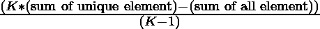

# 数组中唯一的元素，其中除了一个元素外，所有元素都出现了 K 次|集合 2

> 原文:[https://www . geesforgeks . org/unique-element-in-a-array-all-elements-except-k-times-one-set-2/](https://www.geeksforgeeks.org/unique-element-in-an-array-where-all-elements-occur-k-times-except-one-set-2/)

给定一个[数组](https://www.geeksforgeeks.org/introduction-to-arrays/) **arr[]** ，其中每个元素出现 **K** 次，只有一个元素只出现一次，任务是[找到那个唯一的元素](https://www.geeksforgeeks.org/find-unique-element-element-occurs-k-times-except-one/)。
**示例:**

> **输入:** arr[] = {12，1，12，3，12，1，1，2，3，2，3，7}，k = 3
> **输出:** 7
> **说明:**
> 7 是唯一出现一次的元素，其他元素出现 k 次。
> **输入:** arr[] = {12，12，2，2，3}，k = 2
> **输出:** 3
> **说明:**
> 3 是唯一一个出现一次而其他出现 k 次的元素。

**天真方法:**假设我们有每个元素 **K** 次，那么给定数组中所有元素的**和**与所有唯一元素的**K *和**之差就是 **(K-1)次**唯一元素。
**例如:**

> arr[] = {a，a，a，b，b，b，c，c，c，d}，k = 3
> 唯一元素= {a，b，c，d}
> 差= 3 *(a+b+ c+d)–(a+a+b+ b+ b+ c+c+c+d)= 2 * d
> 因此，将方程进行推广:
> 唯一元素可由下式给出:
> 
> 

以下是步骤:

1.  将给定数组的所有元素存储在集合中，以获得唯一的元素。
2.  求数组中所有元素的和(比如 **sum_array** )以及集合中所有元素的和(比如 **sum_set** )。
3.  唯一元素由**(K * sum _ set–sum _ array)/(K–1)**给出。

以下是上述方法的实现:

## C++

```
// C++ program for the above approach

#include <bits/stdc++.h>
using namespace std;

// Function that find the unique element
// in the array arr[]
int findUniqueElements(int arr[], int N,
                       int K)
{
    // Store all unique element in set
    unordered_set<int> s(arr, arr + N);

    // Sum of all element of the array
    int arr_sum = accumulate(arr, arr + N, 0);

    // Sum of element in the set
    int set_sum = accumulate(s.begin(),
                             s.end(),
                             0);

    // Print the unique element using formula
    cout << (K * set_sum - arr_sum) / (K - 1);
}

// Driver Code
int main()
{

    int arr[] = { 12, 1, 12, 3, 12, 1,
                  1, 2, 3, 2, 2, 3, 7 };
    int N = sizeof(arr) / sizeof(arr[0]);
    int K = 3;

    // Function call
    findUniqueElements(arr, N, K);

    return 0;
}
```

## Java 语言(一种计算机语言，尤用于创建网站)

```
// Java program for the above approach
import java.util.*;

class GFG{

// Function that find the unique element
// in the array arr[]
static void findUniqueElements(int arr[],
                               int N, int K)
{

    // Store all unique element in set
    Set<Integer> s = new HashSet<>();
    for(int i = 0; i < N; i++)
        s.add(arr[i]);

    // Sum of all element of the array
    int arr_sum = 0;
    for(int i = 0; i < N; i++)
        arr_sum += arr[i];

    // Sum of element in the set
    int set_sum = 0;
    Iterator it = s.iterator();

    while (it.hasNext())
    {
        set_sum += (int)it.next();
    }

    // Print the unique element using formula
    System.out.println((K * set_sum - arr_sum) /
                       (K - 1));
}

// Driver code
public static void main(String[] args)
{
    int arr[] = { 12, 1, 12, 3, 12, 1,
                  1, 2, 3, 2, 2, 3, 7 };
    int N = arr.length;
    int K = 3;

    // Function call
    findUniqueElements(arr, N, K);
}
}

// This code is contributed by offbeat
```

## 蟒蛇 3

```
# Python3 program for the above approach

# Function that find the unique element
# in the array arr[]
def findUniqueElements(arr, N, K):

    # Store all unique element in set
    s = set()
    for x in arr:
        s.add(x)

    # Sum of all element of the array
    arr_sum = sum(arr)

    # Sum of element in the set
    set_sum = 0
    for x in s:
        set_sum += x

    # Print the unique element using formula
    print((K * set_sum - arr_sum) // (K - 1))

# Driver Code
if __name__ == '__main__':

    arr = [ 12, 1, 12, 3, 12, 1,
            1, 2, 3, 2, 2, 3, 7 ]
    N = len(arr)
    K = 3

    # Function call
    findUniqueElements(arr, N, K)

# This code is contributed by Samarth
```

## C#

```
// C# program for the above approach
using System;
using System.Collections.Generic;
class GFG{

// Function that find the unique element
// in the array []arr
static void findUniqueElements(int []arr,
                               int N, int K)
{

    // Store all unique element in set
    HashSet<int> s = new HashSet<int>();
    for(int i = 0; i < N; i++)
        s.Add(arr[i]);

    // Sum of all element of the array
    int arr_sum = 0;
    for(int i = 0; i < N; i++)
        arr_sum += arr[i];

    // Sum of element in the set
    int set_sum = 0;
    foreach(int i in s)
        set_sum += i;

    // Print the unique element using formula
    Console.WriteLine((K * set_sum - arr_sum) /
                      (K - 1));
}

// Driver code
public static void Main(String[] args)
{
    int []arr = { 12, 1, 12, 3, 12, 1,
                  1, 2, 3, 2, 2, 3, 7 };
    int N = arr.Length;
    int K = 3;

    // Function call
    findUniqueElements(arr, N, K);
}
}

// This code is contributed by gauravrajput1
```

## java 描述语言

```
<script>

// JavaScript implementation of the above approach

// Function that find the unique element
// in the array arr[]
function findUniqueElements(arr, N, K)
{
    // Store all unique element in set
    var s = new Set(arr);

    // Sum of all element of the array
    var arr_sum = arr.reduce((a, b) => a + b, 0);

    // Sum of element in the set
    var set_sum = 0;
    s.forEach(function(value) {
        set_sum += value;
    })

    // Print the unique element using formula
document.write(Math.floor((K * set_sum - arr_sum) / (K - 1)));
}

// Driver Code
var arr = [ 12, 1, 12, 3, 12, 1,
                  1, 2, 3, 2, 2, 3, 7 ];
var N = arr.length;
var K = 3;

findUniqueElements(arr, N,K);

</script>
```

**Output**

```
7
```

***时间复杂度:** O(N)* ，其中 N 为数组中的元素个数
***辅助空间复杂度:** O(N/K)* ，其中 K 为频率。

**另一种方法:**想法是使用[散列](https://www.geeksforgeeks.org/hashing-data-structure/)，但是这将花费 O(n)个时间并且需要额外的空间。我们也可以通过排序来完成，但这需要 O(N log N)时间。

**高效方法:**上述问题可以根据恒定的空间复杂度进行优化。使用[位操纵](https://www.geeksforgeeks.org/bits-manipulation-important-tactics/)方法解决此问题。

*   假设有一种情况，除了一个元素，所有元素都出现了 k 次。
*   所以，把每一个元素的比特数记为 32 比特。
*   对每个元素的第 0 位进行计数并取 k 的模将会消除出现 k 次的元素的位，我们只保留出现一次的元素的位。
*   对所有 32 位应用这个过程，通过取 k 的模，我们将消除重复的元素位。
*   在每一步，从这些剩余的位生成结果。
*   要处理任何负数，请检查数组中是否有结果，如果有，则打印出来。否则打印结果的底片。

> 例如 arr[] = {2，2，4，2，2，2，1，1，1，1，1}，k = 5
> 
> <figure class="table">
> 
> | 索引 | 元素 | 第二位 | 第一位 | 第 0 位 |
> | Zero | 2= 010 | Zero | one | Zero |
> | one | 2= 010 | Zero | one | Zero |
> | Two | 4 =100 | one | Zero | Zero |
> | three | 2= 010 | Zero | one | Zero |
> | four | 2= 010 | Zero | one | Zero |
> | five | 2= 010 | Zero | one | Zero |
> | six | 1 = 001 | Zero | Zero | one |
> | seven | 1 = 001 | Zero | Zero | one |
> | eight | 1 = 001 | Zero | Zero | one |
> | nine | 1 = 001 | Zero | Zero | one |
> | Ten | 1 = 001 | Zero | Zero | one |
> | 总和%k |   | 1%5=1 | 5%5=0 | 5%5=0 |
> | 结果 |   | one | Zero | Zero |
> 
> </figure>
> 
> 我们的结果是(100)二进制= 4 十进制。所以最后的答案会是 4，因为它呈现了 1 次。

下面是上述方法的实现:

## C++

```
// CPP program for the above approach
#include <bits/stdc++.h>
using namespace std;

// Function to find single occurrence element
int findunique(vector<int>& a, int k)
{
    int res = 0;

    for (int i = 0; i < 32; i++) {
        int p = 0;

        for (int j = 0; j < a.size(); j++) {
            // By shifting 1 to left ith
            // time and taking and with 1
            // will give us that ith
            // bit of a[j] is 1 or 0
            p += (abs(a[j]) & (
                  1 << i)) != 0 ? 1 : 0;
        }

        // Taking modulo of p with k
        p %= k;

        // Generate result
        res += pow(2, i) * p;
    }

    int c = 0;

    // Loop for negative numbers
    for (auto x : a)

        if (x == res) {
            c = 1;
            break;
        }

    // Check if the calculated value res
    // is present in array, then mark c=1
    // and if c = 1 return res
    // else res must be -ve
    return c == 1 ? res : -res;
}

// Driver code
int main()
{

    vector<int> a = { 12, 12, 2, 2, 3 };
    int k = 2;

    // Function call
    cout << findunique(a, k) << "\n";
}
// This article is contributed by ajaykr00kj
```

## Java 语言(一种计算机语言，尤用于创建网站)

```
// Java program for the above approach
import java.util.Arrays;
class Main{

// Function to find single
// occurrence element
public static int findunique(int a[],
                             int k)
{
  int res = 0;

  for (int i = 0; i < 32; i++)
  {
    int p = 0;

    for (int j = 0; j < a.length; j++)
    {
      // By shifting 1 to left ith
      // time and taking and with 1
      // will give us that ith
      // bit of a[j] is 1 or 0
      p += (Math.abs(a[j]) &
           (1 << i)) != 0 ? 1 : 0;
    }

    // Taking modulo of p with k
    p %= k;

    // Generate result
    res += Math.pow(2, i) * p;
  }

  int c = 0;

  // Loop for negative numbers
  for (int x = 0; x < a.length; x++)

    if (a[x] == res)
    {
      c = 1;
      break;
    }

  // Check if the calculated value res
  // is present in array, then mark c=1
  // and if c = 1 return res
  // else res must be -ve
  return c == 1 ? res : -res;
}

// Driver code
public static void main(String[] args)
{
  int a[] = {12, 12, 2, 2, 3};
  int k = 2;

  // Function call
  System.out.println(findunique(a, k));
}
}

// This code is contributed by divyeshrabadiya07
```

## 蟒蛇 3

```
# Python3 program for the above approach

# Function to find single occurrence element
def findunique(a, k):

    res = 0

    for i in range(32):
        p = 0

        for j in range(len(a)):

            # By shifting 1 to left ith
            # time and taking and with 1
            # will give us that ith
            # bit of a[j] is 1 or 0
            if (abs(a[j]) & (1 << i)) != 0 :
                p += 1

        # Taking modulo of p with k
        p %= k

        # Generate result
        res += pow(2, i) * p

    c = 0

    # Loop for negative numbers
    for x in a:

        if (x == res) :
            c = 1
            break

    # Check if the calculated value res
    # is present in array, then mark c=1
    # and if c = 1 return res
    # else res must be -ve
    if c == 1 :
        return res
    else :
        return -res

# Driver code
a = [ 12, 12, 2, 2, 3 ]
k = 2

# Function call
print(findunique(a, k))

# This code is contributed by divyesh072019
```

## C#

```
// C# program for the
// above approach
using System;
class GFG{

// Function to find single
// occurrence element
public static int findunique(int []a,
                             int k)
{
  int res = 0;

  for (int i = 0; i < 32; i++)
  {
    int p = 0;

    for (int j = 0; j < a.Length; j++)
    {
      // By shifting 1 to left ith
      // time and taking and with 1
      // will give us that ith
      // bit of a[j] is 1 or 0
      p += (Math.Abs(a[j]) &
           (1 << i)) != 0 ? 1 : 0;
    }

    // Taking modulo of p with k
    p %= k;

    // Generate result
    res += (int)Math.Pow(2, i) * p;
  }

  int c = 0;

  // Loop for negative numbers
  for (int x = 0; x < a.Length; x++)

    if (a[x] == res)
    {
      c = 1;
      break;
    }

  // Check if the calculated value res
  // is present in array, then mark c=1
  // and if c = 1 return res
  // else res must be -ve
  return c == 1 ? res : -res;
}

// Driver code
public static void Main(string []args)
{
  int []a = {12, 12, 2, 2, 3};
  int k = 2;

  // Function call
  Console.Write(findunique(a, k));
}
}

// This code is contributed by Rutvik_56
```

## java 描述语言

```
<script>

// Javascript program for the above approach

// Function to find single occurrence element
function findunique(a, k)
{
    var res = 0;

    for (var i = 0; i < 32; i++) {
        var p = 0;

        for (var j = 0; j < a.length; j++) {
            // By shifting 1 to left ith
            // time and taking and with 1
            // will give us that ith
            // bit of a[j] is 1 or 0
            p += (Math.abs(a[j]) & (
                  1 << i)) != 0 ? 1 : 0;
        }

        // Taking modulo of p with k
        p %= k;

        // Generate result
        res += Math.pow(2, i) * p;
    }

    var c = 0;

    // Loop for negative numbers
    for (var i =0;i<a.length;i++)

        if (a[i] == res) {
            c = 1;
            break;
        }

    // Check if the calculated value res
    // is present in array, then mark c=1
    // and if c = 1 return res
    // else res must be -ve
    return c == 1 ? res : -res;
}

// Driver code

var a = [ 12, 12, 2, 2, 3 ];
var k = 2;

// Function call
document.write( findunique(a, k) + "<br>");

</script>
```

**Output**

```
3
```

***时间复杂度:** O(32 * n) = O(n)*
***辅助空间:** O(1)*