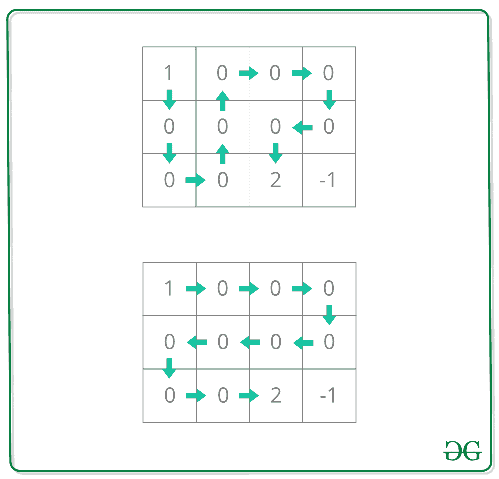

# 在一个网格中恰好覆盖每个无障碍物区块一次的唯一路径

> 原文:[https://www . geesforgeks . org/unique-path-cover-even-non-barrier-grid-恰好一次/](https://www.geeksforgeeks.org/unique-paths-covering-every-non-obstacle-block-exactly-once-in-a-grid/)

给定一个带有 **4** 类型块的网格**网格[][]** :

*   **1** 代表起始块。只有一个起点。
*   **2** 代表结束块。结局只有一个。
*   **0** 代表我们可以走过的空街区。
*   **-1** 代表我们无法跨越的障碍。

任务是计算从起始块到结束块的路径数，以便每个非障碍块恰好被覆盖一次。

**示例:**

> **输入:**网格[][] = {
> {1，0，0，0}，
> {0，0，0，0}，
> {0，0，2，-1} }
> **输出:** 2
> 以下是覆盖所有非障碍物的唯一路径:
> 
> 
> 
> **输入:**网格[][] = {
> {1，0，0，0}，
> {0，0，0，0}，
> {0，0，0，2} }
> **输出:** 4

**方法:**这里我们可以用简单的 DFS 加回溯。我们可以通过计算路上遇到的所有障碍物，并最终将其与可用的障碍物总数进行比较，来检查特定路径是否覆盖了所有非障碍物障碍物，如果匹配，则将其添加为有效的解决方案。

下面是上述方法的实现:

## C++

```
// C++ implementation of the approach
#include <bits/stdc++.h>
using namespace std;

// Function for dfs.
// i, j ==> Current cell indexes
// vis ==> To mark visited cells
// ans ==> Result
// z ==> Current count 0s visited
// z_count ==> Total 0s present
void dfs(int i, int j, vector<vector<int> >& grid,
         vector<vector<bool> >& vis, int& ans,
         int z, int z_count)
{
    int n = grid.size(), m = grid[0].size();

    // Mark the block as visited
    vis[i][j] = 1;
    if (grid[i][j] == 0)

        // update the count
        z++;

    // If end block reached
    if (grid[i][j] == 2) {

        // If path covered all the non-
        // obstacle blocks
        if (z == z_count)
            ans++;
        vis[i][j] = 0;
        return;
    }

    // Up
    if (i >= 1 && !vis[i - 1][j] && grid[i - 1][j] != -1)
        dfs(i - 1, j, grid, vis, ans, z, z_count);

    // Down
    if (i < n - 1 && !vis[i + 1][j] && grid[i + 1][j] != -1)
        dfs(i + 1, j, grid, vis, ans, z, z_count);

    // Left
    if (j >= 1 && !vis[i][j - 1] && grid[i][j - 1] != -1)
        dfs(i, j - 1, grid, vis, ans, z, z_count);

    // Right
    if (j < m - 1 && !vis[i][j + 1] && grid[i][j + 1] != -1)
        dfs(i, j + 1, grid, vis, ans, z, z_count);

    // Unmark the block (unvisited)
    vis[i][j] = 0;
}

// Function to return the count of the unique paths
int uniquePaths(vector<vector<int> >& grid)
{
    int z_count = 0; // Total 0s present
    int n = grid.size(), m = grid[0].size();
    int ans = 0;
    vector<vector<bool> > vis(n, vector<bool>(m, 0));
    int x, y;
    for (int i = 0; i < n; ++i) {
        for (int j = 0; j < m; ++j) {

            // Count non-obstacle blocks
            if (grid[i][j] == 0)
                z_count++;
            else if (grid[i][j] == 1) {

                // Starting position
                x = i, y = j;
            }
        }
    }
    dfs(x, y, grid, vis, ans, 0, z_count);
    return ans;
}

// Driver code
int main()
{
    vector<vector<int> > grid{ { 1, 0, 0, 0 },
                               { 0, 0, 0, 0 },
                               { 0, 0, 2, -1 } };

    cout << uniquePaths(grid);
    return 0;
}
```

## Java 语言(一种计算机语言，尤用于创建网站)

```
// Java implementation of the approach
import java.util.Arrays;
class GFG
{
  static int ans = 0;

  // Function for dfs.
  // i, j ==> Current cell indexes
  // vis ==> To mark visited cells
  // ans ==> Result
  // z ==> Current count 0s visited
  // z_count ==> Total 0s present
  static void dfs(int i, int j, int[][] grid,
                  boolean[][] vis, int z, int z_count)
  {
    int n = grid.length, m = grid[0].length;

    // Mark the block as visited
    vis[i][j] = true;
    if (grid[i][j] == 0)

      // update the count
      z++;

    // If end block reached
    if (grid[i][j] == 2)
    {

      // If path covered all the non-
      // obstacle blocks
      if (z == z_count)
        ans++;
      vis[i][j] = false;
      return;
    }

    // Up
    if (i >= 1 && !vis[i - 1][j] && grid[i - 1][j] != -1)
      dfs(i - 1, j, grid, vis, z, z_count);

    // Down
    if (i < n - 1 && !vis[i + 1][j] && grid[i + 1][j] != -1)
      dfs(i + 1, j, grid, vis, z, z_count);

    // Left
    if (j >= 1 && !vis[i][j - 1] && grid[i][j - 1] != -1)
      dfs(i, j - 1, grid, vis, z, z_count);

    // Right
    if (j < m - 1 && !vis[i][j + 1] && grid[i][j + 1] != -1)
      dfs(i, j + 1, grid, vis, z, z_count);

    // Unmark the block (unvisited)
    vis[i][j] = false;
  }

  // Function to return the count of the unique paths
  static int uniquePaths(int[][] grid)
  {
    int z_count = 0; // Total 0s present
    int n = grid.length, m = grid[0].length;

    boolean[][] vis = new boolean[n][m];
    for (int i = 0; i < n; i++)
    {
      Arrays.fill(vis[i], false);
    }
    int x = 0, y = 0;
    for (int i = 0; i < n; ++i)
    {
      for (int j = 0; j < m; ++j)
      {

        // Count non-obstacle blocks
        if (grid[i][j] == 0)
          z_count++;
        else if (grid[i][j] == 1)
        {

          // Starting position
          x = i;
          y = j;
        }
      }
    }
    dfs(x, y, grid, vis, 0, z_count);
    return ans;
  }

  // Driver code
  public static void main(String[] args)
  {

    int[][] grid = { { 1, 0, 0, 0 }, { 0, 0, 0, 0 }, { 0, 0, 2, -1 } };
    System.out.println(uniquePaths(grid));
  }
}

// This code is contributed by sanjeev2552
```

## 蟒蛇 3

```
# Python3 implementation of the approach

# Function for dfs.
# i, j ==> Current cell indexes
# vis ==> To mark visited cells
# ans ==> Result
# z ==> Current count 0s visited
# z_count ==> Total 0s present
def dfs(i, j, grid, vis, ans, z, z_count):

    n = len(grid)
    m = len(grid[0])

    # Mark the block as visited
    vis[i][j] = 1

    if (grid[i][j] == 0):

        # Update the count
        z += 1

    # If end block reached
    if (grid[i][j] == 2):

        # If path covered all the non-
        # obstacle blocks
        if (z == z_count):
            ans += 1

        vis[i][j] = 0

        return grid, vis, ans

    # Up
    if (i >= 1 and not vis[i - 1][j] and
                      grid[i - 1][j] != -1):
        grid, vis, ans = dfs(i - 1, j, grid,
                             vis, ans, z,
                             z_count)

    # Down
    if (i < n - 1 and not vis[i + 1][j] and
                         grid[i + 1][j] != -1):
        grid, vis, ans = dfs(i + 1, j, grid,
                             vis, ans, z,
                             z_count)

    # Left
    if (j >= 1 and not vis[i][j - 1] and
                      grid[i][j - 1] != -1):
        grid, vis, ans = dfs(i, j - 1, grid,
                             vis, ans, z,
                             z_count)

    # Right
    if (j < m - 1 and not vis[i][j + 1] and
                         grid[i][j + 1] != -1):
        grid, vis, ans = dfs(i, j + 1, grid,
                             vis, ans, z,
                             z_count)

    # Unmark the block (unvisited)
    vis[i][j] = 0

    return grid, vis, ans

# Function to return the count
# of the unique paths
def uniquePaths(grid):

    # Total 0s present
    z_count = 0
    n = len(grid)
    m = len(grid[0])
    ans = 0

    vis = [[0 for j in range(m)]
              for i in range(n)]

    x = 0
    y = 0

    for i in range(n):
        for j in range(m):

            # Count non-obstacle blocks
            if grid[i][j] == 0:
                z_count += 1

            elif (grid[i][j] == 1):

                # Starting position
                x = i
                y = j

    grid, vis, ans = dfs(x, y, grid,
                         vis, ans, 0,
                         z_count)

    return ans

# Driver code
if __name__=='__main__':

    grid = [ [ 1, 0, 0, 0 ],
             [ 0, 0, 0, 0 ],
             [ 0, 0, 2, -1 ] ]

    print(uniquePaths(grid))

# This code is contributed by rutvik_56
```

## C#

```
// C# implementation of the approach
using System;
class GFG {

  static int ans = 0;

  // Function for dfs.
  // i, j ==> Current cell indexes
  // vis ==> To mark visited cells
  // ans ==> Result
  // z ==> Current count 0s visited
  // z_count ==> Total 0s present
  static void dfs(int i, int j, int[,] grid,
                  bool[,] vis, int z, int z_count)
  {
    int n = grid.GetLength(0), m = grid.GetLength(1);

    // Mark the block as visited
    vis[i,j] = true;
    if (grid[i,j] == 0)

      // update the count
      z++;

    // If end block reached
    if (grid[i,j] == 2)
    {

      // If path covered all the non-
      // obstacle blocks
      if (z == z_count)
        ans++;
      vis[i,j] = false;
      return;
    }

    // Up
    if (i >= 1 && !vis[i - 1,j] && grid[i - 1,j] != -1)
      dfs(i - 1, j, grid, vis, z, z_count);

    // Down
    if (i < n - 1 && !vis[i + 1,j] && grid[i + 1,j] != -1)
      dfs(i + 1, j, grid, vis, z, z_count);

    // Left
    if (j >= 1 && !vis[i,j - 1] && grid[i,j - 1] != -1)
      dfs(i, j - 1, grid, vis, z, z_count);

    // Right
    if (j < m - 1 && !vis[i,j + 1] && grid[i,j + 1] != -1)
      dfs(i, j + 1, grid, vis, z, z_count);

    // Unmark the block (unvisited)
    vis[i,j] = false;
  }

  // Function to return the count of the unique paths
  static int uniquePaths(int[,] grid)
  {
    int z_count = 0; // Total 0s present
    int n = grid.GetLength(0), m = grid.GetLength(1);

    bool[,] vis = new bool[n,m];
    for (int i = 0; i < n; i++)
    {
        for(int j = 0; j < m; j++)
        {
            vis[i,j] = false;
        }
    }
    int x = 0, y = 0;
    for (int i = 0; i < n; ++i)
    {
      for (int j = 0; j < m; ++j)
      {

        // Count non-obstacle blocks
        if (grid[i,j] == 0)
          z_count++;
        else if (grid[i,j] == 1)
        {

          // Starting position
          x = i;
          y = j;
        }
      }
    }
    dfs(x, y, grid, vis, 0, z_count);
    return ans;
  }

  // Driver code
  static void Main() {
    int[,] grid = { { 1, 0, 0, 0 }, { 0, 0, 0, 0 }, { 0, 0, 2, -1 } };
    Console.WriteLine(uniquePaths(grid));
  }
}

// This code is contributed by divyesh072019.
```

## java 描述语言

```
<script>
    // Javascript implementation of the approach
    let ans = 0;

    // Function for dfs.
    // i, j ==> Current cell indexes
    // vis ==> To mark visited cells
    // ans ==> Result
    // z ==> Current count 0s visited
    // z_count ==> Total 0s present
    function dfs(i, j, grid, vis, z, z_count)
    {
      let n = grid.length, m = grid[0].length;

      // Mark the block as visited
      vis[i][j] = true;
      if (grid[i][j] == 0)

        // update the count
        z++;

      // If end block reached
      if (grid[i][j] == 2)
      {

        // If path covered all the non-
        // obstacle blocks
        if (z == z_count)
          ans++;
        vis[i][j] = false;
        return;
      }

      // Up
      if (i >= 1 && !vis[i - 1][j] && grid[i - 1][j] != -1)
        dfs(i - 1, j, grid, vis, z, z_count);

      // Down
      if (i < n - 1 && !vis[i + 1][j] && grid[i + 1][j] != -1)
        dfs(i + 1, j, grid, vis, z, z_count);

      // Left
      if (j >= 1 && !vis[i][j - 1] && grid[i][j - 1] != -1)
        dfs(i, j - 1, grid, vis, z, z_count);

      // Right
      if (j < m - 1 && !vis[i][j + 1] && grid[i][j + 1] != -1)
        dfs(i, j + 1, grid, vis, z, z_count);

      // Unmark the block (unvisited)
      vis[i][j] = false;
    }

    // Function to return the count of the unique paths
    function uniquePaths(grid)
    {
      let z_count = 0; // Total 0s present
      let n = grid.length, m = grid[0].length;

      let vis = new Array(n);
      for (let i = 0; i < n; i++)
      {
          vis[i] = new Array(m);
        for(let j = 0; j < m; j++)
        {
            vis[i][j] = false;
        }
      }
      let x = 0, y = 0;
      for (let i = 0; i < n; ++i)
      {
        for (let j = 0; j < m; ++j)
        {

          // Count non-obstacle blocks
          if (grid[i][j] == 0)
            z_count++;
          else if (grid[i][j] == 1)
          {

            // Starting position
            x = i;
            y = j;
          }
        }
      }
      dfs(x, y, grid, vis, 0, z_count);
      return ans;
    }

    let grid = [ [ 1, 0, 0, 0 ], [ 0, 0, 0, 0 ], [ 0, 0, 2, -1 ] ];
    document.write(uniquePaths(grid));

// This code is contributed by decode2207.
</script>
```

**Output:** 

```
2
```

**时间复杂度:** O(行*列)
T3】辅助空间: O(行*列)