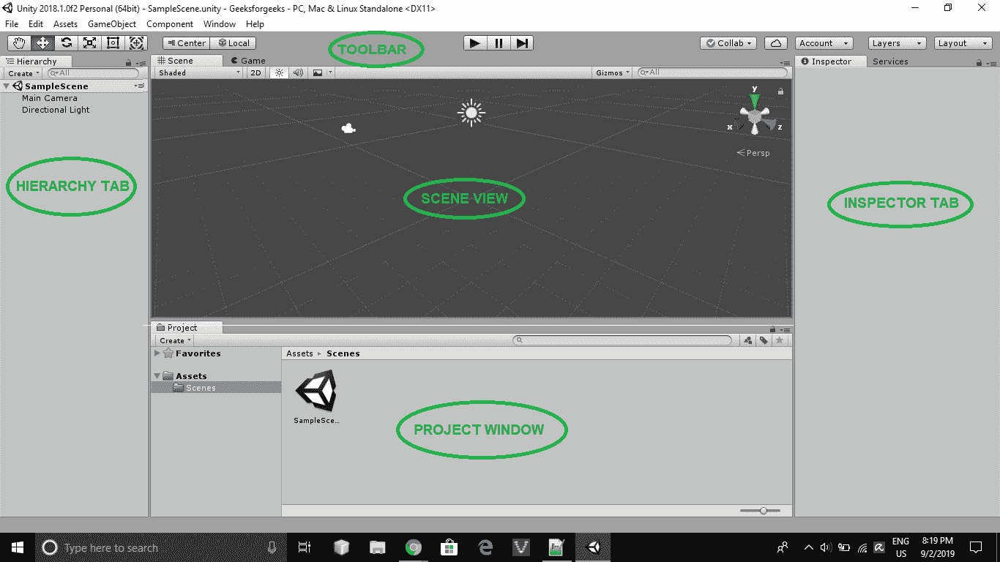
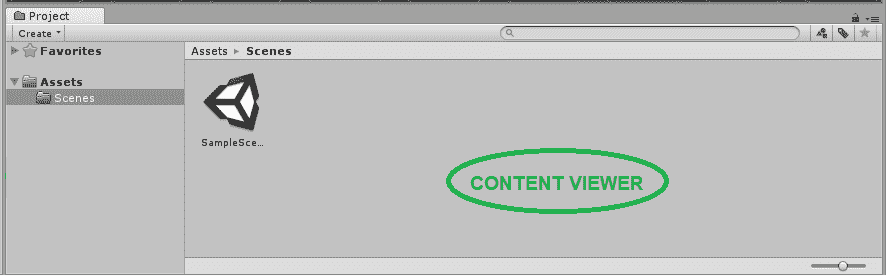
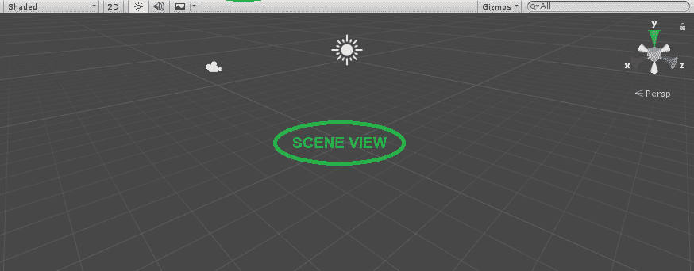
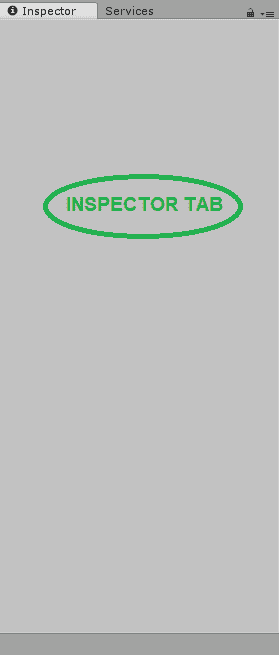
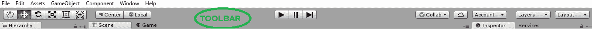
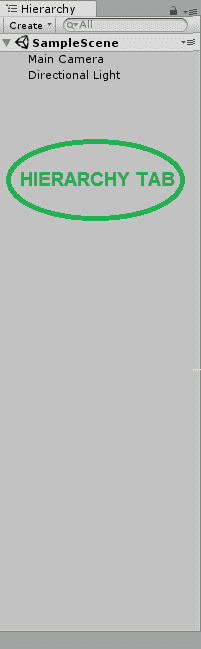

# Unity |界面介绍

> 原文:[https://www . geeksforgeeks . org/unity-introduction-to-interface/](https://www.geeksforgeeks.org/unity-introduction-to-interface/)

带 Unity 的[游戏开发|简介](https://www.geeksforgeeks.org/game-development-with-unity-introduction/)一文介绍了关于 Unity 以及如何安装。在本文中，我们将看到如何创建一个新项目，并了解 Unity 游戏编辑器的界面。

**创建新项目**

1.  打开统一中心。
2.  点击右上方的**新建**按钮。
3.  选择三维项目。
4.  给出项目名称并创建项目。

默认情况下，统一编辑器将打开一个示例场景。编辑器窗口中不同选项卡的排列方式使您可以轻松访问最常见的功能。下图为默认布局:

**所有不同标签及其用途的总结:**

*   **Project Window:**
    

    项目窗口由两个面板组成。浏览器的左侧面板将项目的文件夹结构显示为分层列表。当通过单击从列表中选择一个文件夹时，其内容将在面板中正确显示。您可以单击小三角形来展开或折叠文件夹，显示其中包含的任何嵌套文件夹。按住 Alt 键，同时单击以递归方式展开或折叠任何嵌套文件夹。

*   **Scene/Game View:**
    

    场景窗口是我们实际制作游戏的地方。当我们点击播放按钮时，游戏窗口显示游戏的开始场景。我们将在以后的文章中详细了解这些内容。

*   **Inspector Window:**
    

    检查器窗口显示任何选定游戏对象的属性。

*   **Toolbar:**
    

    工具栏包含不同功能的各种图标。这些按钮用于:

    1.  左边的前 6 个按钮(从手动按钮到靶心按钮)称为变换工具。它们用于改变场景的视图，并对游戏对象进行基本更改，如改变它们的位置、旋转等。
    2.  接下来的两个按钮(中心/枢轴和全局/局部)称为小控件工具。它们用于改变游戏对象的视图。
    3.  接下来是播放/暂停/步进按钮。这些用来运行我们在场景中创建的游戏。
    4.  云按钮打开统一服务窗口。
    5.  帐户按钮用于访问您的 Unity 帐户。
    6.  图层按钮用于选择要显示的游戏对象。
    7.  布局按钮提供了不同的选项来排列所有这些讨论的窗口。默认打开的视图名为**默认**。
*   **Hierarchy Window:**
    

    “层次”窗口显示场景中所有活动游戏对象的列表。这些游戏对象可以是可见的，也可以是隐藏的。隐藏的游戏对象在层次选项卡中变灰。

编辑器各方面的详细信息可以在[官方手册链接](https://docs.unity3d.com/Manual/UsingTheEditor.html)中找到。