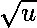
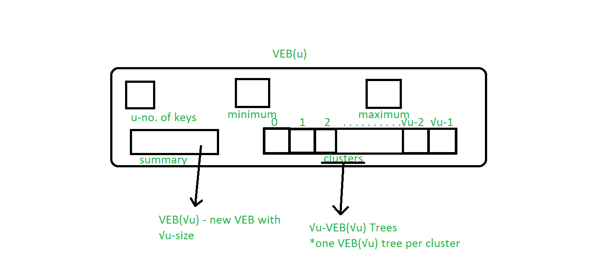
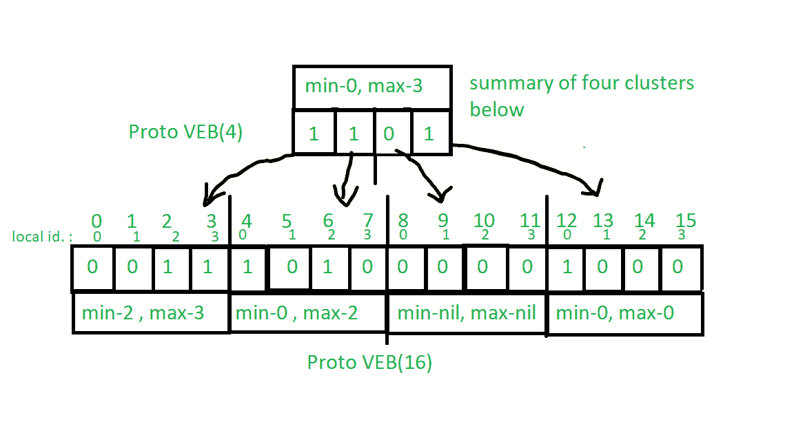
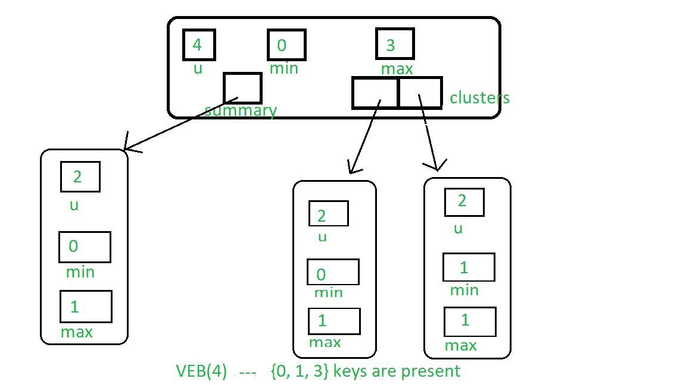

# 范·埃姆德·博阿斯树|第 1 集|基础和构造

> 原文:[https://www . geesforgeks . org/van-emde-boas-tree-set-1-basic-and-construction/](https://www.geeksforgeeks.org/van-emde-boas-tree-set-1-basics-and-construction/)

强烈建议全面了解[原万埃姆德博阿斯树](https://www.geeksforgeeks.org/proto-van-emde-boas-trees-set-1-background-introduction/)。

Van Emde Boas Tree 支持 O(lglgN)时间内的搜索、后继、前置、插入和删除操作，比优先级队列、二叉查找树等任何相关数据结构都要快。范·埃姆德·博阿斯树利用 O(1)时间复杂度进行最小和最大查询。这里 N 是定义树的宇宙的大小，lg 是对数基数 2。

**注意:** Van Emde Boas Data Structure 的密钥集必须在 0 到 n(n 是形式 2 <sup>k</sup> 的正整数)的范围内定义，并且在不允许重复密钥时有效。

**缩写:**

1.  VEB 是范·埃姆德·博阿斯树的缩写。
2.  VEB( )是 VEB 的缩写，包含 u 个键。

**凡·埃姆德·博阿斯树的结构:**



范·埃姆德·博阿斯树是一种递归定义的结构。

1.  **u**:VEB 树中存在的键的数量。
2.  **最小值:**包含 VEB 树中存在的最小键。
3.  **最大值:**包含 VEB 树中存在的最大键。
4.  **摘要:**指向新的 VEB( )树，该树包含集群数组中存在的键的概述。
5.  **集群:**一个大小的阵列阵列中的每个地方都指向新的 VEB( )树。

请参见下图，了解 Van Emde Boas Tree 的基础知识，尽管它并不代表 Van Emde Boas Tree 的实际结构:



**对范·埃姆德·博阿斯树的基本认识:**

1.  范·埃姆德·博阿斯树是递归定义的结构，类似于原型范·埃姆德·博阿斯树。
2.  在范埃姆德博阿斯树中，最小和最大查询在 O(1)时间内工作，因为范埃姆德博阿斯树存储树结构中存在的最小和最大键。
3.  添加最大值和最小值属性的优势有助于降低时间复杂性:
    *   如果 VEB 树的任何最小值和最大值为空(代码中为零或-1)，则树中不存在元素。
    *   如果最小值和最大值相等，则结构中只存在一个值。
    *   如果两者都存在并且不同，则树中存在两个或更多元素。
    *   我们可以通过在常数时间(0(1))中根据条件设置最大值和最小值来插入和删除键，这有助于减少递归调用链:如果 VEB 中只有一个键，那么要删除该键，我们只需将最小值和最大值设置为零值。类似地，如果没有键，那么我们可以通过设置最小和最大到我们想要插入的键来插入。这些是 O(1)运算。
    *   在后继查询和前任查询中，我们可以根据 VEB 的最小值和最大值进行决策，这将使我们的工作更容易。

在原型范·埃姆德·博阿斯树中，宇宙大小的大小被限制为类型 2 <sup>2 <sup>k</sup></sup> ，但是在范·埃姆德·博阿斯树中，它允许宇宙大小是 2 的精确幂。所以我们需要如下修改 Proto Van Emde Boas Tree 中使用的 High(x)、low(x)、generate_index()辅助函数。

1.  High(x):会返回 floor( x/ceil( ))，基本上就是键 x 所在的簇索引。

```
High(x) = floor(x/ceil())
```

*   低(x):它将返回 x mod ceil( )，这是它在集群中的位置。

    ```
    Low(x) = x % ceil( )
    ```

    *   generate_index(a, b) : It will return position of key from its position in cluster b and its cluster index a.

    ```
    generate_index(a, b) = a * ceil() + b
    ```

    **凡·埃姆德·博阿斯树的构建:**凡·埃姆德·博阿斯树的构建与 Proto 凡·埃姆德·博阿斯树非常相似。这里的区别是，我们允许宇宙大小是 2 的任意次方，这样 high()，low()，generate_index()就会不同。

    构建，空 VEB:程序与原 VEB 相同，只是在每个 VEB 中添加了两个最小和最大的东西。为了表示最小值和最大值为空，我们将其表示为-1。

    **注意:**在基本情况下，我们只需要最小值和最大值，因为添加最小值和最大值后，添加大小为 2 的集群将是多余的。

    

    下面是实现:

    ```
    // C++ implementation of the approach
    #include <bits/stdc++.h>
    using namespace std;

    class Van_Emde_Boas {

    public:
        int universe_size;
        int minimum;
        int maximum;
        Van_Emde_Boas* summary;
        vector<Van_Emde_Boas*> clusters;

        // Function to return cluster numbers
        // in which key is present
        int high(int x)
        {
            int div = ceil(sqrt(universe_size));
            return x / div;
        }

        // Function to return position of x in cluster
        int low(int x)
        {
            int mod = ceil(sqrt(universe_size));
            return x % mod;
        }

        // Function to return the index from
        // cluster number and position
        int generate_index(int x, int y)
        {
            int ru = ceil(sqrt(universe_size));
            return x * ru + y;
        }

        // Constructor
        Van_Emde_Boas(int size)
        {
            universe_size = size;
            minimum = -1;
            maximum = -1;

            // Base case
            if (size <= 2) {
                summary = nullptr;
                clusters = vector<Van_Emde_Boas*>(0, nullptr);
            }
            else {
                int no_clusters = ceil(sqrt(size));

                // Assigning VEB(sqrt(u)) to summary
                summary = new Van_Emde_Boas(no_clusters);

                // Creating array of VEB Tree pointers of size sqrt(u)
                clusters = vector<Van_Emde_Boas*>(no_clusters, nullptr);

                // Assigning VEB(sqrt(u)) to all of its clusters
                for (int i = 0; i < no_clusters; i++) {
                    clusters[i] = new Van_Emde_Boas(ceil(sqrt(size)));
                }
            }
        }
    };

    // Driver code
    int main()
    {
        // New Van_Emde_Boas tree with u = 16
        Van_Emde_Boas* akp = new Van_Emde_Boas(4);
    }
    ```