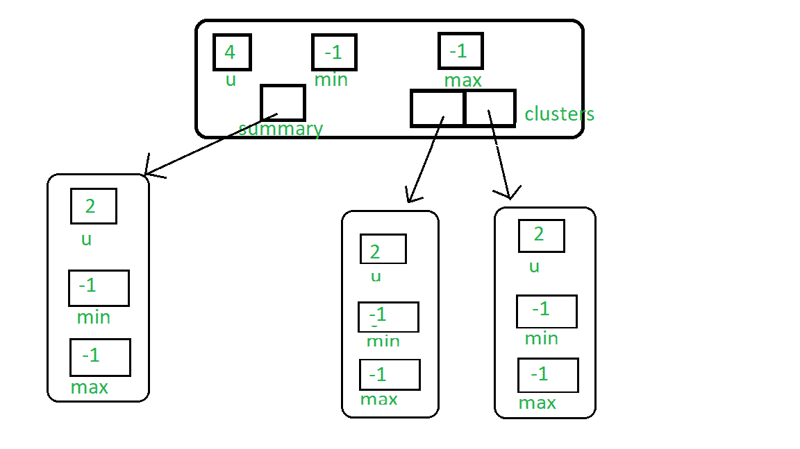
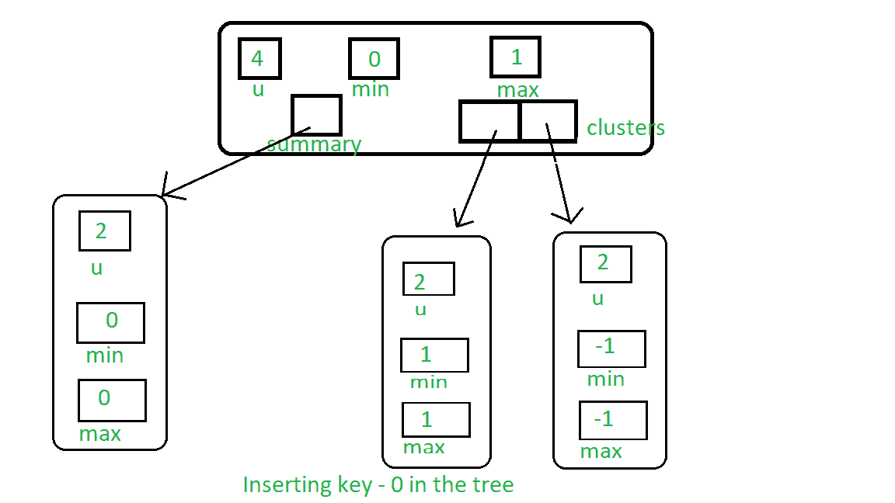

# 范·埃姆德·博阿斯树|集合 2 |插入、查找、最小和最大查询

> 原文:[https://www . geesforgeks . org/van-emde-boas-tree-set-2-insert-find-minimum-and-maximum-query/](https://www.geeksforgeeks.org/van-emde-boas-tree-set-2-insertion-find-minimum-and-maximum-queries/)

强烈建议先看看之前关于 Van Emde Boas Tree 的文章。

**插入**的程序:

1.  如果树中没有键，那么简单地将树的最小值和最大值分配给键。
2.  否则，我们将深入树中并执行以下操作:
    *   如果我们想要插入的键小于树的当前最小值，那么我们交换这两个值，因为新的键将是树的真正最小值，并且已经在最小值位置的键将被用于进一步的处理。
        这个概念可以认为是范·埃姆德·博阿斯树中的懒繁殖。因为这个旧的最小值实际上是递归范·埃姆德·博阿斯结构的一个簇的最小值。所以实际上，我们不会深入到结构中，直到需求出现。
    *   如果我们不在基本情况下意味着树的宇宙大小大于 2，那么:
        *   如果树的簇[High(键)]是空的，那么我们递归地在摘要上调用 insert，并且当我们进行惰性传播时，我们只是给键分配最小值和最大值，并且停止递归。
        *   否则，我们在有键的簇上调用 insert。
3.  同样，我们检查最大值，如果大于当前最大值，则将密钥设置为最大值。

下图表示空的 VEB(4)树:



现在我们插入 1，然后它会将树的最小值和最大值设置为 1。您可以看到 1:


现在，如果我们插入 0，那么 1 将传播到第一个集群，零将是新的最小值:



**会员查询程序**:

*   在我们搜索的任何时候，如果关键字是树的最小值或最大值，这意味着关键字存在，那么返回 true。
*   如果我们到达基本情况，但上述条件为假，那么密钥一定不在树中，所以返回真。
*   否则，递归调用该函数，覆盖键簇(即高(键))及其在簇中的位置(即低(键))。
*   这里我们允许宇宙大小为 2 的任意次方，因此如果出现宇宙大小小于键值的情况，则返回 false。

**最小值&最大值** : Van Emde Boas Tree 存储最小值和最大值作为它的属性，所以如果它存在，我们可以返回它的值，否则返回 null。

## C++

```
#include <bits/stdc++.h>
using namespace std;

class Van_Emde_Boas {

public:
    int universe_size;
    int minimum;
    int maximum;
    Van_Emde_Boas* summary;
    vector<Van_Emde_Boas*> clusters;

    // Function to return cluster numbers
    // in which key is present
    int high(int x)
    {
        int div = ceil(sqrt(universe_size));
        return x / div;
    }

    // Function to return position of x in cluster
    int low(int x)
    {
        int mod = ceil(sqrt(universe_size));
        return x % mod;
    }

    // Function to return the index from
    // cluster number and position
    int generate_index(int x, int y)
    {
        int ru = ceil(sqrt(universe_size));
        return x * ru + y;
    }

    // Constructor
    Van_Emde_Boas(int size)
    {
        universe_size = size;
        minimum = -1;
        maximum = -1;

        // Base case
        if (size <= 2) {
            summary = nullptr;
            clusters = vector<Van_Emde_Boas*>(0, nullptr);
        }
        else {
            int no_clusters = ceil(sqrt(size));

            // Assigning VEB(sqrt(u)) to summary
            summary = new Van_Emde_Boas(no_clusters);

            // Creating array of VEB Tree pointers of size sqrt(u)
            clusters = vector<Van_Emde_Boas*>(no_clusters, nullptr);

            // Assigning VEB(sqrt(u)) to all its clusters
            for (int i = 0; i < no_clusters; i++) {
                clusters[i] = new Van_Emde_Boas(ceil(sqrt(size)));
            }
        }
    }
};

// Function to return the minimum value
// from the tree if it exists
int VEB_minimum(Van_Emde_Boas* helper)
{
    return (helper->minimum == -1 ? -1 : helper->minimum);
}

// Function to return the maximum value
// from the tree if it exists
int VEB_maximum(Van_Emde_Boas* helper)
{
    return (helper->maximum == -1 ? -1 : helper->maximum);
}

// Function to insert a key in the tree
void insert(Van_Emde_Boas* helper, int key)
{
    // If no key is present in the tree
    // then set both minimum and maximum
    // to the key (Read the previous article
    // for more understanding about it)
    if (helper->minimum == -1) {
        helper->minimum = key;
        helper->maximum = key;
    }
    else {
        if (key < helper->minimum) {

            // If the key is less than current minimum
            // then swap it with the current minimum
            // because this minimum is actually
            // minimum of one of the internal cluster
            // so as we go deeper into the Van Emde Boas
            // we need to take that minimum to its real position
            // This concept is similar to "Lazy Propagation"
            swap(helper->minimum, key);
        }

        // Not base case then...
        if (helper->universe_size > 2) {

            // If no key is present in the cluster then insert key into
            // both cluster and summary
            if (VEB_minimum(helper->clusters[helper->high(key)]) == -1) {
                insert(helper->summary, helper->high(key));

                // Sets the minimum and maximum of cluster to the key
                // as no other keys are present we will stop at this level
                // we are not going deeper into the structure like
                // Lazy Propagation
                helper->clusters[helper->high(key)]->minimum = helper->low(key);
                helper->clusters[helper->high(key)]->maximum = helper->low(key);
            }
            else {
                // If there are other elements in the tree then recursively
                // go deeper into the structure to set attributes accordingly
                insert(helper->clusters[helper->high(key)], helper->low(key));
            }
        }

        // Sets the key as maximum it is greater than current maximum
        if (key > helper->maximum) {
            helper->maximum = key;
        }
    }
}

// Function that returns true if the
// key is present in the tree
bool isMember(Van_Emde_Boas* helper, int key)
{

    // If universe_size is less than the key
    // then we can not search the key so returns
    // false
    if (helper->universe_size < key) {
        return false;
    }

    // If at any point of our traversal
    // of the tree if the key is the minimum
    // or the maximum of the subtree, then
    // the key is present so returns true
    if (helper->minimum == key || helper->maximum == key) {
        return true;
    }
    else {

        // If after attending above condition,
        // if the size of the tree is 2 then
        // the present key must be
        // maximum or minimum of the tree if it
        // is not then it returns false because key
        // can not be present in the sub tree
        if (helper->universe_size == 2) {
            return false;
        }
        else {

            // Recursive call over the cluster
            // in which the key can be present
            // and also pass the new position of the key
            // i.e., low(key)
            return isMember(helper->clusters[helper->high(key)],
                            helper->low(key));
        }
    }
}

// Driver code
int main()
{
    Van_Emde_Boas* veb = new Van_Emde_Boas(8);

    // Inserting Keys
    insert(veb, 2);
    insert(veb, 3);
    insert(veb, 6);

    cout << boolalpha;

    // Checking isMember query
    cout << isMember(veb, 3) << endl;

    cout << isMember(veb, 4) << endl;

    // Maximum of VEB
    cout << VEB_maximum(veb) << endl;

    // Minimum of VEB
    cout << VEB_minimum(veb) << endl;
}
```

**Output:** 

```
true
false
6
2
```