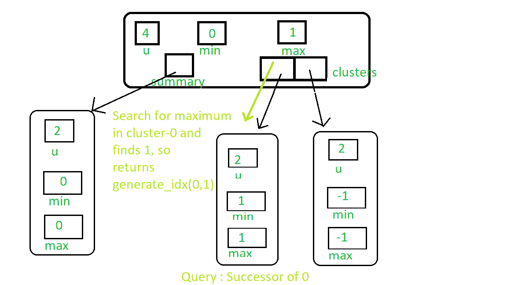
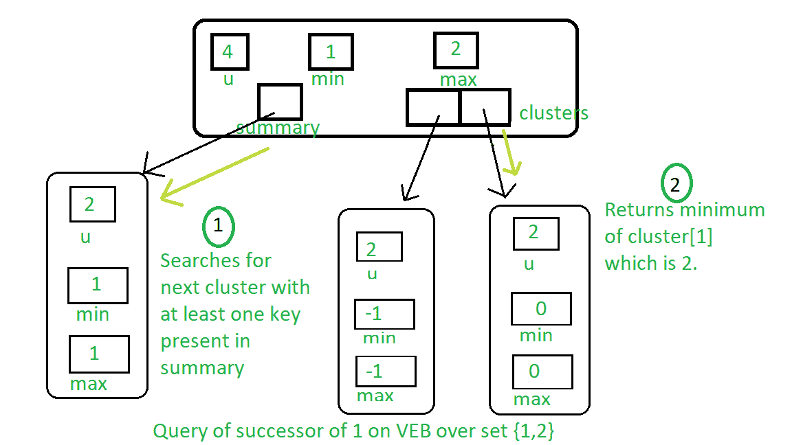
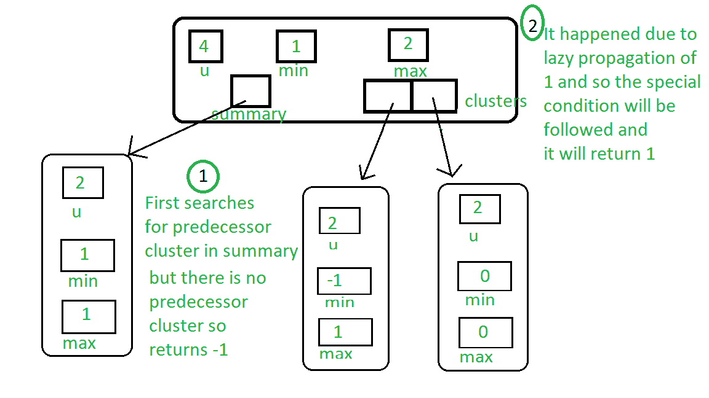

# 范·埃姆德·博阿斯树–第 3 集|继任者和前任

> 原文:[https://www . geeksforgeeks . org/van-emde-boas-tree-set-3-后继和前任/](https://www.geeksforgeeks.org/van-emde-boas-tree-set-3-successor-and-predecessor/)

强烈建议先阅读之前关于范·埃姆德·博阿斯树的文章。

**继任者程序:**

*   **基本情况:**如果树的大小是 2，那么如果查询关键字是 0，并且树中存在关键字–1，那么返回 1，因为它将是后继关键字。否则，返回 null。
*   如果键小于最小值，那么我们可以很容易地说最小值将是查询键的后继。
*   **递归情况:**
    *   我们首先在存在密钥的集群中搜索后继者。
    *   如果我们在集群中找到任何后继，那么生成它的索引并返回它。
    *   否则，搜索下一个至少有一个关键字的集群，并返回该集群的最小索引。

请参见下图中对 0 的后续项的查询:



下图表示对包含关键字 1 和 2 的 VEB 树的 1 个查询的后续查询:



**前置程序:**

*   **基本情况:**如果树的大小是 2，那么如果查询键是 1，并且键 0 存在于树中，那么返回 0，因为它将是前身。否则，返回 null。
*   如果关键字大于最大值，那么我们可以很容易地说，最大值将是查询关键字的前身。
*   **递归情况:**
    *   我们首先在存在密钥的集群中搜索前身。
    *   如果我们在集群中找到任何前身，那么生成它的索引并返回它。
    *   否则，在总结中搜索至少有一个键存在的前一个簇。如果存在任何群集，则返回该群集最大值的索引。
    *   如果不存在具有该属性的群集，则查看由于惰性传播，树的最小值(其中存在群集)是否小于键，如果是，则返回最小值，否则返回空值。

下图表示键-2 的查询前身:



## C++

```
#include <bits/stdc++.h>
using namespace std;

class Van_Emde_Boas {

public:
    int universe_size;
    int minimum;
    int maximum;
    Van_Emde_Boas* summary;
    vector<Van_Emde_Boas*> clusters;

    // Function to return cluster numbers
    // in which key is present
    int high(int x)
    {
        int div = ceil(sqrt(universe_size));
        return x / div;
    }

    // Function to return position of x in cluster
    int low(int x)
    {
        int mod = ceil(sqrt(universe_size));
        return x % mod;
    }

    // Function to return the index from
    // cluster number and position
    int generate_index(int x, int y)
    {
        int ru = ceil(sqrt(universe_size));
        return x * ru + y;
    }

    // Constructor
    Van_Emde_Boas(int size)
    {
        universe_size = size;
        minimum = -1;
        maximum = -1;

        // Base case
        if (size <= 2) {
            summary = nullptr;
            clusters = vector<Van_Emde_Boas*>(0, nullptr);
        }
        else {
            int no_clusters = ceil(sqrt(size));

            // Assigning VEB(sqrt(u)) to summary
            summary = new Van_Emde_Boas(no_clusters);

            // Creating array of VEB Tree pointers of size sqrt(u)
            clusters = vector<Van_Emde_Boas*>(no_clusters, nullptr);

            // Assigning VEB(sqrt(u)) to all its clusters
            for (int i = 0; i < no_clusters; i++) {
                clusters[i] = new Van_Emde_Boas(ceil(sqrt(size)));
            }
        }
    }
};

// Function to return the minimum value
// from the tree if it exists
int VEB_minimum(Van_Emde_Boas* helper)
{
    return (helper->minimum == -1 ? -1 : helper->minimum);
}

// Function to return the maximum value
// from the tree if it exists
int VEB_maximum(Van_Emde_Boas* helper)
{
    return (helper->maximum == -1 ? -1 : helper->maximum);
}

// Function to insert a key in the tree
void insert(Van_Emde_Boas* helper, int key)
{
    // If no key is present in the tree
    // then set both minimum and maximum
    // to the key (Read the previous article
    // for more understanding about it)
    if (helper->minimum == -1) {
        helper->minimum = key;
        helper->maximum = key;
    }
    else {
        if (key < helper->minimum) {

            // If the key is less than the current minimum
            // then swap it with the current minimum
            // because this minimum is actually
            // minimum of one of the internal cluster
            // so as we go deeper into the Van Emde Boas
            // we need to take that minimum to its real position
            // This concept is similar to "Lazy Propagation"
            swap(helper->minimum, key);
        }

        // Not base case then...
        if (helper->universe_size > 2) {

            // If no key is present in the cluster then insert key into
            // both cluster and summary
            if (VEB_minimum(helper->clusters[helper->high(key)]) == -1) {
                insert(helper->summary, helper->high(key));

                // Sets the minimum and maximum of cluster to the key
                // as no other keys are present we will stop at this level
                // we are not going deeper into the structure like
                // Lazy Propagation
                helper->clusters[helper->high(key)]->minimum = helper->low(key);
                helper->clusters[helper->high(key)]->maximum = helper->low(key);
            }
            else {
                // If there are other elements in the tree then recursively
                // go deeper into the structure to set attributes accordingly
                insert(helper->clusters[helper->high(key)], helper->low(key));
            }
        }

        // Sets the key as maximum it is greater than current maximum
        if (key > helper->maximum) {
            helper->maximum = key;
        }
    }
}

// Function that returns true if the
// key is present in the tree
bool isMember(Van_Emde_Boas* helper, int key)
{

    // If universe_size is less than the key
    // then we can not search the key so returns
    // false
    if (helper->universe_size < key) {
        return false;
    }

    // If at any point of our traversal
    // of the tree if the key is the minimum
    // or the maximum of the subtree, then
    // the key is present so returns true
    if (helper->minimum == key || helper->maximum == key) {
        return true;
    }
    else {

        // If after attending above condition,
        // if the size of the tree is 2 then
        // the present key must be
        // maximum or minimum of the tree if it
        // is not then it returns false because key
        // can not be present in the sub tree
        if (helper->universe_size == 2) {
            return false;
        }
        else {

            // Recursive call over the cluster
            // in which the key can be present
            // and also pass the new position of the key
            // i.e., low(key)
            return isMember(helper->clusters[helper->high(key)],
                            helper->low(key));
        }
    }
}

// Function to find the successor of the given key
int VEB_successor(Van_Emde_Boas* helper, int key)
{

    // Base case: If key is 0 and its successor
    // is present then return 1 else return null
    if (helper->universe_size == 2) {

        if (key == 0 && helper->maximum == 1) {
            return 1;
        }
        else {
            return -1;
        }
    }

    // If key is less then minimum then return minimum
    // because it will be successor of the key
    else if (helper->minimum != -1 && key < helper->minimum) {

        return helper->minimum;
    }
    else {

        // Find successor inside the cluster of the key
        // First find the maximum in the cluster
        int max_incluster = VEB_maximum(helper->clusters[helper->high(key)]);

        int offset{ 0 }, succ_cluster{ 0 };

        // If there is any key( maximum!=-1 ) present in the cluster then find
        // the successor inside of the cluster
        if (max_incluster != -1 && helper->low(key) < max_incluster) {

            offset = VEB_successor(helper->clusters[helper->high(key)],
                                   helper->low(key));

            return helper->generate_index(helper->high(key), offset);
        }

        // Otherwise look for the next cluster with at least one key present
        else {

            succ_cluster = VEB_successor(helper->summary, helper->high(key));

            // If there is no cluster with any key present
            // in summary then return null
            if (succ_cluster == -1) {
                return -1;
            }

            // Find minimum in successor cluster which will
            // be the successor of the key
            else {

                offset = VEB_minimum(helper->clusters[succ_cluster]);

                return helper->generate_index(succ_cluster, offset);
            }
        }
    }
}

// Function to find the predecessor of the given key
int VEB_predecessor(Van_Emde_Boas* helper, int key)
{

    // Base case: If the key is 1 and it's predecessor
    // is present then return 0 else return null
    if (helper->universe_size == 2) {

        if (key == 1 && helper->minimum == 0) {
            return 0;
        }
        else
            return -1;
    }

    // If the key is greater than maximum of the tree then
    // return key as it will be the predecessor of the key
    else if (helper->maximum != -1 && key > helper->maximum) {

        return helper->maximum;
    }
    else {

        // Find predecessor in the cluster of the key
        // First find minimum in the key to check whether any key
        // is present in the cluster
        int min_incluster = VEB_minimum(helper->clusters[helper->high(key)]);

        int offset{ 0 }, pred_cluster{ 0 };

        // If any key is present in the cluster then find predecessor in
        // the cluster
        if (min_incluster != -1 && helper->low(key) > min_incluster) {

            offset = VEB_predecessor(helper->clusters[helper->high(key)],
                                     helper->low(key));

            return helper->generate_index(helper->high(key), offset);
        }

        // Otherwise look for predecessor in the summary which
        // returns the index of predecessor cluster with any key present
        else {

            pred_cluster = VEB_predecessor(helper->summary, helper->high(key));

            // If no predecessor cluster then...
            if (pred_cluster == -1) {

                // Special case which is due to lazy propagation
                if (helper->minimum != -1 && key > helper->minimum) {
                    return helper->minimum;
                }

                else
                    return -1;
            }

            // Otherwise find maximum in the predecessor cluster
            else {

                offset = VEB_maximum(helper->clusters[pred_cluster]);

                return helper->generate_index(pred_cluster, offset);
            }
        }
    }
}

// Driver code
int main()
{

    Van_Emde_Boas* veb = new Van_Emde_Boas(8);

    // Inserting Keys
    insert(veb, 2);
    insert(veb, 3);
    insert(veb, 4);
    insert(veb, 6);

    // Queries
    cout << VEB_successor(veb, 2) << endl;

    cout << VEB_predecessor(veb, 6) << endl;

    cout << VEB_successor(veb, 4) << endl;

    return 0;
}
```

**Output:** 

```
3
4
6
```