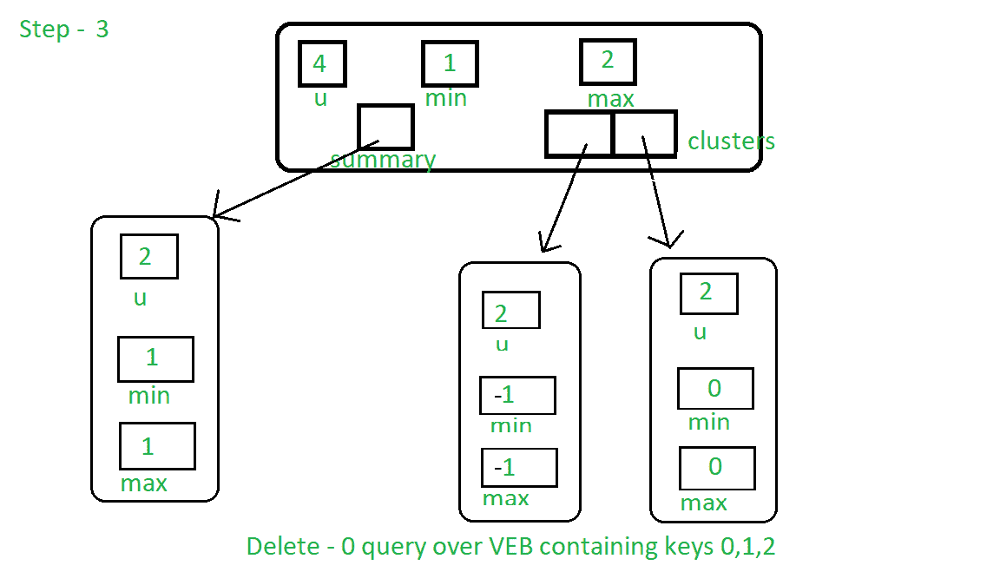

# 范·埃姆德·博阿斯树|第 4 集|删除

> 原文:[https://www . geesforgeks . org/van-emde-boas-tree-set-4-delete/](https://www.geeksforgeeks.org/van-emde-boas-tree-set-4-deletion/)

强烈建议先阅读 [Van Emde Boas Tree](https://www.geeksforgeeks.org/van-emde-boas-tree-set-1-basics-and-construction/) 上之前的文章。

**删除程序:**
这里我们假设密钥已经存在于树中。

*   首先，我们检查是否只有一个键，然后将树的最大值和最小值赋给空值以删除该键。
*   **基本情况:**如果树的宇宙大小是 2，那么在只有一个键存在的上述条件为假之后，树中正好有两个键存在(在上述条件变为假之后)，因此通过将树的最大值和最小值分配给树中存在的另一个键来删除查询键。
*   **递归情况:**
    *   如果关键字是树的最小值，则找到树的下一个最小值，并将其指定为树的最小值，然后删除查询关键字。
    *   现在查询关键字不在树中。我们将不得不改变树中的其余结构，以完全消除关键点:
        1.  如果查询关键字簇的最小值为空，那么我们也将从摘要中删除它。此外，如果关键字是树的最大值，那么我们将找到新的最大值，并将其指定为树的最大值。
        2.  否则，如果关键字是树的最大值，则找到新的最大值，并将其指定为树的最大值。

下面是代表 VEB 树上“删除键-0 查询”的一系列图像，其中有 0、1、2 个键:


第一步:由于 0 是树的最小值，它将满足算法其他部分的第一个条件。

首先，它找到下一个最大值 1，并将其设置为最小值。


步骤 2:现在它将从群集[0]中删除键 1。


第三步:下一个条件，簇[0]没有键，是真的，所以它也将从摘要中清除键。



## C++

```
#include <bits/stdc++.h>
using namespace std;

class Van_Emde_Boas {

public:
    int universe_size;
    int minimum;
    int maximum;
    Van_Emde_Boas* summary;
    vector<Van_Emde_Boas*> clusters;

    // Function to return cluster numbers
    // in which key is present
    int high(int x)
    {
        int div = ceil(sqrt(universe_size));
        return x / div;
    }

    // Function to return position of x in cluster
    int low(int x)
    {
        int mod = ceil(sqrt(universe_size));
        return x % mod;
    }

    // Function to return the index from
    // cluster number and position
    int generate_index(int x, int y)
    {
        int ru = ceil(sqrt(universe_size));
        return x * ru + y;
    }

    // Constructor
    Van_Emde_Boas(int size)
    {
        universe_size = size;
        minimum = -1;
        maximum = -1;

        // Base case
        if (size <= 2) {
            summary = nullptr;
            clusters = vector<Van_Emde_Boas*>(0, nullptr);
        }
        else {
            int no_clusters = ceil(sqrt(size));

            // Assigning VEB(sqrt(u)) to summary
            summary = new Van_Emde_Boas(no_clusters);

            // Creating array of VEB Tree pointers of size sqrt(u)
            clusters = vector<Van_Emde_Boas*>(no_clusters, nullptr);

            // Assigning VEB(sqrt(u)) to all its clusters
            for (int i = 0; i < no_clusters; i++) {
                clusters[i] = new Van_Emde_Boas(ceil(sqrt(size)));
            }
        }
    }
};

// Function to return the minimum value
// from the tree if it exists
int VEB_minimum(Van_Emde_Boas* helper)
{
    return (helper->minimum == -1 ? -1 : helper->minimum);
}

// Function to return the maximum value
// from the tree if it exists
int VEB_maximum(Van_Emde_Boas* helper)
{
    return (helper->maximum == -1 ? -1 : helper->maximum);
}

// Function to insert a key in the tree
void insert(Van_Emde_Boas* helper, int key)
{
    // If no key is present in the tree
    // then set both minimum and maximum
    // to the key (Read the previous article
    // for more understanding about it)
    if (helper->minimum == -1) {
        helper->minimum = key;
        helper->maximum = key;
    }
    else {
        if (key < helper->minimum) {

            // If the key is less than the current minimum
            // then swap it with the current minimum
            // because this minimum is actually
            // minimum of one of the internal cluster
            // so as we go deeper into the Van Emde Boas
            // we need to take that minimum to its real position
            // This concept is similar to "Lazy Propagation"
            swap(helper->minimum, key);
        }

        // Not base case then...
        if (helper->universe_size > 2) {

            // If no key is present in the cluster then insert key into
            // both cluster and summary
            if (VEB_minimum(helper->clusters[helper->high(key)]) == -1) {
                insert(helper->summary, helper->high(key));

                // Sets the minimum and maximum of cluster to the key
                // as no other keys are present we will stop at this level
                // we are not going deeper into the structure like
                // Lazy Propagation
                helper->clusters[helper->high(key)]->minimum = helper->low(key);
                helper->clusters[helper->high(key)]->maximum = helper->low(key);
            }
            else {
                // If there are other elements in the tree then recursively
                // go deeper into the structure to set attributes accordingly
                insert(helper->clusters[helper->high(key)], helper->low(key));
            }
        }

        // Sets the key as maximum it is greater than current maximum
        if (key > helper->maximum) {
            helper->maximum = key;
        }
    }
}

// Function that returns true if the
// key is present in the tree
bool isMember(Van_Emde_Boas* helper, int key)
{

    // If universe_size is less than the key
    // then we can not search the key so returns
    // false
    if (helper->universe_size < key) {
        return false;
    }

    // If at any point of our traversal
    // of the tree if the key is the minimum
    // or the maximum of the subtree, then
    // the key is present so returns true
    if (helper->minimum == key || helper->maximum == key) {
        return true;
    }
    else {

        // If after attending above condition,
        // if the size of the tree is 2 then
        // the present key must be
        // maximum or minimum of the tree if it
        // is not then it returns false because key
        // can not be present in the sub tree
        if (helper->universe_size == 2) {
            return false;
        }
        else {

            // Recursive call over the cluster
            // in which the key can be present
            // and also pass the new position of the key
            // i.e., low(key)
            return isMember(helper->clusters[helper->high(key)],
                            helper->low(key));
        }
    }
}

// Function to find the successor of the given key
int VEB_successor(Van_Emde_Boas* helper, int key)
{

    // Base case: If key is 0 and its successor
    // is present then return 1 else return null
    if (helper->universe_size == 2) {

        if (key == 0 && helper->maximum == 1) {
            return 1;
        }
        else {
            return -1;
        }
    }

    // If key is less then minimum then return minimum
    // because it will be successor of the key
    else if (helper->minimum != -1 && key < helper->minimum) {

        return helper->minimum;
    }
    else {

        // Find successor inside the cluster of the key
        // First find the maximum in the cluster
        int max_incluster = VEB_maximum(helper->clusters[helper->high(key)]);

        int offset{ 0 }, succ_cluster{ 0 };

        // If there is any key( maximum!=-1 ) present in the cluster then find
        // the successor inside of the cluster
        if (max_incluster != -1 && helper->low(key) < max_incluster) {

            offset = VEB_successor(helper->clusters[helper->high(key)],
                                   helper->low(key));

            return helper->generate_index(helper->high(key), offset);
        }

        // Otherwise look for the next cluster with at least one key present
        else {

            succ_cluster = VEB_successor(helper->summary, helper->high(key));

            // If there is no cluster with any key present
            // in summary then return null
            if (succ_cluster == -1) {
                return -1;
            }

            // Find minimum in successor cluster which will
            // be the successor of the key
            else {

                offset = VEB_minimum(helper->clusters[succ_cluster]);

                return helper->generate_index(succ_cluster, offset);
            }
        }
    }
}

// Function to find the predecessor of the given key
int VEB_predecessor(Van_Emde_Boas* helper, int key)
{

    // Base case: If the key is 1 and it's predecessor
    // is present then return 0 else return null
    if (helper->universe_size == 2) {

        if (key == 1 && helper->minimum == 0) {
            return 0;
        }
        else
            return -1;
    }

    // If the key is greater than maximum of the tree then
    // return key as it will be the predecessor of the key
    else if (helper->maximum != -1 && key > helper->maximum) {

        return helper->maximum;
    }
    else {

        // Find predecessor in the cluster of the key
        // First find minimum in the key to check whether any key
        // is present in the cluster
        int min_incluster = VEB_minimum(helper->clusters[helper->high(key)]);

        int offset{ 0 }, pred_cluster{ 0 };

        // If any key is present in the cluster then find predecessor in
        // the cluster
        if (min_incluster != -1 && helper->low(key) > min_incluster) {

            offset = VEB_predecessor(helper->clusters[helper->high(key)],
                                     helper->low(key));

            return helper->generate_index(helper->high(key), offset);
        }

        // Otherwise look for predecessor in the summary which
        // returns the index of predecessor cluster with any key present
        else {

            pred_cluster = VEB_predecessor(helper->summary, helper->high(key));

            // If no predecessor cluster then...
            if (pred_cluster == -1) {

                // Special case which is due to lazy propagation
                if (helper->minimum != -1 && key > helper->minimum) {
                    return helper->minimum;
                }

                else
                    return -1;
            }

            // Otherwise find maximum in the predecessor cluster
            else {

                offset = VEB_maximum(helper->clusters[pred_cluster]);

                return helper->generate_index(pred_cluster, offset);
            }
        }
    }
}

// Function to delete a key from the tree
// assuming that the key is present
void VEB_delete(Van_Emde_Boas* helper, int key)
{

    // If only one key is present, it means
    // that it is the key we want to delete
    // Same condition as key == max && key == min
    if (helper->maximum == helper->minimum) {

        helper->minimum = -1;
        helper->maximum = -1;
    }

    // Base case: If the above condition is not true
    // i.e. the tree has more than two keys
    // and if its size is two than a tree has exactly two keys.
    // We simply delete it by assigning it to another
    // present key value
    else if (helper->universe_size == 2) {

        if (key == 0) {
            helper->minimum = 1;
        }
        else {
            helper->minimum = 0;
        }
        helper->maximum = helper->minimum;
    }
    else {

        // As we are doing something similar to lazy propagation
        // we will basically find next bigger key
        // and assign it as minimum
        if (key == helper->minimum) {

            int first_cluster = VEB_minimum(helper->summary);

            key
                = helper->generate_index(first_cluster,
                                         VEB_minimum(helper->clusters[first_cluster]));

            helper->minimum = key;
        }

        // Now we delete the key
        VEB_delete(helper->clusters[helper->high(key)],
                   helper->low(key));

        // After deleting the key, rest of the improvements

        // If the minimum in the cluster of the key is -1
        // then we have to delete it from the summary to
        // eliminate the key completely
        if (VEB_minimum(helper->clusters[helper->high(key)]) == -1) {

            VEB_delete(helper->summary, helper->high(key));

            // After the above condition, if the key
            // is maximum of the tree then...
            if (key == helper->maximum) {
                int max_insummary = VEB_maximum(helper->summary);

                // If the max value of the summary is null
                // then only one key is present so
                // assign min. to max.
                if (max_insummary == -1) {

                    helper->maximum = helper->minimum;
                }
                else {

                    // Assign global maximum of the tree, after deleting
                    // our query-key
                    helper->maximum
                        = helper->generate_index(max_insummary,
                                                 VEB_maximum(helper->clusters[max_insummary]));
                }
            }
        }

        // Simply find the new maximum key and
        // set the maximum of the tree
        // to the new maximum
        else if (key == helper->maximum) {

            helper->maximum
                = helper->generate_index(helper->high(key),
                                         VEB_maximum(helper->clusters[helper->high(key)]));
        }
    }
}

// Driver code
int main()
{
    Van_Emde_Boas* end = new Van_Emde_Boas(8);

    // Inserting Keys
    insert(end, 1);
    insert(end, 0);
    insert(end, 2);
    insert(end, 4);

    // Before deletion
    cout << isMember(end, 2) << endl;
    cout << VEB_predecessor(end, 4) << " "
         << VEB_successor(end, 1) << endl;

    // Delete only if the key is present
    if (isMember(end, 2))
        VEB_delete(end, 2);

    // After deletion
    cout << isMember(end, 2) << endl;
    cout << VEB_predecessor(end, 4) << " "
         << VEB_successor(end, 1) << endl;
}
```

**Output:** 

```
1
2 2
0
1 4
```

**时间复杂度:** O(N)。
**辅助空间** : O(N)。