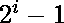
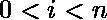
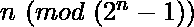
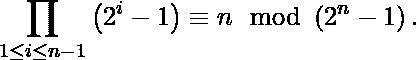
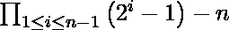

# 素性检验的万提厄姆定理

> 原文:[https://www . geeksforgeeks . org/vantieghems-定理-素性-测试/](https://www.geeksforgeeks.org/vantieghems-theorem-primality-test/)

[Vantieghems 定理](https://en.wikipedia.org/wiki/Vantieghems_theorem)是一个数为素数的充要条件。它规定自然数 n 是质数，是的乘积，其中与全等。
换句话说，一个数 n 是素数的当且仅当。

**例:**

*   对于 n = 3，最终产品为(2<sup>1</sup>–1)*(2<sup>2</sup>–1)= 1 * 3 = 3。3 与 3 模 7 全等。我们从表达式 3 *(mod(2<sup>3</sup>–1))得到 3 mod 7，因此 3 是素数。
*   对于 n = 5，最终乘积为 1*3*7*15 = 315。315 与 5(mod 31)全等，因此 5 是素数。
*   对于 n = 7，最终乘积为 1*3*7*15*31*63 = 615195。615195 与 7 全等(mod 127)，因此 7 是素数。
*   对于 n = 4，最终产物 1*3*7 = 21。21 与 4(mod 15)不全等，因此 4 是复合的。

上述定理的另一种表述方式是，如果除以，则 n 为素数。

## C++

```
// C++ code to verify Vantieghem's Theorem
#include <bits/stdc++.h>
using namespace std;

void checkVantieghemsTheorem(int limit)
{
    long long unsigned prod = 1;
    for (long long unsigned n = 2; n < limit; n++) {

        // Check if above condition is satisfied
        if (((prod - n) % ((1LL << n) - 1)) == 0)
            cout << n << " is prime\n";

        // product of previous powers of 2
        prod *= ((1LL << n) - 1);
    }
}

// Driver code
int main()
{
    checkVantieghemsTheorem(10);
    return 0;
}
```

## Java 语言(一种计算机语言，尤用于创建网站)

```
// Java code to verify Vantieghem's Theorem
import java.util.*;
class GFG
{

static void checkVantieghemsTheorem(int limit)
{
    long prod = 1;
    for (long n = 2; n < limit; n++) 
    {

        // Check if above condition is satisfied
        if (((prod - n < 0 ? 0 : prod - n) % ((1 << n) - 1)) == 0)
            System.out.print(n + " is prime\n");

        // product of previous powers of 2
        prod *= ((1 << n) - 1);
    }
}

// Driver code
public static void main(String []args)
{
    checkVantieghemsTheorem(10);
}
}

// This code is contributed by rutvik_56.
```

## 蟒蛇 3

```
# Python3 code to verify Vantieghem's Theorem
def checkVantieghemsTheorem(limit):

    prod = 1
    for n in range(2, limit):

        # Check if above condition is satisfied
        if n == 2:
            print(2, "is prime")
        if (((prod - n) % ((1 << n) - 1)) == 0):
            print(n, "is prime")

        # Product of previous powers of 2
        prod *= ((1 << n) - 1)

# Driver code
checkVantieghemsTheorem(10)

# This code is contributed by shubhamsingh10
```

## C#

```
// C# code to verify Vantieghem's Theorem
using System;
class GFG
{
  static void checkVantieghemsTheorem(int limit)
  {
    long prod = 1;
    for (long n = 2; n < limit; n++) 
    {

      // Check if above condition is satisfied
      if (((prod - n < 0 ? 0 : prod - n) % ((1 << (int)n) - 1)) == 0)
        Console.Write(n + " is prime\n");

      // product of previous powers of 2
      prod *= ((1 << (int)n) - 1);
    }
  }

  // Driver code
  public static void Main()
  {
    checkVantieghemsTheorem(10);
  }
}

// This code is contributed by pratham76.
```

## java 描述语言

```
<script>

// Javascript code to verify Vantieghem's Theorem

function checkVantieghemsTheorem( limit)
{
    let prod = 1;
    for (let n = 2; n < limit; n++) {

        // Check if above condition is satisfied
        if (n == 2)
            document.write(2 + " is prime" + "</br>");
        if (((prod - n) % ((1 << n) - 1)) == 0)
            document.write( n + " is prime" + "</br>");

        // product of previous powers of 2
        prod *= ((1 << n) - 1);
    }
}

// Driver Code
checkVantieghemsTheorem(10);

// This code is contributed by jana_sayantan.
</script>
```

**Output:** 

```
2 is prime
3 is prime
5 is prime
7 is prime
```

上述代码不适用于大于 11 的 n 值。它导致产品评估溢出。