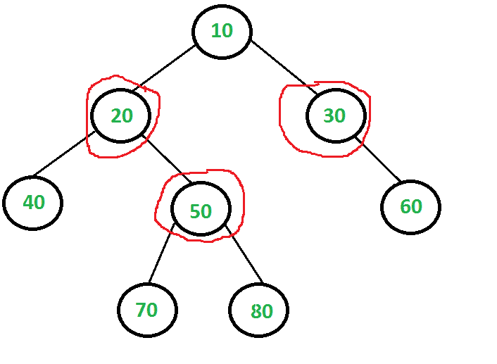

# 顶点覆盖问题|集合 2(树的动态规划解)

> 原文:[https://www . geesforgeks . org/顶点-覆盖-问题-集合-2-动态-编程-解决方案-树/](https://www.geeksforgeeks.org/vertex-cover-problem-set-2-dynamic-programming-solution-tree/)

无向图的[顶点覆盖是其顶点的子集，使得对于图的每条边(u，v)，要么“u”要么“v”处于顶点覆盖中。虽然名称是顶点覆盖，但是集合覆盖了给定图形的所有边。
求图的最小尺寸顶点覆盖的问题是](https://www.geeksforgeeks.org/vertex-cover-problem-set-1-introduction-approximate-algorithm-2/) [NP 完全](https://www.geeksforgeeks.org/np-completeness-set-1/)。但是对于树来说，它可以在多项式时间内求解。这篇文章讨论了二叉树的一个解决方案。相同的解决方案可以扩展到 n 元树。

例如，考虑下面的二叉树。最小的顶点覆盖是{20，50，30}，顶点覆盖的大小是 3。



这个想法是考虑以下两种可能性:根节点和根节点的递归。
***1)根是顶点覆盖的一部分:*** 在这种情况下根覆盖所有子边。我们递归地计算左右子树的顶点覆盖的大小，并将结果加 1(对于根树)。

***2)根不是顶点覆盖的一部分:*** 在这种情况下，根的两个子必须包含在顶点覆盖中，以覆盖所有根到子边。我们递归地计算所有子代的顶点覆盖的大小和结果的子代数(对于根的两个子代)。

以下是上述想法的实现。

## C

```
// A naive recursive C implementation for vertex cover problem for a tree
#include <stdio.h>
#include <stdlib.h>

// A utility function to find min of two integers
int min(int x, int y) { return (x < y)? x: y; }

/* A binary tree node has data, pointer to left child and a pointer to
   right child */
struct node
{
    int data;
    struct node *left, *right;
};

// The function returns size of the minimum vertex cover
int vCover(struct node *root)
{
    // The size of minimum vertex cover is zero if tree is empty or there
    // is only one node
    if (root == NULL)
        return 0;
    if (root->left == NULL && root->right == NULL)
        return 0;

    // Calculate size of vertex cover when root is part of it
    int size_incl = 1 + vCover(root->left) + vCover(root->right);

    // Calculate size of vertex cover when root is not part of it
    int size_excl = 0;
    if (root->left)
      size_excl += 1 + vCover(root->left->left) + vCover(root->left->right);
    if (root->right)
      size_excl += 1 + vCover(root->right->left) + vCover(root->right->right);

    // Return the minimum of two sizes
    return min(size_incl, size_excl);
}

// A utility function to create a node
struct node* newNode( int data )
{
    struct node* temp = (struct node *) malloc( sizeof(struct node) );
    temp->data = data;
    temp->left = temp->right = NULL;
    return temp;
}

// Driver program to test above functions
int main()
{
    // Let us construct the tree given in the above diagram
    struct node *root         = newNode(20);
    root->left                = newNode(8);
    root->left->left          = newNode(4);
    root->left->right         = newNode(12);
    root->left->right->left   = newNode(10);
    root->left->right->right  = newNode(14);
    root->right               = newNode(22);
    root->right->right        = newNode(25);

    printf ("Size of the smallest vertex cover is %d ", vCover(root));

    return 0;
}
```

## Java 语言(一种计算机语言，尤用于创建网站)

```
// A naive recursive Java implementation
// for vertex cover problem for a tree

class GFG
{
    // A utility function to find min of two integers
    static int min(int x, int y)
    {
        return (x < y) ? x : y;
    }

    /*
    * A binary tree node has data, pointer
    to left child and a pointer to right
    * child
    */
    static class node
    {
        int data;
        node left, right;
    };

    // The function returns size
    // of the minimum vertex cover
    static int vCover(node root)
    {
        // The size of minimum vertex cover
        // is zero if tree is empty or there
        // is only one node
        if (root == null)
            return 0;
        if (root.left == null && root.right == null)
            return 0;

        // Calculate size of vertex cover
        // when root is part of it
        int size_incl = 1 + vCover(root.left) +
                               vCover(root.right);

        // Calculate size of vertex cover
        // when root is not part of it
        int size_excl = 0;
        if (root.left != null)
            size_excl += 1 + vCover(root.left.left) +
                              vCover(root.left.right);
        if (root.right != null)
            size_excl += 1 + vCover(root.right.left) +
                                vCover(root.right.right);

        // Return the minimum of two sizes
        return Math.min(size_incl, size_excl);
    }

    // A utility function to create a node
    static node newNode(int data)
    {
        node temp = new node();
        temp.data = data;
        temp.left = temp.right = null;
        return temp;
    }

    // Driver code
    public static void main(String[] args)
    {
        // Let us construct tree given in the above diagram
        node root = newNode(20);
        root.left = newNode(8);
        root.left.left = newNode(4);
        root.left.right = newNode(12);
        root.left.right.left = newNode(10);
        root.left.right.right = newNode(14);
        root.right = newNode(22);
        root.right.right = newNode(25);

        System.out.printf("Size of the smallest vertex" +
                            "cover is %d ", vCover(root));

    }
}

// This code is contributed by 29AjayKumar
```

## 蟒蛇 3

```
# A naive recursive Python3 implementation
# for vertex cover problem for a tree

# A utility function to find min of two integers

# A binary tree node has data, pointer to
# left child and a pointer to right child
class Node:

    def __init__(self, x):

        self.data = x
        self.left = None
        self.right = None

# The function returns size of
# the minimum vertex cover
def vCover(root):

    # The size of minimum vertex cover
    # is zero if tree is empty or there
    # is only one node
    if (root == None):
        return 0

    if (root.left == None and
       root.right == None):
        return 0

    # Calculate size of vertex cover when
    # root is part of it
    size_incl = (1 + vCover(root.left) +
                     vCover(root.right))

    # Calculate size of vertex cover
    # when root is not part of it
    size_excl = 0
    if (root.left):
      size_excl += (1 + vCover(root.left.left) +
                        vCover(root.left.right))
    if (root.right):
      size_excl += (1 + vCover(root.right.left) +
                        vCover(root.right.right))

    # Return the minimum of two sizes
    return min(size_incl, size_excl)

# Driver Code
if __name__ == '__main__':

    # Let us construct the tree
    # given in the above diagram
    root  = Node(20)
    root.left = Node(8)
    root.left.left = Node(4)
    root.left.right = Node(12)
    root.left.right.left = Node(10)
    root.left.right.right = Node(14)
    root.right  = Node(22)
    root.right.right = Node(25)

    print("Size of the smallest vertex cover is", vCover(root))

# This code is contributed by mohit kumar 29
```

## C#

```
// A naive recursive C# implementation
// for vertex cover problem for a tree
using System;

class GFG
{
    // A utility function to find
    // min of two integers
    static int min(int x, int y)
    {
        return (x < y) ? x : y;
    }

    /*
    * A binary tree node has data, pointer
    to left child and a pointer to right
    * child
    */
    public class node
    {
        public int data;
        public node left, right;
    };

    // The function returns size
    // of the minimum vertex cover
    static int vCover(node root)
    {
        // The size of minimum vertex cover
        // is zero if tree is empty or there
        // is only one node
        if (root == null)
            return 0;
        if (root.left == null &&
            root.right == null)
            return 0;

        // Calculate size of vertex cover
        // when root is part of it
        int size_incl = 1 + vCover(root.left) +
                            vCover(root.right);

        // Calculate size of vertex cover
        // when root is not part of it
        int size_excl = 0;
        if (root.left != null)
            size_excl += 1 + vCover(root.left.left) +
                             vCover(root.left.right);
        if (root.right != null)
            size_excl += 1 + vCover(root.right.left) +
                             vCover(root.right.right);

        // Return the minimum of two sizes
        return Math.Min(size_incl, size_excl);
    }

    // A utility function to create a node
    static node newNode(int data)
    {
        node temp = new node();
        temp.data = data;
        temp.left = temp.right = null;
        return temp;
    }

    // Driver code
    public static void Main(String[] args)
    {
        // Let us construct tree given
        // in the above diagram
        node root = newNode(20);
        root.left = newNode(8);
        root.left.left = newNode(4);
        root.left.right = newNode(12);
        root.left.right.left = newNode(10);
        root.left.right.right = newNode(14);
        root.right = newNode(22);
        root.right.right = newNode(25);

        Console.Write("Size of the smallest vertex" +
                      "cover is {0} ", vCover(root));
    }
}

// This code is contributed by 29AjayKumar
```

## java 描述语言

```
<script>
// A naive recursive Javascript implementation
// for vertex cover problem for a tree

    // A utility function to find min of two integers
    function min(x,y)
    {
         return (x < y) ? x : y;
    }

    /*
    * A binary tree node has data, pointer
    to left child and a pointer to right
    * child
    */
    class Node
    {
        constructor(d)
        {
            this.data=d;
            this.left=null;
            this.right=null;
        }
    }

    // The function returns size
    // of the minimum vertex cover
    function vCover(root)
    {
        // The size of minimum vertex cover
        // is zero if tree is empty or there
        // is only one node
        if (root == null)
            return 0;
        if (root.left == null && root.right == null)
            return 0;

        // Calculate size of vertex cover
        // when root is part of it
        let size_incl = 1 + vCover(root.left) +
                               vCover(root.right);

        // Calculate size of vertex cover
        // when root is not part of it
        let size_excl = 0;
        if (root.left != null)
            size_excl += 1 + vCover(root.left.left) +
                              vCover(root.left.right);
        if (root.right != null)
            size_excl += 1 + vCover(root.right.left) +
                                vCover(root.right.right);

        // Return the minimum of two sizes
        return Math.min(size_incl, size_excl);
    }

    // Driver code
    // Let us construct tree given in the above diagram
    root = new Node(20);
    root.left = new Node(8);
    root.left.left = new Node(4);
    root.left.right = new Node(12);
    root.left.right.left = new Node(10);
    root.left.right.right = new Node(14);
    root.right = new Node(22);
    root.right.right = new Node(25);

    document.write("Size of the smallest vertex" +
                            "cover is ", vCover(root));   

    // This code is contributed by unknown2108
</script>
```

**输出:**

```
Size of the smallest vertex cover is 3
```

上述简单递归方法的时间复杂度是指数级的。需要注意的是，上面的函数一次又一次地计算相同的子问题。例如，值为 50 的节点的 vCover 被评估两次，因为 50 是 10 的孙子，20 的孩子。

由于相同的子问题被再次调用，这个问题具有重叠子问题的性质。所以顶点覆盖问题同时具有动态规划问题的两个性质(参见[这个](https://www.geeksforgeeks.org/overlapping-subproblems-property-in-dynamic-programming-dp-1/)和[这个](https://www.geeksforgeeks.org/optimal-substructure-property-in-dynamic-programming-dp-2/))。像其他典型的[动态规划(DP)问题一样，](https://www.geeksforgeeks.org/archives/tag/dynamic-programming)相同子问题的重新计算可以通过存储子问题的解和以自下而上的方式解决问题来避免。

下面是基于动态规划的解决方案的实现。在下面的解决方案中，一个额外的字段“vc”被添加到树节点。所有节点的“vc”初始值都设置为 0。递归函数 vCover()仅在节点尚未设置时才计算节点的“vc”。

## C

```
/* Dynamic programming based program for Vertex Cover problem for
   a Binary Tree */
#include <stdio.h>
#include <stdlib.h>

// A utility function to find min of two integers
int min(int x, int y) { return (x < y)? x: y; }

/* A binary tree node has data, pointer to left child and a pointer to
   right child */
struct node
{
    int data;
    int vc;
    struct node *left, *right;
};

// A memoization based function that returns size of the minimum vertex cover.
int vCover(struct node *root)
{
    // The size of minimum vertex cover is zero if tree is empty or there
    // is only one node
    if (root == NULL)
        return 0;
    if (root->left == NULL && root->right == NULL)
        return 0;

    // If vertex cover for this node is already evaluated, then return it
    // to save recomputation of same subproblem again.
    if (root->vc != 0)
        return root->vc;

    // Calculate size of vertex cover when root is part of it
    int size_incl = 1 + vCover(root->left) + vCover(root->right);

    // Calculate size of vertex cover when root is not part of it
    int size_excl = 0;
    if (root->left)
      size_excl += 1 + vCover(root->left->left) + vCover(root->left->right);
    if (root->right)
      size_excl += 1 + vCover(root->right->left) + vCover(root->right->right);

    // Minimum of two values is vertex cover, store it before returning
    root->vc =  min(size_incl, size_excl);

    return root->vc;
}

// A utility function to create a node
struct node* newNode( int data )
{
    struct node* temp = (struct node *) malloc( sizeof(struct node) );
    temp->data = data;
    temp->left = temp->right = NULL;
    temp->vc = 0; // Set the vertex cover as 0
    return temp;
}

// Driver program to test above functions
int main()
{
    // Let us construct the tree given in the above diagram
    struct node *root         = newNode(20);
    root->left                = newNode(8);
    root->left->left          = newNode(4);
    root->left->right         = newNode(12);
    root->left->right->left   = newNode(10);
    root->left->right->right  = newNode(14);
    root->right               = newNode(22);
    root->right->right        = newNode(25);

    printf ("Size of the smallest vertex cover is %d ", vCover(root));

    return 0;
}
```

## Java 语言(一种计算机语言，尤用于创建网站)

```
/* Dynamic programming based program for
Vertex Cover problem for a Binary Tree */

class GFG
{
    // A utility function to find min of two integers
    static int min(int x, int y)
    {
        return (x < y) ? x : y;
    }

    /*
    * A binary tree node has data, pointer
    to left child and a pointer to right
    * child
    */
    static class node
    {
        int data;
        int vc;
        node left, right;
    };

    // A memoization based function that returns
    // size of the minimum vertex cover.
    static int vCover(node root)
    {
        // The size of minimum vertex cover is zero
        //  if tree is empty or there is only one node
        if (root == null)
            return 0;
        if (root.left == null && root.right == null)
            return 0;

        // If vertex cover for this node is
        // already evaluated, then return it
        // to save recomputation of same subproblem again.
        if (root.vc != 0)
            return root.vc;

        // Calculate size of vertex cover
        // when root is part of it
        int size_incl = 1 + vCover(root.left) +
                            vCover(root.right);

        // Calculate size of vertex cover
        // when root is not part of it
        int size_excl = 0;
        if (root.left != null)
            size_excl += 1 + vCover(root.left.left) +
                                vCover(root.left.right);
        if (root.right != null)
            size_excl += 1 + vCover(root.right.left) +
                                vCover(root.right.right);

        // Minimum of two values is vertex cover,
        // store it before returning
        root.vc = Math.min(size_incl, size_excl);

        return root.vc;
    }

    // A utility function to create a node
    static node newNode(int data)
    {
        node temp = new node();
        temp.data = data;
        temp.left = temp.right = null;
        temp.vc = 0; // Set the vertex cover as 0
        return temp;
    }

    // Driver code
    public static void main(String[] args)
    {
        // Let us construct tree given in the above diagram
        node root = newNode(20);
        root.left = newNode(8);
        root.left.left = newNode(4);
        root.left.right = newNode(12);
        root.left.right.left = newNode(10);
        root.left.right.right = newNode(14);
        root.right = newNode(22);
        root.right.right = newNode(25);

        System.out.printf("Size of the smallest vertex" +
                            "cover is %d ", vCover(root));
    }
}

// This code is contributed by PrinciRaj1992
```

## C#

```
/* Dynamic programming based program for
Vertex Cover problem for a Binary Tree */
using System;

class GFG
{
    // A utility function to find
    // min of two integers
    static int min(int x, int y)
    {
        return (x < y) ? x : y;
    }

    /*
    * A binary tree node has data, pointer
    to left child and a pointer to right
    * child
    */
    class node
    {
        public int data;
        public int vc;
        public node left, right;
    };

    // A memoization based function that returns
    // size of the minimum vertex cover.
    static int vCover(node root)
    {
        // The size of minimum vertex cover is zero
        // if tree is empty or there is only one node
        if (root == null)
            return 0;
        if (root.left == null &&
            root.right == null)
            return 0;

        // If vertex cover for this node is
        // already evaluated, then return it
        // to save recomputation of same subproblem again.
        if (root.vc != 0)
            return root.vc;

        // Calculate size of vertex cover
        // when root is part of it
        int size_incl = 1 + vCover(root.left) +
                            vCover(root.right);

        // Calculate size of vertex cover
        // when root is not part of it
        int size_excl = 0;
        if (root.left != null)
            size_excl += 1 + vCover(root.left.left) +
                             vCover(root.left.right);
        if (root.right != null)
            size_excl += 1 + vCover(root.right.left) +
                             vCover(root.right.right);

        // Minimum of two values is vertex cover,
        // store it before returning
        root.vc = Math.Min(size_incl, size_excl);

        return root.vc;
    }

    // A utility function to create a node
    static node newNode(int data)
    {
        node temp = new node();
        temp.data = data;
        temp.left = temp.right = null;
        temp.vc = 0; // Set the vertex cover as 0
        return temp;
    }

    // Driver code
    public static void Main(String[] args)
    {
        // Let us construct tree given in the above diagram
        node root = newNode(20);
        root.left = newNode(8);
        root.left.left = newNode(4);
        root.left.right = newNode(12);
        root.left.right.left = newNode(10);
        root.left.right.right = newNode(14);
        root.right = newNode(22);
        root.right.right = newNode(25);

        Console.Write("Size of the smallest vertex" +
                      "cover is {0} ", vCover(root));
    }
}

// This code is contributed by PrinciRaj1992
```

## java 描述语言

```
<script>

/* Dynamic programming based program for
Vertex Cover problem for a Binary Tree */

// A utility function to find min of two integers
function min(x,y)
{
    return (x < y) ? x : y;
}

/*
    * A binary tree node has data, pointer
    to left child and a pointer to right
    * child
    */
class Node
{
    constructor(data)
    {
        this.vc=0;
        this.data=data;
        this.left=this.right=null;
    }
}

// A memoization based function that returns
// size of the minimum vertex cover.
function vCover(root)
{
    // The size of minimum vertex cover is zero
        //  if tree is empty or there is only one node
        if (root == null)
            return 0;
        if (root.left == null && root.right == null)
            return 0;

        // If vertex cover for this node is
        // already evaluated, then return it
        // to save recomputation of same subproblem again.
        if (root.vc != 0)
            return root.vc;

        // Calculate size of vertex cover
        // when root is part of it
        let size_incl = 1 + vCover(root.left) +
                            vCover(root.right);

        // Calculate size of vertex cover
        // when root is not part of it
        let size_excl = 0;
        if (root.left != null)
            size_excl += 1 + vCover(root.left.left) +
                                vCover(root.left.right);
        if (root.right != null)
            size_excl += 1 + vCover(root.right.left) +
                                vCover(root.right.right);

        // Minimum of two values is vertex cover,
        // store it before returning
        root.vc = Math.min(size_incl, size_excl);

        return root.vc;
}

// Driver code
// Let us construct tree given in the above diagram
        let root = new Node(20);
        root.left = new Node(8);
        root.left.left = new Node(4);
        root.left.right = new Node(12);
        root.left.right.left = new Node(10);
        root.left.right.right = new Node(14);
        root.right = new Node(22);
        root.right.right = new Node(25);

        document.write("Size of the smallest vertex " +
                            "cover is ", vCover(root));

// This code is contributed by rag2127

</script>
```

**输出:**

```
Size of the smallest vertex cover is 3
```

**参考文献:**
[http://courses . csail . MIT . edu/6.006/spring 11/讲课/lec21.pdf](http://courses.csail.mit.edu/6.006/spring11/lectures/lec21.pdf)
**练习:**
对 n 元树扩展上述解决方案。
本文由 **Udit Gupta** 供稿。如果您发现任何不正确的地方，请写评论，或者您想分享更多关于上面讨论的主题的信息

**任何普通树的方法:**

1.方法将与所讨论的动态编程方法相同。

2.对于每个节点，如果我们从顶点覆盖中排除这个节点，那么我们必须包括它的相邻节点，

如果我们把这个节点包括在顶点覆盖中，那么我们将取取它的邻域的两种可能性中的最小值

顶点覆盖中的节点，以获得最小顶点覆盖。

3.我们将把上述信息存储在 dp 数组中。

## C++

```
// C++ implementation for the above approach
#include <bits/stdc++.h>
using namespace std;

// An utility function to add an edge in the tree
void addEdge(vector<int> adj[], int x, int y)
{
    adj[x].push_back(y);
    adj[y].push_back(x);
}

void dfs(vector<int> adj[], vector<int> dp[], int src,
         int par)
{
    for (auto child : adj[src]) {
        if (child != par)
            dfs(adj, dp, child, src);
    }

    for (auto child : adj[src]) {
        if (child != par) {
            // not including source in the vertex cover
            dp[src][0] += dp[child][1];

            // including source in the vertex cover
            dp[src][1] += min(dp[child][1], dp[child][0]);
        }
    }
}

// function to find minimum size of vertex cover
void minSizeVertexCover(vector<int> adj[], int N)
{
    vector<int> dp[N + 1];

    for (int i = 1; i <= N; i++) {
        // 0 denotes not included in vertex cover
        dp[i].push_back(0);

        // 1 denotes included in vertex cover
        dp[i].push_back(1);
    }

    dfs(adj, dp, 1, -1);

    // printing minimum size vertex cover
    cout << min(dp[1][0], dp[1][1]) << endl;
}

// Driver Code
int main()
{  
    /*                          1

                        /            \

                     2                7

               /             \

             3                6

    /        |        \

  4          8          5

 */

    // number of nodes in the tree
    int N = 8;

    // adjacency list representation of the tree
    vector<int> adj[N + 1];

    addEdge(adj, 1, 2);
    addEdge(adj, 1, 7);
    addEdge(adj, 2, 3);
    addEdge(adj, 2, 6);
    addEdge(adj, 3, 4);
    addEdge(adj, 3, 8);
    addEdge(adj, 3, 5);

    minSizeVertexCover(adj, N);

    return 0;
}
```

**Output**

```
3
```

**时间复杂度:** O(N)

**辅助空间:** O(N)