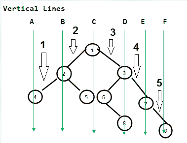

# 二叉树的垂直宽度|集合 2

> 原文:[https://www . geesforgeks . org/vertical-width-二叉树-set-2/](https://www.geeksforgeeks.org/vertical-width-binary-tree-set-2/)

给定一棵二叉树，求二叉树的垂直宽度。二叉树的宽度是垂直路径的数量。

**示例:**

```
Input : 
             7
           /  \
          6    5
         / \  / \
        4   3 2  1 
Output : 5

Input :
           1
         /    \
        2       3
       / \     / \
      4   5   6   7
               \   \ 
                8   9 
Output : 6
```

**先决条件:** [按垂直顺序打印二叉树](https://www.geeksforgeeks.org/print-binary-tree-vertical-order/)



在这张图片中，树包含 6 条垂直线，这是树所需的宽度。

**方法:**在该方法中，我们使用该方法打印二叉树的垂直视图。将水平距离存储在一组中，并返回 **1 +最高水平距离–最低水平距离。**增加 1 也是为了考虑水平距离 0。左转时，执行 HD–1，右转时执行 hd + 1。我们在哈希表中插入所有可能的距离，最后返回哈希表的大小。

## C++

```
// CPP code to find vertical
// width of a binary tree
#include <bits/stdc++.h>
using namespace std;

// Tree class
class Node
{
public :
    int data;
    Node *left, *right;

    // Constructor
    Node(int data_new)
    {
        data = data_new;
        left = right = NULL;
    }
};

// Function to fill hd in set.
void fillSet(Node* root, unordered_set<int>& s,
                                       int hd)
{
    if (!root)
        return;

    fillSet(root->left, s, hd - 1);
    s.insert(hd);
    fillSet(root->right, s, hd + 1);
}

int verticalWidth(Node* root)
{
    unordered_set<int> s;

    // Third parameter is horizontal
    // distance
    fillSet(root, s, 0);

    return s.size();
}

int main()
{
    Node* root = NULL;

    // Creating the above tree
    root = new Node(1);
    root->left = new Node(2);
    root->right = new Node(3);
    root->left->left = new Node(4);
    root->left->right = new Node(5);
    root->right->left = new Node(6);
    root->right->right = new Node(7);
    root->right->left->right = new Node(8);
    root->right->right->right = new Node(9);

    cout << verticalWidth(root) << "\n";

    return 0;
}
```

## Java 语言(一种计算机语言，尤用于创建网站)

```
/* Java code to find the vertical width of a binary tree */
import java.io.*;
import java.util.*;

/* A binary tree node has data, pointer to left child
and a pointer to right child */
class Node
{
    int data;
    Node left, right;

    Node(int item)
    {
        data = item;
        left = right = null;
    }
}

class BinaryTree
{
    Node root;

    /* UTILITY FUNCTIONS */
    // Function to fill hd in set.
    void fillSet(Node root,Set<Integer> set,int hd)
    {
        if(root == null) return;
        fillSet(root.left,set,hd - 1);
        set.add(hd);
        fillSet(root.right,set,hd + 1);
    }

    int verticalWidth(Node root)
    {
        Set<Integer> set = new HashSet<Integer>();

        // Third parameter is horizontal distance
        fillSet(root,set,0);
        return set.size();
    }

    /* Driver program to test above functions */
    public static void main(String args[])
    {
        BinaryTree tree = new BinaryTree();

        /*
        Constructed binary tree is:
            1
            / \
        2 3
        / \ \
        4 5     8
                / \
                6 7
        */
        tree.root = new Node(1);
        tree.root.left = new Node(2);
        tree.root.right = new Node(3);
        tree.root.left.left = new Node(4);
        tree.root.left.right = new Node(5);
        tree.root.right.right = new Node(8);
        tree.root.right.right.left = new Node(6);
        tree.root.right.right.right = new Node(7);
        System.out.println(tree.verticalWidth(tree.root));

    }
}

/* This code is contributed by Ashok Borra */
```

## 蟒蛇 3

```
# Python code to find vertical
# width of a binary tree

class Node:
    def __init__(self, data):
        self.data = data
        self.left = self.right = None

# Function to fill hd in set.
def fillSet(root, s, hd):
    if (not root):
        return

    fillSet(root.left, s, hd - 1)
    s.add(hd)
    fillSet(root.right, s, hd + 1)

def verticalWidth(root):
    s = set()

    # Third parameter is horizontal
    # distance
    fillSet(root, s, 0)

    return len(s)

if __name__ == '__main__':

    # Creating the above tree
    root = Node(1)
    root.left = Node(2)
    root.right = Node(3)
    root.left.left = Node(4)
    root.left.right = Node(5)
    root.right.left = Node(6)
    root.right.right = Node(7)
    root.right.left.right = Node(8)
    root.right.right.right = Node(9)

    print(verticalWidth(root))

# This code is contributed by PranchalK
```

## C#

```
// C# code to find the vertical width
// of a binary tree
using System;
using System.Collections.Generic;

/* A binary tree node has data,
pointer to left child and a
pointer to right child */
public class Node
{
    public int data;
    public Node left, right;

    public Node(int item)
    {
        data = item;
        left = right = null;
    }
}

public class BinaryTree
{
    Node root;

    /* UTILITY FUNCTIONS */
    // Function to fill hd in set.
    void fillSet(Node root, HashSet<int> set, int hd)
    {
        if(root == null) return;
        fillSet(root.left, set, hd - 1);
        set.Add(hd);
        fillSet(root.right, set, hd + 1);
    }

    int verticalWidth(Node root)
    {
        HashSet<int> set = new HashSet<int>();

        // Third parameter is horizontal distance
        fillSet(root,set, 0);
        return set.Count;
    }

    // Driver Code
    public static void Main(String []args)
    {
        BinaryTree tree = new BinaryTree();

        /*
        Constructed binary tree is:
            1
            / \
        2 3
        / \ \
        4 5     8
                / \
                6 7
        */
        tree.root = new Node(1);
        tree.root.left = new Node(2);
        tree.root.right = new Node(3);
        tree.root.left.left = new Node(4);
        tree.root.left.right = new Node(5);
        tree.root.right.right = new Node(8);
        tree.root.right.right.left = new Node(6);
        tree.root.right.right.right = new Node(7);
        Console.WriteLine(tree.verticalWidth(tree.root));

    }
}

// This code is contributed by PrinciRaj1992
```

## java 描述语言

```
<script>

// Javascript code to find the vertical
// width of a binary tree

/* A binary tree node has data,
pointer to left child and a
pointer to right child */
class Node
{
    constructor(item)
    {
        this.data = item;
        this.left = null;
        this.right = null;
    }
}

var root;

/* UTILITY FUNCTIONS */
// Function to fill hd in set.
function fillSet(root,set, hd)
{
    if (root == null)
        return;

    fillSet(root.left, set, hd - 1);
    set.add(hd);
    fillSet(root.right, set, hd + 1);
}

function verticalWidth(root)
{
    var set = new Set();

    // Third parameter is horizontal
    // distance
    fillSet(root,set, 0);
    return set.size;
}

// Driver Code
/*
Constructed binary tree is:
     1
    / \
   2   3
  / \   \
 4   5   8
        / \
        6 7
*/
root = new Node(1);
root.left = new Node(2);
root.right = new Node(3);
root.left.left = new Node(4);
root.left.right = new Node(5);
root.right.right = new Node(8);
root.right.right.left = new Node(6);
root.right.right.right = new Node(7);

document.write(verticalWidth(root));

// This code is contributed by rrrtnx

</script>
```

**Output:** 

```
6
```