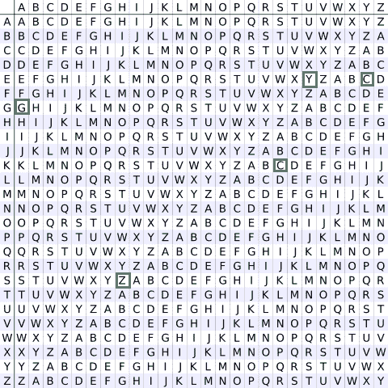

# Vigenère 密码

> 原文:[https://www.geeksforgeeks.org/vigenere-cipher/](https://www.geeksforgeeks.org/vigenere-cipher/)

Vigenere Cipher 是一种加密字母文本的方法。它使用简单形式的[多字母替换](https://en.wikipedia.org/wiki/Polyalphabetic_cipher)。多字母密码是任何基于替换的密码，使用多个替换字母。使用 [*维格内广场或维格内表格*](https://en.wikipedia.org/wiki/Vigen%C3%A8re_cipher#/media/File:Vigen%C3%A8re_square_shading.svg) 对原始文本进行加密。

*   该表由不同行中写了 26 次的字母组成，每个字母与前一个字母相比循环向左移动，对应于 26 个可能的[凯撒密码](https://www.geeksforgeeks.org/caesar-cipher/)。
*   在加密过程的不同阶段，密码使用不同于其中一行的字母表。
*   每个点使用的字母取决于一个重复的关键字。

**例:**

```
Input : Plaintext :   GEEKSFORGEEKS
             Keyword :  AYUSH
Output : Ciphertext :  GCYCZFMLYLEIM
For generating key, the given keyword is repeated
in a circular manner until it matches the length of 
the plain text.
The keyword "AYUSH" generates the key "AYUSHAYUSHAYU"
The plain text is then encrypted using the process 
explained below.
```

**加密**
明文的第一个字母，G 与密钥的第一个字母 A 配对。因此使用 Vigenère 正方形的行 G 和列 A，即 G。类似地，对于明文的第二个字母，使用密钥的第二个字母，行 E 的字母，列 Y 是 c。其余的明文以类似的方式加密。

**要加密的表格–极客**



**解密**
解密是通过转到表中与密钥对应的行，找到密文字母在该行的位置，然后使用该列的标签作为明文来执行的。例如，在 A 行(来自 AYUSH)，密文 G 出现在 G 列，这是第一个明文字母。接下来，我们转到 Y 行(来自 AYUSH)，找到 E 列中的密文 C，这样 E 就是第二个明文字母。
更简单的实现方式**可以是通过将[A-Z]转换成数字[0–25]来代数化地可视化维根内。** 

```
Encryption
The plaintext(P) and key(K) are added modulo 26.
Ei = (Pi + Ki) mod 26

Decryption
Di = (Ei - Ki + 26) mod 26
```

**注:** D <sub>i</sub> 表示明文第 I 个字符的偏移量。像**的偏移量 A** 是 0，而**的偏移量 B** 是 1 等等。
下面是思路的实现。

## C++

```
// C++ code to implement Vigenere Cipher
#include<bits/stdc++.h>
using namespace std;

// This function generates the key in
// a cyclic manner until it's length isi'nt
// equal to the length of original text
string generateKey(string str, string key)
{
    int x = str.size();

    for (int i = 0; ; i++)
    {
        if (x == i)
            i = 0;
        if (key.size() == str.size())
            break;
        key.push_back(key[i]);
    }
    return key;
}

// This function returns the encrypted text
// generated with the help of the key
string cipherText(string str, string key)
{
    string cipher_text;

    for (int i = 0; i < str.size(); i++)
    {
        // converting in range 0-25
        char x = (str[i] + key[i]) %26;

        // convert into alphabets(ASCII)
        x += 'A';

        cipher_text.push_back(x);
    }
    return cipher_text;
}

// This function decrypts the encrypted text
// and returns the original text
string originalText(string cipher_text, string key)
{
    string orig_text;

    for (int i = 0 ; i < cipher_text.size(); i++)
    {
        // converting in range 0-25
        char x = (cipher_text[i] - key[i] + 26) %26;

        // convert into alphabets(ASCII)
        x += 'A';
        orig_text.push_back(x);
    }
    return orig_text;
}

// Driver program to test the above function
int main()
{
    string str = "GEEKSFORGEEKS";
    string keyword = "AYUSH";

    string key = generateKey(str, keyword);
    string cipher_text = cipherText(str, key);

    cout << "Ciphertext : "
         << cipher_text << "\n";

    cout << "Original/Decrypted Text : "
         << originalText(cipher_text, key);
    return 0;
}
```

## Java 语言(一种计算机语言，尤用于创建网站)

```
// Java code to implement Vigenere Cipher

class GFG
{

// This function generates the key in
// a cyclic manner until it's length isi'nt
// equal to the length of original text
static String generateKey(String str, String key)
{
    int x = str.length();

    for (int i = 0; ; i++)
    {
        if (x == i)
            i = 0;
        if (key.length() == str.length())
            break;
        key+=(key.charAt(i));
    }
    return key;
}

// This function returns the encrypted text
// generated with the help of the key
static String cipherText(String str, String key)
{
    String cipher_text="";

    for (int i = 0; i < str.length(); i++)
    {
        // converting in range 0-25
        int x = (str.charAt(i) + key.charAt(i)) %26;

        // convert into alphabets(ASCII)
        x += 'A';

        cipher_text+=(char)(x);
    }
    return cipher_text;
}

// This function decrypts the encrypted text
// and returns the original text
static String originalText(String cipher_text, String key)
{
    String orig_text="";

    for (int i = 0 ; i < cipher_text.length() &&
                            i < key.length(); i++)
    {
        // converting in range 0-25
        int x = (cipher_text.charAt(i) -
                    key.charAt(i) + 26) %26;

        // convert into alphabets(ASCII)
        x += 'A';
        orig_text+=(char)(x);
    }
    return orig_text;
}

// This function will convert the lower case character to Upper case
static String LowerToUpper(String s)
{
    StringBuffer str =new StringBuffer(s);
    for(int i = 0; i < s.length(); i++)
    {
        if(Character.isLowerCase(s.charAt(i)))
        {
            str.setCharAt(i, Character.toUpperCase(s.charAt(i)));
        }
    }
    s = str.toString();
    return s;
}

// Driver code
public static void main(String[] args)
{
    String Str = "GEEKSFORGEEKS";
    String Keyword = "AYUSH";

      String str = LowerToUpper(Str);
      String keyword = LowerToUpper(Keyword);

    String key = generateKey(str, keyword);
    String cipher_text = cipherText(str, key);

    System.out.println("Ciphertext : "
        + cipher_text + "\n");

    System.out.println("Original/Decrypted Text : "
        + originalText(cipher_text, key));
    }
}

// This code has been contributed by 29AjayKumar
```

## 蟒蛇 3

```
# Python code to implement
# Vigenere Cipher

# This function generates the
# key in a cyclic manner until
# it's length isn't equal to
# the length of original text
def generateKey(string, key):
    key = list(key)
    if len(string) == len(key):
        return(key)
    else:
        for i in range(len(string) -
                       len(key)):
            key.append(key[i % len(key)])
    return("" . join(key))

# This function returns the
# encrypted text generated
# with the help of the key
def cipherText(string, key):
    cipher_text = []
    for i in range(len(string)):
        x = (ord(string[i]) +
             ord(key[i])) % 26
        x += ord('A')
        cipher_text.append(chr(x))
    return("" . join(cipher_text))

# This function decrypts the
# encrypted text and returns
# the original text
def originalText(cipher_text, key):
    orig_text = []
    for i in range(len(cipher_text)):
        x = (ord(cipher_text[i]) -
             ord(key[i]) + 26) % 26
        x += ord('A')
        orig_text.append(chr(x))
    return("" . join(orig_text))

# Driver code
if __name__ == "__main__":
    string = "GEEKSFORGEEKS"
    keyword = "AYUSH"
    key = generateKey(string, keyword)
    cipher_text = cipherText(string,key)
    print("Ciphertext :", cipher_text)
    print("Original/Decrypted Text :",
           originalText(cipher_text, key))

# This code is contributed
# by Pratik Somwanshi
```

## C#

```
// C# code to implement Vigenere Cipher
using System;

class GFG
{

// This function generates the key in
// a cyclic manner until it's length isi'nt
// equal to the length of original text
static String generateKey(String str, String key)
{
    int x = str.Length;

    for (int i = 0; ; i++)
    {
        if (x == i)
            i = 0;
        if (key.Length == str.Length)
            break;
        key+=(key[i]);
    }
    return key;
}

// This function returns the encrypted text
// generated with the help of the key
static String cipherText(String str, String key)
{
    String cipher_text="";

    for (int i = 0; i < str.Length; i++)
    {
        // converting in range 0-25
        int x = (str[i] + key[i]) %26;

        // convert into alphabets(ASCII)
        x += 'A';

        cipher_text+=(char)(x);
    }
    return cipher_text;
}

// This function decrypts the encrypted text
// and returns the original text
static String originalText(String cipher_text, String key)
{
    String orig_text="";

    for (int i = 0 ; i < cipher_text.Length &&
                            i < key.Length; i++)
    {
        // converting in range 0-25
        int x = (cipher_text[i] -
                    key[i] + 26) %26;

        // convert into alphabets(ASCII)
        x += 'A';
        orig_text+=(char)(x);
    }
    return orig_text;
}

// Driver code
public static void Main(String[] args)
{
    String str = "GEEKSFORGEEKS";
    String keyword = "AYUSH";

    String key = generateKey(str, keyword);
    String cipher_text = cipherText(str, key);

    Console.WriteLine("Ciphertext : "
        + cipher_text + "\n");

    Console.WriteLine("Original/Decrypted Text : "
        + originalText(cipher_text, key));
    }
}

/* This code contributed by PrinciRaj1992 */
```

## java 描述语言

```
<script>

// JavaScript code to implement Vigenere Cipher

// This function generates the key in
// a cyclic manner until it's length isi'nt
// equal to the length of original text
function generateKey(str,key)
{

     key=key.split("");
    if(str.length == key.length)
        return key.join("");
    else
    {
        let temp=key.length;   
        for (let i = 0;i<(str.length-temp) ; i++)
        {

            key.push(key[i % ((key).length)])
        }
    }
    return key.join("");
}

// This function returns the encrypted text
// generated with the help of the key
function cipherText(str,key)
{
    let cipher_text="";

    for (let i = 0; i < str.length; i++)
    {
        // converting in range 0-25
        let x = (str[i].charCodeAt(0) + key[i].charCodeAt(0)) %26;

        // convert into alphabets(ASCII)
        x += 'A'.charCodeAt(0);

        cipher_text+=String.fromCharCode(x);
    }
    return cipher_text;
}

// This function decrypts the encrypted text
// and returns the original text
function originalText(cipher_text,key)
{
    let orig_text="";

    for (let i = 0 ; i < cipher_text.length ; i++)
    {
        // converting in range 0-25
        let x = (cipher_text[i].charCodeAt(0) -
                    key[i].charCodeAt(0) + 26) %26;

        // convert into alphabets(ASCII)
        x += 'A'.charCodeAt(0);
        orig_text+=String.fromCharCode(x);
    }
    return orig_text;
}

// This function will convert the lower
// case character to Upper case
function LowerToUpper(s)
{
    let str =(s).split("");
    for(let i = 0; i < s.length; i++)
    {
        if(s[i] == s[i].toLowerCase())
        {
            str[i] = s[i].toUpperCase();
        }
    }
    s = str.toString();
    return s;
}

// Driver code
let str = "GEEKSFORGEEKS";
let keyword = "AYUSH";

let key = generateKey(str, keyword);

let cipher_text = cipherText(str, key);

document.write("Ciphertext : "
                   + cipher_text + "<br><br>");

document.write("Original/Decrypted Text : "
                   + originalText(cipher_text, key)+"<br>");

// This code is contributed by rag2127

</script>
```

**Output**

```
Ciphertext : GCYCZFMLYLEIM
Original/Decrypted Text : GEEKSFORGEEKS
```

**参考:**[【https://en.wikipedia.org/wiki/Vigen%C3%A8re_cipher】](https://en.wikipedia.org/wiki/Vigen%C3%A8re_cipher)
本文由 [**阿育什·坎德里**](https://in.linkedin.com/in/ayush-khanduri-b4ab87106) 供稿。如果你喜欢 GeeksforGeeks 并想投稿，你也可以使用[write.geeksforgeeks.org](https://write.geeksforgeeks.org)写一篇文章或者把你的文章邮寄到 review-team@geeksforgeeks.org。看到你的文章出现在极客博客主页上，帮助其他极客。
如果发现有不正确的地方，或者想分享更多关于上述话题的信息，请写评论。