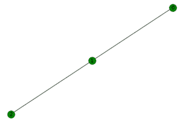
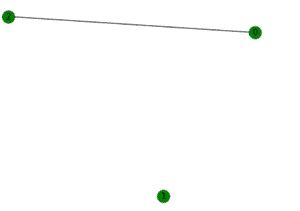

# 使用网络可视化图形的补集

> 原文:[https://www . geesforgeks . org/visualizing-the-complex-of-graph-use-networkx/](https://www.geeksforgeeks.org/visualizing-the-complement-of-a-graph-using-networkx/)

给定一个图 *G* 通过从具有与 *G* 相同节点数的完整图中移除包含在 *G* 中的边来获得该图的补集。

**示例:**

初始图形 G:



G

G 的补语:



g 补码

### **使用 Python 实现补码:**

我们将使用**networkx . complete()**函数来完成我们的任务

**语法:**

> networkx.complement()
> 
> *   返回传递的图形对象的补码。
> *   返回的值与传递的值属于同一类型，即 networkx graph 对象。
> *   g 是传递的初始对象。
> *   虽然补码正在创建，但没有创建自循环和平行边。

### **补体(G)功能的工作:**

如果满足以下条件，则在补集图中增加一条边(n，n2)，其中 n 是用于迭代 G 的迭代器:

*   n 和 n2 不是邻居，即 n2 在 n 的邻接表中，反之亦然。
*   还有 n！= n2。
*   n 和 n2 都是 g 的一部分。

**进场:**

*   我们将使用别名 *nx* 导入*网络。*
*   使用 *path_graph()* 函数创建一个样本图形对象 G。
*   然后我们将调用补码函数传递 *G* 作为参数。
*   我们将在另一个对象 *G_C* **中捕获补码函数返回的对象。**
*   然后我们将调用 *draw()* 函数传递 *<u>G_C</u>* 作为一个参数，它将显示补码图。

## 蟒蛇 3

```
# importing networkx module
import networkx as nx

# creating sample graph object
G = nx.path_graph(3)

# complement of G and saving in G_C
G_C = nx.complement(G)

# calling draw() to visualize the original graph
nx.draw(G, node_color='Green', with_labels=True)

# calling draw() to visualize the complement graph
nx.draw(G_C, node_color='Green', with_labels=True)
```

**输出:**


原始图形


补码图

通过使用*补码()*方法，G 中的所有边都被移除，所有其他可能性都被添加到 G 的补码中并被打印。