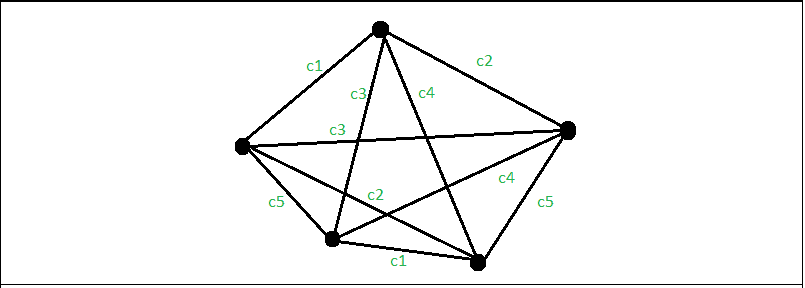

# 维金定理

> 原文:[https://www.geeksforgeeks.org/vizings-theorem/](https://www.geeksforgeeks.org/vizings-theorem/)

在图论中， [Vizing 定理](https://en.wikipedia.org/wiki/Vizing%27s_theorem)指出，每个简单的无向图都可以使用最多比图的最大度数‘d’大一个的颜色数进行边着色。简单来说，这个定理说明简单图的色指数可以是**‘T3’或**‘d’+1**。图的边着色所需的最小颜色数称为色指数。** 



上图 g 中有 5 个顶点，最高度数是 4，但是我们需要 5 种颜色，这样就没有边与相邻顶点的任何边共享相同的颜色，如上图所示。因此，此图所需的有效颜色数等于 5，即('最高度数'+ 1)。
**注:**上图中的 c1、c2、c3、c4、c5 隐含着鲜明的色彩。

**示例:**

> **输入:**
> v = 3，e = 3
> {{ 1，2，-1 }，
> { 2，3，-1 }，
> { 3，1，-1 } }；
> **输出:**
> 3 种颜色需要生成有效的边缘着色:
> v(1):1 和 v(2): 2 之间的颜色为:颜色 1
> v(1):2 和 v(2): 3 之间的颜色为:颜色 2
> v(1):3 和 v(2): 1 之间的颜色为:颜色 3

**算法:**

*   初始化边的数量后，指定每条边的顶点对
*   根据定理给图的边着色
*   指定一种颜色，然后检查其有效性
*   检查任何两条相邻的边是否具有相同的颜色，然后增加颜色，转到标志，并尝试下一种颜色
*   根据定理，重复直到所有的边都变成它的颜色
*   完成后，打印顶点之间所有边的颜色

下面是上述方法的实现:

## C++

```
// C++ program to illustrate
// Vizing's Theorem
#include <iostream>
using namespace std;

// Function to print the color of the edge
void colorEdge(int edges[][3], int e)
{
    int color;

    // Assign a color to every edge 'i'.
    for (int i = 0; i < e; i++) {
        color = 1;
    flag:
        // Assign a color and
        // then check its validity.
        edges[i][2] = color;
        for (int j = 0; j < e; j++) {
            if (j == i)
                continue;

            // If the color of edges
            // is adjacent to edge i
            if ((edges[i][0] == edges[j][0])
                || (edges[i][1] == edges[j][0])
                || (edges[i][0] == edges[j][1])
                || (edges[i][1] == edges[j][1])) {

                // If the color matches
                if (edges[i][2] == edges[j][2]) {

                    // Increment the color,
                    // denotes the change in color.
                    color++;

                    // goes back, and assigns
                    // the next color.
                    goto flag;
                }
            }
        }
    }
    // Check the maximum color from all the edge colors
    int maxColor = -1;
    for (int i = 0; i < e; i++) {
        maxColor = max(maxColor, edges[i][2]);
    }
    cout << maxColor
         << " colors needs to generate a valid edge "
            "coloring:"
         << endl;
    for (int i = 0; i < e; i++) {
        cout << "color between v(1): " << edges[i][0]
             << " and v(2): " << edges[i][1]
             << " is: color " << edges[i][2] << endl;
    }
}

// Driver Code
int main()
{
    // initialize the number
    // of edges of the graph
    int e = 5;

    // initialize the vertex
    // pair of every edge in a graph
    int edges[e][3] = { { 1, 2, -1 },
                        { 2, 3, -1 },
                        { 3, 4, -1 },
                        { 4, 1, -1 },
                        { 1, 3, -1 } };

    colorEdge(edges, e);
    return 0;
}
```

## Java 语言(一种计算机语言，尤用于创建网站)

```
// Java program to illustrate
// Vizing's Theorem
import java.util.*;

public class VizingsTheorem {

    // Function to find the chromatic index
    public void colorEdge(int[][] edges, int e)
    {
        // Initialize edge to first edge and
        // color to color 1
        int i = 0, color = 1;

        // Repeat until all edges are done coloring
        while (i < e) {
            // Give the selected edge a color
            edges[i][2] = color;
            boolean flag = false;
            // Iterate through all others edges to check
            for (int j = 0; j < e; j++) {
                // Ignore if same edge
                if (j == i)
                    continue;
                // Check if one vertex is similar
                if ((edges[i][0] == edges[j][0])
                    || (edges[i][1] == edges[j][0])
                    || (edges[i][0] == edges[j][1])
                    || (edges[i][1] == edges[j][1])) {
                    // Check if color is similar
                    if (edges[i][2] == edges[j][2]) {
                        // Increment the color by 1
                        color++;
                        flag = true;
                        break;
                    }
                }
            }

            // If same color faced then repeat again
            if (flag == true) {
                continue;
            }

            // Or else proceed to a
            // new vertex with color 1
            color = 1;
            i++;
        }

        // Check the maximum color from all the edge colors
        int maxColor = -1;
        for (i = 0; i < e; i++)
        {
            maxColor = Math.max(maxColor, edges[i][2]);
        }
        System.out.println(
            maxColor
            + " colors needs to generate"
            +" a valid edge coloring:");
        for (i = 0; i < e; i++)
        {
            System.out.println(
                "color between v(1): " + edges[i][0]
                + " and v(2): " + edges[i][1]
                + " is: color " + edges[i][2]);
        }
    }

    // Driver code
    public static void main(String[] args)
    {

        // Number of edges
        int e = 5;

        // Edge list
        int[][] edges = new int[e][3];

        // Initialize all edge colors to 0
        for (int i = 0; i < e; i++) {
            edges[i][2] = -1;
        }

        // Edges
        edges[0][0] = 1;
        edges[0][1] = 2;

        edges[1][0] = 2;
        edges[1][1] = 3;

        edges[2][0] = 3;
        edges[2][1] = 4;

        edges[3][0] = 4;
        edges[3][1] = 1;

        edges[4][0] = 1;
        edges[4][1] = 3;

        // Run the function
        VizingsTheorem c = new VizingsTheorem();
        c.colorEdge(edges, e);
    }
}
```

## 蟒蛇 3

```
def colorEdge(edges, e):
    # Initialize edge to first edge and
    # color to color 1
    i = 0
    color = 1
    # Repeat until all edges are done coloring
    while(i < e):
        # Give the selected edge a color
        edges[i][2] = color
        flag = False
        # Iterate through all others edges to check
        for j in range(e):
            # Ignore if same edge
            if (j == i):
                continue
            # Check if one vertex is similar
            if ((edges[i][0] == edges[j][0])or
                (edges[i][1] == edges[j][0]) or
                (edges[i][0] == edges[j][1]) or
                    (edges[i][1] == edges[j][1])):
                # Check if color is similar
                if (edges[i][2] == edges[j][2]):
                    # Increment the color by 1
                    color += 1
                    flag = True
                    break
        # If same color faced then repeat again
        if (flag == True):
            continue

        # Or else proceed to a new vertex with color 1
        color = 1
        i += 1

    # Check the maximum color from all the edge colors
    maxColor = -1
    for i in range(e):
        maxColor = max(maxColor, edges[i][2])
    print(str(maxColor)+" colors needs to generate a valid edge coloring:")
    for i in range(e):
        print("color between v(1): "+str(edges[i][0])+" and v(2): "
              + str(edges[i][1])+" is: color "+str(edges[i][2]))

# Driver code

if __name__ == "__main__":
    # Number of edges
    e = 5
    # Edge list
    edges = [[0 for _ in range(3)] for _ in range(e)]
    # Initialize all edge colors to 0
    for i in range(e):
        edges[i][2] = -1
    # Edges
    edges[0][0] = 1
    edges[0][1] = 2

    edges[1][0] = 2
    edges[1][1] = 3

    edges[2][0] = 3
    edges[2][1] = 4

    edges[3][0] = 4
    edges[3][1] = 1

    edges[4][0] = 1
    edges[4][1] = 3

    # Run the function
    colorEdge(edges, e)
```

## java 描述语言

```
<script>

// JavaScript program to illustrate
// Vizing's Theorem
// Function to find the chromatic index
function colorEdge(edges, e)
{
    // Initialize edge to first edge and
    // color to color 1
    var i = 0, color = 1;
    // Repeat until all edges are done coloring
    while (i < e) {
        // Give the selected edge a color
        edges[i][2] = color;
        var flag = false;
        // Iterate through all others edges to check
        for (var j = 0; j < e; j++) {
            // Ignore if same edge
            if (j == i)
                continue;
            // Check if one vertex is similar
            if ((edges[i][0] == edges[j][0])
                || (edges[i][1] == edges[j][0])
                || (edges[i][0] == edges[j][1])
                || (edges[i][1] == edges[j][1])) {
                // Check if color is similar
                if (edges[i][2] == edges[j][2]) {
                    // Increment the color by 1
                    color++;
                    flag = true;
                    break;
                }
            }
        }
        // If same color faced then repeat again
        if (flag == true) {
            continue;
        }
        // Or else proceed to a
        // new vertex with color 1
        color = 1;
        i++;
    }
    // Check the maximum color from all the edge colors
    var maxColor = -1;
    for (i = 0; i < e; i++)
    {
        maxColor = Math.max(maxColor, edges[i][2]);
    }
    document.write(
        maxColor
        + " colors needs to generate"
        +" a valid edge coloring:<br>");
    for (i = 0; i < e; i++)
    {
        document.write(
            "color between v(1): " + edges[i][0]
            + " and v(2): " + edges[i][1]
            + " is: color " + edges[i][2] + "<br>");
    }
}
// Driver code
// Number of edges
var e = 5;
// Edge list
var edges = Array.from(Array(e), ()=>Array(3));
// Initialize all edge colors to 0
for (var i = 0; i < e; i++) {
    edges[i][2] = -1;
}
// Edges
edges[0][0] = 1;
edges[0][1] = 2;
edges[1][0] = 2;
edges[1][1] = 3;
edges[2][0] = 3;
edges[2][1] = 4;
edges[3][0] = 4;
edges[3][1] = 1;
edges[4][0] = 1;
edges[4][1] = 3;

// Run the function
colorEdge(edges, e);

</script>
```

**Output**

```
3 colors needs to generate a valid edge coloring:
color between v(1): 1 and v(2): 2 is: color 1
color between v(1): 2 and v(2): 3 is: color 2
color between v(1): 3 and v(2): 4 is: color 1
color between v(1): 4 and v(2): 1 is: color 2
color between v(1): 1 and v(2): 3 is: color 3
```