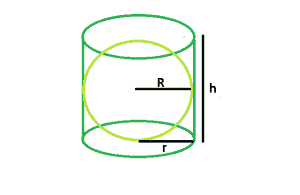

# 右圆柱体内最大球体的体积

> 原文:[https://www . geeksforgeeks . org/右圆柱内最大球体的体积/](https://www.geeksforgeeks.org/volume-of-biggest-sphere-within-a-right-circular-cylinder/)

给定半径为高度为的右圆柱体。任务是找到可以在其中内接的最大球体的半径。
**示例** :

```
Input : r = 4, h = 8
Output : 4

Input : r = 5, h= 10
Output :5
```



**逼近**:从图中可以明显看出，球体的半径将明显等于圆柱体的基半径。
所以， **R = r**
以下是上述方法的实现:

## C++

```
// C++ Program to find the biggest sphere
// that can be fit within a right circular cylinder
#include <bits/stdc++.h>
using namespace std;

// Function to find the biggest sphere
float sph(float r, float h)
{

    // radius and height cannot be negative
    if (r < 0 && h < 0)
        return -1;

    // radius of sphere
    float R = r;
    return R;
}

// Driver code
int main()
{
    float r = 4, h = 8;
    cout << sph(r, h) << endl;
    return 0;
}
```

## Java 语言(一种计算机语言，尤用于创建网站)

```
// Java Program to find the biggest
// sphere that can be fit within a
// right circular cylinder
import java.io.*;

class GFG
{

// Function to find the biggest sphere
static float sph(float r, float h)
{

    // radius and height cannot
    // be negative
    if (r < 0 && h < 0)
        return -1;

    // radius of sphere
    float R = r;
    return R;
}

// Driver code
public static void main (String[] args)
{
    float r = 4, h = 8;
    System.out.println(sph(r, h));
}
}

// This code is contributed
// by inder_verma
```

## 蟒蛇 3

```
# Python 3 Program to find the biggest
# sphere that can be fit within a right
# circular cylinder

# Function to find the biggest sphere
def sph(r, h):

    # radius and height cannot
    # be negative
    if (r < 0 and h < 0):
        return -1

    # radius of sphere
    R = r
    return float(R)

# Driver code
r, h = 4, 8
print(sph(r, h))

# This code is contributed
# by PrinciRaj1992
```

## C#

```
// C# Program to find the biggest
// sphere that can be fit within a
// right circular cylinder
using System;

class GFG
{

// Function to find the biggest sphere
static float sph(float r, float h)
{

    // radius and height cannot
    // be negative
    if (r < 0 && h < 0)
        return -1;

    // radius of sphere
    float R = r;
    return R;
}

// Driver code
public static void Main ()
{
    float r = 4, h = 8;
    Console.WriteLine(sph(r, h));
}
}

// This code is contributed
// by shs..
```

## 服务器端编程语言（Professional Hypertext Preprocessor 的缩写）

```
<?php
    // PHP Program to find the biggest sphere
// that can be fit within a right circular cylinder

// Function to find the biggest sphere
function sph($r, $h)
{

    // radius and height cannot be negative
    if ($r < 0 && $h < 0)
        return -1;

    // radius of sphere
    $R = $r;
    return $R;
}

// Driver code

    $r = 4 ;$h = 8;
    echo sph($r, $h);

// This code is contributed
// by shs..
?>
```

## java 描述语言

```
<script>
// javascript Program to find the biggest
// sphere that can be fit within a
// right circular cylinder

// Function to find the biggest sphere
function sph(r , h)
{

    // radius and height cannot
    // be negative
    if (r < 0 && h < 0)
        return -1;

    // radius of sphere
    var R = r;
    return R;
}

// Driver code
var r = 4, h = 8;
document.write(sph(r, h));

// This code is contributed by shikhasingrajput
</script>
```

**Output:** 

```
4
```