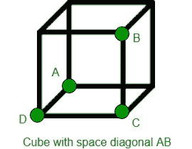
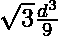
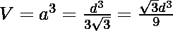

# 立方体的体积利用其空间对角线

> 原文:[https://www . geesforgeks . org/volume-of-cube-using-its-space-对角线/](https://www.geeksforgeeks.org/volume-of-cube-using-its-space-diagonal/)

给定立方体的空间对角线长度为 ***d*** 。任务是计算给定空间对角线长度的立方体所占的体积。空间对角线是连接不在同一面上的两个顶点的线。



**例:**

```
Input: d = 5 
Output: Volume of Cube: 24.0563

Input: d = 10
Output: Volume of Cube: 192.45
```

> 空间对角线给定的立方体的体积:

**证明:**

> 设 d =对角线的长度|AB|和
> 设 a =立方体每边的长度。
> 三角形 ACD 中的毕达哥拉斯# 1:
> 
> 三角形 ABC 中的毕达哥拉斯# 2:
> 
> 现在我们可以用 d 来求解为 a:
> 
> 这意味着体积 V 是:
> 

下面是需要的实现:

## C++

```
// C++ program to find the volume occupied
// by Cube with given space diagonal
#include <bits/stdc++.h>
using namespace std;

// Function to calculate Volume
float CubeVolume(float d)
{
    float Volume;

    // Formula to find Volume
    Volume = (sqrt(3) * pow(d, 3)) / 9;

    return Volume;
}

// Drivers code
int main()
{

    // space diagonal of Cube
    float d = 5;

    cout << "Volume of Cube: "
         << CubeVolume(d);

    return 0;
}
```

## Java 语言(一种计算机语言，尤用于创建网站)

```
// Java program to find the volume occupied
// by Cube with given space diagonal

public class GFG{

    // Function to calculate Volume
    static float CubeVolume(float d)
    {
        float Volume;

        // Formula to find Volume
        Volume = (float) (Math.sqrt(3) * Math.pow(d, 3)) / 9;

        return Volume;
    }

    // Drivers code
    public static void main(String []args)
    {

        // space diagonal of Cube
        float d = 5;

        System.out.println("Volume of Cube: " + CubeVolume(d));

    }

    // This code is contributed by Ryuga
    }
```

## 蟒蛇 3

```
# Python 3 program to find the volume occupied
# by Cube with given space diagonal
from math import sqrt, pow

# Function to calculate Volume
def CubeVolume(d):

    # Formula to find Volume
    Volume = (sqrt(3) * pow(d, 3)) / 9

    return Volume

# Drivers code
if __name__ == '__main__':

    # space diagonal of Cube
    d = 5

    print("Volume of Cube:",'{0:.6}' .
                format(CubeVolume(d)))

# This code is contributed
# by SURENDRA_GANGWAR
```

## C#

```
// C# program to find the volume occupied
// by Cube with given space diagonal
using System;

public class GFG{

    // Function to calculate Volume
    static float CubeVolume(float d)
    {
        float Volume;

        // Formula to find Volume
        Volume = (float) (Math.Sqrt(3) * Math.Pow(d, 3)) / 9;

        return Volume;
    }

    // Drivers code
    public static void Main()
    {

        // space diagonal of Cube
        float d = 5;

        Console.WriteLine("Volume of Cube: {0:F4}" , CubeVolume(d));

    }

    // This code is contributed by mits
    }
```

## 服务器端编程语言（Professional Hypertext Preprocessor 的缩写）

```
<?php
// PHP program to find the volume occupied
// by Cube with given space diagonal

// Function to calculate Volume
function CubeVolume($d)
{
    $Volume;

    // Formula to find Volume
    $Volume = (sqrt(3) * pow($d, 3)) / 9;

    return $Volume;
}

// Driver code

// space diagonal of Cube
$d = 5;

echo "Volume of Cube: ",
         CubeVolume($d);

// This code is contributed by akt_mit
?>
```

## java 描述语言

```
<script>

// javascript program to find the volume occupied
// by Cube with given space diagonal

// Function to calculate Volume
function CubeVolume( d)
{
    let Volume;

    // Formula to find Volume
    Volume = (Math.sqrt(3) * Math.pow(d, 3)) / 9;

    return Volume;
}

// Drivers code

    // space diagonal of Cube
    let d = 5;

   document.write( "Volume of Cube: "
         + CubeVolume(d).toFixed(4));

// This code contributed by gauravrajput1

</script>
```

**Output:** 

```
Volume of Cube: 24.0563
```

**时间复杂度:** O(1)