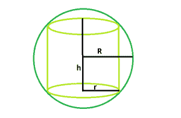

# 球体中最大右圆柱体的体积

> 原文:[https://www . geesforgeks . org/体积最大的球体中的右圆柱体/](https://www.geeksforgeeks.org/volume-of-largest-right-circular-cylinder-within-a-sphere/)

给定半径范围。任务是找到最大的右圆柱体的体积，它可以被刻在里面。
**示例** :

```
Input : R = 4
Output : 77.3495

Input : R = 5
Output : 151.073
```



**逼近** :
让 **r** 为右圆柱体的半径， **h** 为其高度。
气缸容积， **V = π*r <sup>2</sup> *h**
同样，**R<sup>2</sup>= R<sup>2</sup>–h<sup>2</sup>**T21】或，**V =π*(R<sup>2</sup>–h<sup>2</sup>)* h**
或，

## **C++**

```
// C++ Program to find the biggest right circular cylinder
// that can be fit within a sphere

#include <bits/stdc++.h>
using namespace std;

// Function to find the biggest right circular cylinder
float cyl(float R)
{

    // radius cannot be negative
    if (R < 0)
        return -1;

    // volume of cylinder
    float V = (2 * 3.14 * pow(R, 3)) / (3 * sqrt(3));
    return V;
}

// Driver code
int main()
{
    float R = 4;

    cout << cyl(R) << endl;

    return 0;
}
```

## **Java 语言(一种计算机语言，尤用于创建网站)**

```
// Java Program to find the biggest
// right circular cylinder that can
// be fit within a sphere
import java.io.*;

class GFG
{

// Function to find the biggest
// right circular cylinder
static float cyl(float R)
{

    // radius cannot be negative
    if (R < 0)
        return -1;

    // volume of cylinder
    float V = (float)((2 * 3.14 * Math.pow(R, 3)) /
                      (3 * Math.sqrt(3)));
    return V;
}

// Driver code
public static void main (String[] args)
{
    float R = 4;

    System.out.print( cyl(R));
}
}

// This code is contributed by anuj_67..
```

## **蟒蛇 3**

```
# Python 3 Program to find the biggest
# right circular cylinder that can be
# fit within a sphere
import math

# Function to find the biggest right
# circular cylinder
def cyl(R):

    # radius cannot be negative
    if (R < 0):
        return -1

    # volume of cylinder
    V = ((2 * 3.14 * math.pow(R, 3)) /
                (3 * math.sqrt(3)));
    return float(V)

# Driver code
R = 4
print(cyl(R))

# This code is contributed
# by PrinciRaj1992
```

## **C#**

```
// C# Program to find the biggest
// right circular cylinder that can
// be fit within a sphere
using System;

class GFG
{

// Function to find the biggest
// right circular cylinder
static float cyl(float R)
{

    // radius cannot be negative
    if (R < 0)
        return -1;

    // volume of cylinder
    float V = (float)((2 * 3.14 * Math.Pow(R, 3)) /
                             (3 * Math.Sqrt(3)));
    return V;
}

// Driver code
public static void Main ()
{
    float R = 4;

    Console.WriteLine( cyl(R));
}
}

// This code is contributed by shs
```

## **服务器端编程语言（Professional Hypertext Preprocessor 的缩写）**

```
<?php
// PHP Program to find the biggest right circular cylinder
// that can be fit within a sphere

// Function to find the biggest right circular cylinder
function cyl($R)
{

    // radius cannot be negative
    if ($R < 0)
        return -1;

    // volume of cylinder
    $V = (2 * 3.14 * pow($R, 3)) / (3 * sqrt(3));
    return $V;
}

// Driver code
    $R = 4;

    echo cyl($R);

// This code is contributed by shs

?>
```

## **java 描述语言**

```
<script>

// javascript Program to find the biggest
// right circular cylinder that can
// be fit within a sphere

// Function to find the biggest
// right circular cylinder
function cyl(R)
{

    // radius cannot be negative
    if (R < 0)
        return -1;

    // volume of cylinder
    var V = ((2 * 3.14 * Math.pow(R, 3)) /
                      (3 * Math.sqrt(3)));
    return V;
}

// Driver code
var R = 4;

document.write( cyl(R).toFixed(4));

// This code contributed by shikhasingrajput

</script>
```

****Output:** 

```
77.3495
```**