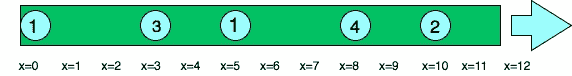
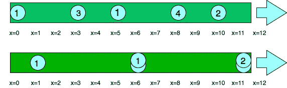

# 水滴问题

> 原文:[https://www.geeksforgeeks.org/water-drop-problem/](https://www.geeksforgeeks.org/water-drop-problem/)

考虑一根长度为 l 的管子，管子内 N 个不同位置有 N 个水滴。每个水滴都以不同的速度向管道末端移动(x=L)。当一个水滴与另一个水滴混合时，它假设与它混合的水滴的速度。确定从管道末端流出的液滴数量。
参考下图:

圆圈上的数字表示水滴的速度



**示例:**

```
Input: length = 12, position = [10, 8, 0, 5, 3], 
       speed = [2, 4, 1, 1, 3]
Output: 3
Explanation:
Droplets starting at x=10 and x=8 become a droplet, 
meeting each other at x=12 at time =1 sec.
The droplet starting at 0 doesn't mix with any 
other droplet, so it is a drop by itself.
Droplets starting at x=5 and x=3 become a single 
drop, mixing with each other at x=6 at time = 1 sec.
Note that no other droplets meet these drops before 
the end of the pipe, so the answer is 3.
Refer to the figure below
Numbers on circles indicates speed of water droplets.
```



**进场:**
这道题使用[贪婪手法](https://www.geeksforgeeks.org/greedy-algorithms/)。
如果满足两个条件，一滴将与另一滴混合:
1。如果液滴比液滴快，则它与
2 混合。如果较快下降的位置在较慢下降的后面。

我们使用一组[对](https://www.geeksforgeeks.org/pair-in-cpp-stl/)来存储我<sup>第</sup>次下落到达管道末端的位置和时间。然后我们[根据水滴的位置对](https://www.geeksforgeeks.org/sort-c-stl/)进行排序。现在，我们清楚地知道哪些水滴落在哪些水滴后面，以及它们各自到达终点所需的时间。时间多意味着速度慢，时间少意味着速度快。现在，较慢的液滴之前的所有液滴将与它混合。并且所有的液滴在较慢的液滴之后与下一个较慢的液滴混合，以此类推。
比如到达终点的时间是:12、3、7、8、1(按位置排序)
第 0 滴最慢，不会和下一滴混合
第 1 滴比第 2 滴快，所以他们会混合，第 2 滴比第 3 滴快，所以三者会混合在一起。它们不能与第四滴混合，因为那更快。
局部最大值+残留物的数量(最后一个局部最大值后的液滴)=液滴总数。

下面是上述方法的实现:

## C++

```
#include <bits/stdc++.h>
using namespace std;

// Function to find the number
// of the drops that come out of the
// pipe
int drops(int length, int position[],
          int speed[], int n)
{   
    // stores position and time
    // taken by a single
    // drop to reach the end as a pair
    vector<pair<int, double> > m(n);

    int i;
    for (i = 0; i < n; i++) {

        // calculates distance needs to be
        // covered by the ith drop
        int p = length - position[i];

        // inserts initial position of the
        // ith drop to the pair 
        m[i].first = position[i];

        // inserts time taken by ith
        // drop to reach
        // the end to the pair
        m[i].second = p * 1.0 / speed[i];
    }

    // sorts the pair according to increasing
    // order of their positions
    sort(m.begin(), m.end());
    int k = 0; // counter for no of final drops

    int curr_max = m[n-1].second;
    // we traverse the array demo
    // right to left
    // to determine the slower drop
    for (i = n - 2; i >= 0; i--)
    {
        // checks for next slower drop
        if (m[i].second > curr_max)
        {
            k++;
              curr_max=m[i].second;
        }
    }

    // calculating residual
    // drops in the pipe
    k++;
    return k;
}

// Driver Code
int main()
{
    // length of pipe
    int length = 12;

    // position of droplets
    int position[] = { 10, 8, 0, 5, 3 };

    // speed of each droplets
    int speed[] = { 2, 4, 1, 1, 3 };
    int n = sizeof(speed)/sizeof(speed[0]);
    cout << drops(length, position, speed, n);
    return 0;
}
```

## Java 语言(一种计算机语言，尤用于创建网站)

```
import java.util.*;

// User defined Pair class
class Pair {
    int x;
    int y;

    // Constructor
    public Pair(int x, int y)
    {
        this.x = x;
        this.y = y;
    }
}

// class to define user defined conparator
class Compare {

    static void compare(Pair arr[], int n)
    {
        // Comparator to sort the pair according to second element
        Arrays.sort(arr, new Comparator<Pair>() {
            @Override public int compare(Pair p1, Pair p2)
            {
                return p1.x - p2.x;
            }
        });
    }
}

public class Main
{
    // Function to find the number
  // of the drops that come out of the
  // pipe
  static int drops(int length, int[] position, int[] speed, int n)
  {
    // stores position and time
    // taken by a single
    // drop to reach the end as a pair
    Pair m[] = new Pair[n];
    int i;
    for (i = 0; i < n; i++)
    {

      // calculates distance needs to be
      // covered by the ith drop
      int p = length - position[i];

      // inserts initial position of the
      // ith drop to the pair
      // inserts time taken by ith
      // drop to reach
      // the end to the pair
      m[i] = new Pair(position[i], p / speed[i]);
    }

    // sorts the pair according to increasing
    // order of their positions
    Compare obj = new Compare();
    obj.compare(m, n);
    int k = 0; // counter for no of final drops
    int curr_max = (int)(m[n - 1].y);

    // we traverse the array demo
    // right to left
    // to determine the slower drop
    for (i = n - 2; i >= 0; i--)
    {

      // checks for next slower drop
      if (m[i].y > curr_max)
      {
        k++;
        curr_max = (int)(m[i].y);
      }
    }

    // calculating residual
    // drops in the pipe
    k++;
    return k;
  }

    public static void main(String[] args) {
        // length of pipe
        int length = 12;

        // position of droplets
        int[] position = { 10, 8, 0, 5, 3 };

        // speed of each droplets
        int[] speed = { 2, 4, 1, 1, 3 };
        int n = speed.length;
        System.out.println(drops(length, position, speed, n));
    }
}

// This code is contributed by decode2207.
```

## 蟒蛇 3

```
# Function to find the number
# of the drops that come out of the
# pipe
def drops(length, position, speed, n):

    # Stores position and time
    # taken by a single drop to
    # reach the end as a pair
    m = []

    for i in range(n):

        # Calculates distance needs to be
        # covered by the ith drop
        p = length - position[i]

        # Inserts initial position of the
        # ith drop to the pair
        # inserts time taken by ith
        # drop to reach
        # the end to the pair
        m.append([position[i], (p * 1.0) / speed[i]])

    # Sorts the pair according to increasing
    # order of their positions
    m.sort()

    # Counter for no of final drops
    k = 0

    curr_max = m[n - 1][1]

    # We traverse the array demo
    # right to left
    # to determine the slower drop
    for i in range(n - 2, -1, -1):

        # Checks for next slower drop
        if (m[i][1] > curr_max):
            k += 1
            curr_max = m[i][1]

    # Calculating residual
    # drops in the pipe
    k += 1
    return k

# Driver Code

# Length of pipe
length = 12

# Position of droplets
position = [ 10, 8, 0, 5, 3 ]

# Speed of each droplets
speed = [ 2, 4, 1, 1, 3 ]
n = len(speed)

print(drops(length, position, speed, n))

# This code is contributed by divyeshrabadiya07
```

## C#

```
using System;
using System.Collections.Generic;
class GFG
{

  // Function to find the number
  // of the drops that come out of the
  // pipe
  static int drops(int length, int[] position,
                   int[] speed, int n)
  {

    // stores position and time
    // taken by a single
    // drop to reach the end as a pair
    List<Tuple<int,double>> m = new List<Tuple<int,double>>();
    int i;
    for (i = 0; i < n; i++)
    {

      // calculates distance needs to be
      // covered by the ith drop
      int p = length - position[i];

      // inserts initial position of the
      // ith drop to the pair
      // inserts time taken by ith
      // drop to reach
      // the end to the pair
      m.Add(new Tuple<int,double>(position[i], p * 1.0 / speed[i]));
    }

    // sorts the pair according to increasing
    // order of their positions
    m.Sort();
    int k = 0; // counter for no of final drops
    int curr_max = (int)m[n - 1].Item2;

    // we traverse the array demo
    // right to left
    // to determine the slower drop
    for (i = n - 2; i >= 0; i--)
    {

      // checks for next slower drop
      if (m[i].Item2 > curr_max)
      {
        k++;
        curr_max = (int)m[i].Item2;
      }
    }

    // calculating residual
    // drops in the pipe
    k++;
    return k;
  }

  // Driver code
  static void Main()
  {

    // length of pipe
    int length = 12;

    // position of droplets
    int[] position = { 10, 8, 0, 5, 3 };

    // speed of each droplets
    int[] speed = { 2, 4, 1, 1, 3 };
    int n = speed.Length;
    Console.WriteLine(drops(length, position, speed, n));
  }
}

// This code is contributed by divyesh072019
```

## java 描述语言

```
<script>

// Function to find the number
// of the drops that come out of the
// pipe
function drops(length, position, speed, n)
{   
    // stores position and time
    // taken by a single
    // drop to reach the end as a pair
    var m = Array.from(Array(n), ()=>Array(2));

    var i;
    for (i = 0; i < n; i++) {

        // calculates distance needs to be
        // covered by the ith drop
        var p = length - position[i];

        // inserts initial position of the
        // ith drop to the pair 
        m[i][0] = position[i];

        // inserts time taken by ith
        // drop to reach
        // the end to the pair
        m[i][1] = p * 1.0 / speed[i];
    }

    // sorts the pair according to increasing
    // order of their positions
    m.sort();
    var k = 0; // counter for no of final drops

    var curr_max = m[n-1][1];
    // we traverse the array demo
    // right to left
    // to determine the slower drop
    for (i = n - 2; i >= 0; i--)
    {
        // checks for next slower drop
        if (m[i][1] > curr_max)
        {
            k++;
              curr_max=m[i][1];
        }
    }

    // calculating residual
    // drops in the pipe
    k++;
    return k;
}

// Driver Code
// length of pipe
var length = 12;

// position of droplets
var position = [10, 8, 0, 5, 3];

// speed of each droplets
var speed = [2, 4, 1, 1, 3];
var n = speed.length;
document.write( drops(length, position, speed, n));

</script>
```

**Output**

```
3
```