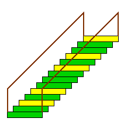
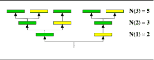

# 用两种颜色油漆楼梯使相邻的两个不黄的方法

> 原文:[https://www . geesforgeks . org/way-paint-stairs-two-colors-two-相邻-非黄色/](https://www.geeksforgeeks.org/ways-paint-stairs-two-colors-two-adjacent-not-yellow/)

给定 n 个楼梯，我们有 2 种颜色黄色和绿色，任务是我们必须用给定的颜色绘制给定的楼梯，条件是我们不能一个接一个地直接绘制两个黄色台阶。
**例:**

```
Input : n = 1
Output : 2
A single stair can be colored either
as green or yellow.

Input : n = 3
Output : 5
```



案例 1:当我们有一个楼梯时，我们可以涂黄色或绿色。
案例 2:当我们有 2 个楼梯时，我们可以用黄色或绿色来绘制第一个楼梯，但是对于下一个楼梯，我们只能用绿色来绘制，因为我们不能一个接一个地直接绘制两个黄色的台阶。总共有三个 YG，GG，GY。
案例 3:当我们有 3 个楼梯时，我们可以用 5 种方法来画它。
如果我们仔细观察，可以发现它遵循[斐波那契数列](https://www.geeksforgeeks.org/program-for-nth-fibonacci-number/)。



## C++

```
// C++ Program to find the number of ways to paint stairs
#include <bits/stdc++.h>
using namespace std;

// Function to find the number of ways
int ways(int n)
{
    int W[n + 1];

    // take base case for 1 and 2
    W[1] = 2;
    W[2] = 3;

    for (int i = 3; i <= n; i++)
        W[i] = W[i - 1] + W[i - 2];

    return W[n];
}

// Driven code
int main()
{
    int n = 3;
    printf("%d", ways(n));
    return 0;
}
```

## Java 语言(一种计算机语言，尤用于创建网站)

```
// java Program to find the number of
// ways to paint stairs
import java.io.*;

public class GFG {

    // Function to find the number of ways
    static int ways(int n)
    {
        int []W = new int[n+1];

        // take base case for 1 and 2
        W[1] = 2;
        W[2] = 3;

        for (int i = 3; i <= n; i++)
            W[i] = W[i - 1] + W[i - 2];

        return W[n];
    }

    // Driven code
    static public void main (String[] args)
    {
        int n = 3;

        System.out.println(ways(n));
    }
}

// This code is contributed by vt_m.
```

## 蟒蛇 3

```
# Python3 code to find the number
# of ways to paint stairs

# Function to find the number of ways
def ways( n ):
    W = list()

    # take base case for 1 and 2
    W.append(0)
    W.append(2)
    W.append(3)

    i = 3
    while i <= n:
        W.append(W[i - 1] + W[i - 2])
        i = i + 1

    return W[n]

# Driver code
n = 3
print(ways(n))

# This code is contributed by "Sharad_Bhardwaj".
```

## C#

```
// C# Program to find the number of
// ways to paint stairs
using System;

public class GFG {

    // Function to find the number of ways
    static int ways(int n)
    {
        int []W =new int[n+1];

        // take base case for 1 and 2
        W[1] = 2;
        W[2] = 3;

        for (int i = 3; i <= n; i++)
            W[i] = W[i - 1] + W[i - 2];

        return W[n];
    }

    // Driven code
    static public void Main ()
    {
        int n = 3;

        Console.WriteLine(ways(n));
    }
}

// This code is contributed by vt_m.
```

## 服务器端编程语言（Professional Hypertext Preprocessor 的缩写）

```
<?php
// PHP Program to find the
// number of ways to paint stairs

// Function to find the
// number of ways
function ways($n)
{

    // take base case
    // for 1 and 2
    $W[1] = 2;
    $W[2] = 3;

    for ($i = 3; $i <= $n; $i++)
        $W[$i] = $W[$i - 1] +
                 $W[$i - 2];

    return $W[$n];
}

// Driven code
$n = 3;
echo ways($n);

// This code is contributed by ajit
?>
```

## java 描述语言

```
<script>

// Javascript Program to find the number of
// ways to paint stairs

    // Function to find the number of ways
    function ways(n)
    {
        let W = [];

        // take base case for 1 and 2
        W[1] = 2;
        W[2] = 3;

        for (let i = 3; i <= n; i++)
            W[i] = W[i - 1] + W[i - 2];

        return W[n];
    }

// Driver code

        let n = 3;

        document.write(ways(n));

</script>
```

**输出:**

```
5
```

**时间复杂度:**O(n)
T3】额外空间: O(n)
我们也可以用第 n 个斐波那契数的[矩阵求幂解，在 O(Log n)时间内解决这个问题。](https://www.geeksforgeeks.org/program-for-nth-fibonacci-number/)