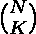
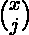
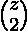

# 在给定约束的情况下，从三个组组成一个组的方法

> 原文:[https://www . geeksforgeeks . org/从给定约束的三个组中形成一个组的方法/](https://www.geeksforgeeks.org/ways-to-form-a-group-from-three-groups-with-given-constraints/)

给定三个数字(x、y 和 z)，表示第一组、第二组和第三组的人数。我们可以通过从第一组、第二组和第三组中选择人员来形成组，这样以下条件就不会无效。

*   每组至少要选出一人。
*   从第一组中选择的人数必须至少比从第三组中选择的人数多一个。

任务是找到许多形成不同群体的方法。
**例:**

> **输入:** x = 3，y = 2，z = 1
> **输出:** 9
> 假设 x 有人(a，b，c)
> Y 有人(d，e)
> Z 有人(f)
> 那么这 9 种方式就是{a，b，d，f}，{a，b，e，f}，{a，c，d，f}，{a，c，e，f}，
> {b，c，d，f b、c、d、e、f}
> **输入:** x = 4，y = 2，z = 1
> **输出:** 27

这个问题可以用[组合数学](https://www.geeksforgeeks.org/combinatorics-gq/)来解决。有三个职位(就不同群体的人而言)需要填补。第一个位置必须用比第二个位置大一个或多个的数字来填充。第三个可以用任何数字填充。我们知道，如果我们需要用 N 个人来填补 k 个职位，那么方法的数量就是。因此，可以遵循以下步骤来解决上述问题。

*   第二个位置可以填充 i = 1 到 i = y 个人。
*   第一个位置可以填充 j = i+1 到 j = x 个人。
*   第三个位置可以填充任意数量的 k = 1 到 k = z 的人。
*   因此，常见的事情是用 k 人填充第三个位置。因此，我们可以把这部分看作是共同的。
*   运行两个循环(I 和 j)分别填充第二位置和第一位置。
*   填充位置的方式有 * 。
*   在计算了填充这两个位置的所有方法后，我们可以简单地将 +  + … 相乘，因为这是两者的公共部分。

可以使用动态规划来预先计算，以降低时间复杂度。方法在这里讨论。
以下是上述办法的实施情况。

## C++

```
// C++ program to find the number of
// ways to form the group of peopls
#include <bits/stdc++.h>
using namespace std;

int C[1000][1000];

// Function to pre-compute the
// Combination using DP
void binomialCoeff(int n)
{
    int i, j;

    // Calculate value of Binomial Coefficient
    // in bottom up manner
    for (i = 0; i <= n; i++) {
        for (j = 0; j <= i; j++) {

            // Base Cases
            if (j == 0 || j == i)
                C[i][j] = 1;

            // Calculate value using previously
            // stored values
            else
                C[i][j] = C[i - 1][j - 1] + C[i - 1][j];
        }
    }

    // return C[n][k];
}

// Function to find the number of ways
int numberOfWays(int x, int y, int z)
{
    // Function to pre-compute
    binomialCoeff(max(x, max(y, z)));

    // Sum the Zci
    int sum = 0;
    for (int i = 1; i <= z; i++) {
        sum = (sum + C[z][i]);
    }

    // Iterate for second position
    int sum1 = 0;
    for (int i = 1; i <= y; i++) {

        // Iterate for first position
        for (int j = i + 1; j <= x; j++) {
            sum1 = (sum1 + (C[y][i] * C[x][j]));
        }
    }

    // Multiply the common Combination value
    sum1 = (sum * sum1);

    return sum1;
}

// Driver Code
int main()
{
    int x = 3;
    int y = 2;
    int z = 1;

    cout << numberOfWays(x, y, z);

    return 0;
}
```

## Java 语言(一种计算机语言，尤用于创建网站)

```
// Java program to find the number of
// ways to form the group of peopls
class GFG
{

static int C[][] = new int [1000][1000];

// Function to pre-compute the
// Combination using DP
static void binomialCoeff(int n)
{
    int i, j;

    // Calculate value of Binomial Coefficient
    // in bottom up manner
    for (i = 0; i <= n; i++)
    {
        for (j = 0; j <= i; j++)
        {

            // Base Cases
            if (j == 0 || j == i)
                C[i][j] = 1;

            // Calculate value using previously
            // stored values
            else
                C[i][j] = C[i - 1][j - 1] + C[i - 1][j];
        }
    }

    // return C[n][k];
}

// Function to find the number of ways
static int numberOfWays(int x, int y, int z)
{
    // Function to pre-compute
    binomialCoeff(Math.max(x, Math.max(y, z)));

    // Sum the Zci
    int sum = 0;
    for (int i = 1; i <= z; i++)
    {
        sum = (sum + C[z][i]);
    }

    // Iterate for second position
    int sum1 = 0;
    for (int i = 1; i <= y; i++)
    {

        // Iterate for first position
        for (int j = i + 1; j <= x; j++)
        {
            sum1 = (sum1 + (C[y][i] * C[x][j]));
        }
    }

    // Multiply the common Combination value
    sum1 = (sum * sum1);

    return sum1;
}

// Driver Code
public static void main(String args[])
{
    int x = 3;
    int y = 2;
    int z = 1;

    System.out.println(numberOfWays(x, y, z));
}
}

// This code is contributed by Arnab Kundu
```

## 蟒蛇 3

```
# Python3 program to find the number of
# ways to form the group of peopls
C = [[0 for i in range(1000)]
        for i in range(1000)]

# Function to pre-compute the
# Combination using DP
def binomialCoeff(n):
    i, j = 0, 0

    # Calculate value of Binomial Coefficient
    # in bottom up manner
    for i in range(n + 1):
        for j in range(i + 1):

            # Base Cases
            if (j == 0 or j == i):
                C[i][j] = 1

            # Calculate value using previously
            # stored values
            else:
                C[i][j] = C[i - 1][j - 1] + \
                          C[i - 1][j]

    # return C[n][k]

# Function to find the number of ways
def numberOfWays(x, y, z):

    # Function to pre-compute
    binomialCoeff(max(x, max(y, z)))

    # Sum the Zci
    sum = 0
    for i in range(1, z + 1):
        sum = (sum + C[z][i])

    # Iterate for second position
    sum1 = 0
    for i in range(1, y + 1):

        # Iterate for first position
        for j in range(i + 1, x + 1):
            sum1 = (sum1 + (C[y][i] * C[x][j]))

    # Multiply the common Combination value
    sum1 = (sum * sum1)

    return sum1

# Driver Code
x = 3
y = 2
z = 1

print(numberOfWays(x, y, z))

# This code is contributed by Mohit Kumar
```

## C#

```
// C# program to find the number of
// ways to form the group of peopls
using System;

class GFG
{

static int [,]C = new int [1000,1000];

// Function to pre-compute the
// Combination using DP
static void binomialCoeff(int n)
{
    int i, j;

    // Calculate value of Binomial Coefficient
    // in bottom up manner
    for (i = 0; i <= n; i++)
    {
        for (j = 0; j <= i; j++)
        {

            // Base Cases
            if (j == 0 || j == i)
                C[i,j] = 1;

            // Calculate value using previously
            // stored values
            else
                C[i,j] = C[i - 1,j - 1] + C[i - 1,j];
        }
    }

    // return C[n,k];
}

// Function to find the number of ways
static int numberOfWays(int x, int y, int z)
{
    // Function to pre-compute
    binomialCoeff(Math.Max(x, Math.Max(y, z)));

    // Sum the Zci
    int sum = 0;
    for (int i = 1; i <= z; i++)
    {
        sum = (sum + C[z,i]);
    }

    // Iterate for second position
    int sum1 = 0;
    for (int i = 1; i <= y; i++)
    {

        // Iterate for first position
        for (int j = i + 1; j <= x; j++)
        {
            sum1 = (sum1 + (C[y,i] * C[x,j]));
        }
    }

    // Multiply the common Combination value
    sum1 = (sum * sum1);

    return sum1;
}

// Driver Code
public static void Main(String []args)
{
    int x = 3;
    int y = 2;
    int z = 1;

    Console.WriteLine(numberOfWays(x, y, z));
}
}

// This code is contributed by Rajput-Ji
```

## java 描述语言

```
<script>
// javascript program to find the number of
// ways to form the group of peopls    
var C = Array(1000).fill().map(()=>Array(1000).fill(0));

    // Function to pre-compute the
    // Combination using DP
    function binomialCoeff(n) {
        var i, j;

        // Calculate value of Binomial Coefficient
        // in bottom up manner
        for (i = 0; i <= n; i++) {
            for (j = 0; j <= i; j++) {

                // Base Cases
                if (j == 0 || j == i)
                    C[i][j] = 1;

                // Calculate value using previously
                // stored values
                else
                    C[i][j] = C[i - 1][j - 1] + C[i - 1][j];
            }
        }

        // return C[n][k];
    }

    // Function to find the number of ways
    function numberOfWays(x , y , z) {
        // Function to pre-compute
        binomialCoeff(Math.max(x, Math.max(y, z)));

        // Sum the Zci
        var sum = 0;
        for (i = 1; i <= z; i++) {
            sum = (sum + C[z][i]);
        }

        // Iterate for second position
        var sum1 = 0;
        for (i = 1; i <= y; i++) {

            // Iterate for first position
            for (j = i + 1; j <= x; j++) {
                sum1 = (sum1 + (C[y][i] * C[x][j]));
            }
        }

        // Multiply the common Combination value
        sum1 = (sum * sum1);

        return sum1;
    }

    // Driver Code

        var x = 3;
        var y = 2;
        var z = 1;

        document.write(numberOfWays(x, y, z));

// This code contributed by aashish1995
</script>
```

**Output:** 

```
9
```

**时间复杂度:** O(K * K)，其中 K 为(x，y，z)的最大值。