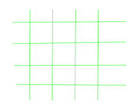

# 将 4 个项目放置在 n^2 位置的方法，使得没有行/列包含一个以上的

> 原文:[https://www . geesforgeks . org/way-to-place-4-items-in-N2-positions-so-no-row-column-contain-over-one/](https://www.geeksforgeeks.org/ways-to-place-4-items-in-n2-positions-such-that-no-row-column-contains-more-than-one/)

给定一个整数 **N** ，其中 **4 ≤ N ≤ 100** 。纵向有 **N** 线，横向有 **N** 线。所以，有 **N <sup>2</sup>** 路口。任务是找到在这些 **N <sup>2</sup>** 位置放置 4 个项目的方法数量，使得每行和每列包含不超过一个项目。
**举例:**

> **输入:** N = 4
> 
> 
> 
> **输出:**24
> T3】输入:N = 5
> T6】输出: 600

**方式:**从 **n** 中选择 4 条横线会有物品的方式数量为**T5】nC<sub>4</sub>T9】。有 **n** 种方法可以将项目放置在第一行。给定第一个项目的位置，有**n–1**种方法可以将项目放在第二行，因为其中一条垂直线已经被占用。给定第一项和第二项的位置，第三行有**n–2**种放置方式，第四行有相同的方式**n–3**。在选定的 4 条水平路径上放置项目的方式总数为**n *(n–1)*(n–2)*(n–3)**。所以结果是**<sup>n</sup>C<sub>4</sub>* n *(n–1)*(n–2)*(n–3)**。
以下是上述方法的实施:** 

## C++

```
// C++ implementation of the approach
#include <bits/stdc++.h>
using namespace std;

// Function to return the number of ways
// to place 4 items in n^2 positions
long long NumberofWays(int n)
{
    long long x = (1LL * (n) * (n - 1) * (n - 2) * (n - 3))
                  / (4 * 3 * 2 * 1);
    long long y = (1LL * (n) * (n - 1) * (n - 2) * (n - 3));

    return (1LL * x * y);
}

// Driver code
int main()
{
    int n = 4;
    cout << NumberofWays(n);

    return 0;
}
```

## Java 语言(一种计算机语言，尤用于创建网站)

```
// Java implementation of the approach
class GFG
{

// Function to return the number of ways
// to place 4 items in n^2 positions
static long NumberofWays(int n)
{
    long x = (1l * (n) * (n - 1) * (n - 2) * (n - 3))
                / (4 * 3 * 2 * 1);
    long y = (1l * (n) * (n - 1) * (n - 2) * (n - 3));

    return (1l * x * y);
}

// Driver code
public static void main(String args[])
{
    int n = 4;
    System.out.println( NumberofWays(n));
}
}

// This code is contributed by Arnab Kundu
```

## 蟒蛇 3

```
# python implementation of the approach

# Function to return the number of ways
# to place 4 items in n^2 positions
def NumbersofWays(n):
    x = (n * (n - 1) * (n - 2) * (n - 3)) // (4 * 3 * 2 * 1)
    y = n * (n - 1) * (n - 2) * (n - 3)

    return x * y

# Driver code
n = 4
print(NumbersofWays(n))

# This code is contributed by Shrikant13
```

## C#

```
// C# implementation of the approach
using System;

class GFG
{

// Function to return the number of ways
// to place 4 items in n^2 positions
public static long NumberofWays(int n)
{
    long x = (1l * (n) * (n - 1) * (n - 2) *
               (n - 3)) / (4 * 3 * 2 * 1);
    long y = (1l * (n) * (n - 1) * (n - 2) *
                (n - 3));

    return (1l * x * y);
}

// Driver code
public static void Main(string[] args)
{
    int n = 4;
    Console.WriteLine(NumberofWays(n));
}
}

// This code is contributed by Shrikant13
```

## 服务器端编程语言（Professional Hypertext Preprocessor 的缩写）

```
<?php
// PHP implementation of the approach

// Function to return the number of ways
// to place 4 items in n^2 positions
function NumberofWays($n)
{
    $x = (1 * ($n) * ($n - 1) *
                     ($n - 2) * ($n - 3)) /
                          (4 * 3 * 2 * 1);
    $y = (1 * ($n) * ($n - 1) *
                     ($n - 2) * ($n - 3));

    return (1 * $x * $y);
}

// Driver code
$n = 4;
echo NumberofWays($n);

// This code is contributed by mits
?>
```

## java 描述语言

```
<script>

      // JavaScript implementation of the approach
      // Function to return the number of ways
      // to place 4 items in n^2 positions
      function NumberofWays(n) {
        var x = (1 * n * (n - 1) * (n - 2) * (n - 3)) /
        (4 * 3 * 2 * 1);
        var y = 1 * n * (n - 1) * (n - 2) * (n - 3);

        return 1 * x * y;
      }

      // Driver code
      var n = 4;
      document.write(NumberofWays(n));

</script>
```

**Output:** 

```
24
```