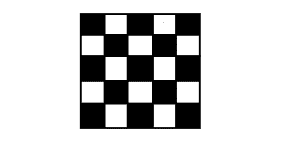
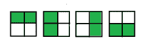

# 在 N×N 棋盘上放置 K 个主教的方法，这样就不会有两个攻击

> 原文:[https://www . geesforgeks . org/way-to-place-k-bisgos-on-an-nxn-棋盘-so-no-two-attack/](https://www.geeksforgeeks.org/ways-to-place-k-bishops-on-an-nxn-chessboard-so-that-no-two-attack/)

给定两个整数 *N* 和 *K* ，任务是找到将 *K* 主教放置在 *N × N* 棋盘上的方法数量，这样就不会有两个主教互相攻击。

> 这里有一个 5×5 棋盘的例子。
> 
> 

**例:**

> **输入:** N = 2，K = 2
> **输出:** 4
> 在 2 * 2 棋盘中放置 2 个主教的不同方式为:
> 
> 
> 
> **输入:** N = 4，K = 3
> T3】输出: 232

**方法:**这个问题可以用[动态规划](https://www.geeksforgeeks.org/dynamic-programming/)解决。

*   让 *dp[i][j]* 表示将 *j* 主教放置在对角线上的方法的数量，其索引直到与对角线 *i* 具有相同颜色的 *i* 。然后 *i = 1…2N-1* 和 *j = 0…K* 。
*   我们可以仅使用 *dp[i-2]* 的值来计算 *dp[i][j]* (我们减去 2，因为我们只考虑与 I 颜色相同的对角线)。有两种方法可以获得 *dp[i][j]* 。要么我们把所有的 *j* 主教放在前面的对角线上:然后有*DP【I-2】【j】*的方法来实现这一点。或者我们在对角线 *i* 和 *j-1* 上放置一个主教在先前的对角线上。这样做的方法数量等于对角线*I –( j–1)*中的正方形数量，因为放置在先前对角线上的每个 *j-1* 主教将阻挡当前对角线上的一个正方形。
*   基本情况很简单: *dp[i][0] = 1，dp[1][1] = 1* 。
*   一旦我们计算出 *dp[i][j]* 的所有值，就可以得到如下答案:考虑放置在黑色对角线上的所有可能的主教数量 *i=0…K* ，白色对角线上的相应主教数量 *K-i* 。放置在黑白对角线上的主教从不互相攻击，因此放置可以独立完成。最后一条黑色对角线的索引为 *2N-1* ，最后一条白色对角线的索引为 *2N-2* 。对于每个 *i* 我们在答案中加上*DP[2N-1][I]* DP[2N-2][K-I]*。

以下是上述方法的实现:

## C++

```
// CPP implementation of the approach
#include<bits/stdc++.h>
using namespace std;

// returns the number of squares in diagonal i
int squares(int i)
{

    if ((i & 1) == 1)
        return i / 4 * 2 + 1;
    else
        return (i - 1) / 4 * 2 + 2;
}

// returns the number of ways to fill a
// n * n chessboard with k bishops so
// that no two bishops attack each other.
long bishop_placements(int n, int k)
{
    // return 0 if the number of valid places to be
    // filled is less than the number of bishops
    if (k > 2 * n - 1)
        return 0;

    // dp table to store the values
    long dp[n * 2][k + 1];

    // Setting the base conditions
    for(int i = 0; i < n * 2; i++)
    {
        for(int j = 0; j < k + 1; j++)
        {
            dp[i][j] = 0;
        }

    }
    for (int i = 0; i < n * 2; i++)
        dp[i][0] = 1;
    dp[1][1] = 1;

    // calculate the required number of ways
    for (int i = 2; i < n * 2; i++)
    {
        for (int j = 1; j <= k; j++)
        {
            dp[i][j] = dp[i - 2][j]
                    + dp[i - 2][j - 1] * (squares(i) - j + 1);

        }
    }

    // stores the answer
    long ans = 0;
    for (int i = 0; i <= k; i++)
    {
        ans += dp[n * 2 - 1][i] * dp[n * 2 - 2][k - i];
    }

    return ans;
}

// Driver code
int main()
{
    int n = 2;
    int k = 2;
    long ans = bishop_placements(n, k);
    cout << (ans);
}

// This code is contributed by Rajput-Ji
```

## Java 语言(一种计算机语言，尤用于创建网站)

```
// Java implementation of the approach

class GFG {

    // returns the number of squares in diagonal i
    static int squares(int i)
    {
        if ((i & 1) == 1)
            return i / 4 * 2 + 1;
        else
            return (i - 1) / 4 * 2 + 2;
    }

    // returns the number of ways to fill a
    // n * n chessboard with k bishops so
    // that no two bishops attack each other.
    static long bishop_placements(int n, int k)
    {
        // return 0 if the number of valid places to be
        // filled is less than the number of bishops
        if (k > 2 * n - 1)
            return 0;

        // dp table to store the values
        long[][] dp = new long[n * 2][k + 1];

        // Setting the base conditions
        for (int i = 0; i < n * 2; i++)
            dp[i][0] = 1;
        dp[1][1] = 1;

        // calculate the required number of ways
        for (int i = 2; i < n * 2; i++) {
            for (int j = 1; j <= k; j++)
                dp[i][j]
                    = dp[i - 2][j]
                        + dp[i - 2][j - 1] * (squares(i) - j + 1);
        }

        // stores the answer
        long ans = 0;
        for (int i = 0; i <= k; i++) {
            ans += dp[n * 2 - 1][i] * dp[n * 2 - 2][k - i];
        }

        return ans;
    }

    // Driver code
    public static void main(String[] args)
    {
        int n = 2;
        int k = 2;
        long ans = bishop_placements(n, k);
        System.out.println(ans);
    }
}
```

## 蟒蛇 3

```
# Python 3 implementation of the approach

# returns the number of squares in
# diagonal i
def squares(i):
    if ((i & 1) == 1):
        return int(i / 4) * 2 + 1
    else:
        return int((i - 1) / 4) * 2 + 2

# returns the number of ways to fill a
# n * n chessboard with k bishops so
# that no two bishops attack each other.
def bishop_placements(n, k):

    # return 0 if the number of valid places
    # to be filled is less than the number
    # of bishops
    if (k > 2 * n - 1):
        return 0

    # dp table to store the values
    dp = [[0 for i in range(k + 1)]
             for i in range(n * 2)]

    # Setting the base conditions
    for i in range(n * 2):
        dp[i][0] = 1

    dp[1][1] = 1

    # calculate the required number of ways
    for i in range(2, n * 2, 1):
        for j in range(1, k + 1, 1):
            dp[i][j] = (dp[i - 2][j] +
                        dp[i - 2][j - 1] *
                       (squares(i) - j + 1))

    # stores the answer
    ans = 0
    for i in range(0, k + 1, 1):
        ans += (dp[n * 2 - 1][i] *
                dp[n * 2 - 2][k - i])

    return ans

# Driver code
if __name__ == '__main__':
    n = 2
    k = 2
    ans = bishop_placements(n, k)
    print(ans)

# This code is contributed by
# Sanjit_Prasad
```

## C#

```
// C# implementation of the approach
using System;

class GFG
{

// returns the number of squares
// in diagonal i
static int squares(int i)
{
    if ((i & 1) == 1)
        return i / 4 * 2 + 1;
    else
        return (i - 1) / 4 * 2 + 2;
}

// returns the number of ways to fill a
// n * n chessboard with k bishops so
// that no two bishops attack each other.
static long bishop_placements(int n, int k)
{
    // return 0 if the number of valid
    // places to be filled is less than
    // the number of bishops
    if (k > 2 * n - 1)
        return 0;

    // dp table to store the values
    long[,] dp = new long[n * 2, k + 1];

    // Setting the base conditions
    for (int i = 0; i < n * 2; i++)
        dp[i, 0] = 1;
    dp[1, 1] = 1;

    // calculate the required
    // number of ways
    for (int i = 2; i < n * 2; i++)
    {
        for (int j = 1; j <= k; j++)
            dp[i, j] = dp[i - 2, j] +
                       dp[i - 2, j - 1] *
                        (squares(i) - j + 1);
    }

    // stores the answer
    long ans = 0;
    for (int i = 0; i <= k; i++)
    {
        ans += dp[n * 2 - 1, i] *
               dp[n * 2 - 2, k - i];
    }

    return ans;
}

// Driver code
static public void Main ()
{
    int n = 2;
    int k = 2;
    long ans = bishop_placements(n, k);
    Console.WriteLine(ans);
}
}

// This code is contributed by akt_mit
```

## 服务器端编程语言（Professional Hypertext Preprocessor 的缩写）

```
<?php
// PHP implementation of the approach

// returns the number of squares
// in diagonal i
function squares($i)
{
    if (($i & 1) == 1)
        return intval($i / 4) * 2 + 1;
    else
        return intval(($i - 1) / 4) * 2 + 2;
}

// returns the number of ways to fill a
// n * n chessboard with k bishops so
// that no two bishops attack each other.
function bishop_placements($n, $k)
{
    // return 0 if the number of valid
    // places to be filled is less than
    // the number of bishops
    if ($k > 2 * $n - 1)
        return 0;

    // dp table to store the values
    $dp = array_fill(0, $n * 2,
          array_fill(0, $k + 1, NULL));

    // Setting the base conditions
    for ($i = 0; $i < $n * 2; $i++)
        $dp[$i][0] = 1;
    $dp[1][1] = 1;

    // calculate the required number of ways
    for ($i = 2; $i < $n * 2; $i++)
    {
        for ($j = 1; $j <= $k; $j++)
            $dp[$i][$j] = $dp[$i - 2][$j] +
                          $dp[$i - 2][$j - 1] *
                             (squares($i) - $j + 1);
    }

    // stores the answer
    $ans = 0;
    for ($i = 0; $i <= $k; $i++)
    {
        $ans += $dp[$n * 2 - 1][$i] *
                $dp[$n * 2 - 2][$k - $i];
    }

    return $ans;
}

// Driver code
$n = 2;
$k = 2;
$ans = bishop_placements($n, $k);
echo $ans;

// This code is contributed by ita_c
?>
```

## java 描述语言

```
<script>

    // Javascript implementation of the approach

    // returns the number of squares
    // in diagonal i
    function squares(i)
    {
        if ((i & 1) == 1)
            return parseInt(i / 4, 10) * 2 + 1;
        else
            return parseInt((i - 1) / 4, 10) * 2 + 2;
    }

    // returns the number of ways to fill a
    // n * n chessboard with k bishops so
    // that no two bishops attack each other.
    function bishop_placements(n, k)
    {
        // return 0 if the number of valid
        // places to be filled is less than
        // the number of bishops
        if (k > 2 * n - 1)
            return 0;

        // dp table to store the values
        let dp = new Array(n * 2);

        // Setting the base conditions
        for (let i = 0; i < n * 2; i++)
        {
            dp[i] = new Array(k + 1);
            for(let j = 0; j < k + 1; j++)
            {
                dp[i][j] = 0;
            }
            dp[i][0] = 1;
        }
        dp[1][1] = 1;

        // calculate the required
        // number of ways
        for (let i = 2; i < n * 2; i++)
        {
            for (let j = 1; j <= k; j++)
                dp[i][j] = dp[i - 2][j] +
                           dp[i - 2][j - 1] *
                            (squares(i) - j + 1);
        }

        // stores the answer
        let ans = 0;
        for (let i = 0; i <= k; i++)
        {
            ans += dp[n * 2 - 1][i] *
            dp[n * 2 - 2][k - i];
        }

        return ans;
    }

    let n = 2;
    let k = 2;
    let ans = bishop_placements(n, k);
    document.write(ans);

</script>
```

**Output:** 

```
4
```