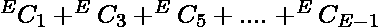
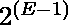
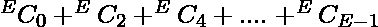

# 从一个完整的图中移除边以生成奇数边的方法

> 原文:[https://www . geeksforgeeks . org/从完整图中移除边以生成奇数边的方法/](https://www.geeksforgeeks.org/ways-to-remove-edges-from-a-complete-graph-to-make-odd-edges/)

给定一个具有 **N 个**顶点的完整图，任务是计算移除边的方法的数量，使得生成的图具有奇数个边。
**例:**

> **输入:** N = 3
> **输出:** 4
> 初始图形有 3 条边，因为它是一个完整的图形。我们可以移除边(1，2)和(1，3)或(1，2)和(2，3)或(1，3)和(2，3)，或者我们不移除任何边。
> **输入:** N = 4
> **输出:** 32

**方法:**随着图形的完成，边的总数将为**E = N *(N–1)/2**。现在有两种情况，

1.  如果 **E** 是**偶数**那么你要去掉奇数个边，那么路的总数就是，相当于。
2.  如果 **E** 是**奇数**那么你就要去掉偶数个边，那么路的总数就是，相当于。

**注意**如果 **N = 1** 那么答案就是 **0** 。
以下是上述方法的实现:

## C++

```
// C++ implementation of the approach
#include <bits/stdc++.h>
using namespace std;

// Function to return the number of ways
// to remove edges from the graph so that
// odd number of edges are left in the graph
int countWays(int N)
{
    // Total number of edges
    int E = (N * (N - 1)) / 2;

    if (N == 1)
        return 0;

    return pow(2, E - 1);
}

// Driver code
int main()
{
    int N = 4;
    cout << countWays(N);

    return 0;
}
```

## Java 语言(一种计算机语言，尤用于创建网站)

```
// Java implementation of the approach
class GfG
{

// Function to return the number of ways
// to remove edges from the graph so that
// odd number of edges are left in the graph
static int countWays(int N)
{
    // Total number of edges
    int E = (N * (N - 1)) / 2;

    if (N == 1)
        return 0;

    return (int)Math.pow(2, E - 1);
}

// Driver code
public static void main(String[] args)
{
    int N = 4;
    System.out.println(countWays(N));
}
}

// This code is contributed by Prerna Saini
```

## 蟒蛇 3

```
# Python3 implementation of the approach

# Function to return the number of ways
# to remove edges from the graph so that
# odd number of edges are left in the graph
def countWays(N):

    # Total number of edges
    E = (N * (N - 1)) / 2

    if (N == 1):
        return 0

    return int(pow(2, E - 1))

# Driver code
if __name__ == '__main__':
    N = 4
    print(countWays(N))

# This code contributed by PrinciRaj1992
```

## C#

```
// C# implementation of the approach

using System;

public class GFG{

// Function to return the number of ways
// to remove edges from the graph so that
// odd number of edges are left in the graph
static int countWays(int N)
{
    // Total number of edges
    int E = (N * (N - 1)) / 2;

    if (N == 1)
        return 0;

    return (int)Math.Pow(2, E - 1);
}

// Driver code
    static public void Main (){

    int N = 4;
    Console.WriteLine(countWays(N));
    }
}
// This code is contributed by ajit.
```

## 服务器端编程语言（Professional Hypertext Preprocessor 的缩写）

```
<?php
// PHP implementation of the approach

// Function to return the number of ways
// to remove edges from the graph so that
// odd number of edges are left in the graph
function countWays($N)
{
    // Total number of edges
    $E = ($N * ($N - 1)) / 2;

    if ($N == 1)
        return 0;

    return (int)pow(2, $E - 1);
}

// Driver code
$N = 4;
echo(countWays($N));

// This code is contributed
// by Code_Mech.
?>
```

## java 描述语言

```
<script>
    // Javascript implementation of the approach

    // Function to return the number of ways
    // to remove edges from the graph so that
    // odd number of edges are left in the graph
    function countWays(N)
    {
        // Total number of edges
        let E = parseInt((N * (N - 1)) / 2, 10);

        if (N == 1)
            return 0;

        return Math.pow(2, E - 1);
    }

    let N = 4;
    document.write(countWays(N));

</script>
```

**Output:** 

```
32
```